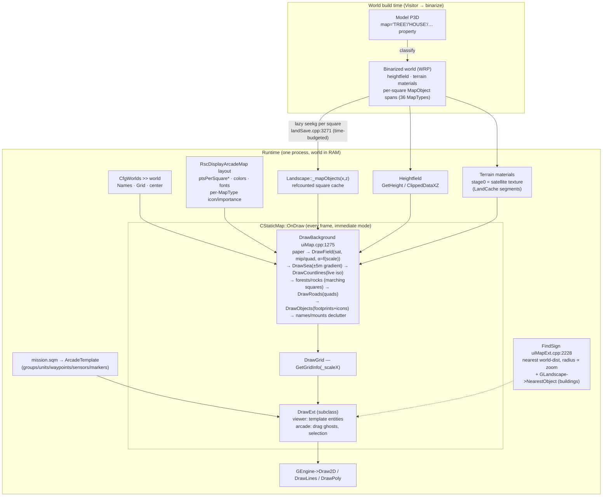

# T-144.1 — Arma 3 2D mission-editor map: architecture study

**Source:** `/home/Samuel/Projects/TBD_Arma_3_Remaster/Arma_3_SourceCode_Old` (read-only; `Arma3_2012.sln` era)
**Scope:** mission editor **2D map** — raster stack, coords, zoom/LOD, world objects, pick, height. Search log: [`t144_arma3_search_log.md`](t144_arma3_search_log.md). Verify: [`t144_verify_log.md`](t144_verify_log.md).

**Provenance caveat (mandatory):** this tree is **Arma 3 ~2012 — pre-Eden**. The shipped 2D mission editor here is the classic **Arcade editor** (`DisplayArcadeMap`), the direct ancestor of the map view Eden (2016) later embedded. Everything below is engine ground truth for the RV-engine 2D map stack; statements about Eden itself are inference from this lineage and are flagged as such.

---

## §0 Entry point discovery

### Verdict on the `lib/UI/uiMap.*` hypothesis (row 1)

**SPLIT — hypothesis substantially right, but incomplete.** `lib/UI/uiMap.{cpp,hpp}` is the **primary widget core**: `CStaticMap` (declared `uiMap.hpp:440`, drawn `uiMap.cpp`) owns every terrain/vector pixel of any 2D map in the game. But the **mission-editor entry point and editor behavior live in `lib/UI/uiMapExt.cpp`** (file header line 1: `// Implementation of mission editor`), which implements `DisplayArcadeMap` + `CStaticMapArcade(Viewer)` declared at the tail of `uiMap.hpp` (lines 2983–3330). `lib/UI/dispMissionEditor.cpp` — the file whose name looks most like "the mission editor" — is **not** the retail 2D editor: it is Editor2 (hidden RTE lineage), a separate surface.

### Search strategies (≥6, full log in `t144_arma3_search_log.md`)

| # | Strategy | Key result |
|---|----------|-----------|
| S1 | Display/editor class names, tree-wide | `DisplayArcadeMap` concentrated in `uiMapExt.cpp` (55) + declared `uiMap.hpp:3202` |
| S2 | Draw machinery (`CStaticMap`, `DrawField`) | terrain-pixel path exists exactly once: `CStaticMap::DrawField`, `uiMap.cpp:2005` |
| S3 | Data feed (satellite/chart/landscape) | satellite lives in `Landscape` materials (`landscape.cpp`: 50 hits); map widget consumes them |
| S4 | Config side (`RscDisplayArcadeMap`, `CfgWorlds`) | engine repo has **no** Rsc classes — layout/config ships in game data; engine reads `Pars >> Glob.config.editorLayout`, `CfgWorlds >> world >> Names/Grid` |
| S5 | Tools/legacy (`mapViewer`, export, Visitor) | `mapViewer.exe` stdin pipe = dev-only (`gameStateExt.cpp:25344`); `uiMapExport.cpp` = offline GDI EMF export via cheat; Visitor IDs persist into runtime `MapObject::_id` |
| S6 | Compile guards (retail vs VBS vs dead) | retail chain `wpch.hpp:18–42` → `retailConfig.h`: `_ENABLE_EDITOR 1` **and** `_ENABLE_EDITOR2 1`; VBS islands (`_VBS3_UDEFCHART` user chart, HLA, RTE-as-map) compiled out |

### Candidate table

| Candidate path | Why searched | Verdict | Evidence |
|---|---|---|---|
| `lib/UI/uiMap.cpp` + `uiMap.hpp` | hypothesis; S1/S2 hit density | **PRIMARY (widget core)** | `CStaticMap : CStatic` `uiMap.hpp:440`; all terrain draw `uiMap.cpp:1275–3330`; editor classes declared `uiMap.hpp:2983/3051/3202` |
| `lib/UI/uiMapExt.cpp` | S1 density (55× `DisplayArcadeMap`) | **PRIMARY (editor display)** | header comment line 1; `DisplayArcadeMap` ctor `uiMapExt.cpp:3371`; overlay `CStaticMapArcadeViewer::DrawExt:367`; pick `FindSign:2228` |
| `lib/UI/dispMissionEditor.cpp` | filename; `DisplayMissionEditor : DisplayMap` (line 467) | **SECONDARY** | whole file `#if _ENABLE_EDITOR2 && !_VBS2` (line 3); retail-compiled hidden Editor2/RTE; as in-game-map replacement it is VBS-only (`world.cpp:17021`) |
| `lib/UI/dispMissionEditorVBS.cpp`, `lib/HLA/*` | S2 hits | REJECT | VBS builds only |
| `lib/UI/uiMapExport.cpp` | S3 forest/road density | SECONDARY (offline diag) | GDI/EMF export; entry `ExportWMF` `uiMapExport.cpp:1178`; trigger `CheatExportMap` `uiMap.cpp:3588` |
| `mapViewer.exe` pipe | spec hypothesis | REJECT (legacy tool) | `gameStateExt.cpp:25344–25379`, spawn + stdin feed, dev path `c:\bis\mapViewer\` |
| `lib/UI/missionEditor.{cpp,hpp}` | filename | SECONDARY | Editor2 workspace model (`EditorObject`, `EditorWorkspace` `missionEditor.hpp:292/459`) — not arcade 2D |
| `lib/UI/uiCurator.cpp` | S6 | REJECT (other surface) | `#if _ARMA3_CURATOR` line 6 — early Zeus |
| `lib/world.cpp` | hypothesis (`GetMap()` wiring) | SUPPORTING | world owns in-game map + `SwitchLandscape`; not the editor display itself |
| `cfg/` | config hypothesis | REJECT | project files only (`cfg2012.vcxproj`, `cfgBuldozer.hpp`) |

### Rejected / adjacent 2D-map surfaces (complete derived-class sweep)

Discriminator found by exhaustive `: public CStaticMap(Main)` sweep: **the mission-editor spine derives from `CStaticMap` directly; every other live in-game map derives from `CStaticMapMain`** — no other subclasses exist.

| Surface | Class | Decl | Instantiated from | Guard | Role |
|---|---|---|---|---|---|
| In-game main map (briefing/diary) | `DisplayMainMap` / `CStaticMapMain` | `uiMap.hpp:2648` / `:1374` | `World::CreateMainMap` `world.cpp:17242` → `uiMap.cpp:32169` | retail | full-screen M-key map |
| GPS / minimap HUD | `CStaticMapMain` with `_miniMapMode=true` | flag `uiMap.hpp:752` | `World::CreateMiniMaps` `world.cpp:4363` (`RscMiniMap*`, `IDC_MINIMAP` `resincl.hpp:2787`) | retail | corner GPS — a mode, not a class |
| UAV terminal map | `UavTerminalStaticMapMain : CStaticMapMain` | `uiMap.hpp:4621` | `uiMap.cpp:30805` (world slot `_uavMapTerminal` `world.hpp:1414`) | retail | drone terminal |
| Artillery computer map | `ArtilleryStaticMapMain : CStaticMapMain` | `uiMap.hpp:5312` | `uiMap.cpp:30173` | retail | arty targeting |
| Curator / Zeus map | `CuratorStaticMapMain : CStaticMapMain` | `uiCurator.hpp:1015` | `uiCurator.cpp:2217` | `_ARMA3_CURATOR` | Zeus editing map |
| High Command layer | `HCMapInfo` overlay (struct) | `uiMap.hpp:358` | drawn inside `CStaticMapMain` `uiMap.cpp:4028–4504` | retail | overlay, not a surface |
| AAR map | `AAR` | `HLA/AAR.hpp:138` | HLA subsystem (reads `DisplayMap` via `#if _VBS3` friend `uiMap.hpp:2243`) | `_AAR`/VBS | reject (VBS) |
| Briefing notebook | `DisplayNotebook` / `Notepad` | `uiMap.hpp:1221` / `:113` | ancestor of `DisplayMapEditor` (`:1268`) | retail | editor's own 2D notebook base |
| Insert-marker dialog | `DisplayInsertMarker : Display` | `uiMap.hpp:1669` | `uiMap.cpp:7981` | retail | user-marker modal on main map |
| Editor2's map control | `CStaticMapEditor` | `dispMissionEditor.cpp:210/212` (base `CStaticMapMain` if `_VBS2`, else `CStaticMap`) | `DisplayMapEditor` (Editor2) | `_ENABLE_EDITOR2` | secondary editor's own widget |
| Xbox mission-wizard map | `CStaticMapXWizard : CStaticMap` | `optionsUI.cpp:19682` | console wizard | `_GAMES_FOR_WINDOWS \|\| _XBOX` | reject (console) |
| Warrant | `CWarrant : Control` | `uiMap.hpp:1656` | `uiMap.cpp:22393` | `#ifndef _XBOX` | dead ("NOT USED CURRENTLY") |

### The locked spine

> The authoritative chain for the retail 2D mission editor map is: main menu handler → **`CDPCreateEditor`** (`displayUI.cpp:17765`, `#if _ENABLE_EDITOR`) → **`DisplayArcadeMap`** (`uiMap.hpp:3202`, impl `uiMapExt.cpp:3371`) which owns **`CStaticMapArcade *_map`** (`uiMap.hpp:3206`) → **`CStaticMapArcade`** (`uiMap.hpp:3051`) → **`CStaticMapArcadeViewer`** (`uiMap.hpp:2983`) → **`CStaticMap`** (`uiMap.hpp:440`) → **`CStaticMap::OnDraw`** (`uiMap.cpp:3332`) → **`DrawBackground`** (`uiMap.cpp:1275`) fanning into `DrawField`/`DrawSea`/`DrawCountlines`/`DrawForestsNew`/`DrawRoads`/`DrawObjects`/`DrawGrid`, all fed by the **live `GLandscape`** (`landscape.cpp`, `landSave.cpp`) and drawn immediate-mode through `GEngine->Draw2D/DrawLines/DrawPoly`. Editor overlay and picking sit in the two subclass layers (`uiMapExt.cpp:367` DrawExt, `:2228` FindSign).

All sections below trace from this spine only.

---

## §1 Executive summary — how A3 actually does it vs what T-090 assumed

1. **There is no basemap.** A3 renders the editor map **live every frame** from in-RAM world data — heightfield, terrain materials, per-square map-object records. No tiles, no pyramid, no offline compose, no cached raster. (T-090 must keep offline compose — we have no engine at runtime — but this changes *what* we bake: §9/§10.)
2. **"Satellite view" is the 3D terrain's own satellite texture**, drawn per land-square quad with UVs from the terrain material's world-pos texgen (`DrawField`, `uiMap.cpp:2046–2175`). One source of truth for 3D and 2D imagery — zero alignment risk by construction.
3. **The cartographic "Map look" is not an image at all**: paper texture + sea shore gradient from the heightfield (±5 m band, `DrawSea uiMap.cpp:2179`) + live-contoured elevation lines + vector roads/forests/objects. Every "map" pixel we bake offline, A3 synthesizes from data at draw time.
4. **Satellite vs Map is a crossfade, not two basemaps**: `_showScale` (editor TEXTURES button) toggles the satellite field layer, and satellite alpha fades out with zoom-out over a config band (`maxSatelliteAlpha`, `alphaFadeStartScale`→`alphaFadeEndScale`, `uiMap.cpp:2161`). The vector/cartographic layer is **always** drawn on top.
5. **Land-cover is data, not photo heuristics.** Forest/rock polygons come from **marching squares over per-square tree/rock density fields** (`MapObjectForest` corner densities, iso threshold 1.0, `DrawForestsNew` `uiMap.cpp:2390`), and object classification comes from an **artist-authored `map = "…"` property in each model** (36 stable `MapType`s, `Shape/mapTypes.hpp:12–48`). Our SAP color-mask heuristics have no analogue in A3.
6. **Map-info records are pre-baked at world build and lazily streamed**: per-land-square `MapObjectList` spans inside the binarized world file, `seekg` + deserialize on demand with a per-frame time budget and refcounted square cache (`landSave.cpp:3271`, `Landscape::UseMapObjects`), plus 5 % viewport-border prefetch (`uiMap.cpp:1528`) and predictive preload along flyTo animation (`uiMap.cpp:3443`).
7. **LOD is density-per-screen-square, config-driven, per feature class**: `ptsLand = 800·_invScaleX·InvLandRange`; each layer activates when `ptsLand ≥ ptsPerSquare<Class>` (sea/textures/contours/forests/forest-edges/roads/objects — `uiMap.cpp:322–330`), icon types gate individually on `importance ≥ _scaleX` (`mapTypes.hpp:90–96`), labels declutter by a **precomputed nearest-more-important distance** (`uiMap.cpp:1696`). Nothing clusters; things simply don't draw below their band.
8. **Coordinates are trivially simple**: whole island normalized to 0–1, north-up, y-flip, `WorldToScreen` is 4 multiplies + 2 adds (`uiMap.cpp:603`); zoom is continuous and **anchored at the cursor** (`SetScale` re-derives the window origin, `uiMap.cpp:3860`); contour interval and grid step re-derive from scale (`70·_scaleX` snapped to 2/5/10×10ⁿ, `uiMap.cpp:1446`; `GetGridInfo(_scaleX)`, `uiMap.cpp:3172`).
9. **Editor pick is nearest-neighbor in world space with a zoom-proportional radius** (2 % of viewport width, `FindSign` `uiMapExt.cpp:2228`), priority-tiered (waypoints → units → sensors → markers → sites), Shift reverses priority, and **world buildings are pickable via the landscape spatial query** only when their LOD band is visible (`GLandscape->NearestObject`, `uiMapExt.cpp:2377`). Mission entities draw as a brute-force full iterate — fine at mission scale.
10. **Map *draw* ignores Z, but the editor stamps surface height into entities**: `ScreenToWorld` returns Y = 0 by contract (`uiMap.cpp:624`), then every insert immediately samples `GLOB_LAND->RoadSurfaceY` into the template position (`uiMapExt.cpp:3141`) and every drag re-clamps it (`RoadSurfaceYAboveWater`, `:3291`) — the exact T-091.2 `sampleElevation` + T-092 spawn-authority split we shipped. And a humbling reference point: the 2012 arcade editor has **no undo at all** (zero hits in the editor sources) and **no autosave** — manual save only.

---

## §2 Architecture diagram

---

## §3 Raster stack — every layer that hits pixels

Bottom → top, all inside `DrawBackground` (`uiMap.cpp:1275`) unless noted:

| # | Layer | Mechanism | Source | Citation |
|---|-------|-----------|--------|----------|
| 1 | Paper | `_texture` tiled in 0.5·view steps | control config | `uiMap.cpp:1299–1325` |
| 2 | Terrain fields ("satellite") | per-square textured quad; UV from terrain material texgen (`UVWorldPos`, `tgen._uvTransform`); per-quad mip = `log4(texelArea/pixelArea)`; **white where sat not yet streamed**; alpha = `maxSatelliteAlpha · crossfade(scale)`; skipped entirely when `_showScale` off or `_scaleX ≥ alphaFadeEndScale`; stepping aligned to satellite segment size (`GetSatSegSize`) | `GLandscape->ClippedTextureInfo(z,x)._mat->_stage[0]` — **the same satellite texture the 3D terrain renders** | `uiMap.cpp:1328–1386, 2005–2175`; `landscape.cpp:2162` |
| 3 | Sea + shoreline | corner heights vs ±5 m (`waves`); pure-sea quad = flat `_colorSea`; shore quad = per-vertex alpha gradient land↔sea | heightfield `GetHeightNT` = `GLandscape->GetHeight` (`uiMap.cpp:2002`) | `uiMap.cpp:2179–2251, 1389–1417` |
| 4 | Hypsometric shade (`DrawScale`, greyscale 0–700 m black-alpha ramp) — alternate mode | vertex-color quad | heightfield | `uiMap.cpp:2253–2290` |
| 5 | Contours | live triangle contouring per square (2 tris, vertex sort, iso interpolation); water vs land colors; main line every 5 steps; **interval = 70·_scaleX snapped to 2/5/10×10ⁿ** | `GLOB_LAND->ClippedDataXZ` on the **terrain** grid (finer than land grid) | `uiMap.cpp:1420–1478, 3026–3160` |
| 6 | Forests + rocks | marching squares over `MapObjectForest` corner densities (16 cases → poly3/4/5 fill; same cases → border lines, drawn only when `ptsLand ≥ ptsPerSquareForEdge`) | map-object records | `uiMap.cpp:2292–2738` |
| 7 | Roads | per-segment world quad TL/TR/BL/BR → 2 edge lines + fill poly; class → color (`Track/Road/MainRoad` + `…Fill`); batched, flushed at 500 lines | map-object records | `uiMap.cpp:2929–3018` |
| 8 | Objects | buildings/houses/fences/walls → footprint polys (`DrawBuilding`); powerlines/railway → segment lines; 15 icon-only types + 6 icon+footprint types via macro table | map-object records | `uiMap.cpp:2739–2837`; `mapTypes.hpp:51–105` |
| 9 | Airports | runway/taxiway rects + taxi guides | world data | `uiMap.cpp:1617`, decl `uiMap.hpp:1041–1045` |
| 10 | Outside-map fill | `_colorOutside` borders when world has no outside terrain | — | `uiMap.cpp:1622–1662` |
| 11 | Names/mounts | town names from `CfgWorlds >> Names` (legacy) or `Landscape::GetLocations()` with importance-distance declutter; mountain elevation labels via quadtree + min-dist | config/world | `uiMap.cpp:1663–1808` |
| 12 | Grid | `DrawGrid` — zoom-stepped `GridInfo` (step/format per zoom from world config) | `GWorld->GetGridInfo(_scaleX)` | `uiMap.cpp:3167+` |

**View switch mechanism:** retail has **one** map view with two knobs — the TEXTURES toggle (`_showScale`, `UpdateTexturesButton` in the editor, `uiMap.cpp:1328`) and the automatic zoom crossfade (band `alphaFadeStartScale→alphaFadeEndScale`, `uiMap.cpp:2161`). The VBS3 "user chart" (swap satellite for a custom raster per segment, `uiMap.cpp:2052–2123`) is compiled out in retail (`UserMapDrawing` → `false`, `uiMap.cpp:3755`).

**File formats:** none at the UI layer — textures arrive as engine `Texture`/`TexMaterial` streamed by `LandCache` (segments, default 8 squares, `landscape.cpp:2196+`); map-object records are binary spans inside the world file (§6).

**Config keys read by the widget** (`CStaticMap` ctor, `uiMap.cpp:313–`): `scaleMin/scaleMax/scaleDefault`, `ptsPerSquareSea/Txt/CLn/Exp/Cost/For/ForEdge/Road/Obj`, `maxSatelliteAlpha`, `alphaFadeStartScale/alphaFadeEndScale`, `colorSea/Forest/Rocks/…Border`, `colorCountlines(+Water/Main…)`, `colorTracks/Roads/MainRoads(+Fill)`, `colorPowerLines/RailWay/Grid/GridMap/Names/Levels/Outside`, fonts+sizes, and one `MapTypeInfo` subclass per map type: `icon, color, size, coefMin, coefMax, importance` (`uiMap.cpp:251–262`). **The numbers ship in game data configs, not the engine repo.**

---

## §4 Coordinate systems

- **Map space:** whole island normalized to **0–1**, origin top-left, **north-up**; `sizeLand = LandGrid · LandRange` metres (runtime per-world values: `landscape.hpp:38–55`).
- **World → screen** (`uiMap.cpp:603`):
  `xMap = worldX / sizeLand · _invScaleX + _mapX + _x`
  `yMap = (1 − worldZ / sizeLand) · _invScaleY + _mapY + _y` — the y-flip.
- **Screen → world** (`uiMap.cpp:619`): exact inverse; **`Y() == 0` by contract** (warning comment line 624).
- **Scale semantics:** `_scaleX` = fraction of the island per screen width unit; `_invScaleX` = screen units the whole island spans. `_scaleY = (h/w)·_scaleX` (`Precalculate`, `uiMap.cpp:3783`) keeps metres square on screen.
- **Zoom anchored at cursor:** `SetScale` unprojects the point under the mouse, applies the clamped scale, then re-solves `_mapX/_mapY` so that point stays put (`uiMap.cpp:3860–3891`). Wheel = `exp(−0.1·dz)·scale` (`uiMap.cpp:3688`) — continuous exponential; numpad +/− the same via time (`uiMap.cpp:3389`); `*` animates back to default scale.
- **Pan clamp:** `SaturateX/Y` keep at least half the view on the island (`uiMap.cpp:3800–3816`).
- **Icon sizing:** `DrawSign(MapTypeInfo…)`: `coef = _invScaleX · 0.05` clamped to `[coefMin, coefMax]`, size = `coef · info.size` (`uiMap.cpp:629–635`) — meters-scaled with px-like min/max clamp, the exact pattern of Deck `sizeUnits:'meters'` + `sizeMinPixels/MaxPixels`.
- **Grid readout:** `GridFormat` composes labels from configured `formatX/formatY` + `invStepX/Y` offsets (`uiMap.cpp:222–248`).

---

## §5 Zoom & LOD

**Zoom is continuous; feature classes are stepped.** The master density metric (resolution-independent): `ptsLand = 800 · _invScaleX · InvLandRange` — screen points per land square at a 800-px reference width (`uiMap.cpp:1278`).

| Feature | Gate / step rule | Citation |
|---|---|---|
| Terrain fields | drawn while `_scaleX < alphaFadeEndScale`; sampling step `iStep = ceil(ptsPerSquareTxt/ptsLand)`, snapped to whole satellite segments; per-quad mip 0–8 | `uiMap.cpp:1328–1368` |
| Satellite alpha | 1.0 below `alphaFadeStartScale`, linear → 0 at `alphaFadeEndScale`, times `maxSatelliteAlpha` | `uiMap.cpp:2161` |
| Sea | own step from `ptsPerSquareSea` (always drawn) | `uiMap.cpp:1392` |
| Contours | step from `ptsPerSquareCLn` on terrain grid; **interval from scale**: `70·_scaleX` → snap {2,5,10}×10ⁿ, main line every 5 intervals | `uiMap.cpp:1432–1456` |
| Map objects load | skipped wholesale when `ptsLand < min(For, Road, Obj)`; preload band at 80 % of that | `uiMap.cpp:1509–1529` |
| Forest fill / edges | `ptsLand ≥ ptsPerSquareFor` / `≥ ptsPerSquareForEdge` | `uiMap.cpp:1532/1558` |
| Roads / objects | `ptsLand ≥ ptsPerSquareRoad` / `≥ ptsPerSquareObj` | `uiMap.cpp:1585/1594` |
| Per-type icons | `info<Type>.importance ≥ _scaleX` — each of the 21 icon types has its own zoom threshold from config | `mapTypes.hpp:90–105` |
| Town names | legacy: min-dist 1000·`_scaleX` de-dupe; locations: draw only if `_nearestMoreImportant ≥ 0.08·sizeLand·_scaleX` (importance distance precomputed per location) | `uiMap.cpp:1720/1684–1697` |
| Mountain labels | quadtree region query + min-dist `1000·_scaleX` keep-only-locally-highest | `uiMap.cpp:1750–1806` |
| Grid | step/format table selected by `GetGridInfo(_scaleX)` | `uiMap.cpp:3172` |
| Building pick | only when object band visible (`ptsLand ≥ ptsPerSquareObj`) | `uiMapExt.cpp:2373–2377` |

**No clustering anywhere.** Density steps + per-type importance thresholds do all the work; below a band, a class simply vanishes (forest mass stays because marching-squares fill is cheap and steps its own sampling).

---

## §6 World objects on the 2D map

**Taxonomy (closed, ordinal-stable):** 36 `MapType`s — Tree, SmallTree, Bush, Building, House, ForestBorder, ForestTriangle, ForestSquare, Church, Chapel, Cross, Rock, Bunker, Fortress, Fountain, ViewTower, Lighthouse, Quay, Fuelstation, Hospital, Fence, Wall, Hide, BusStop, Road, Forest, Transmitter, Stack, Ruin, Tourism, Watertower, Track, MainRoad, Rocks, PowerLines, RailWay (`Shape/mapTypes.hpp:12–48`; comment line 11: *"the order must be kept (is stored as integer in binarized map)"*).

**Classification source:** the **`map = "…"` named property authored on the model** (parsed via `MAP_TYPE_READ` in `Shape/shapeFile.cpp` / `geography.cpp`) — data-driven at world build, not runtime heuristics. Each record keeps its Visitor object id (`MapObject::_id : VisitorObjId`, `mapObject.hpp:23`).

**Storage & paging:**
- Per-land-square `MapObjectList` spans **inside the binarized world stream**; `Landscape::LoadMapObjects(x,z)` seeks `[beg,end)`, deserializes `int type + SerializeBin` per record (`landSave.cpp:3271–3340`), rejects bad types.
- Time-budgeted (`TimeManagerScope(TCLoadMapObjects)`, `landSave.cpp:3304`) — loading never stalls a frame; refcounted per-square cache (`_mapObjects(x,z)`, `IsUsed()`).
- The widget locks the viewport rect each frame via `GLandscape->UseMapObjects(*_mapUsed, …)` (RAII `MapObjectListRectUsed`, `landscape.cpp:12015–12077`), extends the rect by the largest object radius (`ObjMapRadiusRectangle`, `collisions.cpp:137`) so runway-sized objects in neighbor squares still draw, and **prefetches a 5 % border** (`PreloadMapObjects`, `uiMap.cpp:1519–1529`).
- FlyTo animations preload along the **predicted** path 0.2 s ahead (`uiMap.cpp:3441–3444`).
- A3's rebuilt road system feeds the same lists through a separate `_newRoadsCache` merge (`#if _ARMA3_NEW_ROADS`, `landSave.cpp:3284–3290`).

**Geometry per class:** roads = 4-corner world quads per segment; forests/rocks = corner-density subgrid records (`MapObjectForest {_row,_col,_rows,_cols,_tl,_tr,_bl,_br}`, `mapObject.hpp:61–83`) contoured by marching squares at draw time; buildings/fences/walls = footprint polygons colored per object (`DrawBuilding`, `obj->GetColor()`); powerlines/railway = corner-to-corner lines; everything else = icon (+ optional footprint) with per-type config style.

**Legacy geography bits:** per-square `GeographyInfo` bitfield (forest flag used by old `MapForestSquare` border logic, `uiMap.cpp:2881–2923`) — superseded by iso-arbors but still in the data model.

---

## §7 Editor-specific behavior

**Display family split** (all over the same `CStaticMap` widget core):

| Display | Widget | Surface | Guard |
|---|---|---|---|
| `DisplayArcadeMap : DisplayMapEditor, MissionEditCursorContainer` (`uiMap.hpp:3202`) | `CStaticMapArcade` | **mission editor** | `_ENABLE_EDITOR` |
| `DisplayMap : Display` (`uiMap.hpp:2240`) / `DisplayMainMap` (`:2648`) | `CStaticMapMain` (`:1374`) | in-game map (M key), briefing/diary chrome | retail |
| `DisplayMissionEditor : DisplayMap` (`dispMissionEditor.cpp:467`) | via `DisplayMap` | Editor2 / RTE (hidden; VBS uses it as the in-game map, `world.cpp:17021–17045`) | `_ENABLE_EDITOR2 && !_VBS2` |
| `DisplayCurator` family (`uiCurator.cpp`) | — | early Zeus | `_ARMA3_CURATOR` |

**Editor boot sequence** (`DisplayArcadeMap` ctor, `uiMapExt.cpp:3371–3442`):
1. Layout from config: `DisplayMapEditor(parent, Pars >> Glob.config.editorLayout)` → controls incl. the map control built from resource (`CreateStaticMap` pattern, `uiMap.cpp:305–311`; scales from `scaleMin/Max/Default`).
2. `LoadTemplates(<missionDir>/mission.sqm)` → `ParamArchive` deserializes **four `ArcadeTemplate`s** (Mission/Intro/OutroWin/OutroLoose, `SerializeAll` `uiMapExt.cpp:3444–3478`); missing-addon report (`:3510`).
3. `_map->SetScale(-1)` (= default) + `Center()` + `Reset()`; `defaultSide` from layout config; `SetMode(EMMap)`; `RestartMission()`.
4. Island switch = **full world switch**: `GWorld->SwitchLandscape(worldname)` (`uiMapExt.cpp:3899, 4447, 5626`); the map then draws from the freshly loaded landscape — *what loads at editor open is the world database itself, there is no separate "map dataset"*.

**Pick / hit-test** (`CStaticMapArcadeViewer::FindSign`, `uiMapExt.cpp:2228–2410`):
- `ScreenToWorld(cursor)`, then **nearest-by-world-distance linear scan** with start radius `0.02 · sizeLand · _scaleX` (2 % of the visible width — constant *screen* feel at every zoom).
- Priority tiers: waypoints → group units → group sensors → empty vehicles → global sensors → markers → sites; **Shift reverses** waypoint priority (`:2230/2387`).
- **World buildings** become pick candidates through the landscape spatial query `GLandscape->NearestObject(pt, r, IsStaticEntityAI…)` — but only when the object LOD band is drawn (`:2371–2384`), so you can never select something invisible.
- Editing gestures live in `CStaticMapArcade`/`DisplayArcadeMap`: drag (`_dragging`), right-drag pan (`_draggingRM`, anchor `_pt1/_pt2` `uiMap.hpp:3254` — pan, not select), rotate (`_rotating`), raise (`_raising`), clipboard ops incl. paste-at-cursor vs paste-absolute (`uiMap.hpp:3113–3123, 3236–3255`).

**Overlay draw** (`CStaticMapArcadeViewer::DrawExt`, `uiMapExt.cpp:367–974`): full iterate of the `ArcadeTemplate` — waypoint polylines with arrowheads + cycle-link resolution, per-waypoint placement/completion radius ellipses, sensor ellipse/rect + link lines, group member icons, leader-visibility rules by side/rights; **markers** drawn inline in the `IMMarkers` mode block (`:882–935` — `DrawSign` for icon markers, `Fill/DrawRectangle` and `Fill/DrawEllipse` for area markers), sites at `:937–970`. Immediate mode, no spatial index — mission-scale entity counts.

**Insert / move / select mechanics** (traced `uiMapExt.cpp`):
- **Insert** (`OnLButtonDblClick` `:2914`): `position = ScreenToWorld(cursor)` then **`position[1] = GLOB_LAND->RoadSurfaceY(...)`** (`:3140–3141`) before opening the unit dialog (`new DisplayArcadeUnit`, `:3168`; dialogs live in `uiArcade.cpp`). Waypoints (`:2983`), sensors (`:3093`) and markers (`:3109`) sample the same way — **terrain height is stamped at insert time**.
- **Drag** (`OnMouseHold` `:3234`): per-frame delta applied to *all selected* entities via `_template->UnitChangePosition / WaypointChangePosition / …` (`:3292–3351`), height re-clamped every move (`RoadSurfaceYAboveWater`, `:3291`); **no grid/road snap**; Shift-drag rotates the selection about its centroid (`:3268–3281`). `OnLButtonUp` (`:2552`) finalizes; dropping a **waypoint/sensor onto a world building** attaches it by Visitor id (`wInfo.idVisitorObj = obj->ID()` `:2977`; `SensorChangeStatic` `:2655/2679`) — units do not attach.
- **Rect multi-select**: anchor `_special` on empty-map mouse-down (`:2852/2882`), applied in the `_selecting` branch of `OnLButtonUp` (`:2747–2825`) as an inline world-space AABB test over every template collection; rubber-band drawn in `CStaticMapArcade::DrawExt` (`:1203–1231`).
- **No undo.** Zero undo machinery in `uiMapExt.cpp`/`uiMap.hpp`/`uiArcade.cpp` — edits mutate the template irreversibly. **No autosave** either: `SaveTemplates` (`:3624`) is called only from user actions (publish `:3500`, save-as `:5472`, MP-preview `:4431`).
- **Preview** (`IDC_ARCMAP_PREVIEW` `:4410`): guards `_running`, consistency-checks, then full mission load (`SwitchLandscape` + `InitVehicles` `:4445–4457`) and spawns a child `DisplayMission` (`:4476`).

**3D mode is real and retail-compiled**: `IDC_ARCMAP_MAP` toggles `EMMap ↔ EM3D` (`:4404–4408`); `SetMode(EM3D)` (`:4213`) enables world render behind the UI, `CBackGround3dArcade` (`uiMap.hpp:3182`, created `:4348`) catches mouse events, `MissionEditorCamera` created at `:3904` — the arcade editor's 3D assist/preview mode (`_backupCamera/Player` for "Continue", `uiMap.hpp:3260–3272`).

---

## §8 Terrain / height on the 2D map

- **Height source is the live heightfield, always**: `GetHeightNT(j,i) ≡ GLandscape->GetHeight(j<<HEIGHT_LOG, i<<HEIGHT_LOG)` (`uiMap.cpp:2002`) for sea/hypsometric quads on the land grid; `GLOB_LAND->ClippedDataXZ` on the **finer terrain grid** for contours (`uiMap.cpp:3152–3155`). No exported DEM, no second copy — the map reads the same array the simulation walks on.
- **Sea/shore** is a heightfield classification (±5 m band), not a water polygon dataset (§3 row 3). Inland water bodies as data do not exist in this generation's 2D map.
- **Unproject is Z-free, placement is not**: `ScreenToWorld` returns Y = 0 by contract (`uiMap.cpp:624`), but the editor immediately stamps `GLOB_LAND->RoadSurfaceY` into every inserted entity (`uiMapExt.cpp:3141`) and re-clamps with `RoadSurfaceYAboveWater` on every drag frame (`:3291`); manual raise/lower is a 3D-mode gesture (`_raising`). Simulation still re-resolves at spawn/preview. This is exactly the split we shipped: T-091.2 `sampleElevation` in the editor + T-092 `GetSurfaceY` as spawn authority.
- **Hypsometric/greyscale mode** (`DrawScale`: 0–700 m ramp) and contour-interval readout (`_showCountourInterval`) are display alternates over the same heights.

---

## §9 Gap analysis — A3 mechanism vs T-090 today

| # | A3 behavior (evidence) | T-090 today | Recommended change | Ticket |
|---|---|---|---|---|
| G1 | Satellite = the 3D terrain's own texture; 2D/3D aligned by construction (`uiMap.cpp:2046`) | SAP supertexture stitch (source ceiling; seams; T-090.1.2.4 proved no engine ortho) | Keep SAP as locked source (no runtime engine). Note ceiling is source-bound, already accepted | T-090.1.2.8 ✓ (no change) |
| G2 | Cartographic look **synthesized from data** (paper+sea gradient+contours+vectors), zero raster bake (`uiMap.cpp:1275–3160`) | Map view = offline-composed raster tiles (land-cover tints from SAP heuristics + baked `.topo` roads) | Long-term: move Map-view features (roads, forest fills, water) to **vector/data layers over a minimal base**, keep raster only for satellite. Short-term keep shipped compose | T-090.5 / T-090.3 (reorder, §10) |
| G3 | Land-cover from **authored model `map` property** + density fields — never photo heuristics (`mapTypes.hpp:12`, `mapObject.hpp:61`) | SAP color-mask heuristics for forest/open tints (T-090.1.1.1), water masks (T-090.1.2.5.x) | Treat heuristics as interim; **T-090.3 Workbench entity export becomes the land-cover authority** (forest regions from tree density à la iso-arbors, T-090.8) | T-090.3, T-090.8 |
| G4 | Roads drawn as **vector quads at draw time**, class-styled from config, batched (`uiMap.cpp:2929`) | T-090.1.2.9 (**active**) plans to bake road strokes **into satellite raster tiles** | **Re-scope .2.9**: roads belong in the T-090.5 vector layer (PathLayer/PolygonLayer, width by `roadClass`), not baked into the sat raster. Bake at most as a cache | T-090.1.2.9 → T-090.5 |
| G5 | Map-object records **pre-baked at world build**, streamed per square, time-budgeted, refcounted (`landSave.cpp:3271+`) | T-090.3 phased export → chunked `objects/chunks/{cx}_{cy}.json.gz` | Design already convergent — add A3's two refinements: **per-frame time budget** on chunk hydration and **neighbor-radius extension** for oversized objects | T-090.3 |
| G6 | LOD = `ptsPerSquare<Class>` density thresholds + per-type `importance` (config), **no clustering** (`uiMap.cpp:1278–1599`, `mapTypes.hpp:90`) | T-065 supercluster for mission slots; T-090.5 LOD contract in Deck zoom bands | For **world objects** adopt A3's model: per-class density gates + per-type importance from `type-inventory` — skip clustering for world layer entirely (cluster stays for 367k mission slots) | T-090.5 (`t090_render_lod_contract.md`) |
| G7 | Forest mass = marching squares over per-square tree-density corners (`uiMap.cpp:2390–2738`) | T-090.8 forest regions planned as polygons from export | Validates the region approach; recommend **deriving polygons from a density grid** (robust at 1M trees, no geometry union), iso threshold configurable | T-090.8 |
| G8 | Labels/names declutter by precomputed `_nearestMoreImportant` distance (`uiMap.cpp:1696`) | No label layer yet | Adopt importance-distance precompute when labels land (cheap, orders labels without runtime collision checks) | T-090.9 (later) |
| G9 | Pick = nearest world-distance, zoom-proportional radius, LOD-gated candidates (`uiMapExt.cpp:2228+`) | T-063 rbush `pickNearest`/`pickRect` | **Parity already achieved**; add A3's two rules if missing: pick radius ∝ zoom, and never pick features whose layer is hidden at current LOD | T-063 ✓ / T-090.9 |
| G10 | Satellite↔Map is a **zoom crossfade + toggle**, vectors always on top (`uiMap.cpp:2161`, `_showScale`) | Binary Satellite/Map radio (T-090.1.1) | Optional enhancement: opacity crossfade of sat under the map layer by zoom (single Deck opacity prop); keep the radio | new idea ticket |
| G11 | Predictive preload: +5 % border every frame; flyTo preloads along path (`uiMap.cpp:1528, 3443`) | T-090.1.2.3 prefetch queued (legacy pyramid only); .2.8 unified texture killed tile churn | Confirm .2.3 stays **parked** (superseded); if pyramid fallback ever matters, implement border+predictive variant | T-090.1.2.3 (park) |
| G12 | Editor stamps `RoadSurfaceY` at insert + re-clamps on drag; spawn re-resolves (`uiMapExt.cpp:3141/3291`) | T-091.2 `sampleElevation` on placement; T-092 GetSurfaceY spawn authority | **Full parity** — A3 uses the identical two-tier Z model; no change | T-091/T-092 ✓ |
| G13 | Grid + contour interval re-derive from zoom (`uiMap.cpp:1446, 3172`) | Static procedural grid | Nice-to-have: zoom-stepped grid labels (GridInfo-style) | backlog |
| G14 | Engine has its own offline cartographic export (EMF via `ExportWMF`, cheat-triggered) | `build-map-cartographic.mjs` offline compose | Amusing precedent: even BI needed an offline export path; ours is the production path — no change | — |
| G15 | **No undo, no autosave** in the 2012 editor (zero undo machinery in editor sources); waypoints/sensors can **attach to world buildings** by Visitor id (`uiMapExt.cpp:2977`) | Yjs `UndoManager` + IDB autosave shipped; no world-object attach concept | We already exceed the reference on editing safety. Attach-to-world-object is a candidate pattern for markers/logic once T-090.3 exports stable object ids | T-090.9 / idea |

---

## §10 Phased recommendation for T-090

**Core lesson:** A3's map readability comes from **structured world data drawn as vectors over one photo raster** — not from raster compositing. Our stack inverted that (raster-first because we lack a runtime engine), which was right for satellite imagery but wrong as the *end state* for roads/forests/water. The program should pivot from "bake more into tiles" to "export data, render layers".

| Order | Slice | Action | Rationale (A3 evidence) |
|---|---|---|---|
| 1 | **T-090.3** (export) | **Promote to next implementation slice.** Roads, buildings, vegetation, land-cover densities out of Workbench — the A3 analogue of binarize-time map-info (G3, G5) | Everything readable on A3's map is a per-square data record, streamed lazily |
| 2 | **T-090.1.2.9** (active: bake road strokes into sat tiles) | **Re-scope or park.** Deliver roads as a T-090.5 vector layer from T-090.3 data; bake into raster only if Deck perf forces a cache (G4) | A3 never bakes roads; class-styled vector quads at draw time |
| 3 | **T-090.5** (render layers) | Adopt A3 LOD model: per-class density gates (`ptsPerSquare` equivalent in Deck zoom space) + per-type `importance` thresholds from `type-inventory`; no clustering for world objects (G6); chunk hydration time-budget + oversized-object neighbor radius (G5) | `uiMap.cpp:1278–1599` |
| 4 | **T-090.8** (forest regions) | Derive polygons from tree-density grid via marching squares (configurable iso), not geometry unions (G7) | `DrawForestsNew` iso-arbors |
| 5 | **T-090.9** (interaction) | Pick radius ∝ zoom + LOD-gated pickability (G9); importance-distance label declutter when labels land (G8) | `FindSign`, locations declutter |
| 6 | Water (T-143 idea) | Down-rank further: A3 ships with heightfield sea only — our shipped ocean+inland masks already exceed this generation (G2) | `DrawSea` ±5 m band |
| — | T-090.1.2.3 (prefetch) | Keep parked; superseded by .2.8 unified texture (G11) | LandCache streaming analogue already satisfied |
| — | New idea | Optional satellite↔map zoom crossfade (G10); zoom-stepped grid labels (G13) | `alphaFadeStart/EndScale`, `GetGridInfo` |

**Net program order after T-144:** T-090.3 (P1 roads+buildings first) → T-090.5 (vector road/building layer + density LOD) → T-090.8 → T-090.9 → (T-090.1.2.9 only if a raster road cache is still wanted; likely obsolete).

---

## §11 File index (top source files, one-line roles)

| # | File | Role |
|---|---|---|
| 1 | `lib/UI/uiMap.hpp` | Whole 2D-map class family: `CStaticMap` (440), `CStaticMapMain` (1374), `DisplayMap` (2240), `DisplayMainMap` (2648), `CStaticMapArcadeViewer` (2983), `CStaticMapArcade` (3051), `DisplayArcadeMap` (3202), `MapTypeInfo` (320) |
| 2 | `lib/UI/uiMap.cpp` | Widget core: coords (603–626), `DrawBackground` (1275), `DrawField` sat (2005), `DrawSea` (2179), `DrawScale` (2253), forests marching squares (2292–2738), `DrawObjects` (2739), `DrawRoads` (2929), contours (3026–3160), `DrawGrid` (3167), `OnDraw` (3332), cheats/EMF (3586), `Precalculate` (3783), `SetScale` (3860) |
| 3 | `lib/UI/uiMapExt.cpp` | Mission editor impl: viewer overlay `DrawExt` (367), arcade `DrawExt` (1082), pick `FindSign` (2228), `DisplayArcadeMap` ctor/boot (3371), templates load/save (3543+), island switch (3899) |
| 4 | `lib/UI/uiMapExport.cpp` | Offline GDI/EMF cartographic export (`ExportWMF` 1178); hardcoded palette (30–55) |
| 5 | `lib/UI/displayUI.cpp` | `CDPCreateEditor` entry (17765–17770); menu wiring |
| 6 | `lib/UI/optionsUI.cpp` | Main-menu editor launch sites (11103–11211); `RscDisplayArcadeMap` name |
| 7 | `lib/UI/uiArcade.cpp` | "Implementation of mission editor dialogs" (unit/waypoint/marker property displays) |
| 8 | `lib/UI/dispMissionEditor.cpp` | Editor2/RTE (`#if _ENABLE_EDITOR2 && !_VBS2`); `DisplayMissionEditor : DisplayMap` (467); `CreateMissionEditor` (860) |
| 9 | `lib/UI/dispMissionEditorVBS.cpp` | VBS variant of Editor2 (reject) |
| 10 | `lib/UI/missionEditor.hpp/.cpp` | Editor2 workspace model: `EditorObject` (292), `EditorWorkspace` (459), `EditorParams` |
| 11 | `lib/UI/missionEditorCursor.hpp/.cpp` | `MissionEditCursorContainer` — editor cursor state mixin for both editors |
| 12 | `lib/UI/baseEditor.cpp/.hpp` | Shared editor base utilities |
| 13 | `lib/mapObject.hpp` | `MapObject` base + `MapObjectForest` density record; Visitor id link; bin serialize; factories (86–88) |
| 14 | `lib/mapObject.cpp` | `CreateMapObject(Object*)` classify / `CreateMapObject(MapType)` load |
| 15 | `lib/Shape/mapTypes.hpp` | 36-type closed taxonomy from model `map` property; icon/importance macro machinery; "order must be kept — stored as integer in binarized map" (11) |
| 16 | `lib/Shape/shapeFile.cpp`, `lib/Shape/shape.hpp` | Parse `map = "…"` model property (`MAP_TYPE_READ`) |
| 17 | `lib/landSave.cpp` | Lazy per-square map-object streaming from world binary (3229–3340); time budget; `_newRoadsCache` merge (3284) |
| 18 | `lib/landscape.hpp` | `Landscape` API: `LandRange/LandGrid` macros (38–55), `TextureInfo` (1541), `ClippedTextureInfo` (2487), `UseMapObjects`, heights |
| 19 | `lib/landscape.cpp` | Terrain segments/`LandCache` (2162–2205+), `MapObjectListRectUsed` lock (12015–12077) |
| 20 | `lib/collisions.cpp` | `ObjMapRadiusRectangle` (137) — oversized-object rect extension |
| 21 | `lib/world.cpp` | `ShowMap` (17025), VBS RTE hijack (17021–17045), `SwitchLandscape`, `GetGridInfo` |
| 22 | `lib/arcadeTemplate.cpp/.hpp` | `ArcadeTemplate` mission model (mission.sqm ⇄ editor), groups/units/waypoints/sensors/markers/sites |
| 23 | `lib/geography.cpp` | World-build geography classification (uses map types) |
| 24 | `lib/gameStateExt.cpp` | Script bindings; legacy `mapViewer.exe` stdin pipe (25344–25379) |
| 25 | `lib/vbsCmds.cpp` | VBS script surface incl. `exportMap` → `ExportWMF` (8505) |
| 26 | `lib/UI/uiCurator.cpp` | Early Zeus (`_ARMA3_CURATOR`) — separate map consumer |
| 27 | `lib/wpch.hpp` | Config selection chain (18–42): retail/normal/VBS/afx |
| 28 | `lib/retailConfig.h` / `normalConfig.h` | `_ENABLE_EDITOR 1` (8), `_ENABLE_EDITOR2 1` (39) |
| 29 | `lib/afxConfig.h` / `VBS2Config.h` / `xboxConfig.h` | Variant flags (afx/xbox: EDITOR2 off; VBS2: on) |
| 30 | `lib/AI/operMap.cpp` | AI operational map (same landscape grids, different consumer — not UI) |
| 31 | `lib/location.cpp/.hpp` | `Locations` spatial store + `_nearestMoreImportant` declutter data |
| 32 | `lib/UI/displayUI.hpp` | Display factory declarations |
| 33 | `lib/UI/uiViewport.cpp/.hpp` | `UIViewport` — 2D draw target abstraction used by `OnDraw` |
| 34 | `lib/engine.hpp` | `Engine::Draw2D/DrawLines/DrawPoly`, `MipInfo`, `TextBank` — the immediate-mode 2D API |
| 35 | `lib/HLA/ShapeLayers.*`, `lib/HLA/VBSVisuals.*` | VBS shape-layer overlays on `CStaticMap` (reject) |
| 36 | `lib/d3d9|d3d11/engdd*.cpp` | `Draw2D` backend implementations |
| 37 | `El/ParamArchive/*` (extern lib) | `ParamArchive` — mission.sqm serializer used by `LoadTemplates` |
| 38 | `lib/UI/resincl.hpp` | Control/display resource IDs (IDC_ARCMAP_*) |
| 39 | `lib/objectId.hpp` | `VisitorObjId` — build-tool identity preserved on map records |
| 40 | `lib/global.hpp` | `Glob.config.editorLayout`, `Glob.header.worldname/filename` globals the editor boots from |
