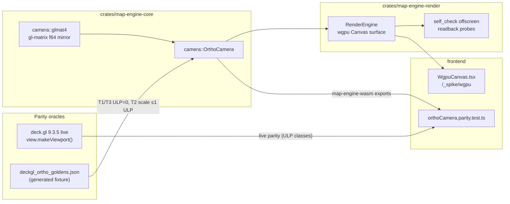

# T-151 Phase 3 — wgpu render-engine spike: implementation plan

**Executor:** this Cursor agent, in the spike worktree, per operator instruction ("We are executing…", "Let's build a game engine") — this overrides the default Claude-Code-owns-code split for this branch only. No Rust/TS is written until this plan is approved.

**Working tree:** `/var/home/Samuel/Projects/TBD-Reforger/tbd-reforger-wgpu-spike` on branch `t-151-wgpu-spike` @ `209999fd` (verified: clean, contains the full yrs doc-core; `node_modules` absent; `src/wasm/pkg` unbuilt). All paths below are relative to that root. Main repo, registry, and `main` are untouched.

**Scope = exactly the four approved steps** of Phase 3's spine:
1. Scaffold `crates/map-engine-render` (wgpu `webgpu`+`webgl` features, wasm-bindgen).
2. Headless math-verifiable `OrthoCamera` in `crates/map-engine-core` + parity tests against Deck.gl `OrthographicView`.
3. `RenderEngine` API targeting `wgpu::SurfaceTarget::Canvas`.
4. `WgpuCanvas.tsx` mounted at `/_spike/wgpu` with the strict wasm memory lifecycle.

**Explicitly OUT of this slice** (next slices, after this ships): TBDS satellite parsing/decode, texture upload, the world-bounds satellite quad, the icon atlas, the LOD/density ladder, compute culling, streaming/mips, any Deck.gl removal. The GPU scene in THIS slice is a deterministic **calibration scene** whose every pixel is predicted by the camera math — that is what makes render verification numeric instead of "looks good" — plus an **instanced stress mode up to 20,000,000 instances** through chunked buffer pools, so the north-star scale (§20M feasibility below) gets measured constants on day one, not promises. Everything 20M-critical that is *architectural* (vertex-stream instancing, chunked buffer pool, streaming upload, exact-count primitives, anchor parameterization) is IN this slice; everything 20M-critical that is *additive* (atlas, ladder, compute cull) has its hook built and its slice named.

**Verification philosophy (the operator's bar):** every claim is a machine-checkable number. Camera math: bit-exact (ULP=0) where mathematically forced, explicit ULP budgets where not, with the derivation for each budget. GPU pixels: byte-exact readback probes at pixel coordinates derived in closed form. The single irreducibly-perceptual item (pan/zoom feel) is explicitly operator-gated and never claimed as verified.

---

## Ground truth: the exact Deck.gl 9.3.5 contract being mirrored

Read from the installed `@deck.gl/core@9.3.5` dist (paths under `apps/website/frontend/node_modules/`). The app's only usage is `new OrthographicView({ id: 'tactical-ortho', flipY: false })` with `viewState = { target: [tx, ty], zoom }` ([useOrthographicView.ts](tbd-reforger-wgpu-spike/apps/website/frontend/src/features/tactical-map/view/useOrthographicView.ts) lines 29–36; `MIN_ZOOM = -6`, `MAX_ZOOM = 6`, default zoom `-2`, target clamped to `[0,width]×[0,height]`, Everon 12800×12800 center `(6400, 6400)`).

Composition order (all f64, plain JS arrays, gl-matrix column-major, vectors multiplied from the right):

- `scale = Math.pow(2, zoom)`; near `0.1`, far `1000`, padding `null` (app never sets them).
- `U` (uncentered view) = `lookAt(eye=[0,0,1], center=[0,0,0], up=[0,1,0])` — closed form: identity with `m[14] = -1` — then in-place `scale([s, s, s])` (flipY:false ⇒ no y negation).
- `V` (view) = `identity.multiplyRight(U).translate([-tx, -ty, -tz])` (gl-matrix in-place `translate`, `out===a` branch).
- `P` = `orthoNO(left=-w/2, right=w/2, bottom=-h/2, top=h/2, 0.1, 1000)` — GL z∈[-1,1] convention; exact expression tree with `lr=1/(l-r)` etc.
- `VP` = `mat4.multiply(vpm, vpm=I·P, V)` ⇒ `P·V`.
- `pixelProjection` = `viewportMatrix · VP` where `viewportMatrix = I.scale([w/2, -h/2, 1]).translate([1, -1, 0])` ⇒ pixel = top-left origin, `x_px = (ndc.x+1)·w/2`, `y_px = (1-ndc.y)·h/2`.
- `pixelUnprojection = mat4.invert(pixelProjection)` (exact gl-matrix cofactor expression tree).
- `project([x,y,z])` = `transformVector(pixelProjection, [x,y,z,1])` → `[px, py, pz]`, topLeft. **Expression-tree detail:** `transformVector` computes `w⁻¹ = 1/result[3]` once and multiplies each component by it (`vec4.scale`) — `r[i] * (1/w)`, not `r[i] / w`; these differ bitwise and the Rust mirror must use the multiply form (`math-utils.js` `transformVector`).
- `unproject([px,py])` (no z) = transform `[px,py,0,1]` and `[px,py,1,1]` through `pixelUnprojection`, then `vec2.lerp(coord0, coord1, t)` with `t = z0 === z1 ? 0 : (0 - z0)/(z1 - z0)` — intersection with the world z=0 plane. `vec2.lerp` form is `a + t·(b − a)` (mirror verbatim, incl. the `z0===z1` branch).
- `getBounds()` = component-wise min/max of `unproject` at the four viewport corners `(0,0), (w,0), (0,h), (w,h)` at z=0 (`viewport.js` lines 188–200) — mirrored as `visible_world_rect()` (used by every future culling/tile-selection feature, so it enters the corpus now).

Hand-derived closed-form anchor (goes into a Rust unit test as literal constants) — `w=800, h=600, zoom=0 (s=1), target=(6400,6400,0)`:

- `V = [1,0,0,0, 0,1,0,0, 0,0,1,0, -6400,-6400,-1,1]`
- `P: m0=0.0025, m5=1/300, m10=-2/999.9, m14=-1000.1/999.9, m15=1` (rest 0)
- `VP: m0=0.0025, m5=1/300, m10=-2/999.9, m12=-16, m13=-64/3, m14=-998.1/999.9, m15=1`
- `project([6400,6400,0]) = (400, 300)` — screen center **exactly** (asserted with `==`, subtraction cancels exactly).
- `project([6500,6400,0]) = (500, 300)` — +100 m east ⇒ +100 px right at zoom 0.
- `project([6400,6500,0]) = (400, 200)` — +100 m north ⇒ 100 px **up** — the numeric proof of flipY:false / north-up.

Sign/unit invariants (fixed vocabulary for all code + tests): world = Arma meters, +Y = north; screen pixels top-left origin, +y down; `zoom` = log2(pixels per meter); camera dimensions are **CSS pixels**; matrices column-major `[f64; 16]`.

---

## S0 — Preflight (worktree environment, no code)

- `cd` the worktree; assert `git branch --show-current` == `t-151-wgpu-spike` and `git status --porcelain` empty.
- `node --version` (expect v26 per `.nvmrc`; `nvm use` if not), `cargo --version` (1.95), `wasm-pack --version` (0.15), `rustup target list --installed | grep wasm32-unknown-unknown`.
- `npm ci` in `apps/website/frontend/` (worktree has no `node_modules` — verified).
- `make wasm` (builds the existing bundler pkg the `_wasm` parity suite imports) then `npm test` — baseline must be green (223 tests per CLAUDE.md) **before** any change; record the count.
- LFS sanity from the Phase-2 assertions: `head -c4 packages/map-assets/everon/satellite/everon-sat.tbd-sat` == `TBDS` (not needed by this slice, but proves the worktree is fully materialized).
- Commit the approved plan text as `.ai/artifacts/t151_wgpu_spike_phase3_plan.md` (artifact convention) in commit C1.

## S1 — Scaffold `crates/map-engine-render`

**Files:**
- `Cargo.toml` (root): members += `"crates/map-engine-render"`.
- `crates/map-engine-render/Cargo.toml` — exact contents:
  - `[package]` name `map-engine-render`, version `0.1.0`, edition `2024`, rust-version `1.95`, license `UNLICENSED`, publish `false`, description mentioning T-151.
  - `[lib] crate-type = ["cdylib", "rlib"]`.
  - Plain `[dependencies]` (compile natively for the scene byte tests): `map-engine-core = { path = "../map-engine-core" }` (no features — camera only), `bytemuck = { version = "1", features = ["derive"] }`.
  - Under `[target.'cfg(target_arch = "wasm32")'.dependencies]` (heavy GPU/web stack never touches native builds): `wgpu = { version = "29", default-features = false, features = ["webgpu", "webgl", "wgsl"] }`, `wasm-bindgen = "0.2"`, `wasm-bindgen-futures = "0.4"`, `js-sys = "0.3"`, `web-sys = { version = "0.3", features = ["HtmlCanvasElement"] }`, `console_error_panic_hook = "0.1"`.
- `crates/map-engine-render/src/lib.rs` — wgpu/web modules `#[cfg(target_arch = "wasm32")]`-gated; the pure `scene` data module (geometry builders, `#[repr(C)]` bytemuck instance structs) compiles **natively too** so its byte-level tests run under plain `cargo test` (keeps the workspace-wide CI `cargo build --all-targets` / `clippy` / `test` green — verified those run workspace-wide in `ci.yml`). Consequence: `bytemuck` and `map-engine-core` sit in plain `[dependencies]`; only wgpu/wasm-bindgen/web-sys/js-sys/futures/panic-hook are target-gated.
- Makefile: extend `wasm-ci` with `cargo fmt --check -p map-engine-render` + `cargo clippy -p map-engine-render --target wasm32-unknown-unknown -- -D warnings`; add target `wasm-render`: `wasm-pack build crates/map-engine-render --release --target web --out-dir ../../apps/website/frontend/src/wasm/render --out-name map_engine_render`. `--target web` (not bundler) keeps the heavy wgpu pkg isolated from the doc-core pkg and needs no vite-plugin-wasm involvement (init fetches `*_bg.wasm` via `new URL(..., import.meta.url)`, which Vite handles natively).
- Ignore wiring (each an exact one-line edit): root `.gitignore` += `apps/website/frontend/src/wasm/render/`; `eslint.config.js` `globalIgnores` += `'src/wasm/render/**'`.

**Gate S1:** `cargo build --workspace` (native — render crate builds its scene module only, no GPU deps), `cargo clippy --all-targets -- -D warnings`, `make wasm-render` succeeds and emits `map_engine_render.js` + `.d.ts` + `_bg.wasm`.

## S2 — `OrthoCamera` in `crates/map-engine-core` (pure math, no wgpu)

**Files:** `src/camera/mod.rs`, `src/camera/glmat4.rs`, `src/camera/ortho.rs`; `pub mod camera` in `lib.rs`. No new dependencies (fixture tests use `serde_json` as a dev-dependency — already in the tree).

- `glmat4.rs` — a line-for-line f64 mirror of the exact gl-matrix functions deck's path touches, **preserving each expression tree verbatim** (IEEE-754 ops are deterministic, so identical expression trees ⇒ identical bits): `multiply`, `translate` (in-place `out===a` branch), `scale`, `ortho_no`, `look_at`, `invert` (cofactor form), `transform_vector` (transformMat4 + `1/w` scale), `lerp`. Each function's doc comment cites its source (`@math.gl/core/dist/gl-matrix/mat4.js` line range) — that citation is the review contract for "same expression tree".
- `ortho.rs` — `OrthoCamera { width_px: f64, height_px: f64, zoom: f64, target: [f64; 3] }` with deck defaults as named consts (`NEAR = 0.1`, `FAR = 1000.0`), flipY:false semantics hardcoded (the app never uses flipY:true; documented). API:
  - `new(width_px, height_px, target_x, target_y, zoom)`
  - `view_matrix() / projection_matrix() / view_projection() / pixel_projection() -> [f64;16]`, `pixel_unprojection() -> Option<[f64;16]>` — composed in **deck's exact order** (incl. the `I·P` then `·V` multiply sequence and the viewportMatrix scale-then-translate).
  - `project(&self, [f64;3]) -> [f64;3]` (top-left px) and `unproject_xy(&self, px, py) -> [f64;2]` (two-point z-plane lerp) — mirroring `viewport.project`/`unproject` exactly.
  - `visible_world_rect(&self) -> [f64;4]` (`[minX, minY, maxX, maxY]`) — mirrors deck `getBounds()` (min/max of the four corner unprojects). Added now because every future feature (frustum culling, tile selection, chunk streaming) keys off it; it enters the golden corpus on day one instead of being retrofitted unverified.
  - `scale(&self) -> f64` = `exp2(zoom)`.
  - Interaction helpers (the wasm event contract): `pan(&mut self, dx_px, dy_px)` — `target.x -= dx_px/scale; target.y += dy_px/scale` (drag content-follows-cursor under flipY:false) — and `zoom_at(&mut self, dz, cursor_x_px, cursor_y_px)` — clamp `zoom+dz` to `[-6, 6]` (consts mirroring `useOrthographicView.ts`), then solve the new target so the world point under the cursor is invariant. Optional `set_bounds(min_x, min_y, max_x, max_y)` clamping target, mirroring `onViewStateChange` (used by the spike page like the editor does).
  - `wgpu_clip_matrix(&self, anchor_x: f64, anchor_y: f64) -> [f32;16]` = `Z01 · VP · T(anchor)` composed in f64, cast to f32 last — where `Z01` (column-major: `m10 = 0.5`, `m14 = 0.5`, else identity) remaps GL NDC z∈[-1,1] to WebGPU z∈[0,1]. **Z01 is mandatory:** without it, world z=0 sits at GL NDC z = −998.1/999.9 ≈ −0.9982, which WebGPU clips (z<0) — the screen would be empty. wgpu presents WebGPU clip conventions on the WebGL backend too, so this one matrix serves both. **Anchor rule (precision at scale):** the anchor belongs to the *uploaded geometry*, not the camera — vertex/instance coordinates are stored anchor-relative in f32 once, and the per-frame f64 matrix carries `target − anchor`. Worst-case f32 error bound (stated in a code comment): matrix translation magnitude ≤ `2^6 · 12800 = 819200` ⇒ relative f32 error `2⁻²⁴` ⇒ ≤ 0.05 px at max zoom; scene-local coordinates (≤ a few hundred m per chunk anchor) contribute < 1e-3 px. Future large worlds use per-chunk anchors — the seam already exists in the signature.
  - **Oracle hook for exactness:** the matrix builders internally take `scale` as a parameter; `#[doc(hidden)] pub fn with_scale_for_test(width, height, target, zoom, scale)` exposes injection so the parity tests can split "pow drift" from "pipeline drift" (see S3b).

## S3 — The parity corpus (this is the "mathematically verifiable" core)

**Two independent oracles, three test layers:**

**(a) Golden fixture generator** — `apps/website/frontend/scripts/gen-deckgl-ortho-goldens.mjs` + npm script `gen:ortho-goldens`. Imports `OrthographicView` from the installed `@deck.gl/core` and uses the app's exact oracle path `new OrthographicView({ flipY: false }).makeViewport({ width, height, viewState: { target, zoom } })`. Emits `crates/map-engine-core/tests/fixtures/deckgl_ortho_goldens.json` (committed). Fully enumerated battery — **no randomness**:
- zooms: integer `{-6, -4, -2, 0, 2, 6}` ∪ fractional `{-5.5, -2.25, 0.5, 3.75}` (all exact f64 inputs)
- sizes: `{1×1, 800×600, 1366×768, 1920×1080, 2560×1440, 1237.33×842.67}` — the last is a **fractional CSS size**, because the live app builds viewports from `getBoundingClientRect()` which returns fractional dimensions (`TacticalMap.tsx` line 210); integer-only sizes would leave the real input domain untested
- targets: `{(0,0), (6400,6400), (12800,12800), (123.456, 9876.543), (-500, 13300)}` (last one deliberately out-of-bounds — camera math is clamp-free; clamps live in the view-state layer)
- = 300 cases; per case: `scale` (JS `Math.pow(2, zoom)` recorded — this is the oracle's own transcendental, consumed by the injection test below), `bounds` (deck `getBounds()` 4-tuple), 5 world→pixel probes (terrain corners, center, target, target+(137.037, −73.31)) each recording all three `project` components `[px, py, pz]` + round-trip, 4 pixel→world unprojects (`(0,0)`, `(w/2,h/2)`, `(w,h)`, `(0.25w, 0.75h)`); the 5 full matrices for the 60 `800×600` cases (bounds fixture size ~350 KB; arrays one line each, 2-space indent, trailing newline for editorconfig). JSON numbers use JS shortest-round-trip serialization, parsed exactly by serde_json ⇒ lossless f64 transport.
- Meta block records `deckglVersion` (read from package.json), node version, flipY, near/far, generator name.
- **Determinism gate:** run generator twice, `sha256sum` both outputs equal; committed fixture must equal a fresh run (`git diff --exit-code` after regen). Cross-V8-version drift of `Math.pow` cannot invalidate the committed fixture (the Rust gate reads the frozen file); the live vitest oracle (layer c) independently tracks whatever V8 the runtime ships — that split is why two oracles exist.

**(b) Rust native tests** — `crates/map-engine-core/tests/deckgl_ortho_parity.rs` (+ `camera_props.rs`), fixture via `include_str!`:
- Port `ulpDistanceF64` from [parity.ts](tbd-reforger-wgpu-spike/apps/website/frontend/src/features/_wasm/parity.ts) lines 62–75 into the test helper (i128 intermediate; +0/−0 ⇒ 0; NaN ⇒ ∞).
- **T1, integer-zoom cases: ULP distance == 0 (bit-exact)** on every matrix entry, every `project`/`unproject` output, and `bounds`. This is forced: `2^int` is exact in both `Math.pow` and `exp2`, and every other op follows an identical expression tree. If any platform wrinkle breaks this, the gate fails loudly; the only sanctioned response is a per-assertion documented tolerance bump with root-cause comment — never a silent global epsilon.
- **T2, scale-drift isolation (ALL cases, incl. fractional):** assert `ulp(exp2(zoom), fixture.scale) ≤ 1` — the *only* op that is not expression-tree-mirrored, measured in isolation.
- **T3, scale-injection exactness (ALL cases, incl. fractional):** rebuild the camera via `with_scale_for_test(…, fixture.scale)` — i.e. feed it the oracle's own transcendental — and assert **ULP == 0** on every matrix entry, project/unproject output, and bounds. Together T2+T3 mean the *entire* pipeline is proven bit-exact unconditionally, and the residual fractional-zoom uncertainty is confined to one measured ≤1-ULP scalar. Nothing is "close enough by epsilon".
- **T4, end-to-end fractional (informational bound):** with Rust's own `exp2`, ULP ≤ 2 on matrix entries, ≤ 4 on project/unproject — the propagation of T2's scalar through one product and one transform/divide chain; derivation in the test header. (T3 is the real gate; T4 documents the shipping-path bound.)
- Closed-form literal test: the `800×600/z0/(6400,6400)` anchor case above asserted against hand-written constants (independent of both oracles).
- Property tests (seeded LCG, constants in-file, mirroring the `meters.parity.test.ts` convention): 10,000 round-trips `|unproject(project(p)) − p| ≤ 1e-9·max(1,|p|)` over p∈[−20000,20000]², zoom∈[−6,6], w,h∈[1,4096]; `project(target) == (w/2, h/2)` **exact** (`==`, the `x − tx` cancellation is exact; note `pan` shift is *not* claimed exact — FP distributivity — hence its 1e-9 px tolerance); 1,000 pan invariants (`project(p)` shifts by `(dx,dy)` ± 1e-9 px); 1,000 zoom_at invariants (`unproject(cursor)` fixed ± 1e-9 m; zoom clamped to [−6,6]); 1,000 `visible_world_rect` consistency checks (every rect corner re-projects into `[0,w]×[0,h]` ± 1e-9 px).

**(c) Live-oracle vitest** — expose the camera through the **existing bundler pkg** (`map-engine-wasm`, so the established `_wasm` test harness applies unchanged): add `#[wasm_bindgen] pub struct OrthoCameraJs` (constructor + `project`/`unproject`/matrix getters returning `Vec<f64>`; `pan`/`zoom_at`). New test `apps/website/frontend/src/features/_wasm/orthoCamera.parity.test.ts` (the exact filename the Phase-3 design names): instantiates deck's viewport **live, in-process** per battery case and asserts the same ULP classes against the wasm exports. Two oracles converging (committed fixture in Rust + live deck in vitest) means a deck.gl upgrade or a codegen drift can't silently rot the contract.

## S4 — `RenderEngine` (crates/map-engine-render)

**Files:** `src/lib.rs` (exports + `console_error_panic_hook` init), `src/engine.rs` (GPU device/surface owner), `src/scene.rs` (**pure, native-compiled** instance-data builders), `src/probe.rs`, `src/shader.wgsl`.

- **Backend decision happens BEFORE the canvas is touched — hard constraint.** A canvas permanently commits to its first `getContext` type: if a WebGPU context is created and adapter/device acquisition then fails, `getContext('webgl2')` on the *same* canvas returns `null` — same-canvas fallback is **impossible**. Therefore: (1) `force_webgl` ⇒ GL instance, done; (2) otherwise probe WebGPU availability off-canvas (`wgpu::util::new_instance_with_webgpu_detection`, which exists precisely for this — `navigator.gpu` presence alone is NOT sufficient, e.g. Linux Chrome exposes it with no adapter) and only then pick the backend. Any failure *after* the canvas is contexted is a hard, typed error; retry granularity is a **fresh canvas element** (S5 bumps a React `key`), never a same-canvas retry.
- **Init order (WebGL2 REQUIRES the compatible surface before adapter — wgpu 29 changelog):** decided instance (`Instance::new(&InstanceDescriptor …)`, by-reference in 29; no-display-handle constructor) → `instance.create_surface(SurfaceTarget::Canvas(canvas))` → `request_adapter(&RequestAdapterOptions { compatible_surface: Some(&surface), .. })` → `request_device` with `required_limits = Limits::downlevel_webgl2_defaults().using_resolution(adapter.limits())` on GL, defaults on WebGPU. Async throughout via wasm-bindgen-futures. (wgpu 29 call shapes re-verified against docs.rs of the pinned version at implementation time; any deviation is a one-line verify-log note, not a design change.)
- **Surface config:** `surface.get_default_config(&adapter, device_w, device_h)` then force the first **non-sRGB** format from capabilities and hard-error (`JsError`, code string `srgb-only-surface`) if none — this makes the readback color contract exact (no transfer-function guesswork). `PresentMode::Fifo`.
- **ONE instanced pipeline — this is the scalability spine, not a toy path.** Vertex stream 0: a unit quad (4 vertices, triangle strip, `step_mode: Vertex`). Vertex stream 1 (`step_mode: Instance`): `QuadInstance { min: [f32;2], max: [f32;2], color: [f32;4] }` (`#[repr(C)]`, bytemuck `Pod`) — the shader expands `pos = mix(inst.min, inst.max, unit_uv)`. The calibration scene is just **2 instances** through this pipeline, and the exact same draw-call shape scales through the chunked pool to 20M instances (S4d) — the instance workload that motivated the whole pivot renders through the path we verify on day one, instead of a dead-end dedicated-vertex path. Uniform `mvp: mat4x4<f32>` = `wgpu_clip_matrix(anchor)` (f64-composed, f32-cast; scene anchor constant `(6400, 6400)`). No depth attachment, no blending (opaque); instance order defines overlap.
- **Calibration scene (exact, closed-form):** clear color `wgpu::Color { r: 51/255, g: 68/255, b: 85/255, a: 1 }`; green instance G = world `[6300,6300]…[6500,6500]`, red instance R = `[6450,6450]…[6490,6490]` after G. Two forced-exactness arguments, stated precisely:
  - **Color bytes are forced by margin, not by exact representability** (51/255 = 0.2 has no finite binary expansion): the f64→f32→unorm8 chain carries relative error < 2⁻²³ ≈ 1.2e-7, while the unorm8 rounding decision margin is 1/510 ≈ 2.0e-3 — four orders of magnitude of headroom ⇒ readback bytes are exactly `[51,68,85,255]` on any conformant implementation. Quad colors 0.0/1.0 are exact outright.
  - **Geometry pixels are forced by margin:** at the fixed probe camera (`800×600`, zoom 0, target `(6400,6400)` = anchor) every quad edge lands on an **integer pixel coordinate** (G: x∈[300,500], y∈[200,400]; R: x∈[450,490], y∈[210,250]); pixel centers sit at half-integers, so coverage is decided at ≥ 0.5 px distance from every edge — while the worst-case f32 vertex/matrix displacement at this camera is < 1e-3 px (anchor-relative coords ≤ 200, exact in f32; matrix entries carry ≤ 2⁻²⁴ relative error). Safety factor > 500× ⇒ **zero rasterization-rule dependence, no tolerances needed**.
- **`scene.rs` is pure and native-tested (closes the "did we upload what we think" gap):** `calibration_instances() -> [QuadInstance; 2]` and `stress_chunk(chunk_idx, count, seed) -> Vec<QuadInstance>` (seeded LCG derived per chunk — deterministic and independently regenerable) contain no wgpu types; a plain `cargo test -p map-engine-render` asserts the **exact bytes** (`bytemuck::bytes_of` memcmp against literal expected bytes — Class R) for the calibration instances and for sampled stress instances (first 4 of chunk 0 and chunk 1) that the GPU upload will receive verbatim.
- **Chunked instance-buffer pool (the 20M enabler, built now):** instance data lives in a pool of GPU buffers of **2,097,152 instances × 32 B = 64 MiB each** — a size that is legal by construction under WebGPU's *default* limits (`maxBufferSize` 256 MiB) with 4× headroom, so no device-limit negotiation is ever load-bearing. 20M instances = 10 buffers = 10 instanced draws (draw-call overhead is negligible at this count; per-chunk draws are also exactly the shape chunk-granular culling consumes later). Upload streams through **one reused 64 MiB staging `Vec`** (fill chunk → `queue.write_buffer` → refill), so peak wasm heap is bounded at one chunk regardless of N — the wasm32 4 GiB ceiling stays untouched at any object count, and this loop is the rehearsal for real world-object chunk streaming.
- **API (wasm-bindgen):** `async create(canvas, force_webgl: bool) -> Result<RenderEngine, JsError>`; `resize(css_w, css_h, dpr)` (camera in CSS px, surface at `round(css·dpr)` device px; reject 0-sized); `set_view(tx, ty, zoom)`, `pan(dx, dy)`, `zoom_at(dz, cx, cy)`; readouts `target_x/target_y/zoom/backend()` (backend string from `adapter.get_info()`: `"webgpu" | "webgl2"` for the HUD + gates) and `visible_bounds()` (HUD + future culling); `render()` — `get_current_texture()` with the standard error arms (`Lost | Outdated` ⇒ reconfigure + retry once; `Timeout` ⇒ skip frame; `OutOfMemory` ⇒ typed error) — the reconfigure arm also self-heals the StrictMode canvas-reconfiguration race; `seed_stress(n: u32, seed: u64)` / `clear_stress()`; `stats() -> String` (JSON: `{backend, instances, chunks, gpu_bytes, staging_peak_bytes, gen_ms, upload_ms, uniform_bytes_last_frame, gpu_frame_ms?}` — `gpu_frame_ms` populated via `TIMESTAMP_QUERY` when the adapter offers it, else omitted; every performance claim in the verify log is one of these numbers); `async self_check() -> Result<String, JsError>`.
- **`self_check()` (GPU made numeric):** renders the calibration scene with a **local** fixed camera (independent of live view state) into a dedicated offscreen `Rgba8Unorm` 800×600 texture (`RENDER_ATTACHMENT | COPY_SRC`), `copy_texture_to_buffer` with explicit row padding (800·4 = 3200 → padded to 3328 per `COPY_BYTES_PER_ROW_ALIGNMENT` 256), await the async map through the JS event loop (no blocking poll exists on wasm; if the GL path stalls, the known pattern is a `device.poll(PollType::Poll)` after submit), then assert byte-exact probes and return a JSON report `{backend, probes: [{px, py, expect, got, pass}], pass}`:
  - (400,300) = green `[0,255,0,255]`; (302,302) and (498,398) = green (≥2.5 px inside G's NW/SE corners, measured center-to-edge); (298,300) and (400,198) = clear `[51,68,85,255]` (≥1.5 px outside west/north edges);
  - orientation kill-shot: (470,230) = red **and** (470,370) = green — if the y-axis were flipped these two swap, so a sign error cannot pass;
  - all expectations are byte-equality (`==`), no tolerances — legitimate per the margin arguments above.
- **S4d — instanced stress mode to 20M (the "fast" claim made measurable):** `seed_stress(n, seed)` streams n deterministic quads (uniform over Everon bounds, 2–20 m sizes) through the chunked pool — HUD buttons **100k / 1M / 5M / 20M**. Integer accounting is asserted, not assumed: `stats().instances` (the sum of per-chunk draw ranges) must equal the requested n exactly. The verify log records, at each count on **both** backends: fps, `gen_ms`, `upload_ms`, `gpu_bytes`, and `gpu_frame_ms` where available. Two honesty rules: (1) the 32 B `QuadInstance` is *heavier* than the pinned ≤20 B production icon layout, so every measured number is a **conservative lower bound** on production throughput; (2) the plan **predicts sub-60 fps at brute-force 20M** (80M vertex-shader invocations/frame = 4.8 GVerts/s at 60 fps, beyond most hardware — see §20M feasibility) — that measurement is the point: it calibrates the constants that size the cull/LOD ladder, and 60 fps at 20M is delivered by the ladder (whose per-frame work is independent of N), never by brute force. fps is a readout, not an eyeball.

## S5 — `WgpuCanvas.tsx` at `/_spike/wgpu` (strict wasm lifecycle)

**Files:** `apps/website/frontend/src/features/_spike/wgpu/WgpuCanvas.tsx` (default-export page: canvas + HUD), `.../wgpu/wasmRender.ts` (module glue), route additions in `features/_spike/routes.ts` (lazy export, mirroring `DocCoreSpikePage`) + `router.tsx` (no-auth, chromeless, exactly like the `/_spike/doc-core` block at lines 50–58).

Lifecycle invariants (each carries a comment naming it; per the `wasm-react-lifecycle` memory, `.free()` is NOT idempotent):
- **I1 — module init once:** `wasmRender.ts` memoizes the web-target `init()` promise at module level; `init()` runs exactly once per page session (double-init would instantiate a second wasm memory).
- **I2 — engine is effect-local:** created inside `useEffect`, never in `useMemo`/`useRef`-persisted state; the only references are the effect closure's `let engine` and the cleanup.
- **I3 — at most one live engine per canvas, ever:** a module-level promise chain (`creationMutex = creationMutex.then(create)`) serializes `RenderEngine.create` calls, so the StrictMode interleave (setup₁ → cleanup₁ → setup₂ while create₁ is still awaiting) cannot have two engines configuring one canvas concurrently; combined with I4, engine A is freed before engine B's surface exists.
- **I4 — free exactly once on every path:** cleanup sets `disposed = true`, cancels rAF, disconnects the ResizeObserver, then frees `engine` iff committed; the async create path checks `disposed` immediately after `await` and frees-and-returns without committing. No other code path may call `.free()`.
- **I5 — no render-after-free:** the rAF loop re-checks `engine !== null && !disposed` every frame and is cancelled before free in cleanup.
- **I6 — errors surface:** create/render rejections land in a `useState` error banner (never swallowed; lint `no-empty` enforces).
- **I7 — retry = new canvas element:** the error banner's "Retry with WebGL2" action bumps a React `key` on the canvas (fresh DOM node) — required by the one-context-per-canvas constraint in S4; the old engine (if any) was already freed via I4.

Sizing & input: ResizeObserver on the container → `engine.resize(cssW, cssH, devicePixelRatio)`; the rAF loop also compares `devicePixelRatio` per frame (cheap) to catch monitor moves. The css→device-pixel mapping is a **pure exported helper** `deviceSize(cssW, cssH, dpr)` with a literal-expectation vitest (dpr ∈ {1, 1.25, 1.5, 2, 2.75} × odd css sizes) so even that one rounding rule is pinned, not assumed. Pointer capture drag → `engine.pan(dx_css, dy_css)`; wheel (`preventDefault`) → `engine.zoom_at(-e.deltaY * WHEEL_ZOOM_PER_PX, cx_css, cy_css)` with exported `WHEEL_ZOOM_PER_PX = 1/500` (the camera-side semantics of `zoom_at` are property-tested in Rust; the constant only tunes feel). HUD (reuses [useFps.ts](tbd-reforger-wgpu-spike/apps/website/frontend/src/features/_spike/useFps.ts)): fps, backend string, `target/zoom/bounds` readouts (tabular-nums), a live `stats()` panel (instances / chunks / GPU bytes / gen+upload ms / `uniform_bytes_last_frame` / gpu_frame_ms), a **Run self-check** button that prints the JSON report PASS/FAIL, **stress buttons** (100k / 1M / 5M / 20M / clear → `seed_stress`), and a **Force WebGL2** link (`?force=webgl`, read once at mount and passed to `create`). Initial view: Everon center `(6400, 6400)`, zoom `-2`, bounds `[0,0,12800,12800]` — mirroring the editor defaults. The stats panel makes the **navigation invariant** observable: while panning/zooming over a seeded scene, `uniform_bytes_last_frame` must read exactly **64** (one mat4x4 f32) and nothing else — steady-state navigation uploads zero instance data at any N.

## S6 — Gates, commits, and what is NOT claimed

**Machine gates (all must pass; run in the worktree):**
- V1 `cargo fmt --check` (workspace) — includes the new crate.
- V2 `cargo clippy --all-targets -- -D warnings` (native workspace) + `cargo clippy -p map-engine-render --target wasm32-unknown-unknown -- -D warnings`.
- V3 `cargo test -p map-engine-core --all-features` — goldens (T1 ULP=0 integer / T2 scale ≤1 ULP / T3 injected ULP=0 all / T4 bounds), closed-form literals, 13k+ property cases; **and** `cargo test -p map-engine-render` — scene instance-byte memcmp (Class R).
- V4 golden determinism — regenerate, `git diff --exit-code` on the fixture.
- V5 `make wasm && npm test` — new `orthoCamera.parity.test.ts` + `deviceSize` tests green **and** the pre-existing suite still green at its S0 baseline count.
- V6 `make wasm-render` + `npm run build` + `npm run lint` clean (tsc typechecks WgpuCanvas against the emitted `.d.ts`); record `map_engine_render_bg.wasm` byte size in the verify log (tracked metric for the wgpu+webgl payload, not a gate).
- V7 `cargo build --workspace` native (render crate native = scene module only).
- V8 **browser verification — agent-run first, operator for the remainder:**
  - **V8a (agent, IDE browser):** I navigate to `/_spike/wgpu`, read the self-check JSON from the page (must be `pass: true`), take a screenshot and check the 4 key probe coordinates in the captured image (advisory ±3/channel — screenshots pass through compositor color management, so byte-exactness lives in `self_check`, not the screenshot), and repeat under `?force=webgl`. The Electron-embedded browser guarantees the WebGL2 path; if it lacks WebGPU, that half moves to V8b.
  - **V8b (operator, real browser):** self-check `pass: true` + zero console errors on the WebGPU backend; the **stress table** — fps + `stats()` JSON at 1M / 5M / 20M on both backends, plus `stats().instances == 20,000,000` exactly and `uniform_bytes_last_frame == 64` during a pan at 20M (the navigation invariant, read off the HUD) — all numbers copied into the verify log verbatim; and the four **binary** perceptual checks, each a yes/no: red square appears up-and-right of green center (present-path orientation — the one thing probes can't see), wheel-up zooms in at the cursor, drag-right moves the map content right, motion feels smooth at ≤1M. Feel is the sole non-numeric judgment and is recorded as an operator statement, never as a verified fact. Sub-60 fps at brute-force 20M is an expected *measurement*, not a gate failure (§20M feasibility).
- Verify log artifact: `.ai/artifacts/t151_wgpu_spike_verify_log.md` capturing every gate's command + output verbatim (self-check JSONs, fps table, wasm size).

**Commits (on `t-151-wgpu-spike`, `Co-Authored-By` trailer, no tags until ship; registry untouched — T-151 stays `queued` with no `active_slice` per the Phase-1 design):**
- C1 `T-151 plan: wgpu spike Phase 3 implementation plan` — the approved plan artifact.
- C2 `T-151 wgpu spike: OrthoCamera deck-parity core + golden corpus` — S1 + S2 + S3 (gates V1–V5, V7).
- C3 `T-151 wgpu spike: RenderEngine canvas surface + /_spike/wgpu mount` — S4 + S5 (gates V6, V8 evidence).

## 20M-object feasibility — the architectural law and the arithmetic

The north star: Reforger-scale maps with **20,000,000 objects** (real objects — typed, rotated, tinted, glyph-rendered — not dots) navigable with virtually no lag. That is only achievable under one law, and every design choice in this plan is audited against it:

**The law: per-frame cost must be a function of screen pixels (P) and a fixed icon budget (B) — never of total object count (N).** N may only influence one-time/streamed residency work, never the steady-state frame.

**Why brute force is provably insufficient (so nobody re-litigates it later):**
- Pixel bound: at 2560×1440, P = 3,686,400. Full-island view of N = 20M ⇒ ≈ 5.4 objects per pixel — the *sub-pixel regime*. No renderer can display 20M distinguishable icons on 3.7M pixels; past ~N = P the only correct representations are aggregates.
- Vertex bound: 20M instanced quads = 80M vertex-shader invocations/frame = **4.8 GVerts/s at 60 fps** — beyond most GPUs (~2–10 GVerts/s peak, less sustained). The spike's 20M stress button exists to measure exactly where the operator's hardware lands on this curve.
- Fill is NOT the bottleneck: even 5× overdraw of the full screen ≈ 18 Mpx/frame ≈ 1.1 Gpx/s at 60 fps, versus 50–200 Gpx/s hardware fill — icons' one atlas fetch per fragment lives here, i.e. in the cheap domain.

**The ladder that satisfies the law (each rung with its verification method; hooks in this slice, rungs in named next slices):**
- **L0 — true icons, N_visible ≤ B (budget ≈ 2M):** instanced quads + atlas. Cost at B = 2M: 8M VS invocations/frame = 480M/s (5–25% of hardware); instance fetch 2M × 20 B = 40 MB/frame = 2.4 GB/s (≪ 300–1000 GB/s desktop). Comfortably inside 16.67 ms. *Verification:* this slice's stress measurements bracket it from above (32 B layout, no cull).
- **L2 — density aggregate, N_visible > B:** pre-aggregated per-chunk/per-texel counts rendered as one textured quad — **O(P)**, constant in N. The map program already produces exactly this data (T-090.3.2: 625 TBDD density grids). *Verification:* integer texel sums == exact object counts (Class R), switch threshold is a constant compared against an exact count.
- (Optional L1 — 1px point pass for the band between; decided by measurement, not now.)
- **Ladder switching needs exact visible counts:** per-chunk counts (625 chunks × u32 ≈ 2.5 KB directory) summed over frustum-intersecting chunks — integer arithmetic, O(chunks) ≈ microseconds, testable against brute-force counting on seeded data (Class R/S). `visible_world_rect()` — added to the camera corpus in this slice — is the frustum primitive.

**Culling (how N_visible gets small when zoomed in):**
- **Chunk-granular CPU cull, both backends:** world is already chunked (512 m grid ⇒ 625 chunks on Everon); AABB-vs-`visible_world_rect` over 625 chunks ≈ microseconds/frame; draw only intersecting chunks' buffers. Exactly testable (chunk set == reference set, Class S). The pool-of-chunk-buffers built in THIS slice is the shape this consumes.
- **Instance-granular GPU compute cull, WebGPU only (later slice):** compute pass appends surviving instances to a `VERTEX|STORAGE` buffer + `draw_indirect`. Cost at N = 20M: 20M AABB tests/frame = 1.2B tests/s of trivial compute (teraflop-scale hardware; fine) and 20M × 20 B = 400 MB/frame of reads = 24 GB/s at 60 fps (fine on desktop, tight on integrated — hence chunk pre-cull runs first and instance-level cull touches only boundary chunks, collapsing the worst case). *Verification:* GPU-culled count read back == CPU reference count for the same frustum (Class R integer equality) + sampled membership.
- **This is why instances are vertex streams, not storage buffers — pinned NOW:** wgpu's WebGL2 downlevel limits have `max_storage_buffers_per_shader_stage = 0`; a storage-buffer instancing design would strand the fallback entirely. Vertex-stream instancing works on both backends AND WebGPU compute can still write it (`VERTEX | STORAGE` usage). Anyone proposing to "modernize" this to pure SSBO indexing breaks WebGL2 and must bring a replacement fallback story.

**Residency & memory (where N is allowed to cost):**
- Production icon instance layout budget pinned at **≤ 20 B**: pos 2×f32 (8) + size f16×2 or u16 (4) + rotation snorm16 (2) + glyph index u16 (2) + tint/flags u32 (4). 20M × 20 B = **400 MB GPU** (this slice's 32 B stress layout ⇒ 640 MB = the conservative ceiling). Exact packing is pinned in the icon slice with its own byte-level corpus; the budget and required fields are pinned here.
- WebGPU default `maxBufferSize` = 256 MiB ⇒ **single-buffer designs are illegal at 20M by spec default**. The chunked 64 MiB pool (this slice) is therefore load-bearing architecture, not an optimization; it also gives chunk-cull its natural draw granularity.
- wasm32 is capped at 4 GiB address space ⇒ objects stream: fetch/generate chunk → fill 64 MiB staging → `write_buffer` → reuse staging. Peak wasm heap is **one chunk, independent of N** (this slice's stress generator rehearses exactly this loop and reports `staging_peak_bytes`). The CPU keeps only the chunk directory (AABB + count + buffer handle ≈ 20 KB for 625 chunks), never 20M decoded objects.
- **Two data classes, one pipeline family:** static world objects (the 20M — read-only, chunk-streamed, GPU-resident, CPU-dropped) vs dynamic mission entities (≤1M, doc-core SoA authoritative, dirty-range `write_buffer` of only edited instances = O(edits×20 B)/frame). Conflating them is the classic scaling mistake; they share shaders, not residency strategy.
- **"Unique icons" bounded honestly:** uniqueness = per-instance {glyph type, rotation, scale, tint} over a glyph library, not 20M distinct images (20M × 64² RGBA = 320 GB — physically impossible, and not what the game data is: Everon = 391 prefab classes + 51 tree species, T-090.3.3). Glyph budget: 4096 distinct 64² glyphs in a 4096² × 4-layer RGBA8 array = 64 MB — one bind group, single-draw-call compatible, WebGL2-portable (`TEXTURE_2D_ARRAY` exists in GLES3). u16 glyph index in the instance layout covers it with headroom.

**The navigation invariant (what "virtually no lag" means, checkably):** in steady-state pan/zoom, the per-frame CPU→GPU traffic is **exactly 64 bytes** (the view-projection uniform) at any N — instance data is static in GPU memory. Surfaced as `stats().uniform_bytes_last_frame == 64` and asserted during the V8 pan check. Camera math is O(1) f64 in wasm. Frame cost is then GPU-side and bounded by the law above.

**What this slice proves vs. what later slices prove:** this slice proves the mechanisms N depends on (chunked pool, streaming upload, uniform-only navigation, instancing throughput measured to 20M on real hardware) and ships the exact-count primitive (`visible_world_rect`). The atlas slice proves glyph rendering at B; the cull slice proves chunk/compute culling counts; the density slice proves L2 sums. Each lands with its own corpus in the house pattern. Nothing in this slice's API changes when those land — that is the test of "architecture, not scaffolding".

## Architecture seams (how this stays open, not a closed toy)

- **One instanced pipeline from day one:** icons/trees/props — from the 500k-instance workload that killed the Deck.gl path up to the 20M north star — render through exactly the draw-call shape this slice builds and stress-proves under the §20M law; adding a feature = adding an instance stream + shader variant, not rearchitecting.
- **Engine internals split as `Gpu` (instance/surface/device/queue) + an ordered list of draw batches** (pipeline + buffers + instance range). The calibration scene is merely the first batch producer; satellite quad, glyph atlas, and vector layers append batches. No render-graph framework until ≥3 real passes exist (deliberate YAGNI).
- **Camera lives in `map-engine-core`, not the render crate** — the doc-core, compiler, and any future headless consumer (server-side thumbnailing, tests) share the *verified* transform instead of reimplementing it.
- **Anchor-relative coordinates are parameterized** (`wgpu_clip_matrix(anchor)`) — large-world precision scales by giving each chunk its own anchor; the signature already supports it.
- **Wasm-module convergence path:** for this spike the render pkg (`--target web`) and the doc-core pkg (`--target bundler`) are separate wasm instances with separate memories (operator's isolation call), so doc→render data crosses JS. The end-state for true zero-copy (doc SoA → GPU upload with no JS copy) is a single wasm module (render crate gains the `doc` feature or one merged shim crate). That flip changes **packaging only**: the engine ingests `&[f32]` slices either way, so no API designed in this slice is invalidated.
- **The verification pattern is the reusable template:** enumerate inputs → committed golden fixture + live oracle → ULP/byte classes (R/T/S per `parity.ts`) → margin-forced GPU probes. Every future subsystem (culling via `visible_world_rect`, tile math, LOD) ships its own corpus in this exact shape; "looks right" never becomes the gate.
- **Deferred with names (not forgotten):** icon-atlas slice (glyph library + u16 index; §20M glyph budget), chunk-cull slice (chunk set == reference set gate), WebGPU compute-cull slice (readback count == CPU reference gate), density/L2 slice (texel sums == exact counts gate), damage-driven rendering (render-on-change instead of continuous rAF — battery), per-chunk anchors, depth/blend passes, wasm-size diet (`wasm-opt` tuning), wgpu render bundles for static batches.

**Known risk register (each with its tripwire):** wgpu 29 API drift vs this plan's call shapes (tripwire: compile; response: conform, note in verify log) · V8 `Math.pow` vs libm `exp2` at fractional zooms (tripwire: V3 T2 gate; residual confined to one measured ≤1-ULP scalar by T3) · non-sRGB surface format unavailable (tripwire: explicit `srgb-only-surface` error, never silent color drift) · WebGL2 readback/map-async stalls (tripwire: self_check on the forced-GL pass in V8; known `device.poll` pattern ready) · one-context-per-canvas fallback trap (closed by design: off-canvas backend detection + remount-key retry) · Electron browser lacking WebGPU (tripwire: V8a backend readout; falls to V8b) · 20M stress = 640 MB GPU on the conservative 32 B layout (tripwire: typed `OutOfMemory` surfaces in the HUD and is *recorded* — an OOM on integrated GPUs is a data point, not a failure; production layout halves it) · brute-force 20M expected below 60 fps (by design — the measurement calibrates the §20M ladder; only ≤1M carries a smoothness expectation in V8b) · `TIMESTAMP_QUERY` availability varies (tripwire: `stats().gpu_frame_ms` omitted, rAF fps remains) · fixture size creep (bounded: matrices only on the 800×600 subset).
