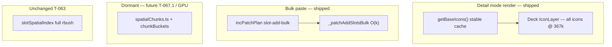

# T-067 — Spatial chunks / bulk-paste scale (mission layer)

**Status:** **Shipped** @ `d2128cf` — T-067.0 bulk paste + scaffolding; **T-067.0.1** CPU viewport cull reverted; follow-ons **T-111** / **T-112** (`idea`).  
**Git tag:** **T-067** (`d2128cf`)  
**Authority:** [MC ROADMAP](ROADMAP.md) §Map performance · [agent_execution.md](agent_execution.md) · [t066_worker_compile.md](t066_worker_compile.md) · [t063_spatial_index.md](t063_spatial_index.md) · [t110_terrain_base_mission_layers.md](t110_terrain_base_mission_layers.md) · [`docs/TICKET_LEAD.md`](../../docs/TICKET_LEAD.md)

**Prerequisites:** T-066 shipped (`53bc2a8`). Repro mission: `70a36667-612f-40c5-ad56-3fb8e0613a17` (~367k slots).

**Agent roles (locked):** **Cursor** authors and syncs all documentation. **Claude Code** reads specs and implements code only.

---

## In one sentence

**Stop bulk paste from triggering full ~367k snapshot rebuilds via `slot-add-bulk`; maintain dormant 512m chunk scaffolding for future lazy RAM / GPU cull on the path to 1M–10M entities.**

---

## Problem (post-T-066)

| Layer | Pre-T-067 | @ 367k impact |
|-------|-----------|---------------|
| Bulk paste (`pasteSlots`) | `incPatchPlan`: `added.length !== 1` → **full `docToSnapshot`** | Multi-second freeze on 6k paste |
| Detail `IconLayer` | `getBaseIcons()` → all icons; stable array @ pan | ~160 fps @ zoom -2 (acceptable) |
| `slotsById` / save | Full materialization | T-066 worker compile handles @ 367k |

**Existing “chunks” are I/O-only:** T-062.1 IDB `PERSIST_CHUNK_SIZE = 5000` batches slots in **iteration order** — not geographic viewport bins.

---

## Shipped (T-067.0 + T-067.0.1)

### T-067.0 — `slot-add-bulk` incremental patch ✅

When `slotsStructural` and only adds, `added.length > 1 && added.length <= REMOVE_PATCH_CAP` (10_000):

- `incPatchPlan` → `{ kind: 'slot-add-bulk', slots, squads, layers }`
- `bindings.applyPlan` → `_patchAddSlotsBulk` — O(k) in-place `slotsById` inserts, single `slotIconCache.append`
- Undo classifies as `slot-remove` (incremental when ids ≤ cap)

### T-067.0 — chunk scaffolding (dormant) ✅

- **`spatialChunks.ts`** — 512m grid math (`CHUNK_SIZE_M`, `chunkKey`, `chunkRectForBbox`, …)
- **`viewportBbox.ts`** — world bbox helpers (for future GPU / lazy load)
- **`slotIconCache.ts`** — `chunkBuckets` / `iconChunk` maintained on edit; **`getBaseIconsForChunkRect`** exists but **not used at render time**
- **`constants.ts`** — `CHUNK_CULL_THRESHOLD = 50_000` (reserved for future cull gate)

### T-067.0.1 — CPU viewport cull reverted ✅

**Attempted:** CPU array-swap cull — feed Deck only icons in visible 512m chunks via `getBaseIconsForBbox` / `cullChunkRect`.

**Failure @ 367k repro:** At zoom -2, normal pan crosses several chunk boundaries per frame. The ~367k blob is fully on-screen, so the “visible” set ≈ all icons. Each chunk-boundary crossing rebuilt a ~360k array and forced Deck GPU attribute **re-pack every frame** (165 idle → 21 fps panning). Pre-T-067: stable `getBaseIcons()` array → upload once, redraw only → ~160 fps.

**Fix shipped:** Revert render path to **`getBaseIcons()`** only (`useIconLayer.ts`, `TacticalMap.tsx` — no cull wiring). Pan contract restored @ ~367k (user verified).

**Lesson:** CPU array-swap cull is the wrong mechanism for pan when zoomed out on dense missions. True render scaling @ 1M+ wants **GPU-side cull** or **lazy residency + clustering** — see Deferred below.

---

## Deferred (not shipped)

### T-067.1 — Lazy chunk residency

1. Evict cold chunks from `slotsById` + caches; authoritative data stays in **Y.Doc**
2. Load chunk slots on viewport enter (yield via `yieldToUi`)
3. Save/Export compile walks **`md.entities.slots`** in worker without full store materialization
4. Optional IDB v3 spatial chunk keys

### GPU viewport cull (future slice)

**`DataFilterExtension`** (`@deck.gl/extensions` already in lockfile): one stable IconLayer buffer uploaded once; viewport bounds as shader uniform each frame (pan costs nothing); small selection overlay for off-screen selected slots.

---

## Out of scope (unchanged)

- T-110 terrain base (millions of read-mostly props)
- Eden **T-068+** (now unblocked — see TICKET_LEAD)
- T-061.1 typed-array IconLayer (deferred mega-opt)
- Replacing Y.Doc / ORBAT / Save POST contract
- Changing T-065 cluster band or T-063 pick path

---

## Locked decisions (as shipped)

| Decision | Choice |
|----------|--------|
| Bulk paste cap | **10_000** slots (`REMOVE_PATCH_CAP`) |
| Render path @ 367k | **`getBaseIcons()`** — full icon set, pan-stable array identity |
| Chunk grid | **512m** — scaffolding only; buckets maintained on edit |
| Pick / marquee | **Unchanged** — full `slotSpatialIndex` rbush |
| Cluster mode | **Unchanged** — T-065 `ZOOM_CLUSTER_MAX = -4` |
| CPU viewport cull | **Deferred** — regressed pan @ dense 367k blob |
| Doc ownership | **Cursor only** |

---

## Architecture (as shipped)

---

## Implementation (shipped files)

| File | Role |
|------|------|
| [`state/spatialChunks.ts`](../../frontend/src/features/tactical-map/state/spatialChunks.ts) | 512m grid math (scaffolding) |
| [`state/viewportBbox.ts`](../../frontend/src/features/tactical-map/state/viewportBbox.ts) | Viewport bbox helpers (future) |
| [`state/constants.ts`](../../frontend/src/features/tactical-map/state/constants.ts) | `CHUNK_CULL_THRESHOLD` |
| [`state/slotIconCache.ts`](../../frontend/src/features/tactical-map/state/slotIconCache.ts) | Chunk buckets + `getBaseIconsForChunkRect` (dormant at render) |
| [`state/incPatchPlan.ts`](../../frontend/src/features/tactical-map/state/incPatchPlan.ts) | `slot-add-bulk` plan |
| [`state/bindings.ts`](../../frontend/src/features/tactical-map/state/bindings.ts) | `applyPlan` case `slot-add-bulk` |
| [`state/useMapStore.ts`](../../frontend/src/features/tactical-map/state/useMapStore.ts) | `_patchAddSlotsBulk` |
| [`layers/useIconLayer.ts`](../../frontend/src/features/tactical-map/layers/useIconLayer.ts) | Detail → `getBaseIcons()` (T-067.0.1 revert) |

---

## Acceptance — T-067 (ship gate)

Repro: `70a36667-612f-40c5-ad56-3fb8e0613a17` (~367k).

| Check | Bar | Status |
|-------|-----|--------|
| Pan/zoom @ zoom -2 (detail) | ~160 fps (no regression) | ✅ user verified |
| `npm run build` + `lint` | Clean | ✅ |
| Ctrl+C/V 6k paste loop | No multi-second freeze; undo works | ✅ (bulk path) |
| Click / marquee / dbl-click / drag | Unchanged (T-063/T-061) | ✅ |
| Cluster drill-in @ zoom ≤ -4 | Unchanged (T-065) | ✅ |
| Save Version **201** | @ ~367k repro mission | No save-path change in T-067 (T-066 worker + `pickMapSnapshot` unchanged). Formal repro Save requires local DB seed of `70a36667-…`; user/browser verify recommended |
| CPU viewport cull active | N/A — **deferred** → **T-112** (`idea`) | N/A |
| Git tag **T-067** | Committed + pushed | ✅ `d2128cf` |

### Follow-on tickets (registry `idea`)

| Ticket | Title | When |
|--------|-------|------|
| **T-111** | Lazy chunk residency @ 1M (T-067.1) | Profile shows RAM pressure @ 1M+ |
| **T-112** | GPU viewport cull (`DataFilterExtension`) | Spread missions / 1M+ where CPU cull failed |

---

## Acceptance — T-067.1 + GPU cull (future)

| Check | Bar | Status |
|-------|-----|--------|
| RAM @ 1M | Resident chunks bounded | Pending |
| GPU cull pan | No per-frame Deck re-pack | Pending |
| T-067 regression suite | All shipped checks pass | Pending |

---

## After T-067

- **T-068+** — asset registry, markers, vehicles, ORBAT Manager modal ([`docs/TICKET_LEAD.md`](../../docs/TICKET_LEAD.md))
- **T-111** — lazy chunk RAM @ 1M ([`docs/TICKET_BRAINSTORM.md`](../../docs/TICKET_BRAINSTORM.md))
- **T-112** — GPU viewport cull ([`docs/TICKET_BRAINSTORM.md`](../../docs/TICKET_BRAINSTORM.md))
- **T-110** — terrain base (extends chunk binning for map props)

---

## Manual verify — repro mission (human)

Mission `70a36667-612f-40c5-ad56-3fb8e0613a17` (~367k). Stack: `make db-up && make api && make web`, dev-login `mission_maker`.

| Check | How | T-067 result |
|-------|-----|--------------|
| Pan @ zoom -2 | FpsCounter while dragging | ✅ ~160 fps (user) |
| 6k paste + undo | Ctrl+C/V loop | ✅ bulk path (no full snapshot) |
| Save **201** | Save Version in UI | No save/compiler changes in T-067 — T-066 path unchanged. Re-verify on repro mission if local DB has the 367k payload |
| Pick / drag / cluster | Smoke | ✅ unchanged paths |

**Local API note:** empty dev DB returns `404` for the repro mission UUID until seeded. Use your existing IndexedDB session in the browser (warm load) or import the mission payload before curl Save smoke.

---

## Claude Code prompt archive — T-067.0 (historical)

Superseded by shipped code + T-067.0.1 revert. Do not re-run.

## Claude Code prompt archive — T-067.1 (after lazy-RAM spec refresh)

Do not run until Cursor publishes an updated prompt for T-067.1 or GPU cull slice.
