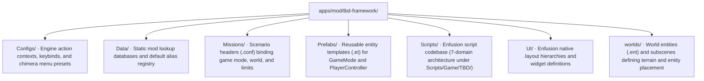

# TBD Framework

Greenfield Enfusion game mode for the TBD Reforger platform. **TBD-owned code only.**

Mod GUID: `B2C3D4E5F6A78901` · Vanilla dependency: `58D0FB3206B6F859`

---

## Coalition / CRF — do not use in Workbench

| Folder | Role | Open in Workbench? |
|---|---|---|
| **`tbd-framework/`** (this mod) | Production TBD framework | **Yes** |
| **`tbd-export/`** | Map-export tooling; depends on this addon + `tbd-emcp` | **Yes** — the full dev session (framework + EMCP + export) |
| **`tbd-emcp/`** | enfusion-mcp Net API handlers (committed) | As a dependency of tbd-export; load it beside this addon for a bridge in a framework-only session |
| **`Tbd_framework/`** | CRF reference (read patterns in Cursor only) | **No** — 60+ Coalition workshop deps |

See `Tbd_framework/REFERENCE-ONLY.md` (gitignored reference copy — present only in local checkouts).

---

## Features (current)

- Backend config from `$profile:TBD_BackendConfig.json`
- Deployed mission (`Systems/Mission/Loaders/TBD_DeployedMission.c`): the server runs the mission deployed to it on the platform - `GET /api/v1/game-runtime/deployment`, then the artifact's exact bytes (`GET /api/v1/game-runtime/artifacts/{id}`, or the profile cache when the cached id and SHA-256 match), loaded only when the SHA-256 of the bytes equals the published one (script SHA-256, `Core/Hashing/`). No deployment, no mission - there is no default; the platform unreachable at boot runs the last verified cached artifact with a WARNING
- Fleet command executor (`API/FleetCommands/`) - `broadcast`, `kick` and `load_mission` (verified artifact, cache, then an in-process scenario restart); in-game admins deploy through the platform (`#tbd missions`, `#tbd mission <n>`)
- Registry alias resolution (`TBD_Registry.c`)
- **Per-slot spawn:** `TBD_SpawnManager` + modded `SCR_MenuSpawnLogic` from mission `slots[]` (schema 1.1) — **kit aliases** + round-robin/roster assign; **no in-game slot picker yet** (**T-068.13** production LOBBY UI, after **T-092.2**)
- **Player loadout on spawn:** **T-068.12** — per-slot compiled loadout → `EquipCloth`/`EquipWeapon` on **human player** (not test NPC)
- **Loadout equip test (T-068.5 / T-068.5.1):** `TBD_LoadoutEquipComponent` — `$profile:TBD_LoadoutTest.json`, **test NPC** @ 6400 only
- Roster loader (`TBD_RosterLoader.c`) - reads `GET /api/v1/game-runtime/events/{id}/roster` (wire version 2) with this server's `mod_runtime` machine credential (`machineCredential`)
- Runtime session (`API/TBD_RuntimeSession.c`) - platform session with sequenced heartbeats while the world runs; deployments into event roster slots are authorized by the platform (`Systems/Spawning/TBD_DeploymentAuthorization.c`) and every life's end is reported
- Game stage enum + manager (`LOADING → … → DEBRIEF`)
- Radio bridge hook stubs (partner VOIP wires later)
- **`TBD_GameMode.et`** prefab — managers + `TBD_LoadoutEquipComponent` (dev loadout test)

---

## Architecture Overview



Top-level folder responsibilities:
- **`Configs/`**: Enfusion engine configurations (`.conf`) defining input actions, action contexts (admin menu, spectator controls), and `chimeraMenus.conf` menu presets.
- **`Data/`**: Static runtime data and schema configurations, including `registry.json` (alias to prefab GUID resolution) and `backend.example.json`.
- **`Missions/`**: Playable mission headers (`.conf`) declaring scenario parameters, player limits, and initial world subscenes.
- **`Prefabs/`**: Reusable entity templates (`.et`) defining component composition for `TBD_GameMode` and `TBD_PlayerController`.
- **`Scripts/`**: Game mode logic and runtime simulation, authored under `Scripts/Game/TBD/` across 7 architectural domains.
- **`UI/`**: Native Enfusion `.layout` files structured to mirror the screen and component hierarchy.
- **`worlds/`**: World entities (`.ent`) and subscene layers placing scenario entities into terrain coordinates.

---

## Dev scenario

| Resource | Path |
|---|---|
| Mission | `Missions/TBD_Dev_POC.conf` (`{69A85365FC09E2CA}`) |
| World | `worlds/TBD_Dev_POC.ent` — Eden subscene (`{853E92315D1D9EFE}worlds/Eden/Eden.ent`) |
| Layer | `worlds/TBD_Dev_POC_Layers/default.layer` — places `TBD_GameMode` at 6400,0,6400 |
| Game mode prefab | `Prefabs/Systems/TBD_GameMode.et` |

Golden mission `msn_8f3a2c` defines **18 slots** with exact spawn positions.

---

## Workbench setup

```bash
cargo xtask setup workbench
```

1. Locate `~/ArmaReforger-Base/data/ArmaReforger.gproj` as base game
2. **+ Add Project → Add Existing** → `tbd-export/addon.gproj` — it depends on this addon and on `tbd-emcp` (the enfusion-mcp bridge), so one project gives the full dev session
3. Open **TBD_Export** in the launcher (`cargo xtask mod dev-bootstrap` launches it directly with `-gproj`)
4. Use **enfusion-mcp** before editing any `.c` file

Opening **TBD_Framework** alone works but has no MCP bridge unless `tbd-emcp` is loaded beside it — this addon carries no `Scripts/WorkbenchGame` by design (the shipping mod has zero Workbench tooling; the map-export plugins live in `tbd-export`).

**New script file:** Workbench builds its script-file list at project load — a freshly added `.c` stays "Unknown class" until **Workbench cold restart** (not just `wb_reload`). Kill Workbench + re-run `cargo xtask mod dev-bootstrap`.

**MCP verify spawn:**

```bash
cargo xtask mod spawn-verify
```

---

## Dedicated server (Linux)

```bash
cargo xtask setup server-profile     # default profile: apps/mod/.local-test-profile/
cargo xtask mod dev-server
```

Prereqs: Steam app **1890870** (Arma Reforger Server), website API on `:8080`.

Local unpublished mods use **`-server` + `-addons`**, not `-config` + `-addons`.

**Staging:** see [`docs/STAGING-SERVER.md`](../../../docs/mod/STAGING-SERVER.md) — `cargo xtask deploy staging`.

### Profile layout

Enfusion `$profile:` = `<profileDir>/profile/`:

```
profile/
  TBD_BackendConfig.json    # copy from Data/backend.example.json
  TBD_Registry.json         # optional override
  TBD_LoadoutTest.json      # copy from web loadout-export.json (T-068.4 download) for loadout equip test
  TBD_MissionArtifactCache/
    document.json           # the last verified mission artifact, exact bytes
    identity.json           # its deployment: artifact id + SHA-256, mission, event, terrain
```

**Workbench `$profile:`** resolves under the Proton prefix, e.g.  
`…/compatdata/1874910/pfx/drive_c/users/steamuser/Documents/My Games/ArmaReforgerWorkbench/profile/`  
(paste exact path in verify — differs from dedicated-server `.local-test-profile/`).

Setup script writes these automatically; token from `GAME_SERVER_TOKEN` env or `apps/website/api_v2/.env`.
`machineCredential` is not written by the script: an administrator issues a `mod_runtime` machine credential for this server (`tbdm_...`) and it is pasted into `TBD_BackendConfig.json`. Until then the example's placeholder counts as unset: no deployment is read (the last verified cached artifact runs with a WARNING, or no mission at all), no runtime session, no roster and no fleet commands (the platform loops re-read the file every minute and pick the credential up without a restart). The mission and its event are not configured in the profile: they come with the deployment.

### Expected log lines

Verified against a real boot (T-612, 2026-08-01). Everything after each tag/`key=` prefix is
expected to vary — pin the prefix, never the sentence (`cargo xtask mod remote-logs` does):

```
[TBD] Registry loaded (21 aliases).
[TBD][Slots] Slot-1 blufor:Alpha:SL:0 (blufor:Alpha:SL:0) kit kit:rifleman_m16 at <…>   ← ×18 for msn_8f3a2c
[TBD][Loadout][Slot] slot=… primary equip OK {GUID}…Rifle_M16A2.et                      ← per authored gear item
[TBD][Loadout][Slot] slot=… loadout pass complete gear=…/… cargo=…/…                    ← per dressed slot
[TBD][Slots] materialized 18/18 bodies — … with a JSON loadout, … kit-only, 0 failed
[TBD][Slots] loadout settle complete — … application(s), 0 unplayable, …
[TBD][Stage] LOADING -> LOBBY
[TBD] Stage → LOBBY
NETWORK : Starting RPL server, listening on address 0.0.0.0:2001
[TBD] SpawnManager: assigned slot blufor:Alpha:SL:0 to player 1 at (…)                  ← once a client joins
[TBD] SpawnManager: bound player 1 to slot blufor:Alpha:SL:0 body (kit …)
```

Mission lines observed on a headless dedicated-server boot without a platform connection
(2026-09-23): a bare boot, then the golden `bridgehead-at-levie.json` (13,096 bytes) and a 1 MiB
padded copy staged as the cached artifact:

```
[TBD][Sha256] self-test-passed vectors=11 bytesAbove127=utf8
[TBD][Mission] NO MISSION YET - no machine credential is configured (backend=none), and no verified artifact is cached in $profile:TBD_MissionArtifactCache. ...
[TBD][Mission] RUNNING THE LAST VERIFIED ARTIFACT - no machine credential is configured (backend=none). artifact=... mission=msn_8f3a2c ...
[TBD][Mission] artifact-verified artifact=... sha256=c1f1ffd6...45d0 bytes=13096 from=cache hashMs=... hashWorkMs=...
[TBD][Mission] loaded id=msn_8f3a2c name='Bridgehead at Levie' slots=18 source=last-verified-cache
[TBD][Runtime] no runtime session until a machine credential is configured - backend=none
[TBD][Fleet] claiming fleet commands every 5 s while this world holds a runtime session
```

Mission and platform lines with a machine credential and a mission deployed to the server
(compile-verified; not yet observed on a live boot):

```
[TBD][Mission] deployment-read backend=...
[TBD][Mission] deployment deployment=... state=... mission=... artifact=... sha256=... bytes=... terrain=... event=... eventMission=...
[TBD][Mission] artifact-verified artifact=... sha256=... bytes=... from=platform hashMs=... hashWorkMs=...
[TBD][Mission] loaded id=... name='...' slots=... source=platform
[TBD][Runtime] session-started session=... generation=... heartbeatSeconds=... expiresAfterSeconds=... artifact=... sha256=...
[TBD][Roster] loaded event=... version=2 assignments=... slots=...
[TBD][Deployment] authorization-requested player=... slot=... orbatSlot=... eventMission=... life=...
[TBD][Deployment] deployment-allowed player=... slot=... occupancy=... authorizedBy=... life=...
[TBD][Deployment] life-end-reported occupancy=... session=... HTTP_CODE_200 response=...
```

`source=` is `platform` (fetched and verified), `cache` (the deployment's artifact from the profile
cache) or `last-verified-cache` (the deployment could not be read). A server without a mission logs
`[TBD][Mission] NO MISSION - ...` (the platform answered `NO_DEPLOYMENT`, or the verified artifact
failed validation) or `[TBD][Mission] NO MISSION YET - ...` (the deployment or artifact could not be
loaded; the read repeats) at ERROR, and stays in LOADING.

**Gone since June (T-612 — do not grep for these):** `[TBD] Mission loaded from backend:`,
`built slot spawn`, `spawn requested`, `[TBD][Loadout][Player]`. The only `Mission loaded`
still printed is the **failure** line `[TBD] Mission loaded but invalid — staying in LOADING.`
— a check satisfied by that string is passing on the error case.

**Important:** `[TBD][Loadout][TestNPC]` = the Phase 1 dev harness (`$profile:TBD_LoadoutTest.json`).
**`[TBD][Loadout][Slot]`** = the production slot-body path human players receive (**T-068.12**);
pick slot in LOBBY = **T-068.13**; production roster sync = **T-114**.

---

## Registry

Shipped at `Data/registry.json` (vanilla POC aliases).  
Spec: [`shared/tbd-schema/spikes/registry-poc-0.4.md`](../../../contracts_v2/spikes/registry-poc-0.4.md) (historical spike).

Replace with TBD-Content export in Phase 1+.

---

## Scripts layout (6 Domains)

All mod scripts live under `Scripts/Game/TBD/` and follow a strict 6-domain architecture.
See the **[Scripts/Game/TBD/README.md](Scripts/Game/TBD/README.md)** Architecture Hub for architectural boundaries and communication patterns.

```
Scripts/Game/TBD/
  Core/        Foundational zero-dependency utilities, structured logging, registry resolver
  API/         REST communication with website-api (backend config, identity link, telemetry)
  Gamemode/    Match rules & flow: Orchestrator/, Stages/, Objectives/
  Systems/     In-world simulation, data ingestion & tools: Mission/, Spawning/, Loadouts/, Audio/, Zones/, Markers/, Radio/, AI/
  Session/     Player & admin flows: Lobby/, Briefing/, Spectator/, Admin/, MissionSelector/, PostGame/
  UI/          Shared component library: Core/, Common/, Hud/, Mock/
```

---

## UI Layouts (3 Domains)

All native Enfusion `.layout` files live under `UI/layouts/` and mirror the script domains.
See the **[UI/README.md](UI/README.md)** Architecture Hub for component contracts and layout guidelines.

```
UI/layouts/
  Common/      Atomic design primitives & reusable screen shells (TBD_ScreenShell, TBD_ListRow)
  Hud/         Persistent in-game HUD tactical overlays (TBD_ObjectiveHud)
  Session/     Match lifecycle screens & dock sub-layouts (Lobby/, Briefing/, Admin/, ...)
```

