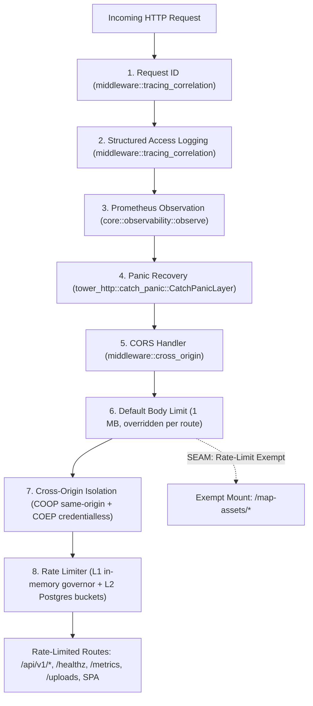

# Modernized Backend Architecture Blueprint & Phased Execution Plan (`apps/website/api_v2`)

Comprehensive technical blueprint, domain boundary specification, sub-router layout, and migration roadmap for refactoring the TBD Reforger platform backend.

---

## 0. Current Layout

This blueprint is implemented. `src/` is `lib.rs`, `bin/`, `core/`, `background_workers/`, the eight
domain directories, and `tests/architecture_rules.rs`, which checks the boundary rules below against
the source text on every test run.

**[`README.md`](./README.md) is the live atlas of the crate** — the real file tree, how the
`/api/v1` table is composed, the placement rules for shared logic, the test and codegen conventions,
and the canonical commands. Each module directory under `src/` also carries its own `README.md`
listing its files. Read those for what the code *is*; read the sections below for the reasoning that
shaped it.

---

## 1. Context & Architectural Goals

The pre-refactor layout of this crate had accumulated severe structural issues:
1. **Meaningless Root Grab-Bags**: Root files (`app.rs` 1,641 LOC, `config.rs` 995 LOC, `db.rs` 551 LOC, `realtime.rs` 369 LOC) conflated unrelated concerns into single monoliths.
2. **Domain Disjointedness**:
   - `FireMission` was orphaned in `models/admin.rs` beside disciplinary warnings and audit logs.
   - Dedicated server management was split between `handlers/telemetry/servers.rs` (CRUD) and `handlers/admin/admin.rs` (RCON execution).
   - Pure ballistics math (`services/mortar.rs`) lived in the API rather than `website-map-engine`.
   - Command Center presentation (`dashboard`, `leaderboards`) was conflated with game-server telemetry ingest.
   - 6 background tasks were scattered across handlers, database utilities, and service modules.
3. **Law 7 & Law 8 Violations**:
   - 17 files exceeded the hard 500 LOC ceiling (two reaching ~3,000 LOC).
   - Inlined unit test modules (`mod tests`) bloated production files.
   - Comments frequently narrated historical transitions and named tickets instead of describing the code.

This blueprint establishes a clean, domain-driven structure under `apps/website/api_v2/`.

---

## 2. Global Middleware Hierarchy & The Rate-Limit Seam

The top-level router (`core/http_router.rs`) constructs the global execution stack. Order of execution from outermost to innermost:



### Critical Invariant: The Rate-Limit Seam
`/map-assets` provides DEM elevation terrain, satellite tiles, and 3D world geometry to the Mission Editor and Planner. A single cold editor load requests up to 951 binary chunks. Mounting this below `rate_limit` would cause cascading HTTP 429 throttles. Therefore, `/map-assets` is mounted strictly **outside and below** the rate limit layer, while all other endpoints remain strictly throttled.

---

## 3. Sub-Router Architecture (<150 LOC Main Router)

`core/http_router.rs` delegates all routes to modular per-domain sub-routers. Each domain owns one
`routes.rs` with a single `pub fn routes` listing its own registrations, and `api_v1_routes`
**merges** the eight tables rather than nesting each behind a prefix.

Merging, not nesting, is what keeps a public URL readable from the domain table that declares it: a
domain's surface is not confined to one path prefix (`administration` registers under `/admin`,
`missions` registers under `/missions`, `/approvals`, `/factions`, `/registry` and `/ingest`), so a
per-domain `.nest()` would either fragment a domain across several sub-routers or force the URL to
be reassembled from two places. With the merge, the path a caller reaches is the literal written in
`routes.rs` with `/api/v1` in front of it, and `cargo xtask verify route-tags` can cross-check the
tables against the route inventory in both directions.

Authorization tiers are enforced per handler by the extractor each takes (`AuthUser`, the
role-gated newtypes, `ServiceAuth`), not by merge order or path prefix.

```rust
fn api_v1_routes(dev: bool, version_limit: usize) -> Router<AppState> {
    Router::new()
        .merge(crate::identity_and_access::routes(dev))
        .merge(crate::operations::routes())
        .merge(crate::missions::routes(version_limit))
        .merge(crate::server_infrastructure::routes())
        .merge(crate::administration::routes())
        .merge(crate::match_telemetry::routes())
        .merge(crate::command_center::routes())
        .merge(crate::community_content::routes())
}

pub fn router(state: AppState) -> Router {
    let dev = state.cfg.is_development();
    let version_limit = state.cfg.mission_version_body_limit() as usize;
    let reg = Arc::new(observability::Registry::new());

    let api_v1 = api_v1_routes(dev, version_limit);

    Router::new()
        .route("/healthz", get(observability::health_check_handler))
        .route("/metrics", get(observability::metrics_scrape_handler))
        .nest("/api/v1", api_v1)
        .nest_service("/uploads", ServeDir::new("uploads"))
        // Rate-limit layer wraps routes above this line
        .layer(from_fn_with_state(RateLimitState::new(state.clone()), rate_limiting))
        // Map assets mounted below rate-limit seam (strictly exempt)
        .nest_service("/map-assets", ServeDir::new(resolve_map_assets_dir(&state.cfg)))
        .layer(DefaultBodyLimit::max(MAX_JSON_BODY))
        .layer(from_fn_with_state(state.clone(), cross_origin))
        .layer(CatchPanicLayer::new())
        .layer(from_fn_with_state(reg, observe))
        .layer(from_fn(tracing_correlation::logging))
        .layer(from_fn(tracing_correlation::request_id))
        .with_state(state)
}
```

---

## 4. Ten Domain Decomposition Blueprints

### 4.1 `core/` (Foundations & Application Lifecycle)
- **`http_router.rs` (<150 LOC)**: Declarative assembly of the global middleware stack and domain sub-routers.
- **`application_state.rs` (<100 LOC)**: `AppState` struct holding `PgPool`, `Arc<Config>`, `Arc<authentication_primitives::Manager>`, `Arc<Hub>`, and rate-limiters.
- **`authentication_primitives/` (<200 LOC per file)**: `jwt_manager.rs` (HS256 access-token issuance and verification), `token_hashing.rs` (opaque-token generation, SHA-256 storage hashing, constant-time comparison). These are credential *primitives*, not an identity feature: the `middleware::authentication` extractors verify every request with them, so they sit on the shared floor in `core/` rather than inside `identity_and_access/`, which would make `core` depend on a domain.
- **`error_handling/` (<100 LOC)**: `ApiError` status mappings and canonical JSON envelope `{"error": "...", "details": ...}`.
- **`configuration/` (<250 LOC per file)**: `mod.rs` (Config struct and loader), `proxy_network.rs` (CIDR parser and bitwise IP matching).
- **`database/` (<200 LOC per file)**: `connection_pool.rs` (PgPool setup and backoff), `migration_runner.rs` (embedded SQL schema migrations).
- **`realtime_hub/` (<150 LOC)**: In-process multi-channel pub/sub bus broadcasting to SSE clients.
- **`observability/` (<200 LOC per file)**: `metrics.rs` (zero-dependency Prometheus 0.0.4 text registry), `health_probe.rs` (bounded 200/503 health check).
- **`middleware/` (<300 LOC per file)**: `authentication.rs`, `rate_limiting.rs`, `durable_ratelimit.rs`, `client_identity.rs`, `cross_origin.rs`, `tracing_correlation.rs`.

### 4.2 `operations/` (Operations, Events & Fire Missions)
- **`events_crud.rs` (<420 LOC)**: Operation creation, listing, dossier aggregation, metadata patching, and soft-delete.
- **`event_lifecycle.rs` (<360 LOC)**: State transitions (Scheduled -> Live -> Completed) and derived SQL effective status evaluation.
- **`registration.rs` (<390 LOC)**: Concurrency Gate G7b (two-level transactional lock, seat release-and-claim, waitlists).
- **`orbat_structure.rs` (<430 LOC)**: Squad reservations, leader slot assignments, and game-server roster sync.
- **`deployments.rs` (<450 LOC)**: Member service records, combat statistics, and Leave of Absence (LOA) review.
- **`fire_missions.rs` (<290 LOC)**: CRUD persistence for saved mortar fire missions.
- **`models/`**: `Event`, `EventMission`, `EventRegistration`, `OrbatSlot`, `LeaveRequest`, and `FireMission` (relocated from admin).

### 4.3 `missions/` (Scenarios, Library & Prefab Catalogs)
- **`library.rs` (<240 LOC)**: Filterable community scenario catalog, bookmarking, and search.
- **`lifecycle.rs` (<320 LOC)**: Scenario creation, metadata updates, review submission, and soft-delete.
- **`upload_ingest.rs` (<360 LOC)**: 2D/3D CAD editor JSON payloads, SemVer 2.0 validation, version rollback.
- **`armory_catalog.rs` (<190 LOC)**: Virtual arsenal inventory lines, faction matching, and cargo physical capacity.
- **`prefab_registry.rs` (<410 LOC)**: Vehicle/weapon item registry, compatibility graph, and weak ETag caching.
- **`approvals_queue.rs` (<260 LOC)**: Review queue, approval promotion (`live`), and structured rejection.
- **`game_server_injection.rs` (<180 LOC)**: Export envelope assembly and staging directory injection.
- **`compiler.rs` (<340 LOC)**: Compilation bridge with `website-map-engine` and diagnostic headers.
- **`contract/`**: JSON Schema draft 2020-12 validation and zone coordinate quantisation.

### 4.4 `server_infrastructure/` (Unified Server Control & RCON)
- **`server_registry.rs` (<250 LOC)**: Dedicated server registration, configuration update, and soft-deactivation.
- **`health_monitor.rs` (<260 LOC)**: Cached status queries and real-time SSE server status feed (`stream_server_status`).
- **`modpack_binding.rs` (<100 LOC)**: Modpack validation and batched server intel queries.
- **`rcon_console.rs` (<250 LOC)**: RCON command parsing and execution via host agent IPC socket.
- **`services/game_agent.rs` (<200 LOC)**: Unix domain socket protocol client communicating with `tbd-reforger-agent.sock`.

### 4.5 `administration/` (Personnel Roster & Audit Logs)
- **`personnel_roster.rs` (<120 LOC)**: Member list, rank, total deployments, and warning counters.
- **`disciplinary.rs` (<200 LOC)**: Ban enforcement, unban, warning issuance, and immediate refresh token revocation.
- **`role_management.rs` (<100 LOC)**: Role assignments (`Enlisted`, `Leader`, `MissionMaker`, `Admin`) and Discord guild resync.
- **`audit_logs.rs` (<270 LOC)**: Keyset-paginated query, CSV export with formula injection prevention, and live Postgres NOTIFY SSE stream.

### 4.6 `match_telemetry/` (Game-Server Ingestion & Replays)
- **`server_heartbeat.rs` (<250 LOC)**: Ingests ticks, merges measurements via SQL `COALESCE`, logs low-FPS warnings.
- **`match_results.rs` (<320 LOC)**: Combat event ingestion, player kills/deaths/TK counters, and session token resolution.
- **`operations/services/participation_attribution.rs`**: Finalized exact-match attendance provenance and correction support, independent of reservation allocation.
- **`replay_streamer.rs` (<180 LOC)**: AAR replay link validation (`is_http_url`) and telemetry tick streaming.

### 4.7 `command_center/` (Public Community Dashboard)
- **`live_dashboard.rs` (<220 LOC)**: Composite home bento query (next operation, caller's slot, server status, current modpack, announcements).
- **`leaderboards.rs` (<260 LOC)**: Ranked player & team leaderboards querying `leaderboard_totals` materialized view with deterministic tie-breaking.
- **`user_stats.rs` (<140 LOC)**: Individual career stat card.

### 4.8 `identity_and_access/` (Authentication & Security)
- **`discord_oauth.rs` (<380 LOC)**: Discord OAuth2 consent redirect, code exchange, and user upsert.
- **`oauth_host_guard.rs` (<150 LOC)**: Host alignment verification and CSRF cookie validation.
- **`session_tokens.rs` (<240 LOC)**: Single-use rotating refresh tokens (Gate G7a) and family revocation.
- **`member_profile.rs` (<100 LOC)**: Profile retrieval and update.
- **`arma_linking.rs` (<380 LOC)**: 6-digit link code generation, status polling, unlinking, and game confirm.
- **`developer_login.rs` (<125 LOC)**: Development-mode bypass shortcut.

### 4.9 `community_content/` (CMS & Modpacks)
- **`announcements_public.rs` (<70 LOC)**: Published announcement feed.
- **`announcements_admin.rs` (<350 LOC)**: CMS announcement CRUD and snippet generation.
- **`discord_webhook_push.rs` (<150 LOC)**: Webhook embed dispatch with ZWSP formula sanitization.
- **`media_upload.rs` (<180 LOC)**: Multipart image validation (magic bytes, 5 MB cap) and local storage.
- **`wiki_knowledgebase.rs` (<200 LOC)**: Markdown tactical doctrine SOP articles.
- **`vehicle_database.rs` (<120 LOC)**: Vehicle technical specs and IFF catalog.
- **`modpack_catalog.rs` (<160 LOC)**: Public modpack manifests and active delta downloads.
- **`modpack_admin.rs` (<340 LOC)**: Modpack authoring, nested mod replace, active toggle, and reference checks.

### 4.10 `background_workers/` (Supervised Background Tickers)
- **`mod.rs` (<80 LOC)**: Central supervisor spawning all background tasks during boot.
- **`token_purge_worker.rs` (<60 LOC)**: Purges expired refresh tokens every 6 hours.
- **`ratelimit_cleanup_worker.rs` (<65 LOC)**: Cleans stale rate limit buckets every 1 hour.
- **`lifecycle_sweeper.rs` (<150 LOC)**: Advances event states every 60 seconds.
- **`discord_role_synchronizer.rs` (<120 LOC)**: Reconciles Discord guild roles every 24 hours.
- **`leaderboard_refresher.rs` (<70 LOC)**: Refreshes `leaderboard_totals` materialized view every 15 minutes.
- **`server_status_publisher.rs` (<90 LOC)**: Polls server status every 10 seconds and fans out to SSE.

---

## 5. Migration Roadmap

The migration from the pre-refactor layout to `apps/website/api_v2` is planned in 4 safe stages:
1. **Stage 1 (Scaffolding & Blueprints — CURRENT)**: Complete `api_v2/` directory topology, domain READMEs, and forensic mapping.
2. **Stage 2 (Foundations Migration)**: Migrate `core/`, `identity_and_access/`, and `background_workers/`.
3. **Stage 3 (Domain Handlers Migration)**: Migrate `operations/`, `missions/`, `server_infrastructure/`, `administration/`, `match_telemetry/`, `command_center/`, and `community_content/`.
4. **Stage 4 (Cutover & Validation)**: Run integration test suite (`cargo xtask db test-it`), verify zero route drift (`cargo xtask verify route-tags`), verify file lengths (`cargo xtask verify file-length`), and perform atomic directory switch.
