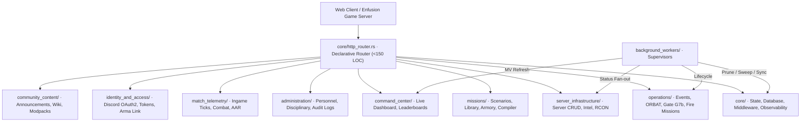

# Modernized Backend Architecture Blueprint (`apps/website/api_v2`)

Modernized, clean, and domain-driven backend architecture blueprint for the TBD Reforger platform suite.

Following the successful tooling consolidation in `tools_v2/` and frontend domain architecture in `apps/website/frontend/src/v2/`, this directory defines the **architectural blueprint and domain scaffolding** for transitioning `apps/website/api` into **ten strictly bounded, self-describing domain subsystems** with zero root clutter, zero ambiguous naming, and strict compliance with Monorepo Laws 1–8.

> [!NOTE]
> This directory serves as the architecture blueprint and scaffolding specification. It contains comprehensive domain documentation, structural blueprints, and boundary specifications without duplicating runtime code prior to phased migration.

---

## 1. Top-Level Directory Topology

```text
apps/website/api_v2/
├── README.md                           <-- Architecture hub overview (this document)
├── ARCHITECTURE_PLAN.md                <-- Phased blueprint specification & sub-router graph
├── ANALYSIS_AND_INVENTORY.md           <-- Forensic catalog of all 78 legacy files & 108 routes
│
└── src/
    ├── core/                           <-- Foundational runtime, HTTP router & state container
    │   └── README.md
    ├── operations/                     <-- Community operations, events, ORBAT & fire missions
    │   └── README.md
    ├── missions/                       <-- Scenarios, library, armory, and prefab catalogs
    │   └── README.md
    ├── server_infrastructure/          <-- Unified dedicated server registry, status & RCON
    │   └── README.md
    ├── administration/                 <-- User roster, permissions, disciplinary & audit logs
    │   └── README.md
    ├── match_telemetry/                <-- Ingame ticks, combat metrics, and AAR replays
    │   └── README.md
    ├── command_center/                 <-- Live community dashboard & ranked leaderboards
    │   └── README.md
    ├── identity_and_access/            <-- Discord OAuth2, token rotation & Arma link codes
    │   └── README.md
    ├── community_content/              <-- Announcements, CMS wiki, media uploads & modpacks
    │   └── README.md
    └── background_workers/             <-- Dedicated supervisors for all 6 background tickers
        └── README.md
```



---

## 2. The Ten Domain Subsystems

| Domain Subsystem | Former Legacy Locations | Role & Boundary Responsibility | Target Models & Sibling Tests |
|:---|:---|:---|:---|
| **[`core/`](./src/core/)** | `app.rs`, `config.rs`, `db.rs`, `state.rs`, `error.rs`, `realtime.rs`, `middleware/` | Shared dependency container (`AppState`), Postgres connection pooling, schema migrations, Prometheus metrics, health probe, and global middleware pipeline. | `AppState`, `ApiError`, `Config`, `DbPoolConfig`, `Hub`, `RateLimitState` |
| **[`operations/`](./src/operations/)** | `handlers/events/events.rs`, `handlers/telemetry/deployments.rs`, `handlers/telemetry/field_tools.rs` | Community operations lifecycle FSM, Concurrency Gate G7b slot reservations, ORBAT tree compilation, member service records, and CRUD persistence for saved mortar fire missions. | `Event`, `EventMission`, `OrbatSlot`, `EventRegistration`, `FireMission` |
| **[`missions/`](./src/missions/)** | `handlers/missions/missions.rs`, `registry.rs`, `approvals.rs`, `services/mission_compile.rs`, `services/registry_import.rs` | Filterable scenario library, author review queue, CAD editor version snapshots, virtual arsenal catalog, item registry, compatibility graph, and flatten compiler bridge. | `Mission`, `MissionVersion`, `MissionArmory`, `RegistryItem`, `RegistryCompatEdge` |
| **[`server_infrastructure/`](./src/server_infrastructure/)** | `handlers/telemetry/servers.rs`, `handlers/admin/admin.rs` (L709–841 RCON), `services/game_agent.rs` | Dedicated server lifecycle CRUD, modpack binding, live heartbeat telemetry, SSE status broadcasting, and host agent RCON console execution via Unix socket. | `Server`, `ServerIntelDto`, `ServerStatus`, `RconCommand`, `AgentAction` |
| **[`administration/`](./src/administration/)** | `handlers/admin/admin.rs`, `handlers/admin/audit.rs`, `services/audit*.rs` | Personnel roster, warning issuance, ban enforcement, token revocation, role hierarchy resolution, and immutable administrative audit logs with formula injection prevention. | `User`, `UserRole`, `DiscordRole`, `Warning`, `AuditLog`, `AuditSeverity` |
| **[`match_telemetry/`](./src/match_telemetry/)** | `handlers/telemetry/telemetry.rs` | High-frequency game-server heartbeat ingest, combat event scoring, match attribution, attendance backfill/retraction, and AAR replay streaming. | `Match`, `MatchPlayerStats`, `ServerStatusHistory`, `CombatEvent` |
| **[`command_center/`](./src/command_center/)** | `handlers/telemetry/dashboard.rs`, `handlers/telemetry/leaderboards.rs` | Public operations command center: next operation bento card, live match status, current modpack info, ranked player/team leaderboards, and member service records. | `DashboardPulse`, `LeaderboardRow`, `UserStatsCard` |
| **[`identity_and_access/`](./src/identity_and_access/)** | `handlers/auth/`, `auth/`, `services/discord.rs`, `services/role_sync.rs` | Discord OAuth2 exchange, cookie CSRF protection, host alignment verification, single-use rotating refresh tokens (Gate G7a), user settings, and 6-digit Arma account linking. | `UserProfile`, `Claims`, `RefreshToken`, `IdentityLinkCode` |
| **[`community_content/`](./src/community_content/)** | `handlers/content/`, `services/webhook.rs` | Member announcement feed, CMS announcement management, Discord webhook embedding, multipart image uploads, wiki tactical doctrine articles, and modpack manifests. | `Announcement`, `WikiPage`, `Vehicle`, `Modpack`, `ModpackMod` |
| **[`background_workers/`](./src/background_workers/)** | Inlined across `services/`, `handlers/events/`, `db.rs`, `realtime.rs` | Dedicated supervisory tickers for refresh token purging, rate limit bucket pruning, event lifecycle convergence, leaderboard MV refreshing, server status SSE fan-out, and role resync. | `WorkerSupervisor`, `LifecycleSweeper`, `LeaderboardRefresher` |

---

## 3. Core Architectural Laws Enforced

1. **Law 1 (Hard Gate — No Silent Deferrals)**:
   - Full domain coverage across all 108 routes and 78 legacy files. Every route, extractor, database interaction, and invariant is preserved.
2. **Law 3 (Clean Architecture Over Hacks)**:
   - Resolves domain fragmentation: server CRUD and RCON console are unified in `server_infrastructure/`.
   - Eliminates root clutter: grab-bag files (`app.rs`, `config.rs`, `db.rs`, `state.rs`, `error.rs`, `realtime.rs`) are structured into `core/`.
   - Decouples mathematical ballistics (`services/mortar.rs`) from the API backend; interactive calculations belong in `website-map-engine`, while the API provides CRUD persistence.
3. **Law 4 (Zero Context Needed for Directory & File Names)**:
   - Every file and module clearly describes its live function. No ambiguous names like `app.rs`, `state.rs`, `me.rs`, or historical ticket prefixes (`gate_t*.rs`).
4. **Law 5 (Categorize Primitives — Avoid Flat Dumps)**:
   - Replaces the 98-route monolithic flat router in `app.rs` with domain sub-routers.
   - Replaces the 15-file flat dump in `services/` with domain-owned services and dedicated `background_workers/`.
5. **Law 6 (Strict Boundary Layers)**:
   - API crate handles HTTP presentation, authorization, validation, persistence, and SSE fan-out.
   - Core scenario compilation delegates strictly to `website-map-engine`.
6. **Law 7 (File Size Limits & Test Placement)**:
   - All production files are budgeted strictly **under 500 lines of code**.
   - All test files are budgeted strictly **under 1000 lines of code**.
   - **Zero inline test modules**: Unit tests live in sibling files declared via `#[cfg(test)] #[path = "tests/<file>.rs"] mod tests;`.
7. **Law 8 (Present-Tense, Context-Free Code Documentation)**:
   - All comments describe what the code does *now* and *why*. All historical transitions ("Rust port of Go", "T-343 sweep", "pre-T-349") are eliminated.

---

## 4. Documentation Index

- **[`ARCHITECTURE_PLAN.md`](./ARCHITECTURE_PLAN.md)**: Technical blueprint, sub-router graph, rate-limit seam, and phased migration roadmap.
- **[`ANALYSIS_AND_INVENTORY.md`](./ANALYSIS_AND_INVENTORY.md)**: Exhaustive catalog of all 78 legacy files, exact line counts, the 17 monoliths >500 LOC, all 108 routes, database access patterns, and law violations.
