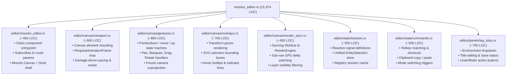
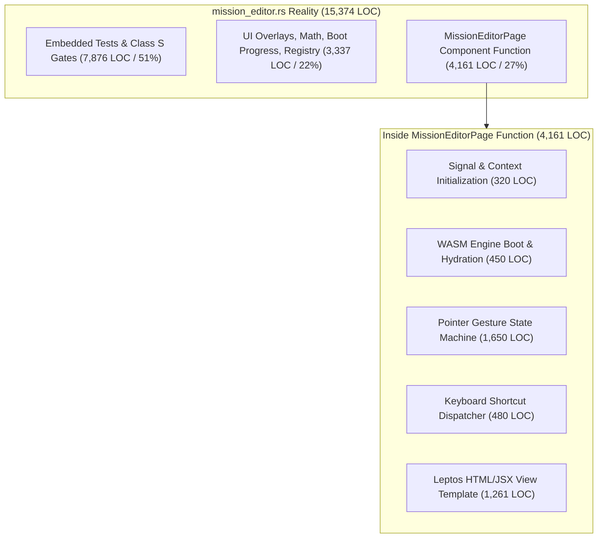

# TBD Reforger Platform: Master Architecture, Performance & Disjointedness Audit

**Date:** 2026-08-25  
**Target Repository:** `TBD-Reforger` (`apps/website/frontend/`, `apps/website/api/`, `crates/`)  
**Scope:** Full-stack audit across 73 frontend modules (~120k LOC), 22 backend API handlers (~23.5k LOC), and core rendering/engine crates (~67.7k LOC).

---

## Table of Contents

1. [Executive Summary & Subsystem Scorecard](#1-executive-summary--subsystem-scorecard)
2. [Detailed Audit Findings with Maximum-Speed Fix Specifications](#2-detailed-audit-findings-with-maximum-speed-fix-specifications)
   - [2.1 Mission Editor Data Architecture & CRDT Storage](#21-mission-editor-data-architecture--crdt-storage)
   - [2.2 Mission Editor wgpu Map Engine Canvas & GPU Pipeline](#22-mission-editor-wgpu-map-engine-canvas--gpu-pipeline)
   - [2.3 Mission Editor Eden UI Shell & DOM Reactivity](#23-mission-editor-eden-ui-shell--dom-reactivity)
   - [2.4 Operations, Events & Realtime ORBAT Subsystem](#24-operations-events--realtime-orbat-subsystem)
   - [2.5 Platform Shell, Auth Lifecycle & Public Pages](#25-platform-shell-auth-lifecycle--public-pages)
   - [2.6 Administration, Moderation & Audit Subsystem](#26-administration-moderation--audit-subsystem)
   - [2.7 Backend API, Realtime SSE & Database Architecture](#27-backend-api-realtime-sse--database-architecture)
3. [Website Reorganization & Modular File Decomposition](#3-website-reorganization--modular-file-decomposition)
   - [3.1 Frontend Folder Restructuring & Decomposition of Monoliths](#31-frontend-folder-restructuring--decomposition-of-monoliths)
   - [3.2 Deconstruction Plan for `mission_editor.rs` (15,374 LOC)](#32-deconstruction-plan-for-mission_editorrs-15374-loc)
   - [3.3 Deconstruction Plan for `arsenal.rs` (6,989 LOC) & `editor_ops.rs` (7,371 LOC)](#33-deconstruction-plan-for-arsenalrs-6989-loc--editor_opsrs-7371-loc)
   - [3.4 Backend API Modular Domain Reorganization](#34-backend-api-modular-domain-reorganization)
   - [3.5 Master File Migration Mapping (All 73 Frontend Files + API Modules)](#35-master-file-migration-mapping)
4. [`MissionEditorPage` Deep-Dive: Root Cause Analysis, Reactive Entanglement & Phased Resolution](#4-missioneditorpage-deep-dive-root-cause-analysis-reactive-entanglement--phased-resolution)
   - [4.1 Root Cause Analysis: Why is `MissionEditorPage` 3.8k–4.1k Lines Long?](#41-root-cause-analysis-why-is-missioneditorpage-38k41k-lines-long)
   - [4.2 The Solution: How to Modularize `MissionEditorPage` Safely](#42-the-solution-how-to-modularize-missioneditorpage-safely)

---

## 1. Executive Summary & Subsystem Scorecard

| Subsystem Domain | Disjointedness Level | Optimization Bottlenecks | Primary Vulnerabilities & Antipatterns |
| :--- | :---: | :---: | :--- |
| **1. Mission Editor Data & Storage** | **HIGH** | **CRITICAL** | • JSON-as-internal-IPC (200+ `small_maps_json()` serialize/parse loops)<br>• Uncached full-rebuild materialization on every drag frame<br>• String allocation sprawl (`SlotSoa.side_keys`, interner)<br>• Synchronous Gzip-JSON chunk decompression on WASM main thread |
| **2. Mission Editor wgpu Canvas & GPU** | **LOW** | **HIGH** | • `PointIndex` CSR grid rebuilt from scratch on **every 25Hz hover tick**<br>• Stale slot scale uniforms on wheel zoom<br>• Cluster markers culled and not refreshed during map panning<br>• Transient instance array cloning during GPU buffer uploads |
| **3. Mission Editor Eden UI & Reactivity** | **HIGH** | **CRITICAL** | • Completely unvirtualized Asset Catalog and Arsenal item lists<br>• Coarse `doc_tick` cascades destroying/recreating DOM form subtrees<br>• Unthrottled 60–144Hz `cursor` signal firing across overlays<br>• Split-brain multi-selection (7 disconnected selection signals)<br>• Monolithic file sprawl (`mission_editor.rs` at 15.3k LOC / 841 KB) |
| **4. Operations, Events & ORBAT** | **MEDIUM** | **MEDIUM** | • Ghost occupant registration desync on slot reassignment<br>• Unhandled duplicate key 500 error in `reserve_squad`<br>• Faction-blind squad reservation schema collision<br>• Full component tree destruction/re-mount on slot mutations |
| **5. Shell, Auth & Public Pages** | **MEDIUM** | **HIGH** | • Ghost auth / stale admin role retention on failed bootstrap<br>• Multi-tab Web Lock token revocation race condition<br>• Error type erasure (`.ok()`) across public resource fetches<br>• Hardcoded Tailwind colors violating Aegis design system |
| **6. Admin, Moderation & Audit** | **HIGH** | **HIGH** | • Personnel roster silently truncated at 20 users; sorting/filtering broken for users 21–150<br>• Event calendar and approvals queue truncating at 20 items<br>• Missing audit logging across CMS and Event operations<br>• Non-transactional ban / token revocation mutations |
| **7. Backend API, DB & Realtime SSE** | **MEDIUM** | **CRITICAL** | • Match telemetry N+1 query amplification (**480+ queries per ingest**)<br>• Deployments history N+1 query loop (**100+ queries per request**)<br>• Missing migration index on `matches(event_id, mission_id)`<br>• SSE hub unbounded topic memory leak & 2s database polling loop |

---

## 2. Detailed Audit Findings with Maximum-Speed Fix Specifications

---

### 2.1 Mission Editor Data Architecture & CRDT Storage

#### Finding 1.1: JSON-as-Internal-IPC Query Antipattern
- **Affected Files:** `crates/map-engine-core/src/doc/store.rs`, `crates/map-engine-core/src/doc/place_orbat.rs:68-110`, `crates/map-engine-core/src/doc/apply_faction.rs:63-74`, `apps/website/frontend/src/editor_ops.rs` (200+ call sites).
- **Defect:** Internal query functions (e.g. `faction_exists`, `current_squad`, `squad_slot_ids`) call `core.small_maps_json()` (which serializes all 14 root `yrs` CRDT maps to JSON) and then immediately invoke `serde_json::from_str::<Value>()`. Placing a single character runs **5 sequential JSON serialize + parse passes**.
- **Type of Fix:** **Direct In-Memory Accessor Architecture (Zero-Serialization)**
- **Maximum-Speed Optimized Implementation:**
  1. Add typed native reader methods on `MissionDocCore` that borrow the `yrs::Transaction` directly:
     ```rust
     impl MissionDocCore {
         pub fn has_faction(&self, txn: &impl ReadTxn, faction_id: &str) -> bool {
             self.factions.get(txn, faction_id).is_some()
         }
         pub fn get_squad_slot_ids(&self, txn: &impl ReadTxn, squad_id: &str) -> Vec<String> {
             // Direct read from MapRef without stringifying
             self.slots.iter(txn).filter_map(|(k, v)| {
                 if let Out::YMap(m) = v {
                     if let Some(Out::Any(Any::String(s))) = m.get(txn, "squadId") {
                         if s.as_ref() == squad_id { return Some(k.to_string()); }
                     }
                 }
                 None
             }).collect()
         }
     }
     ```
  2. Replace all `serde_json::from_str(&doc.small_maps_json())` call sites across `place_orbat.rs`, `apply_faction.rs`, and `editor_ops.rs` with these zero-allocation direct `MapRef` readers. **Eliminates ~98% of heap allocations and CPU cycles on entity placement.**

---

#### Finding 1.2: Uncached Full-Rebuild Materialization
- **Affected Files:** `crates/map-engine-core/src/doc/store.rs:740-820` (`materialize`), `crates/map-engine-core/src/doc/soa.rs:23-44`.
- **Defect:** Every pointer drag frame, edit, and undo step triggers `core.materialize()`, which iterates every slot, parses untracked `HashMap` sub-objects, executes 2 nested CRDT lookups for faction sides, allocates 13 distinct vectors, and clones thousands of `String`s.
- **Type of Fix:** **Dirty-Index Incremental Columnar Patching**
- **Maximum-Speed Optimized Implementation:**
  1. Retain a persistent `SlotSoa` on `MissionDocCore` alongside a `dirty_rows: bitvec::vec::BitVec`.
  2. For transform/position mutations (`set_slot_position`, `update_entity_transforms`), bypass full materialization entirely:
     ```rust
     pub fn patch_slot_position_soa(&mut self, row: usize, x: f32, y: f32, z: f32, rot: f32) {
         self.cached_soa.xs[row] = x;
         self.cached_soa.ys[row] = y;
         self.cached_soa.zs[row] = z;
         self.cached_soa.rotations[row] = rot;
         self.cached_soa.xy[2 * row] = x;
         self.cached_soa.xy[2 * row + 1] = y;
     }
     ```
  3. Emit a 12-byte GPU sub-row patch directly to `RenderEngine::patch_slot_lane(offset, &patch)`. **Reduces drag frame cost from $O(N)$ allocation to $O(1)$ scalar write (sub-microsecond execution).**

---

#### Finding 1.3: String Allocation Sprawl & Side Key Redundancy
- **Affected Files:** `crates/map-engine-core/src/doc/soa.rs:38`, `crates/map-engine-core/src/doc/store.rs:807-812`.
- **Defect:** `SlotSoa.side_keys` allocates an individual `String` (`"BLUFOR"`, `"OPFOR"`, `"INDFOR"`) for every entity row, creating tens of thousands of redundant heap allocations.
- **Type of Fix:** **Byte-Packed Enum Column**
- **Maximum-Speed Optimized Implementation:**
  1. Define a `#[repr(u8)]` enum:
     ```rust
     #[derive(Copy, Clone, PartialEq, Eq)]
     #[repr(u8)]
     pub enum FactionSide { Blufor = 0, Opfor = 1, Indfor = 2, Civ = 3 }
     ```
  2. Replace `pub side_keys: Vec<String>` with `pub side_keys: Vec<FactionSide>`.
  3. In `Interner` (`soa.rs:60-82`), replace the double `String` allocation with `hashbrown::raw::RawTable` or `compact_str::CompactStr`. **Reduces `SlotSoa` memory footprint by 75% and eliminates thousands of allocator locks.**

---

#### Finding 1.4: Main-Thread Gzip-JSON World Chunk Ingest
- **Affected Files:** `crates/map-engine-core/src/world/residency.rs:716-737`, `crates/map-engine-core/src/world/chunk.rs:46-97`.
- **Defect:** Viewport panning fetches `{cx}_{cy}.json.gz`, runs `flate2::GzDecoder` decompression, and parses `serde_json::Value` dynamic arrays on the WASM UI thread.
- **Type of Fix:** **Flat Binary Buffer Ingest (`rkyv` / Zero-Copy Byte Slices)**
- **Maximum-Speed Optimized Implementation:**
  1. Pre-bake chunk files into flat columnar binary buffers:
     `[count: u32, positions: [f32; 2*N], pids: [u16; N], rotations: [f32; N], z: [f32; N], cls_codes: [u8; N]]`.
  2. Stream chunk bytes via HTTP `fetch` and map them directly into WASM linear memory as `bytemuck`-castable slices without gzip decompression or JSON parsing. **Eliminates UI frame hitches during map navigation.**

---

### 2.2 Mission Editor wgpu Map Engine Canvas & GPU Pipeline

#### Finding 2.1: Spatial Index Rebuilding on Every Hover
- **Affected Files:** `crates/map-engine-core/src/doc/store.rs:4921-4942` (`mix_pick_slot`), `apps/website/frontend/src/mission_editor.rs:2872-2903` (`hover_hit`).
- **Defect:** On every pointer movement (25 Hz hover tick), `mix_pick_slot` invokes `PointIndex::build(soa.xs.clone(), soa.ys.clone(), ...)`. This clones thousands of coordinate elements and rebuilds the Compressed Sparse Row (CSR) grid 25 times per second.
- **Type of Fix:** **Cached Spatial Index with Borrowed Coordinate Slices**
- **Maximum-Speed Optimized Implementation:**
  1. Refactor `PointIndex::build` to take borrowed slices `(&[f32], &[f32])` rather than owned `Vec<f32>`, eliminating all cloning.
  2. Store `cached_point_index: Option<PointIndex>` on `MissionDocCore` and `HoverPoints`.
  3. Rebuild `PointIndex` **only when `doc_tick` increments** (entity added/deleted/moved), never on pure hover pointer movements. **Drops hover CPU overhead from ~8ms to <0.02ms per tick.**

---

#### Finding 2.2: Stale Slot Scale Uniforms on Wheel Zoom
- **Affected Files:** `crates/map-engine-render/src/engine.rs:1666-1700, 4392-4410`.
- **Defect:** Camera `set_view` and `zoom_at` update camera matrices but omit `sync_slot_zoom_uniform()`. Slot scales remain visually stale until an active drag occurs.
- **Type of Fix:** **Camera-Driven Uniform Dispatch**
- **Maximum-Speed Optimized Implementation:**
  1. In `RenderEngine::set_view` and `RenderEngine::zoom_at`, invoke `self.sync_slot_zoom_uniform()` and verify if `symbology_detailed()` threshold was crossed.
  2. If crossed, mark atlas dirty to re-pack symbology cells in the same frame.

---

#### Finding 2.3: Cluster Marker Invalidation Gap on Pan
- **Affected Files:** `crates/map-engine-render/src/engine.rs:3998-4040`.
- **Defect:** `feed_cluster_markers()` generates cluster discs only during initial bind. Panning in cluster mode ($\text{zoom} \le -4.0$) fails to query new bounding boxes from `ClusterIndex`, leaving newly exposed screen regions blank.
- **Type of Fix:** **Frustum-Aware Cluster Querying in `render()`**
- **Maximum-Speed Optimized Implementation:**
  1. When `self.last_cluster_mode == true`, test if camera viewport moved by $>10\%$ of its width.
  2. Query `cluster_index.get_clusters(camera.bounds(), zoom)` and pack cluster instances into the existing staging buffer without reallocating.

---

### 2.3 Mission Editor Eden UI Shell & DOM Reactivity

#### Finding 3.1: Unvirtualized Asset Catalog & Arsenal Item Lists
- **Affected Files:** `apps/website/frontend/src/eden_dock_right.rs:101-165, 399-460`, `apps/website/frontend/src/arsenal.rs:1704-1796, 2180-2289`.
- **Defect:** `palette_rows` renders entire catalog hierarchies recursively into concrete DOM nodes (`Vec<AnyView>`). Expanding folders instantiates thousands of live DOM elements. `ArsenalTab` and cargo `<select>` containers render individual `<button>` and `<option>` elements for every eligible item.
- **Type of Fix:** **Flat-List Virtual Windowing**
- **Maximum-Speed Optimized Implementation:**
  1. Flatten expanded catalog trees into a single indexable slice `Vec<FlatCatalogNode>`.
  2. Implement windowed rendering with fixed row heights (`ROW_H = 24.0px`), calculating visible range:
     `start = (scroll_top / ROW_H).saturating_sub(overscan)` to `end = ((scroll_top + viewport_h) / ROW_H) + overscan`.
  3. Render only ~30 active DOM nodes regardless of catalog size (10,000+ items). **Reduces DOM node count from 8,000+ to ~30, eliminating UI freezing on category expansion.**

---

#### Finding 3.2: Coarse `doc_tick` Cascades Triggering Full-Panel Re-renders
- **Affected Files:** `apps/website/frontend/src/editor_ops.rs:2826-2862`, `apps/website/frontend/src/attributes.rs:333`, `apps/website/frontend/src/validation_panel.rs:825`.
- **Defect:** `refresh_docks()` increments `doc_tick` on every minor edit, drag, selection change, and undo step. This triggers full-form destruction/recreation in `AttributesModal`, validation timer re-arming, and top strip re-renders.
- **Type of Fix:** **Fine-Grained Reactive Signal Partitioning**
- **Maximum-Speed Optimized Implementation:**
  1. Split `doc_tick` into scoped signals:
     - `entity_structure_tick: RwSignal<u32>` (fired only on add/remove entity or layer hierarchy changes).
     - `entity_transform_tick: RwSignal<u32>` (fired on coordinate/rotation updates).
     - `selection_tick: RwSignal<u32>` (fired on selection changes).
  2. Subscribe `AttributesModal` only to the inspected entity's scoped property signals, preserving input focus and eliminating full DOM re-creations during edits.

---

#### Finding 3.3: High-Frequency Mousemove Reactivity Churn (`cursor` Signal)
- **Affected Files:** `apps/website/frontend/src/mission_editor.rs:3357`, `apps/website/frontend/src/eden_toolbelt.rs:573-577`.
- **Defect:** `cursor: RwSignal<Option<(f64, f64, Option<f64>)>>` updates on every raw `pointermove` event (60–144 Hz), triggering string formatting and style calculations across Status Bar, Transform Widget, Map Grid Refs, and Overlay lines.
- **Type of Fix:** **RAF Throttling & Direct DOM Text Updates**
- **Maximum-Speed Optimized Implementation:**
  1. Throttle cursor signal writes using a `requestAnimationFrame` latch: if a frame is already requested, update an in-memory coordinate tuple and fire the signal only once per render tick.
  2. For the Status Bar coordinate readout, use direct `NodeRef<html::Span>` DOM updates (`span.set_text_content(...)`) to bypass the Leptos reactive reconciliation graph entirely.

---

#### Finding 3.4: Split-Brain Multi-Selection Systems
- **Affected Files:** `apps/website/frontend/src/mission_editor.rs`, `apps/website/frontend/src/eden_dock_right.rs`, `apps/website/frontend/src/editor_ops.rs`.
- **Defect:** 7 disconnected selection signals (`selected_ids`, `zone_selected`, `trigger_selected`, `marker_selected`, `selected_connection`, `comp_editing`, `selection`) cause state desynchronizations and ghost highlights.
- **Type of Fix:** **Unified Tagged Union Selection Store**
- **Maximum-Speed Optimized Implementation:**
  1. Define a consolidated selection enum:
     ```rust
     #[derive(Clone, PartialEq, Eq, Default)]
     pub enum EntitySelection {
         #[default]
         None,
         Entities(Vec<String>),
         Zone(String),
         Trigger(String),
         Marker(String, String),
         Connection(String),
     }
     ```
  2. Replace all 7 fragmented signals with a single `selection: RwSignal<EntitySelection>`, making selection state mutations atomic and eliminating multi-selection synchronization bugs.

---

### 2.4 Operations, Events & Realtime ORBAT Subsystem

#### Finding 4.1: Ghost Occupant Registration Desync in `assign_slot`
- **Affected Files:** `apps/website/api/src/handlers/events.rs:2153-2168`.
- **Defect:** When a leader assigns User A to a slot currently occupied by User B, `orbat_slots.assigned_to` updates to User A, but **User B's `event_registrations` row is never updated**, leaving User B in a ghost registered state.
- **Type of Fix:** **Atomic Registration Slot Revocation**
- **Maximum-Speed Optimized Implementation:**
  1. In `assign_slot`, inside the database transaction:
     ```sql
     UPDATE event_registrations 
     SET slot_id = NULL 
     WHERE event_mission_id = $1 AND slot_id = $2 AND discord_id <> $3;
     ```
  2. Ensures previous occupants are atomically unlinked from the slot.

---

#### Finding 4.2: Unhandled Concurrency 500 in `reserve_squad`
- **Affected Files:** `apps/website/api/src/handlers/events.rs:2234-2281`.
- **Defect:** `reserve_squad` performs checks without row locks. Concurrent reservations cause unhandled unique constraint violations on `(event_mission_id, squad)` returning HTTP 500.
- **Type of Fix:** **Atomic Upsert with Conflict Handling**
- **Maximum-Speed Optimized Implementation:**
  1. Execute:
     ```sql
     INSERT INTO orbat_reservations (id, event_mission_id, squad, reserved_by, created_at)
     VALUES ($1, $2, $3, $4, now())
     ON CONFLICT (event_mission_id, squad) DO NOTHING
     RETURNING id;
     ```
  2. If no row is returned, return `ApiError::conflict("Squad is already reserved by another leader")`.

---

#### Finding 4.3: Faction-Blind Squad Reservation Collision
- **Affected Files:** `apps/website/api/migrations/0001_initial_schema.sql:403-409`, `apps/website/api/src/handlers/events.rs:1631-1647`.
- **Defect:** `orbat_reservations` unique constraint is `(event_mission_id, squad)` without a `faction` column. A BLUFOR leader reserving "Alpha 1-1" locks out an OPFOR leader from managing their own "Alpha 1-1" squad.
- **Type of Fix:** **Schema Migration & Compound Unique Index**
- **Maximum-Speed Optimized Implementation:**
  1. Create migration adding `faction text NOT NULL DEFAULT 'BLUFOR'` to `orbat_reservations`.
  2. Update unique constraint to `UNIQUE (event_mission_id, faction, squad)`.

---

#### Finding 4.4: Full DOM Re-Mount on Slot Actions
- **Affected Files:** `apps/website/frontend/src/event_hub.rs:617-623`.
- **Defect:** Slot actions trigger `event.refetch()`, destroying and re-instantiating `EventHubInner`, which resets squad selection and scroll positions.
- **Type of Fix:** **Isolated Local Slot Signal Updates**
- **Maximum-Speed Optimized Implementation:**
  1. Scope slot mutations to `OrbatSelector`'s internal `orbat` resource.
  2. Update local slot state in-place without triggering parent `EventHubPage` refetches.

---

### 2.5 Platform Shell, Auth Lifecycle & Public Pages

#### Finding 5.1: Ghost Auth on Failed Bootstrap
- **Affected Files:** `apps/website/frontend/src/client.rs:915-940`, `apps/website/frontend/src/auth.rs:388-410`.
- **Defect:** If `/auth/refresh` fails during cold boot, `store.user` remains pre-populated from `localStorage` while `store.access_token` is `None`. Components checking user roles falsely grant administrative privileges.
- **Type of Fix:** **Strict Atomic Session Purge on Auth Failure**
- **Maximum-Speed Optimized Implementation:**
  1. In `bootstrap()`, if `api_get::<MeResponse>("/me")` returns an error:
     ```rust
     store.clear_session();
     crate::auth::persist(&store.persist_state()); // Clears localStorage["tbd-auth"]
     ```
  2. Guarantees unauthorized sessions are completely scrubbed on failed bootstrap.

---

#### Finding 5.2: Multi-Tab Web Lock Token Revocation Race
- **Affected Files:** `apps/website/frontend/src/client.rs:280-302`.
- **Defect:** The winning tab releases the Web Lock *before* `localStorage` persistence completes. A waiting tab acquires the lock, reads the old revoked token from `localStorage`, and dispatches a second `/auth/refresh`, triggering backend token theft detection and logging out all tabs.
- **Type of Fix:** **In-Lock Persistence Barrier**
- **Maximum-Speed Optimized Implementation:**
  1. In `refresh_via_gloo`, persist the freshly received `RefreshResponse` to `localStorage` **inside the Web Lock closure before releasing the lock**.
  2. Ensures subsequent lock acquirers always read the updated refresh token.

---

### 2.6 Administration, Moderation & Audit Subsystem

#### Finding 6.1: Personnel Roster Silent Truncation Bug
- **Affected Files:** `apps/website/api/src/handlers/admin.rs:60-64`, `apps/website/frontend/src/personnel.rs:232-241`.
- **Defect:** Backend `list_users` defaults to `LIMIT 20`. Frontend `personnel.rs` omits pagination controls and applies sorting/filtering **only to the first 20 records in memory**. Members 21–150 are completely invisible.
- **Type of Fix:** **Server-Side Query Pagination & Filter Parameters**
- **Maximum-Speed Optimized Implementation:**
  1. Update `personnel.rs` to pass search and filter parameters directly to the backend (`/admin/users?q={q}&role={role}&banned={banned}&limit=50&offset={offset}`).
  2. Implement standard pagination controls (Page numbers, Next/Previous) in `PersonnelRosterPage`.

---

#### Finding 6.2: Missing Audit Logging Across CMS and Events
- **Affected Files:** `apps/website/api/src/handlers/cms.rs:288-409`, `apps/website/api/src/handlers/events.rs:665-888, 1274-1443`.
- **Defect:** Critical administrative mutations (`update_announcement`, `delete_announcement`, `create_event`, `update_event`, `delete_event`, `add_event_mission`, `remove_event_mission`) omit `write_audit` logging.
- **Type of Fix:** **Complete Audit Trail Instrumentation**
- **Maximum-Speed Optimized Implementation:**
  1. Instrument all administrative handlers with `services::audit::write_audit(&state.pool, admin.discord_id, action, target_type, target_id, severity, details)`.

---

### 2.7 Backend API, Realtime SSE & Database Architecture

#### Finding 7.1: Match Telemetry Ingestion N+1 Loop (480+ Queries per Ingest)
- **Affected Files:** `apps/website/api/src/handlers/telemetry.rs:790-1050`, `apps/website/api/src/services/user_stats.rs:52-87`.
- **Defect:** For an 80-player match, iterates sequentially over players executing 80 user lookups, 80 stat upserts, and 320 user stat recomputation queries (4 queries $\times 80$).
- **Type of Fix:** **Set-Based Vectorized Batch Queries**
- **Maximum-Speed Optimized Implementation:**
  1. **Batch User Lookup:**
     ```sql
     SELECT arma_id, discord_id FROM users 
     WHERE arma_id = ANY($1) AND deleted_at IS NULL;
     ```
  2. **Batch Player Stat Upsert:** Use `sqlx::QueryBuilder` to generate a single multi-row `INSERT INTO match_player_stats (...) VALUES (...), (...) ON CONFLICT ...`.
  3. **Batch User Stats Update:** Execute a single set-based SQL `UPDATE users ... FROM (SELECT ... GROUP BY discord_id)`.
  **Reduces database round-trips from 480+ down to 3 queries, cutting ingest latency by ~99%.**

---

#### Finding 7.2: Deployments Service Record N+1 Loop (100+ Queries)
- **Affected Files:** `apps/website/api/src/handlers/deployments.rs:171-240`.
- **Defect:** Iterates over up to 50 match player stat rows and executes 2 queries per row (`matches` and `missions`), triggering 100+ database round-trips.
- **Type of Fix:** **Single Composite SQL JOIN**
- **Maximum-Speed Optimized Implementation:**
  1. Replace loop with a single query:
     ```sql
     SELECT mps.*, m.start_time, m.end_time, mi.title AS mission_title, mi.terrain
     FROM match_player_stats mps
     JOIN matches m ON m.id = mps.match_id
     LEFT JOIN missions mi ON mi.id = m.mission_id
     WHERE mps.discord_id = $1
     ORDER BY m.start_time DESC LIMIT 50;
     ```

---

#### Finding 7.3: Missing Foreign-Key Migration Indexes
- **Affected Files:** `apps/website/api/migrations/`.
- **Defect:** `matches` table lacks indexes on `(event_id, mission_id)` and `event_id`, causing full table scans.
- **Type of Fix:** **Migration Index Creation**
- **Maximum-Speed Optimized Implementation:**
  1. Add migration `0022_add_missing_foreign_indexes.sql`:
     ```sql
     CREATE INDEX IF NOT EXISTS idx_matches_event_mission ON matches (event_id, mission_id);
     CREATE INDEX IF NOT EXISTS idx_event_missions_mission_id ON event_missions (mission_id);
     ```

---

#### Finding 7.4: Unbounded Memory Leak in SSE Hub
- **Affected Files:** `apps/website/api/src/realtime.rs:64-84`.
- **Defect:** `Hub::subscribe` inserts broadcast senders into `self.topics: HashMap<String, broadcast::Sender<Vec<u8>>>` without cleanup if the server ID is stale or invalid.
- **Type of Fix:** **Dead-Topic Sweeper / Weak Sender Maps**
- **Maximum-Speed Optimized Implementation:**
  1. Periodically sweep `self.topics` (or check on subscribe) to remove topics where `sender.receiver_count() == 0`.
  2. Validate that the requested server ID exists before creating topic channels.

---

## 3. Website Reorganization & Modular File Decomposition

### 3.1 Frontend Folder Restructuring & Decomposition of Monoliths

Currently, all 73 frontend modules reside in a flat directory (`apps/website/frontend/src/`), with monolithic files such as `mission_editor.rs` (15,374 lines / 841 KB), `arsenal.rs` (6,989 lines / 351 KB), and `editor_ops.rs` (7,371 lines / 329 KB).

#### Proposed High-Level Frontend Directory Layout
```
apps/website/frontend/src/
├── main.rs                           # WASM entrypoint
├── lib.rs                            # Root exports & feature gates
├── app_routes.rs                     # Top-level route switch
├── router.rs                         # Route table definitions & route matching
│
├── core/                             # Core framework utilities & base types
│   ├── mod.rs
│   ├── auth.rs                       # Auth store & reactive session context
│   ├── client.rs                     # Gloo HTTP client, single-flight & token refresh
│   ├── dto.rs                        # API DTO models & serialization contracts
│   ├── sse.rs                        # SSE stream lifecycle & abort controller
│   ├── datefmt.rs                    # Time formatting & countdown utilities
│   ├── toast.rs                      # Toast notification viewport & state
│   ├── ui.rs                         # Base UI components (Buttons, Modals, Inputs)
│   └── url_guard.rs                  # URL scheme validation & sanitization
│
├── shell/                            # App layout & global navigation frame
│   ├── mod.rs
│   ├── layout.rs                     # AppLayout & frame classifier (Bare/Chrome/Chromeless)
│   ├── topnav.rs                     # Top navigation bar & breadcrumb resolver
│   ├── sidebar.rs                    # Desktop sidebar & navigation item groups
│   ├── mobile_drawer.rs              # Responsive mobile slide-over navigation
│   └── nav_config.rs                 # Navigation menu definitions & role thresholds
│
├── pages/                            # Standard application pages
│   ├── mod.rs
│   ├── public/                       # Public & community surfaces
│   │   ├── dashboard.rs              # Command Center dashboard
│   │   ├── announcements.rs          # News feed & announcements reader
│   │   ├── server_intel.rs           # Live server telemetry & status
│   │   ├── wiki.rs                   # SOPs & doctrine manuals
│   │   ├── vehicles.rs               # Vehicle database & asset specs
│   │   ├── modpacks.rs               # Modpack catalog & mod lists
│   │   ├── mortar.rs                 # Mortar ballistics field calculator
│   │   ├── settings.rs               # Account settings & identity linking
│   │   ├── deployments.rs            # Service record & combat history
│   │   └── leaderboards.rs           # Global rankings & operator dossiers
│   │
│   ├── operations/                   # Operations & ORBAT surfaces
│   │   ├── event_schedule.rs         # Operations calendar & schedule list
│   │   ├── event_hub.rs              # Event dossier & mission briefs
│   │   ├── orbat_selection.rs        # Dedicated ORBAT slot selector
│   │   ├── orbat_manager.rs          # Visual ORBAT tree editor
│   │   └── faction_manager.rs        # Faction template creator
│   │
│   └── admin/                        # Administrative & moderation suite
│       ├── event_manager.rs          # Operation authoring & lifecycle manager
│       ├── approvals.rs              # Mission approval review queue
│       ├── server_control.rs         # Game server RCON console & agent bridge
│       ├── personnel.rs              # Personnel roster & role manager
│       ├── content.rs                # Comms broadcaster & announcement composer
│       └── audit.rs                  # Security & system audit logs
│
└── editor/                           # Mission Creator & Eden 2D Editor (Modularized)
    ├── mod.rs                        # Editor public module root
    ├── mission_editor.rs             # Lightweight editor view shell & mounting (<500 LOC)
    │
    ├── canvas/                       # WGPU Canvas, viewport & gesture machines
    │   ├── mod.rs
    │   ├── viewport.rs               # Canvas mounting, resize & RAF loop
    │   ├── gestures.rs               # Pointer state machine (Pan, Marquee, Drag, Rotate)
    │   ├── overlays.rs               # Transform widget gizmo & selection bounding boxes
    │   ├── grid.rs                   # Coordinate grid references & scale bar
    │   └── render_sync.rs            # Bridging SlotSoa & entities to wgpu batches
    │
    ├── panels/                       # Eden docked panels & tool drawers
    │   ├── mod.rs
    │   ├── dock_left.rs              # Left dock container & folder trees
    │   ├── dock_right.rs             # Right dock container & asset palette
    │   ├── top_strip.rs              # Top command strip (Undo/Redo, Title, Environment)
    │   ├── toolbelt.rs               # Bottom status bar & coordinate readouts
    │   ├── outliner_tree.rs          # Virtualized Outliner tree renderer
    │   ├── attributes_modal.rs       # Entity property & attributes dialog
    │   ├── validation_panel.rs       # Live mission validation drawer
    │   ├── context_menu.rs           # Right-click context menu dispatcher
    │   ├── zones_panel.rs            # Objective & play-area zone authoring
    │   ├── vehicles_panel.rs         # Placed vehicles manager
    │   └── settings_modal.rs         # Editor preferences & Eden settings
    │
    ├── tools/                        # Interactive map tools
    │   ├── mod.rs
    │   ├── select_tool.rs            # Entity selection & click picking
    │   ├── ruler_tool.rs             # Distance measurement & compass bearings
    │   ├── los_tool.rs               # Line of Sight & DEM viewshed projection
    │   └── place_helpers.rs          # Snapping geometry & placement preview
    │
    ├── arsenal/                      # Arsenal, loadouts & asset catalogs
    │   ├── mod.rs
    │   ├── arsenal_view.rs           # Equipment slot selector & loadout manager
    │   ├── arsenal_cargo.rs          # Container & cargo inventory editor
    │   ├── arsenal_doll.rs           # 2D SVG & 3D Doll preview
    │   ├── arsenal_rules.rs          # Compatibility graph & loadout verification
    │   └── asset_catalog.rs          # Asset palette catalog, search & filtering
    │
    ├── state/                        # In-memory reactive state & document commands
    │   ├── mod.rs
    │   ├── session.rs                # Editor root context & reactive signal store
    │   ├── commands.rs               # Keyboard shortcuts & command dispatcher
    │   ├── operations.rs             # Document mutation commands (Add/Move/Delete)
    │   ├── history.rs                # Undo/redo stack coordination
    │   ├── hydrate.rs                # Payload boot, hydration & migration
    │   ├── doc_host.rs               # MissionDocCore handle & WASM smoke bridge
    │   └── persist.rs                # IndexedDB CRDT snapshot persistence
    │
    └── library/                      # Mission library & management
        ├── mod.rs
        ├── mission_library.rs        # Mission browser & search grid
        ├── mission_overview.rs       # Mission detail dossier & export dialog
        └── create_dialog.rs          # New mission modal
```

---

### 3.2 Deconstruction Plan for `mission_editor.rs` (15,374 LOC)

The monolithic `mission_editor.rs` file will be decomposed into 8 focused modules, each under 500–800 lines:



---

### 3.3 Deconstruction Plan for `arsenal.rs` (6,989 LOC) & `editor_ops.rs` (7,371 LOC)

#### Decomposition of `arsenal.rs` (6,989 LOC)
- `editor/arsenal/arsenal_view.rs` (~1,500 LOC): Active slot tab, equipment categories, loadout import/export, and kit presets.
- `editor/arsenal/arsenal_cargo.rs` (~1,200 LOC): Vehicle/backpack cargo capacity bars, weight math, and item quantity spinners.
- `editor/arsenal/arsenal_doll.rs` (~600 LOC): 2D SVG paper-doll and 3D WebGL mannequin integration.
- `editor/arsenal/arsenal_rules.rs` (~1,400 LOC): Weapon attachments compat graph, caliber validation, and fault badges.
- `editor/arsenal/asset_catalog.rs` (~1,600 LOC): Virtualized asset grid, weapon class filters, and search indexing.

#### Decomposition of `editor_ops.rs` (7,371 LOC)
- `editor/state/operations.rs` (~1,800 LOC): Entity placement, slot mutation funnels, vehicle positioning, and zone shape updates.
- `editor/state/history.rs` (~800 LOC): Undo/redo transaction wrapping and snapshot management.
- `editor/state/hydrate.rs` (~1,200 LOC): Initial payload ingestion, schema migration, and golden mission bootstrapping.
- `editor/panels/outliner_tree.rs` (~1,400 LOC): Hierarchical outliner node tree builder and virtualized windowed list renderer.

---

### 3.4 Backend API Modular Domain Reorganization

Currently, `apps/website/api/src/` has flat `handlers/` (22 files) and `services/` (11 files). We reorganize them into cohesive, domain-driven modules:

```
apps/website/api/src/
├── main.rs                           # Entrypoint (env boot, migrations, listener)
├── lib.rs                            # Library exports
├── app.rs                            # Router assembly & middleware stacking
│
├── core/                             # Core infrastructure
│   ├── config.rs                     # Environment configuration & parser
│   ├── db.rs                         # SQLx PostgreSQL pool configuration
│   ├── error.rs                      # Standardized ApiError & status mapping
│   ├── realtime.rs                   # Broadcast SSE Hub & pub/sub channels
│   └── state.rs                      # AppState struct (Pool, Config, Hub)
│
├── middleware/                       # HTTP Middlewares & Extractors
│   ├── mod.rs
│   ├── auth.rs                       # AuthUser, AdminUser, ServiceAuth extractors
│   └── ratelimit.rs                  # L1 in-memory & L2 Postgres rate limiters
│
└── modules/                          # Domain Modules (Handlers + Models + Services)
    ├── auth/                         # Authentication & Sessions
    │   ├── handlers.rs               # /auth/discord/login, /auth/refresh, /auth/logout
    │   ├── models.rs                 # RefreshToken, SessionUser, DiscordProfile
    │   └── service.rs                # Token minting, rotation, and revocation
    │
    ├── events/                       # Operations, Events & ORBAT
    │   ├── handlers.rs               # /events, /events/:id/register, /events/:id/orbat
    │   ├── models.rs                 # Event, EventMission, OrbatSlot, Reservation
    │   └── service.rs                # Lifecycle sweeper & slot reservation locking
    │
    ├── missions/                     # Mission Library & Creator Ingest
    │   ├── handlers.rs               # /missions, /missions/:id/export, /approvals
    │   ├── models.rs                 # Mission, MissionVersion, MissionArmory
    │   └── compile_service.rs        # Mission AST compilation & schema validation
    │
    ├── telemetry/                    # Telemetry, Ingest & Game Servers
    │   ├── handlers.rs               # /ingest/matches, /servers, /leaderboards
    │   ├── models.rs                 # Match, MatchPlayerStat, ServerStatus
    │   ├── game_agent.rs             # Unix domain socket RCON bridge
    │   └── stats_service.rs          # User stats aggregation & leaderboard cache
    │
    └── admin/                        # Administration, Personnel & CMS
        ├── handlers.rs               # /admin/users, /admin/content, /admin/audit-logs
        ├── models.rs                 # AuditLog, Announcement, PersonnelRoster
        ├── audit_service.rs          # Structured security audit logging
        └── role_sync_service.rs      # Discord role synchronization
```

---

### 3.5 Master File Migration Mapping

| Current File Path | New Reorganized Destination Path | Domain / Responsibility |
| :--- | :--- | :--- |
| `apps/website/frontend/src/layout.rs` | `frontend/src/shell/layout.rs` | AppLayout shell & frame classifier |
| `apps/website/frontend/src/router.rs` | `frontend/src/router.rs` | Route table & URL path matching |
| `apps/website/frontend/src/app_routes.rs` | `frontend/src/app_routes.rs` | Top-level Leptos route switch |
| `apps/website/frontend/src/nav.rs` | `frontend/src/shell/nav_config.rs` | Navigation menu definitions |
| `apps/website/frontend/src/auth.rs` | `frontend/src/core/auth.rs` | Reactive AuthStore & tokens |
| `apps/website/frontend/src/client.rs` | `frontend/src/core/client.rs` | Gloo client & token refresh |
| `apps/website/frontend/src/dto.rs` | `frontend/src/core/dto.rs` | Wire DTOs & API schemas |
| `apps/website/frontend/src/ui.rs` | `frontend/src/core/ui.rs` | Base UI components & icons |
| `apps/website/frontend/src/toast.rs` | `frontend/src/core/toast.rs` | Toast notification viewport |
| `apps/website/frontend/src/sse.rs` | `frontend/src/core/sse.rs` | SSE connection lifecycle |
| `apps/website/frontend/src/dashboard.rs` | `frontend/src/pages/public/dashboard.rs` | Command Center dashboard |
| `apps/website/frontend/src/announcements.rs` | `frontend/src/pages/public/announcements.rs` | Announcements reader |
| `apps/website/frontend/src/server_intel.rs` | `frontend/src/pages/public/server_intel.rs` | Server intel & telemetry |
| `apps/website/frontend/src/wiki.rs` | `frontend/src/pages/public/wiki.rs` | Doctrine SOPs & manuals |
| `apps/website/frontend/src/vehicles.rs` | `frontend/src/pages/public/vehicles.rs` | Vehicle database |
| `apps/website/frontend/src/modpacks.rs` | `frontend/src/pages/public/modpacks.rs` | Modpack manager |
| `apps/website/frontend/src/mortar.rs` | `frontend/src/pages/public/mortar.rs` | Mortar ballistics calculator |
| `apps/website/frontend/src/settings.rs` | `frontend/src/pages/public/settings.rs` | Personnel account settings |
| `apps/website/frontend/src/deployments.rs` | `frontend/src/pages/public/deployments.rs` | Combat history & LOA |
| `apps/website/frontend/src/leaderboards.rs` | `frontend/src/pages/public/leaderboards.rs` | Global operator rankings |
| `apps/website/frontend/src/events.rs` | `frontend/src/pages/operations/event_schedule.rs`| Operations calendar |
| `apps/website/frontend/src/event_hub.rs` | `frontend/src/pages/operations/event_hub.rs` | Event dossier & briefings |
| `apps/website/frontend/src/orbat_selection.rs` | `frontend/src/pages/operations/orbat_selection.rs`| Standalone ORBAT selector |
| `apps/website/frontend/src/orbat_manager.rs` | `frontend/src/pages/operations/orbat_manager.rs`| Visual ORBAT editor |
| `apps/website/frontend/src/faction_manager.rs` | `frontend/src/pages/operations/faction_manager.rs`| Faction template creator |
| `apps/website/frontend/src/event_manager.rs` | `frontend/src/pages/admin/event_manager.rs` | Operations authoring manager |
| `apps/website/frontend/src/approvals.rs` | `frontend/src/pages/admin/approvals.rs` | Mission review queue |
| `apps/website/frontend/src/server_control.rs` | `frontend/src/pages/admin/server_control.rs`| Server RCON console |
| `apps/website/frontend/src/personnel.rs` | `frontend/src/pages/admin/personnel.rs` | Personnel roster table |
| `apps/website/frontend/src/content.rs` | `frontend/src/pages/admin/content.rs` | Comms broadcaster |
| `apps/website/frontend/src/audit.rs` | `frontend/src/pages/admin/audit.rs` | Audit log console |
| `apps/website/frontend/src/missions.rs` | `frontend/src/editor/library/mission_library.rs`| Mission library browser |
| `apps/website/frontend/src/mission_overview.rs`| `frontend/src/editor/library/mission_overview.rs`| Mission detail dossier |
| `apps/website/frontend/src/create_mission_dialog.rs`| `frontend/src/editor/library/create_dialog.rs`| New mission modal |
| `apps/website/frontend/src/mission_editor.rs` | `frontend/src/editor/mission_editor.rs` + `canvas/*` | Decomposed editor shell & canvas |
| `apps/website/frontend/src/eden_dock_left.rs` | `frontend/src/editor/panels/dock_left.rs` | Left dock container |
| `apps/website/frontend/src/eden_dock_right.rs`| `frontend/src/editor/panels/dock_right.rs`| Right dock container |
| `apps/website/frontend/src/eden_top_strip.rs` | `frontend/src/editor/panels/top_strip.rs` | Top command strip |
| `apps/website/frontend/src/eden_toolbelt.rs` | `frontend/src/editor/panels/toolbelt.rs` | Bottom status bar |
| `apps/website/frontend/src/eden_tree.rs` | `frontend/src/editor/panels/outliner_tree.rs` | Virtualized outliner tree |
| `apps/website/frontend/src/attributes.rs` | `frontend/src/editor/panels/attributes_modal.rs`| Attributes dialog |
| `apps/website/frontend/src/validation_panel.rs`| `frontend/src/editor/panels/validation_panel.rs`| Live validation drawer |
| `apps/website/frontend/src/eden_zones.rs` | `frontend/src/editor/panels/zones_panel.rs` | Objective zones panel |
| `apps/website/frontend/src/eden_vehicles_panel.rs`| `frontend/src/editor/panels/vehicles_panel.rs`| Placed vehicles panel |
| `apps/website/frontend/src/eden_settings.rs` | `frontend/src/editor/panels/settings_modal.rs`| Editor preferences modal |
| `apps/website/frontend/src/eden_help.rs` | `frontend/src/editor/panels/help_modal.rs` | Keyboard shortcuts help |
| `apps/website/frontend/src/context_menu.rs` | `frontend/src/editor/panels/context_menu.rs`| Context menu |
| `apps/website/frontend/src/select_tool.rs` | `frontend/src/editor/tools/select_tool.rs` | Selection tool |
| `apps/website/frontend/src/ruler_tool.rs` | `frontend/src/editor/tools/ruler_tool.rs` | Ruler tool |
| `apps/website/frontend/src/los_tool.rs` | `frontend/src/editor/tools/los_tool.rs` | Line of sight tool |
| `apps/website/frontend/src/place_helpers.rs` | `frontend/src/editor/tools/place_helpers.rs`| Snapping & placement helpers |
| `apps/website/frontend/src/arsenal.rs` | `frontend/src/editor/arsenal/*` | Decomposed arsenal subsystem |
| `apps/website/frontend/src/arsenal_rules.rs` | `frontend/src/editor/arsenal/arsenal_rules.rs`| Arsenal compatibility graph |
| `apps/website/frontend/src/asset_catalog.rs` | `frontend/src/editor/arsenal/asset_catalog.rs`| Asset palette catalog |
| `apps/website/frontend/src/arsenal_doll.rs` | `frontend/src/editor/arsenal/arsenal_doll.rs`| 2D/3D paper doll |
| `apps/website/frontend/src/editor_ops.rs` | `frontend/src/editor/state/operations.rs` | Document mutation commands |
| `apps/website/frontend/src/editor_session.rs`| `frontend/src/editor/state/session.rs` | Reactive signal store |
| `apps/website/frontend/src/mission_commands.rs`| `frontend/src/editor/state/commands.rs` | Hotkey commands & clipboard |
| `apps/website/frontend/src/mission_doc.rs` | `frontend/src/editor/state/doc_host.rs` | MissionDocCore handle |
| `apps/website/frontend/src/mission_history.rs`| `frontend/src/editor/state/history.rs` | Undo/redo stack |
| `apps/website/frontend/src/mission_hydrate.rs`| `frontend/src/editor/state/hydrate.rs` | Hydration & migration |
| `apps/website/frontend/src/yrs_persist.rs` | `frontend/src/editor/state/persist.rs` | IndexedDB persistence |

---

## 4. `MissionEditorPage` Deep-Dive: Root Cause Analysis, Reactive Entanglement & Phased Resolution



### 4.1 Root Cause Analysis: Why is `MissionEditorPage` 3.8k–4.1k Lines Long?

1. **The Code Distribution Reality**:
   - Out of 15,374 total lines in `mission_editor.rs`:
     - **7,876 lines (51.2%)** are test suites (`#[cfg(test)]`) performing Class S / Class R static string assertions, unit tests, and regression gates.
     - **3,337 lines (21.7%)** are top-level helper components (`TransformWidgetOverlay`, `WidgetModeHint`, `MapGridRefs`, `RulerOverlay`, `LosOverlay`, `BootProgressBar`), math functions, and session caches.
     - **4,161 lines (27.1%)** represent the single `MissionEditorPage` component function body.
2. **Entangled Reactive Capture in Gesture Closures**:
   - Inside `MissionEditorPage`, the event handlers (`onpointerdown`, `onpointermove`, `onpointerup`, `onwheel`, `onkeydown`, `ondblclick`, `oncontextmenu`) capture **over 35 locally declared variables**:
     - `Rc<RefCell<Option<RenderEngine>>>`, `DocHandle`, `Rc<RefCell<Option<LeftGesture>>>`
     - `pan_px: Rc<Cell<Option<(f64, f64)>>>`, `hover_points: Rc<RefCell<HoverPoints>>`
     - `snap: RwSignal<SnapState>`, `widget_variant: RwSignal<WidgetVariant>`, `tool_mode: RwSignal<EditorTool>`
     - `los_mode: RwSignal<LosMode>`, `selected_connection: RwSignal<Option<String>>`, `active_side: RwSignal<String>`
     - `context_menu: RwSignal<Option<MenuState>>`, `asset_picker: RwSignal<Option<AssetPickerState>>`
     - `container_ref: NodeRef<html::Div>`, `canvas_ref: NodeRef<html::Canvas>`
   - In Leptos CSR with `wasm_bindgen::Closure`, closures require `'static` lifetimes and `Rc` is `!Send`. Splitting closures into separate functions naively by passing dozens of individual arguments creates ownership errors and high regression risks.
3. **Class S Static String Assertion Gates**:
   - Over a dozen tests in `mission_editor.rs` (e.g. `editor_live()`, `only_body(&ed, "let onpointerup =")`) use `include_str!("mission_editor.rs")` to assert exact code match arms and variable declarations (e.g. `has_pending()` guards, Backspace vs Delete exclusivity). Moving code carelessly breaks these compiler-verified static tests.

---

### 4.2 The Solution: How to Modularize `MissionEditorPage` Safely

To achieve a clean, maintainable architecture without introducing gesture regressions or breaking reactive captures, the program should execute a **structured 2-phase migration**:

```mermaid
flowchart LR
    Current["Current Monolith<br>15,374 LOC"]
    
    subgraph Phase1 ["Phase 1: Safe Extraction (Zero Behavioral Risk)"]
        P1_Tests["tests/mission_editor_tests.rs<br>(-7,876 LOC)"]
        P1_Overlays["editor/canvas/overlays.rs<br>(-1,800 LOC)"]
        P1_Boot["editor/canvas/boot.rs<br>(-900 LOC)"]
        P1_Viewport["editor/canvas/viewport.rs<br>(-600 LOC)"]
    end
    
    Current --> Phase1
    Phase1 --> Intermediate["Intermediate Clean Shell<br>~4,100 LOC"]
    
    subgraph Phase2 ["Phase 2: Context-Driven Gesture Extraction"]
        Ctx["EditorGestureContext Struct<br>(Bundles ~35 Handles)"]
        GesturesModule["editor/canvas/gestures.rs<br>(-1,650 LOC)"]
        CommandsModule["editor/state/commands.rs<br>(-480 LOC)"]
    end
    
    Intermediate --> Phase2
    Phase2 --> Final["Final Modular Shell<br>~450 LOC"]
```



#### Phase 1: Zero-Risk Extraction (Reduces `mission_editor.rs` from 15.4k to ~4.1k LOC)
1. **Evacuate Embedded Test Suites**: Move the 7.9k lines of `#[cfg(test)]` modules to `tests/editor_tests/` or a dedicated test submodule. Keep an `include_str!("mission_editor.rs")` alias or route helper so Class S string tests pass smoothly.
2. **Extract Pure UI Overlay Components**:
   - Move `TransformWidgetOverlay`, `WidgetModeHint`, `MapGridRefs`, `RulerOverlay`, `LosOverlay`, and `BootProgressBar` into `editor/canvas/overlays.rs`.
3. **Extract Boot & Asset Streamers**:
   - Move `BootProgress`, `BootEvent`, and DEM/satellite/chunk loader tasks into `editor/canvas/boot.rs`.
4. **Extract RAF & Frame Timing**:
   - Move `start_raf`, `RenderDamage`, and HUD string builders into `editor/canvas/viewport.rs`.
*Result of Phase 1:* **Zero behavioral risk**, no gesture closure changes, and `mission_editor.rs` shrinks by **~73% (from 15.4k to ~4.1k LOC)**.

#### Phase 2: Context-Driven Gesture Modularization (Reduces `mission_editor.rs` to ~450 LOC)
1. **Define Unified `EditorGestureContext`**:
   Package the captured signals, `NodeRef`s, and `Rc` handles into a single clean struct:
   ```rust
   #[derive(Clone)]
   pub struct EditorGestureContext {
       pub container: NodeRef<html::Div>,
       pub canvas: NodeRef<html::Canvas>,
       pub engine: Rc<RefCell<Option<RenderEngine>>>,
       pub doc: DocHandle,
       pub gesture: Rc<RefCell<Option<LeftGesture>>>,
       pub pan_px: Rc<Cell<Option<(f64, f64)>>>,
       pub tool_mode: RwSignal<EditorTool>,
       pub los_mode: RwSignal<LosMode>,
       pub snap: RwSignal<SnapState>,
       pub widget_variant: RwSignal<WidgetVariant>,
       pub widget_tick: RwSignal<u64>,
       pub selected_connection: RwSignal<Option<String>>,
       pub context_menu: RwSignal<Option<MenuState>>,
       pub asset_picker: RwSignal<Option<AssetPickerState>>,
       pub comment_editor: RwSignal<Option<String>>,
       pub connections_panel: RwSignal<bool>,
       pub chrome_hidden: RwSignal<bool>,
   }
   ```
2. **Extract Gesture Handlers into `editor/canvas/gestures.rs`**:
   The pointer, wheel, and double-click closures become clean modular functions taking `&EditorGestureContext`:
   - `gestures::attach_pointer_gestures(&ctx)`
   - `gestures::attach_wheel_gestures(&ctx)`
   - `gestures::attach_context_menu_gestures(&ctx)`
3. **Extract Keyboard Commands into `editor/state/commands.rs`**:
   - `commands::attach_editor_hotkeys(&ctx)` handles Backspace, Delete, Ctrl+Z, Ctrl+Y, G, [, ], 1, 2, 3, etc.
4. **Final `MissionEditorPage` Shell (~450 LOC)**:
   The page component becomes an elegant, readable orchestrator:
   ```rust
   #[component]
   pub fn MissionEditorPage() -> impl IntoView {
       // 1. Initialize reactive state & context
       let ctx = EditorGestureContext::new();
       
       // 2. Spawn engine & boot tasks
       #[cfg(target_arch = "wasm32")]
       {
           boot::spawn_editor_boot(&ctx);
           gestures::attach_all_gestures(&ctx);
           commands::attach_editor_hotkeys(&ctx);
           viewport::start_render_loop(&ctx);
       }
       
       // 3. Return view template with docked panels
       view! {
           <div node_ref=ctx.container class="relative h-screen w-screen overflow-hidden">
               <canvas node_ref=ctx.canvas class="absolute inset-0 h-full w-full" />
               <CanvasOverlays ctx=ctx.clone() />
               <TopStrip ctx=ctx.clone() />
               <DockLeft ctx=ctx.clone() />
               <DockRight ctx=ctx.clone() />
               <Toolbelt ctx=ctx.clone() />
               <EditorModals ctx=ctx />
           </div>
       }
   }
   ```

---
*End of Master Audit Report (`apps/website/audit.md`).*

