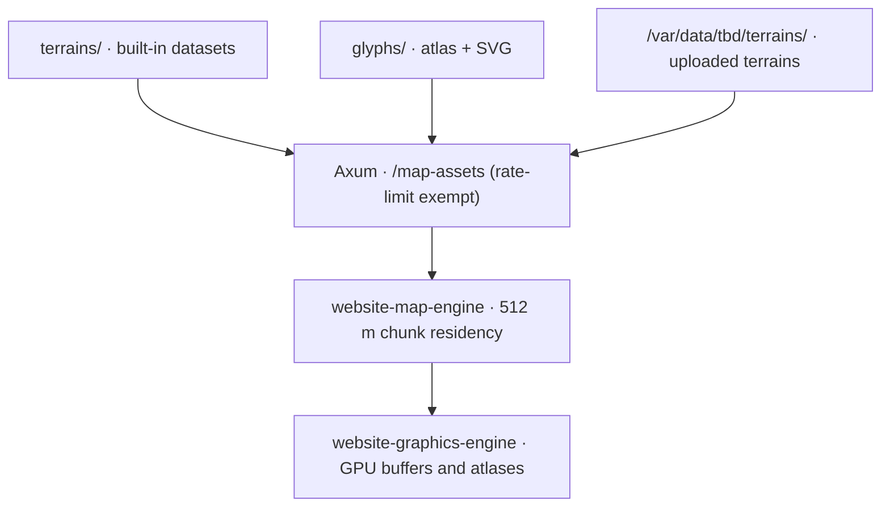

# Map Assets Hub (`assets_v2/`)

Storage layout and specification for the built-in terrain datasets, tactical glyph atlases, and the production volume that holds community-uploaded terrains.

---

## 1. Directory Topology

```text
assets_v2/
├── README.md                           <-- Asset storage specification (this document)
├── ARCHITECTURE_PLAN.md                <-- Streaming residency, chunking, and Git LFS policy
├── ANALYSIS_AND_INVENTORY.md           <-- Census of every committed asset and its role
│
├── terrains/                           # Built-in island datasets, served at /map-assets
│   ├── README.md
│   ├── terrain-registry.json           # Catalog of every registered terrain
│   ├── everon/                         # 12.8 km × 12.8 km primary island
│   │   └── README.md
│   └── arland/                         # 4.1 km × 4.1 km island, manifest only
│       └── README.md
│
├── glyphs/                             # World-object glyph atlas and its SVG sources
│   └── README.md
│
├── scratch/                            # Uncommitted export intermediates (gitignored)
│
└── storage_spec/                       # Production persistent volume specification
    └── README.md
```



---

## 2. Binary Container Formats

Bulk data is stored in the containers T-935 specifies. All multi-byte fields are little-endian; all headers are 32 bytes, `#[repr(C)]` and `bytemuck::Pod`, with field orders chosen so the struct carries no padding.

| Tier | Encoding | Assets |
|:---|:---|:---|
| 1 | Raw `#[repr(C)]` POD read through `bytemuck::cast_slice` | Object chunk instances (`TBDC`), the DEM grid (`TBDE`), forest density (`TBDD`) |
| 2 | rkyv 0.8 archives with `bytecheck`, read through `access_checked` | Roads, map labels, prefab catalog, type inventory, forest regions, building blueprints |
| 3 | Mipmapped containers read by HTTP range or header-computed offset | Satellite (`.tbd-sat`), bathymetry (`.tbd-bath`) |

`ObjectInstancePod` is 32 bytes: position `x, y, z`, orientation `yaw, pitch, roll`, uniform `scale`, a `u16` index into the prefab catalog, a `u8` class code, and one padding byte. Rows that predate pitch/roll/scale decode as `pitch = roll = 0.0`, `scale = 1.0`.

Each terrain ships every bulk asset in both its JSON and its binary encoding. The JSON twin is the parity oracle: a decode of the binary must equal a decode of the JSON for every chunk.

---

## 3. Core Architectural Laws Enforced

1. **Law 3 (Clean Architecture)**: Repository starter data, local export scratch, and the production upload volume are three separate locations with separate lifecycles. Scratch is never read by anything downstream of an export, because a fresh clone does not have it.
2. **Law 4 (Zero Context Needed)**: Directory names state their contents — `terrains/`, `glyphs/`, `scratch/`, `storage_spec/`.
3. **Law 6 (Strict Boundary Layers)**: This tree is data and specification. It holds no GPU pipeline code and no UI.
4. **Law 8 (Present-Tense Documentation)**: These documents describe the live headers, the shipped partition sizes, and the current volume layout.

---

## 4. Documentation Index

- **[`ARCHITECTURE_PLAN.md`](/documentation_v2/archive/assets_v2_relocation/architecture_plan.md)**: Streaming residency budgets, the 512 m partition, the rate-limit seam, and the Git LFS policy.
- **[`ANALYSIS_AND_INVENTORY.md`](/documentation_v2/archive/assets_v2_relocation/analysis_and_inventory.md)**: Every committed asset, its size, its format, and what reads it.
- **[`terrains/README.md`](./terrains/README.md)**: The terrain registry and the built-in dataset contract.
- **[`glyphs/README.md`](./glyphs/README.md)**: The world-object glyph atlas.
- **[`storage_spec/README.md`](./storage_spec/README.md)**: The production persistent volume and its upload ingest gates.
- **[`MIGRATION_HANDOFF.md`](/documentation_v2/archive/assets_v2_relocation/migration_handoff.md)**: Where each legacy asset went, the Git LFS proof, and the outstanding host step.
