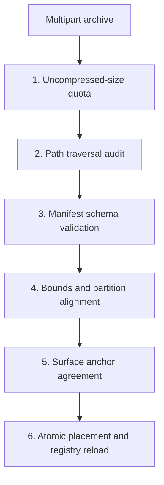

# Production Volume Specification (`assets_v2/storage_spec/`)

Design specification for the second storage tier: the persistent volume on self-hosted servers that holds terrains uploaded at runtime.

**Status: specification only.** The volume, the upload endpoint, and the ingest gates below are not built. Every terrain the platform serves today is a built-in dataset committed under [`../terrains/`](../terrains/), served from the repository checkout. This document fixes the design so the seam is settled before the feature is written; it describes a target, not a running system.

---

## 1. Storage Topology

Uploaded terrains live on a Docker named volume mounted read-only into the API container:

```text
/var/data/tbd/terrains/
└── <terrain-id>/
    ├── manifest.json                   <-- Validated against terrain-manifest.schema.json
    ├── dem/<terrain-id>-dem-16bit.png  <-- 16-bit elevation grid
    ├── satellite/<terrain-id>-sat.tbd-sat
    ├── objects/chunks/{cx}_{cy}.bin    <-- 512 m object chunks
    ├── objects/density/*.bin
    ├── prefabs/, roads/, locations/
    └── anchors/verification.json
```

A terrain directory is structurally identical to a built-in one, because both are addressed through the same manifest contract. That identity is the point: the API resolves a directory per tier and serves both under `/map-assets`, and no consumer distinguishes them.

```yaml
services:
  website-api:
    volumes:
      - terrain-data:/var/data/tbd/terrains:ro
    environment:
      - TBD_TERRAIN_STORAGE_DIR=/var/data/tbd/terrains

volumes:
  terrain-data:
    name: tbd-terrain-storage
```

---

## 2. Ingest Gates

An upload is an archive that is expanded into a staging directory, checked, and only then moved into place.



1. **Quota.** The uncompressed size is computed from the archive index before extraction and rejected past a per-terrain ceiling, with a second ceiling on total volume use. Deciding after extraction is how a decompression bomb fills a disk.
2. **Path traversal.** Every entry path is rejected if it is absolute, escapes the staging root once normalised, or is a symlink. Rejection aborts the whole upload rather than skipping the entry.
3. **Manifest validation.** `manifest.json` must validate against `contracts_v2/definitions/terrain-manifest.schema.json`, and the terrain id must match the directory and be absent from the registry.
4. **Bounds and partition.** World bounds must be positive, a whole multiple of the 512 m chunk size, and consistent with the DEM's pixel dimensions and declared metres-per-pixel. Every chunk file name must fall inside the grid those bounds imply.
5. **Anchors.** If the upload declares surface anchors, resampling the DEM at each anchor must agree within the manifest's threshold. A terrain whose elevation disagrees with its own probe log is misaligned, and placed objects will float or sink.
6. **Atomic placement.** The staged directory is renamed into the volume in one operation, then the registry is reloaded. A partially visible terrain is never servable.

---

## 3. Operational Notes

- The mount is read-only in the API container. Writes happen in the upload handler's staging area on the same volume, so the final rename stays within one filesystem.
- Removing a terrain is a registry edit plus a directory removal, in that order, so nothing resolves a manifest that is about to disappear.
- The volume is excluded from the code deployment: `cargo xtask deploy website` does not transfer terrain data, and the server keeps its own copy across releases.
