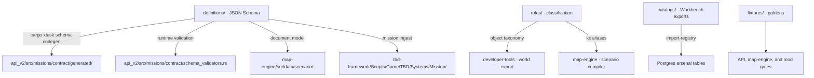

# Contracts Hub (`contracts_v2/`)

Every data shape that crosses a network, process, or language boundary on this platform: the web API, the Leptos frontend, the WebAssembly map engine, the Enfusion game mod, and the external voice bridge.

---

## 1. Directory Topology

```text
contracts_v2/
├── README.md                           <-- Contract hub (this document)
├── ARCHITECTURE_PLAN.md                <-- Codegen pipeline, versioning policy, CI gates
├── ANALYSIS_AND_INVENTORY.md           <-- Census of every schema, rule, catalog, and fixture
│
├── definitions/                        # 25 authoritative JSON Schema definitions
│   └── README.md
├── rules/                              # Classification and alias tables applied at export time
│   └── README.md
├── catalogs/                           # Live Workbench exports the platform ingests
│   └── README.md
└── fixtures/                           # Golden test data for every boundary
    ├── README.md
    ├── missions/{valid,invalid}/       # 9 playable, 6 deliberately malformed
    ├── map/                            # 20 spatial fixtures, JSON and binary
    ├── registry/                       # 8 item, loadout, faction, and alias samples
    ├── enfusion_samples/               # 10 raw mod-emitted payloads
    └── bridge_samples/                 # 6 voice-bridge IPC messages
```



---

## 2. The Four Kinds of Data Here

The split exists because these four are governed differently, and a flat directory hides that.

| Directory | What it is | Changing it means |
|:---|:---|:---|
| **`definitions/`** | The authoritative shape of a wire message. Nothing may put a property on the wire that its schema does not define. | A contract change. Follows the versioning policy in `ARCHITECTURE_PLAN.md`; readers deploy before writers emit. |
| **`rules/`** | Deterministic lookup tables consulted while producing data: prefab taxonomy, kit aliases. | A data change. The output they shape is a committed artifact, so an edit is latent until that artifact is rebuilt. |
| **`catalogs/`** | Live production data exported from the Enfusion Workbench and ingested by the platform. | New game content. Replaced wholesale by a re-export, never hand-edited. |
| **`fixtures/`** | Ground truth for tests. Valid samples that must always parse; invalid samples that must always be rejected. | A test-surface change. An invalid fixture that starts passing is a regression in a rejection gate. |

Keeping live catalogs out of `fixtures/` matters most: an ingest that silently fell back to a test sample would populate the arsenal with sample data and pass every test.

---

## 3. Core Architectural Laws Enforced

1. **Law 4 (Zero Context Needed)**: `definitions/` holds schemas, `rules/` holds lookup tables, `catalogs/` holds live exports, `fixtures/` holds test data. Nothing is named for its history.
2. **Law 5 (Categorize Variants)**: Fixtures are grouped by the boundary they exercise rather than dumped in one directory.
3. **Law 6 (Strict Boundary Layers)**: Contracts are pure interface. No SQL, no rendering, no platform code.
4. **Law 8 (Present-Tense Documentation)**: Schema descriptions state the constraint that holds now.

---

## 4. Documentation Index

- **[`ARCHITECTURE_PLAN.md`](./ARCHITECTURE_PLAN.md)**: The typify codegen pipeline, the schema evolution policy, and the CI gates that enforce both.
- **[`ANALYSIS_AND_INVENTORY.md`](./ANALYSIS_AND_INVENTORY.md)**: Every file here, what reads it, and what breaks without it.
