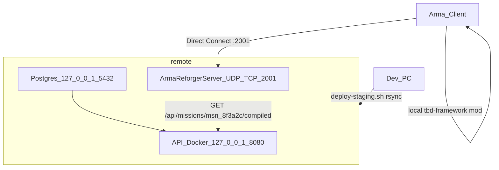

# Staging server — 192.168.0.140

Self-hosted TBD stack for LAN testing: **API + Postgres (Docker)** and **Arma Reforger dedicated server** on `sam@192.168.0.140`. Phase A uses **rsync + local mod symlink** — no Workshop publish yet.

**Do not touch PrairieLearn:** all TBD paths live under `/home/sam/tbd/` only. Never deploy to `/home/sam/prairielearn/`.

---

## Architecture



| Service | Bind | Notes |
|---------|------|-------|
| Game server | `0.0.0.0:2001` UDP + TCP | LAN clients; **A2S on same port** (Direct Join probes `:2001`) |
| API | `127.0.0.1:8080` | Game server on same host; smoke via SSH `curl` |
| Postgres | `127.0.0.1:5432` | Docker internal hostname `postgres` for API container |

---

## Prerequisites

### Dev PC (one-time)

```bash
which sshpass rsync ssh curl git node
node -v   # 18+
cd tbd-schema && npm ci
cp scripts/deploy.env.example scripts/deploy.env   # fill SSH + token + paths
```

Workbench spawn should already pass (`assigned slot` + `spawn requested` in Proton WB log).

### Server 192.168.0.140 (one-time)

| Item | Check |
|------|-------|
| Disk ≥ 30 GB | `df -h ~` |
| Docker + compose | `docker compose version` |
| steamcmd + 32-bit libs | `steamcmd +quit` |
| Arma Reforger Server (**1874900** stable) | logged-in Steam account with dedicated license — **not** 1890870 (Experimental) |
| User systemd survives logout | `sudo loginctl enable-linger sam` |
| Ports free or remapped | `ss -tlnp \| grep -E '5432\|8080\|2001'` |

---

## Paths

| Variable | Default |
|----------|---------|
| `TBD_REMOTE_DIR` | `/home/sam/tbd/repo` |
| `TBD_PROFILE_DIR` | `/home/sam/tbd/profile` |
| `TBD_ADDONS_STAGING` | `/home/sam/tbd/addons-staging` |
| `TBD_SERVER_DIR` | `/home/sam/steam/arma-reforger-server` (adjust after steamcmd) |

---

## One-time bootstrap (server)

Run discovery from dev PC:

```bash
bash scripts/bootstrap-staging-server.sh
```

### 1. Discovery

```bash
ssh sam@192.168.0.140 'df -h ~; ss -tlnp | grep -E "5432|8080|2001" || true; docker compose version'
```

If `:5432` is taken, set `TBD_POSTGRES_HOST_PORT=5433` in `deploy.env` and edit `Tbdevent_Website/docker-compose.staging.yml` to map `127.0.0.1:5433:5432`.

### 2. Layout

```bash
ssh sam@192.168.0.140 'mkdir -p /home/sam/tbd/{repo,profile,addons-staging}'
```

### 3. Arma dedicated server (steamcmd)

```bash
# On server — example paths; adjust TBD_SERVER_DIR in deploy.env
mkdir -p ~/steam
cd ~/steam
# Install steamcmd per Fedora docs, then:
steamcmd +login YOUR_STEAM_USER +force_install_dir "$HOME/steam/arma-reforger-server" \
  +app_update 1874900 validate +quit
```

Note the game **build number** in server logs after first start — client must match.

### 4. API secrets (server only)

On the server, create `Tbdevent_Website/.env` (**never rsync'd from dev**):

```bash
cd /home/sam/tbd/repo/Tbdevent_Website   # after first rsync or clone
cp .env.example .env
# Edit:
#   SESSION_SECRET=<long-random>
#   GAME_SERVER_TOKENS=<same value as TBD_GAME_SERVER_TOKEN in scripts/deploy.env>
```

### 5. Docker stack

```bash
cd /home/sam/tbd/repo/Tbdevent_Website
docker compose -f docker-compose.staging.yml up -d --build
```

First build may take 5–15 minutes.

### 6. API smoke (before game server)

```bash
TOKEN='<your-game-server-token>'
curl -sf -H "Authorization: Bearer $TOKEN" \
  http://127.0.0.1:8080/api/missions/msn_8f3a2c/compiled | head -c 200
curl -sf -H "Authorization: Bearer $TOKEN" \
  http://127.0.0.1:8080/api/game/events/b0000000-0000-4000-8000-000000000001/roster
curl -s -o /dev/null -w '%{http_code}\n' \
  http://127.0.0.1:8080/api/missions/msn_8f3a2c/compiled   # expect 401
```

### 7. User systemd + linger

```bash
sudo loginctl enable-linger sam
```

`deploy-staging.sh` installs `~/.config/systemd/user/tbd-reforger.service` from `deploy/tbd-reforger.service`.

### 8. Firewall (game port)

```bash
sudo firewall-cmd --permanent --add-port=2001/tcp
sudo firewall-cmd --permanent --add-port=2001/udp
sudo firewall-cmd --reload
```

---

## Deploy from dev PC

```bash
cp scripts/deploy.env.example scripts/deploy.env   # if not done
# Fill TBD_SSH_PASS (or SSH key), TBD_GAME_SERVER_TOKEN, paths
bash scripts/deploy-staging.sh
bash scripts/deploy-staging.sh --dry-run   # preview only
```

Flow: validate mission JSON → rsync → profile + addon symlink → Docker rebuild → API smoke → restart game server → remote log grep.

---

## Verification matrix

| Step | Command | Pass |
|------|---------|------|
| V1 Mission JSON | `node tbd-schema/scripts/validate-file.mjs Tbdevent_Website/missions/msn_8f3a2c.json` | exit 0 |
| V2 API mission | SSH: `curl -sf -H "Authorization: Bearer $TOKEN" http://127.0.0.1:8080/api/missions/msn_8f3a2c/compiled` | HTTP 200 |
| V3 Roster | SSH: `curl -sf -H "Authorization: Bearer $TOKEN" http://127.0.0.1:8080/api/game/events/b0000000-0000-4000-8000-000000000001/roster` | HTTP 200 |
| V4 Auth gate | SSH: unauthenticated compiled URL | HTTP 401 |
| V5 Game listening | SSH: `ss -ulnp \| grep 2001` or log `listening on address 0.0.0.0:2001` | yes |
| V6 Game logs | `bash scripts/remote-log-grep.sh` | see below |
| V7 Client join | Direct Connect `192.168.0.140:2001` + **local** mod | spawn at slot + kit |

### Game log pass criteria

- `[TBD] Mission loaded`
- `[TBD] Registry loaded`
- 18× `[TBD] SpawnManager: built slot spawn`
- `[TBD] Stage → LOBBY`
- `[TBD] Roster loaded`
- `[TBD] SpawnManager: assigned slot`
- `[TBD] SpawnManager: spawn requested`
- **No** `Can't compile`, `Unknown class`, `RequestSpawn failed`

(`TBD_RegistryPocComponent` is not on `TBD_GameMode.et` — do not expect Registry POC spawn lines.)

---

## Client join (Phase A)

1. **Mod on client (Steam / Proton):**
   ```bash
   bash scripts/setup-client-addons.sh
   ```
   Steam → Arma Reforger → Properties → Launch Options:
   ```
   -addonsDir "/home/Samuel/.local/share/tbd-server-addons" -addons B2C3D4E5F6A78901
   ```
   Verify in latest Proton client log (`compatdata/1874880/.../ArmaReforger/logs/logs_*/console.log`):
   `gproj: '.../tbd-framework/addon.gproj' guid: 'B2C3D4E5F6A78901'`.

2. **Connect:** Multiplayer → **V** Direct Join → IP `192.168.0.140`, port `2001`.

3. **Version:** Client and server **Steam build IDs** must match (UI version `1.7.0.x` alone is not enough):
   ```bash
   grep buildid ~/.local/share/Steam/steamapps/appmanifest_1874880.acf   # client game
   grep buildid ~/.local/share/Steam/steamapps/appmanifest_1874900.acf   # server (dev PC copy)
   ```
   On server: `steamcmd +app_update 1874900 validate`, then rsync binary to `192.168.0.140` if needed.

4. **Firewall:** UDP and TCP **2001** open on server (`ufw` / `firewall-cmd`). WiFi vs ethernet on same `/24` is fine if ping works.

### Game server CLI (Phase A)

Phase A uses **`-server` + `-addons`** (not `-config` — that breaks unpublished local mods):

```
-bindIP 0.0.0.0 -bindPort 2001 -a2sPort 2001
```

**Critical:** Direct Join probes the **game port** (`2001`) for A2S discovery. If `-a2sPort 17777` is set, the client shows **"No server found"** even when the server is running. `scripts/tbd-staging-server.config.json` still lists `17777` for future Phase B `-config` mode only.

---

## Workbench test loop (dev PC)

enfusion-mcp has no `wb_log` tool — grep Proton console.log after play:

```bash
bash scripts/mcp-call.sh wb_connect '{}'
bash scripts/mcp-call.sh wb_play '{}'
sleep 25
bash scripts/mcp-wb-logs.sh
bash scripts/mcp-call.sh wb_stop '{}'
```

Or: `bash scripts/tbd-spawn-verify.sh`

`.cursor/mcp.json` should set `ENFUSION_GAME_PATH`, `ENFUSION_WORKBENCH_PATH`, `ENFUSION_PROJECT_PATH` (parity with `.mcp.json`).

---

## Troubleshooting

| Symptom | Fix |
|---------|-----|
| **Direct Join "No server found"** | Run `bash scripts/debug-direct-join.sh` — A2S must respond on **2001** from dev PC. Fix: `-a2sPort 2001` in `tbd-reforger.service`, restart server. |
| A2S OK on 17777 but not 2001 | Same as above — wrong discovery port for Direct Join |
| WiFi server + LAN client | Usually **not** the issue if same subnet and `ping 192.168.0.140` works |
| API 401 on mission | `TBD_GAME_SERVER_TOKEN` ≠ `GAME_SERVER_TOKENS` in server `.env` / `TBD_BackendConfig.json` |
| API won't start | Check `docker compose logs api`; `DATABASE_URL` must use hostname `postgres` inside container |
| Port 8080 in use | Remap in `docker-compose.staging.yml` (e.g. `8081:8080`) |
| Empty mod / compile errors | Client launch options; server missing symlink in `addons-staging`; rsync `resourceDatabase.rdb` |
| `Unknown class TBD_*` on server | `resourceDatabase.rdb` not deployed — include in rsync |
| Version mismatch (after discovery) | Match Steam `buildid` client ↔ server; `steamcmd +app_update 1874900 validate` |
| No console.log | Server: `$TBD_PROFILE_DIR/logs/logs_*/console.log`. Client (Proton): `compatdata/1874880/.../ArmaReforger/logs/` |
| Game stops after SSH logout | `sudo loginctl enable-linger sam` |
| Overwrote server secrets | Never rsync `Tbdevent_Website/.env` from dev — recreate on server |

### Debug Direct Join

```bash
bash scripts/debug-direct-join.sh before-join    # from dev PC
# attempt Direct Join in game
bash scripts/debug-direct-join.sh after-join
```

Writes NDJSON to `.cursor/debug-8fc1e0.log` (SSH status, ping, A2S probe on 2001/17777, build IDs, mod symlink).

Client log grep for join flow:
```bash
LOG=$(ls -td ~/.local/share/Steam/steamapps/compatdata/1874880/pfx/drive_c/*/My\ Games/ArmaReforger/logs/logs_* | head -1)/console.log
grep -E 'SEARCHING_SERVER|SERVER_NOT_FOUND|MANUAL_CONNECT|connect' "$LOG"
```

---

## Phase B (deferred)

- Workshop Dev publish
- `-config` server mode (`scripts/tbd-dev-server.config.json` — BattlEye, admin password)
- Public internet / TLS / Discord OAuth on staging

---

## Related scripts

| Script | Purpose |
|--------|---------|
| [`scripts/deploy-staging.sh`](../scripts/deploy-staging.sh) | Full deploy pipeline |
| [`scripts/remote-log-grep.sh`](../scripts/remote-log-grep.sh) | SSH log verification |
| [`scripts/bootstrap-staging-server.sh`](../scripts/bootstrap-staging-server.sh) | Discovery + mkdir |
| [`scripts/setup-server-profile.sh`](../scripts/setup-server-profile.sh) | Profile + mission fallback |
| [`scripts/setup-client-addons.sh`](../scripts/setup-client-addons.sh) | Client mod symlink + Steam launch options |
| [`scripts/debug-direct-join.sh`](../scripts/debug-direct-join.sh) | LAN join diagnostics (A2S, SSH, builds) |
| [`deploy/tbd-reforger.service`](../deploy/tbd-reforger.service) | systemd user unit template (`-a2sPort 2001`) |
