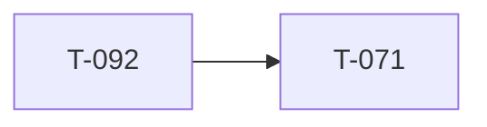

<!-- AUTO-GENERATED by ./scripts/ticket sync — DO NOT EDIT -->

# Ticket Lead Dashboard

## Running / Review

## Ready

- **T-090** (900) — Map visualization program [ready] — Map Engine v2 through sea-band + contours @ `bd481cf1`. **Active:** **T-090.5.5** tree/veg/prop glyphs. Single lane.
- **T-151** (1500) — WebGPU (wgpu/wasm) render engine spike - replace Deck.gl [ready] — wgpu Mission Creator engine program (spike SHIPPED @ 94261dd6; W0/T-151.0 SHIPPED @ f019512d — one wasm module, batch list, editor dual mount; verify .ai/artifacts/t151_0_verify_log.md). Slices W1-W9 wire world data, all render layers, and editor interaction onto the engine; Deck stays the oracle until T-151.9. Hub: t151_wgpu_engine_program.md. Execution: standing worktree tbd-reforger-wgpu-spike/ only; manual Claude prompts; no per-slice branches or ticket run.

## Next queued (top 10)

- **T-071** (710) — ORBAT Manager modal [queued] — ORBAT Manager modal — squad names, numbering, membership, slotting order. **Deferred** — operator **map-first lane** until **T-090** ships (T-092 gate cleared @ `a73224f2`). Hub: t071_orbat_manager_program.md.
- **T-072** (720) — Ctrl multi-place [queued] — Hold Ctrl to place multiple copies without re-selecting asset.
- **T-073** (730) — Shift + map rotation [queued] — Shift-drag and map rotation widget for placed entities.
- **T-074** (740) — Faction submode / catalog filter [queued] — Faction submode tabs and catalog filtering in asset browser.
- **T-075** (750) — Spacebar flyTo vs widget [queued] — Spacebar centers selection; resolve flyTo vs transform widget conflict.
- **T-114** (1140) — Slot roster enforcement + production slot picker [queued] — Production in-game slot picker synced to event roster API + identity-linked claims. **Not** full web ORBAT (T-071). After T-068.13 production LOBBY picker + T-118.
- **T-115** (1150) — Capture win condition [queued] — Real side victory via capture / hold / elimination objective.
- **T-116** (1160) — Results POST to backend [queued] — Game server posts match results; visible on event page.
- **T-117** (1170) — Mission upload + validation UI [queued] — Web UI for mission upload and schema validation (API exists).
- **T-118** (1180) — Event ORBAT + identity linking UI [queued] — Event-side slotting UX completion: manual ORBAT assignment, roster admin, Discord/game identity linking. **Complements T-071** (mission authoring ORBAT) — neither is production-complete today.

## Dependency graph (scoped)

