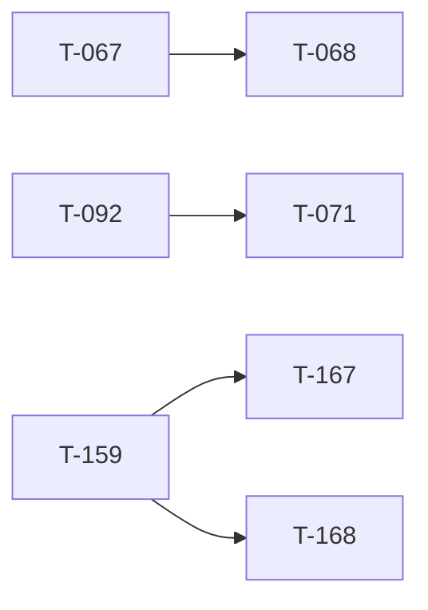

<!-- AUTO-GENERATED by ./scripts/ticket sync — DO NOT EDIT -->

# Ticket Lead Dashboard

## Running / Review

## Ready

- **T-068** (680) — Virtual Arsenal (registry + loadout export) [ready] — Through T-068.10 shipped (3bc0bd24): Forge + editor loadout. ACTIVE T-068.11 compiled mod loadout block → T-068.12 player equip. Hub: t068_virtual_arsenal_program.md.
- **T-090** (900) — Map visualization program [ready] — Map Engine v2 through sea-band + contours @ `bd481cf1`. **Active:** **T-090.5.5** tree/veg/prop glyphs. Single lane.
- **T-151** (1500) — WebGPU (wgpu/wasm) render engine spike - replace Deck.gl [ready] — wgpu Mission Creator engine: W0–W9 shipped @ c4831451 (T-151.9); W10 audit T-151.10/10.1 shipped; W11 remediations T-151.11.1–.6 complete @ 8237cda6. Operator sign-off + polish next. Hub: t151_wgpu_engine_program.md. Worktree tbd-reforger-wgpu-spike/. D5 LANGUAGE GATE.
- **T-167** (1640) — Leptos smart Arsenal port (paper-doll + compat Forge) [ready] — Port the shipped React Smart Arsenal (T-068.10.2–.10.8) into the Leptos Arsenal tab: compat-filtered optic/magazine rows off `GET /registry/compat` (T-150 edges live in DB: 1,880 items / 4,012 edges), clickable paper-doll (Mode D, t068_10_7/t068_10_8), weight/validation, Faction Manager pane. The Leptos tab is the dumb-dropdown tier only (fold documented at `apps/website-leptos/src/arsenal.rs:7-11`); `SlotLoadoutV2` persistence is already the same, so rows/panels add without doc changes. Specs: t068_10_smart_forge_ui.md, t068_10_3_forge_picker_ux.md, t068_10_6_arsenal_expanded_modal.md, t068_10_7_arsenal_paper_doll.md, t068_10_8_arsenal_ux_pass2.md.
- **T-168** (1650) — Leptos ORBAT tree in the left dock [ready] — Replace the ORBAT stub header (scope note `apps/website-leptos/src/eden_chrome.rs:360` — "ORBAT stays a stub header") with the live squads/slots tree: select-on-click, dbl-click→Attributes (SEL-ORBAT-DBL-001), squad grouping from the doc, T-037-parity row actions where they existed in React (`OrbatSection.tsx`). Coordinates with the T-071 ORBAT Manager modal (separate surface — the dock tree is read/select, the modal is manage).

## Next queued (top 10)

- **T-071** (710) — ORBAT Manager modal [queued] — ORBAT Manager modal — squad names, numbering, membership, slotting order. **Deferred** — operator **map-first lane** until **T-090** ships (T-092 gate cleared @ `a73224f2`). Hub: t071_orbat_manager_program.md.
- **T-072** (720) — Ctrl multi-place [queued] — Hold Ctrl to place multiple copies without re-selecting asset.
- **T-073** (730) — Shift + map rotation [queued] — Shift-drag and map rotation widget for placed entities.
- **T-074** (740) — Faction submode / catalog filter [queued] — Faction submode tabs and catalog filtering in asset browser.
- **T-075** (750) — Spacebar flyTo vs widget [queued] — Spacebar centers selection; resolve flyTo vs transform widget conflict.
- **T-114** (1140) — Slot roster enforcement + production slot picker [queued] — Production in-game slot picker synced to event roster API + identity-linked claims. **Not** full web ORBAT (T-071). After T-068.13 production LOBBY picker + T-118.
- **T-115** (1150) — Capture win condition [queued] — Real side victory via capture / hold / elimination objective.
- **T-116** (1160) — Results POST to backend [queued] — Game server posts match results; visible on event page.
- **T-117** (1170) — Mission upload + validation UI [queued] — Web UI for mission upload and schema validation (API exists).
- **T-118** (1180) — Event ORBAT + identity linking UI [queued] — Event-side slotting UX completion: manual ORBAT assignment, roster admin, Discord/game identity linking. **Complements T-071** (mission authoring ORBAT) — neither is production-complete today.

## Dependency graph (scoped)

