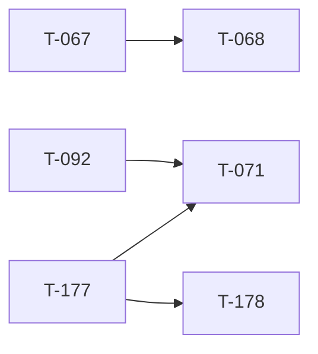

<!-- AUTO-GENERATED by ./scripts/ticket sync — DO NOT EDIT -->

# Ticket Lead Dashboard

## Running / Review

## Ready

- **T-068** (680) — Virtual Arsenal (registry + loadout export) [ready] — Through T-068.10 shipped (3bc0bd24): Forge + editor loadout. ACTIVE T-068.11 compiled mod loadout block → T-068.12 player equip. Hub: t068_virtual_arsenal_program.md.
- **T-071** (710) — ORBAT Manager modal [ready] — ORBAT Manager program. **T-071.0 SHIPPED via T-177** @ e97a01c6 — left ORBAT removed; top-strip ORBAT Manager → OrbatManagerDialog browse/select shell. **Next: T-071.1** squad CRUD · .2 slot numbering/export · .3–.4 logos/standardizations/Arsenal. Hub: t071_orbat_manager_program.md.
- **T-090** (900) — Map visualization program [ready] — Map Engine v2 through sea-band + contours @ `bd481cf1`. **Active:** **T-090.5.5** tree/veg/prop glyphs. Single lane.
- **T-151** (1500) — WebGPU (wgpu/wasm) render engine spike - replace Deck.gl [ready] — wgpu Mission Creator engine: W0–W9 shipped @ c4831451 (T-151.9); W10 audit T-151.10/10.1 shipped; W11 remediations T-151.11.1–.6 complete @ 8237cda6. Operator sign-off + polish next. Hub: t151_wgpu_engine_program.md. Worktree tbd-reforger-wgpu-spike/. D5 LANGUAGE GATE.
- **T-178** (1750) — Forest load consistency + YouTube guides + Outliner label [ready] — Post T-177: (A1) forest canopy loads inconsistently / chunky 512m tiles — coherent draw (shader/precompose/settle); (A2) remove left Outliner label; (A3) continuous YouTube spines (no elbow gaps); (A4) click guide line to expand/collapse. Screens: .ai/artifacts/t178_operator_screens/. UX audit: t178_mc_ux_audit.md. Hub: docs/platform/t178_forest_guides_chrome.md. Not T-071.1 / not mod.

## Next queued (top 10)

- **T-072** (720) — Ctrl multi-place [queued] — Hold Ctrl to place multiple copies without re-selecting asset.
- **T-073** (730) — Shift + map rotation [queued] — Shift-drag and map rotation widget for placed entities.
- **T-074** (740) — Faction submode / catalog filter [queued] — Faction submode tabs and catalog filtering in asset browser.
- **T-075** (750) — Spacebar flyTo vs widget [queued] — Spacebar centers selection; resolve flyTo vs transform widget conflict.
- **T-114** (1140) — Slot roster enforcement + production slot picker [queued] — Production in-game slot picker synced to event roster API + identity-linked claims. **Not** full web ORBAT (T-071). After T-068.13 production LOBBY picker + T-118.
- **T-115** (1150) — Capture win condition [queued] — Real side victory via capture / hold / elimination objective.
- **T-116** (1160) — Results POST to backend [queued] — Game server posts match results; visible on event page.
- **T-117** (1170) — Mission upload + validation UI [queued] — Web UI for mission upload and schema validation (API exists).
- **T-118** (1180) — Event ORBAT + identity linking UI [queued] — Event-side slotting UX completion: manual ORBAT assignment, roster admin, Discord/game identity linking. **Complements T-071** (mission authoring ORBAT) — neither is production-complete today.
- **T-119** (1190) — Framework MVP remainder [queued] — Loadouts, safe start, boundary, admin commands for M1 gate.

## Dependency graph (scoped)

