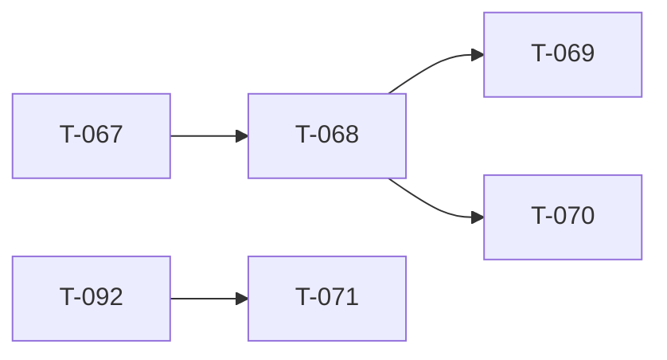

<!-- AUTO-GENERATED by ./scripts/ticket sync — DO NOT EDIT -->

# Ticket Lead Dashboard

## Running / Review

## Ready

- **T-068** (680) — Virtual Arsenal (registry + loadout export) [ready] — Phase 1 shipped. Phase 2 **paused @ T-068.7** until **T-071.2 + T-068.13** (T-092 spawn/compile gate **shipped** @ `a73224f2`). Hub: t068_virtual_arsenal_program.md.
- **T-071** (710) — ORBAT Manager modal [ready] — ORBAT Manager modal — squad names, numbering, membership, slotting order. **Unblocked** — T-092 spawn/compile @ `a73224f2`. Hub: t071_orbat_manager_program.md.
- **T-090** (900) — Map visualization program [ready] — Eden-like map detail (N1-N12). T-090.1.1 Map view @ 6e06e679. Active: T-090.1.1.1 land-cover compose; queued T-090.1.2.9 satellite road overlay. Water good-enough @ T-090.1.2.5.2 (1c07d97a). T-090.2 @ 691d9b26. Hub: t090_091_map_terrain_program.md.

## Next queued (top 10)

- **T-069** (690) — Markers on map [queued] — Place and edit map markers with registry-backed types.
- **T-070** (700) — Vehicles placeable [queued] — Drag vehicles from palette onto map with crew hooks.
- **T-072** (720) — Ctrl multi-place [queued] — Hold Ctrl to place multiple copies without re-selecting asset.
- **T-073** (730) — Shift + map rotation [queued] — Shift-drag and map rotation widget for placed entities.
- **T-074** (740) — Faction submode / catalog filter [queued] — Faction submode tabs and catalog filtering in asset browser.
- **T-075** (750) — Spacebar flyTo vs widget [queued] — Spacebar centers selection; resolve flyTo vs transform widget conflict.
- **T-076** (760) — Vehicle crew UI [queued] — Crew panel and boarding UI for placed vehicles.
- **T-077** (770) — Alt + empty vehicle [queued] — Alt-click to enter empty vehicle placement mode.
- **T-114** (1140) — Slot roster enforcement + production slot picker [queued] — Production in-game slot picker synced to event roster API + identity-linked claims. **Not** full web ORBAT (T-071). After T-068.13 production LOBBY picker + T-118.
- **T-115** (1150) — Capture win condition [queued] — Real side victory via capture / hold / elimination objective.

## Dependency graph (scoped)

