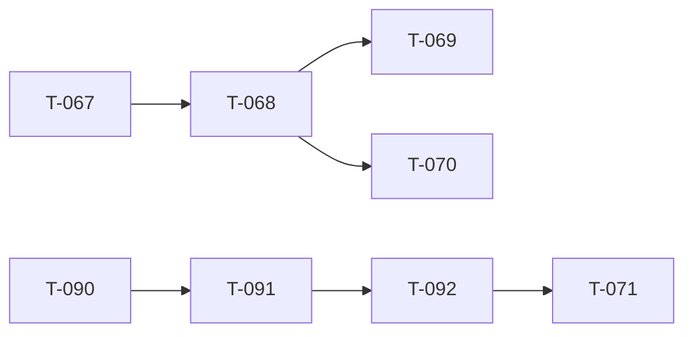

<!-- AUTO-GENERATED by ./scripts/ticket sync — DO NOT EDIT -->

# Ticket Lead Dashboard

## Running / Review

- **T-128** (1280) — Fable audit — doc link repair + staging honesty [active] — ACTIVE — P0 handoff links, staging T-092 honesty, README rot, orphans, registry sync. After T-127 @ 0515aabb. Spec: docs/platform/t128_doc_link_repair.md.

## Ready

- **T-068** (680) — Virtual Arsenal (registry + loadout export) [ready] — Phase 1 shipped. Phase 2 **paused @ T-068.7** until **map verify (T-090–T-092) + T-071.2 + T-068.13** (production LOBBY slot picker). Hub: t068_virtual_arsenal_program.md.
- **T-090** (900) — Map visualization program [ready] — Eden-like map detail (N1-N12). T-090.1.2.4 shipped @ 0d6fe485 (P0 FAIL). PAUSED — Fable audit T-127→128 active (T-126 shipped @ 4a47688e). Next map: T-090.1.2.8 unified GPU texture. Hub: t090_091_map_terrain_program.md.
- **T-092** (920) — Spawn transform parity + mod mission compile [ready] — Mod-native mission 1.1 document (slots[] id/x/z/y/headingDeg/kit), GET /api/v1/missions/:id/compiled, spawn height + capsule offset + yaw verify. Hub: t092_spawn_transform_program.md.

## Next queued (top 10)

- **T-069** (690) — Markers on map [queued] — Place and edit map markers with registry-backed types.
- **T-070** (700) — Vehicles placeable [queued] — Drag vehicles from palette onto map with crew hooks.
- **T-071** (710) — ORBAT Manager modal [queued] — ORBAT Manager modal — squad names, numbering, membership, slotting order. **Blocked on map/spawn verify (T-090–T-092).** Most web ORBAT UX not built. Hub: t071_orbat_manager_program.md.
- **T-072** (720) — Ctrl multi-place [queued] — Hold Ctrl to place multiple copies without re-selecting asset.
- **T-073** (730) — Shift + map rotation [queued] — Shift-drag and map rotation widget for placed entities.
- **T-074** (740) — Faction submode / catalog filter [queued] — Faction submode tabs and catalog filtering in asset browser.
- **T-075** (750) — Spacebar flyTo vs widget [queued] — Spacebar centers selection; resolve flyTo vs transform widget conflict.
- **T-076** (760) — Vehicle crew UI [queued] — Crew panel and boarding UI for placed vehicles.
- **T-077** (770) — Alt + empty vehicle [queued] — Alt-click to enter empty vehicle placement mode.
- **T-114** (1140) — Slot roster enforcement + production slot picker [queued] — Production in-game slot picker synced to event roster API + identity-linked claims. **Not** full web ORBAT (T-071). After T-068.13 production LOBBY picker + T-118.

## Dependency graph (scoped)

