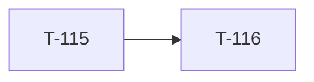

<!-- AUTO-GENERATED by ./scripts/ticket sync — DO NOT EDIT -->

# Ticket Lead Dashboard

## Running / Review

## Ready

- **T-090** (900) — Map visualization program [ready] — Map Engine v2 through sea-band + contours @ `bd481cf1`. **Active:** **T-090.5.5** tree/veg/prop glyphs. Single lane.
- **T-237** (2550) — ticket ship verifies nothing and check ignores the schema [ready] — xtask/src/cmds.rs:534 sets status to shipped and returns. xtask/src/check.rs contains zero references to schema.json and hand-rolls a narrower subset, so 314 schema violations are invisible: program Platform, invented impact and surfaces values, shipped_at which is not in the schema at all, and 13 null active_slice entries.
- **T-274** (2920) — Record the untracked spawn-determinism program [ready] — 57 commits carry no ticket id, including a full spawn determinism program (7a5ab1e3 1065 lines, f4b25440, a18eeb2e), a new gate scripts/mod/tbd-spawn-determinism.sh with an 18.7KB verify log and no Makefile target, the B2 ORBAT mutate-in-place rewrite, and the map-assets LFS slim.
- **T-275** (2930) — Declare mod-enforced limits in the schema [ready] — The mod clamps values the schema is silent about: MAX_NETS=32 (TBD_RadioPlan.c:91), MAX_LABEL_CHARS=48 (:94), MAX_GRACE_SECONDS=3600 (TBD_ZoneRegistry.c:52), MAX_DURATION_SECONDS=21600 (TBD_ObjectiveRegistry.c:60), MISSION_FILE_MAX_BYTES=8MB. A document can validate and still be silently clamped.

## Next queued (top 10)

- **T-072** (720) — Ctrl multi-place [queued] — Hold Ctrl to place multiple copies without re-selecting asset.
- **T-073** (730) — Shift + map rotation [queued] — Shift-drag and map rotation widget for placed entities.
- **T-075** (750) — Spacebar flyTo vs widget [queued] — Spacebar centers selection; resolve flyTo vs transform widget conflict.
- **T-116** (1160) — Results POST to backend [queued] — SPLIT 2026-07-26. Mod half SHIPPED: TBD_ResultsReporter.c (682 lines, T-181.13.1) POSTs to /api/v1/ingest/match-results. Website half OPEN and folded into T-232 — event_hub.rs renders no result/outcome/match data at all. This row now tracks only the website half.
- **T-117** (1170) — Mission upload + validation UI [queued] — Web UI for mission upload and schema validation (API exists).
- **T-118** (1180) — Event ORBAT + identity linking UI [queued] — SPLIT 2026-07-26. DONE: identity-link UI (settings.rs:6-9,74-94, T-159.25) and the ORBAT selector (event_hub.rs:520-572, T-159.25a). OPEN residual is tracked by T-226 (PATCH /events/{id} has no caller), T-284 (clear_slot unreachable, admin cannot free a claimed slot) and T-231 (identity last mile). This row is a pointer, not work.
- **T-120** (1200) — Staging soak + golden mission smoke [queued] — Pinned game/mod version soak; golden-mission smoke on staging server.
- **T-146** (1470) — Asset Browser Data Wiring [queued] — Hook up T-150 registry items (vehicles/crates/…) to Asset Browser for map drag-place. Unblocked by T-150; after or parallel T-068.9 ingest preferred.
- **T-170** (1670) — Prod default flip to Leptos SPA [queued] — Make the Leptos SPA the production default: set `SPA_DIST_DIR` to the trunk release dist in the prod env, move the Discord OAuth redirect origin, staging soak, then flip. OPERATOR-GATED (env + Discord app settings are operator-held); claude-code prepares configs/runbook + verifies the staging soak gates. Runbook anchor: docs/website/DEV_RUNBOOK.md §SPA serving; T-159 finish program left this as the sole operator-gated residual.

## Dependency graph (scoped)

```mermaid
flowchart LR
  T115[T-115] --> T116[T-116]
```
