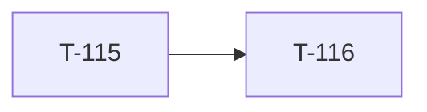

<!-- AUTO-GENERATED by ./scripts/ticket sync — DO NOT EDIT -->

# Ticket Lead Dashboard

## Running / Review

## Ready

- **T-090** (900) — Map visualization program [ready] — Map Engine v2 through sea-band + contours @ `bd481cf1`. **Active:** **T-090.5.5** tree/veg/prop glyphs. Single lane.
- **T-421** (3260) — BLOCKER: the wave gate's cargo check and clippy can PASS on source they never compiled [ready] — THE ALWAYS-BLOCKER CLASS, and the most serious finding of the 2026-07-26 run. Found by wave 5's adversarial verifier after TWO slice agents independently measured the same mechanism.

`scripts/platform/wave.sh:517` asserts: 'cargo check/clippy do not need one because they emit no binary to run.' THAT REASONING IS WRONG. The exposure is not about RUNNING a binary. Cargo's freshness test is mtime-based over a `.fingerprint` directory that IS SHARED ACROSS WORKTREES, so a check step can return a verdict about a file it never opened.

REPRO A -- same tree, mtime alone:
  export CARGO_TARGET_DIR=/home/Samuel/Projects/TBD-Reforger/target
  cp -p crates/map-engine-core/src/slot_line.rs /tmp/sl.orig
  printf '\nTHIS IS NOT RUST AND CANNOT COMPILE ###\n' >> crates/map-engine-core/src/slot_line.rs
  touch -r /tmp/sl.orig crates/map-engine-core/src/slot_line.rs     # keep the ORIGINAL mtime
  cargo check --workspace --quiet ; echo $?    # -> 0    PASS over unparseable Rust
  touch crates/map-engine-core/src/slot_line.rs                     # identical bytes, mtime=now
  cargo check --workspace --quiet ; echo $?    # -> 101  "reserved multi-hash token is forbidden"
The gate's own clippy line returned rc=0 over that same unparseable file.

REPRO B -- cross-worktree, the real mechanism, no artificial dating. Added a const to the T-215 worktree's slot_line.rs, built it into the shared dir, then from main:
  main: cargo check -p map-engine-core --features doc,mission,world  ->  Finished in 0.06s (zero work)
  main: grep -c TBD_FOREIGN_MARKER_W5 crates/map-engine-core/src/    ->  0  (main cannot produce it)
        grep -ac TBD_FOREIGN_MARKER_W5 target/debug/deps/libmap_engine_core-*.rmeta -> 1
Main's cargo check stood on a sibling's rmeta.

WHAT LIMITS IT (the partial defence is real, do not remove it): `touch_changed` (wave.sh:416-433) touches .rs files in $base..HEAD union `git status --porcelain`, so wave-range and dirty files ARE rebuilt. Crates with NO touched .rs file are not. In wave 5's own 12/12 run the range touched only map-engine-core, website-frontend and xtask -- `website-api` and every other workspace crate's cargo check verdict rested on artifacts of unidentified provenance.

THE SAME MECHANISM, MEASURED TWICE MORE THIS WAVE:
  - T-420: `cargo run -q -p xtask` executed a binary its own tree cannot produce. `grep -ac vehicleClass target/debug/xtask` -> 2 while its own `xtask/src/schema_gates.rs` -> 0. `cargo build -p xtask` said 'Finished in 0.09s'. The clobber is ONE-DIRECTIONAL: whichever tree has older mtimes silently inherits the other's tool.
  - T-244: after `git checkout` restored a perturbed file, cargo did NOT rebuild and the gate reported the PERTURBED verdict while `git status` said the tree matched HEAD. This one is worse than it looks because it undermines the program's core habit -- every perturbation loop is break/see-red/restore/see-green, and the GREEN half can be stale too.

This is the third and fourth measured instance of T-193/T-195 clobbering.

FIX DIRECTION, consistent with what already exists: the repo ALREADY gives private target dirs to the expensive steps -- `target-gate-api` (8.3G), `target-gate-frontend` (1.8G), and T-420's new `target-gate-schema` (1.9G). `cargo check --workspace` and the three clippy steps are the ones still on the shared dir. Give them the same treatment, or force a full-workspace touch before the check steps. Weigh disk and cold-build cost against a gate whose verdict cannot be trusted. NOTE T-420's `gate_schema` stamp is NOT a complete model to copy -- see T-422.

## Next queued (top 10)

- **T-072** (720) — Ctrl multi-place [queued] — Hold Ctrl to place multiple copies without re-selecting asset.
- **T-073** (730) — Shift + map rotation [queued] — Shift-drag and map rotation widget for placed entities.
- **T-075** (750) — Spacebar flyTo vs widget [queued] — Spacebar centers selection; resolve flyTo vs transform widget conflict.
- **T-116** (1160) — Results POST to backend [queued] — SPLIT 2026-07-26. Mod half SHIPPED: TBD_ResultsReporter.c (682 lines, T-181.13.1) POSTs to /api/v1/ingest/match-results. Website half OPEN and folded into T-232 — event_hub.rs renders no result/outcome/match data at all. This row now tracks only the website half.
- **T-117** (1170) — Mission upload + validation UI [queued] — Web UI for mission upload and schema validation (API exists).
- **T-118** (1180) — Event ORBAT + identity linking UI [queued] — SPLIT 2026-07-26. DONE: identity-link UI (settings.rs:6-9,74-94, T-159.25) and the ORBAT selector (event_hub.rs:520-572, T-159.25a). OPEN residual is tracked by T-226 (PATCH /events/{id} has no caller), T-284 (clear_slot unreachable, admin cannot free a claimed slot) and T-231 (identity last mile). This row is a pointer, not work.
- **T-120** (1200) — Staging soak + golden mission smoke [queued] — Pinned game/mod version soak; golden-mission smoke on staging server.
- **T-146** (1470) — Asset Browser Data Wiring [queued] — Hook up T-150 registry items (vehicles/crates/…) to Asset Browser for map drag-place. Unblocked by T-150; after or parallel T-068.9 ingest preferred.
- **T-170** (1670) — Prod default flip to Leptos SPA [queued] — Make the Leptos SPA the production default: set `SPA_DIST_DIR` to the trunk release dist in the prod env, move the Discord OAuth redirect origin, staging soak, then flip. OPERATOR-GATED (env + Discord app settings are operator-held); claude-code prepares configs/runbook + verifies the staging soak gates. Runbook anchor: docs/website/DEV_RUNBOOK.md §SPA serving; T-159 finish program left this as the sole operator-gated residual.

## Dependency graph (scoped)

```mermaid
flowchart LR
  T115[T-115] --> T116[T-116]
```
