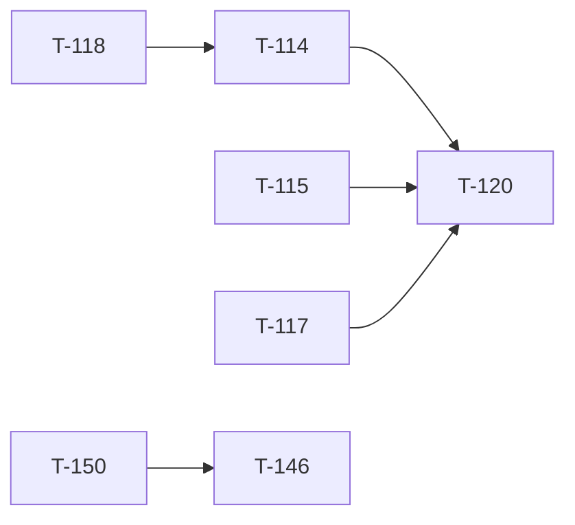

<!-- AUTO-GENERATED by ./scripts/ticket sync — DO NOT EDIT -->

# Ticket Lead Dashboard

## Running / Review

## Ready

- **T-090** (900) — Map visualization program [ready] — Map Engine v2 through sea-band + contours @ `bd481cf1`. **Active:** **T-090.5.5** tree/veg/prop glyphs. Single lane.
- **T-117** (1170) — Mission upload + validation UI [ready] — Web UI for mission upload and schema validation (API exists).
- **T-303** (2303) — Dev config guarantees the first live Discord login fails invalid_state [ready] — Found by T-207 while writing the OAuth runbook. apps/website/api/.env has FRONTEND_URL on 127.0.0.1 and DISCORD_REDIRECT_URL on localhost. The oauth_state cookie is host-only (no Domain attribute), and 127.0.0.1 and localhost are DIFFERENT cookie hosts — so the cookie set when the flow starts is never sent to the callback, and the very first live login fails with invalid_state. That error reads like CSRF tampering, not a misconfiguration, so it will be misdiagnosed. One-line fix: align the two to the same host. Worse, exchange_code and fetch_user errors are DROPPED rather than logged (T-207 corrected the earlier belief that they were logged), so the server log cannot distinguish a bad secret from a Discord outage — add tracing::error! to the callback's error paths so the runbook's diagnosis table can be simplified.

== DEFERRED 2026-07-26 BY OPERATOR DECISION, NOT CANCELLED ==
Recording a bug is most of its value; fixing it now is optional. The audits that produced this ticket were generating work faster than the run could close it, and the original T-182..T-297 feature backlog had not moved in hours. The operator's call, verbatim in substance: there will always be bugs, that is what developing is — knowing them is good, but spending the token budget on things that do not need fixing right now means nothing ships.
This is findable, fully diagnosed, and reproducible from the notes above. Promote it to `idea` when it actually blocks something, when it starts costing real time, or after the feature backlog lands. Nothing here was judged wrong — only not now.

== CONFIRMED STILL LIVE 2026-07-31, and the operator's machine is PATCHED but the REPO IS NOT ==
apps/website/api/.env.example:24  FRONTEND_URL=http://127.0.0.1:3000
apps/website/api/.env.example:71  DISCORD_REDIRECT_URL=http://localhost:8080/api/v1/auth/discord/callback
The command center hand-edited the operator's local .env (gitignored) on 2026-07-27 to unblock testing, so THE BUG NO LONGER REPRODUCES ON THIS MACHINE. It reproduces for every new checkout. Do not conclude it is fixed because a live login works here.
Second half still open: handlers/oauth.rs:113,116 use `let Ok(..) = .. else` and DROP the exchange_code / fetch_user error, so a real Discord failure is indistinguishable from a config one.
WANTED: align the two hosts in the committed example, log the dropped errors, and add a startup check that REFUSES TO BOOT when FRONTEND_URL and DISCORD_REDIRECT_URL disagree on host — a config that guarantees a broken first login should not start silently.

## Next queued (top 10)

- **T-072** (720) — Ctrl multi-place [queued] — Hold Ctrl to place multiple copies without re-selecting asset.
- **T-073** (730) — Shift + map rotation [queued] — Shift-drag and map rotation widget for placed entities.
- **T-075** (750) — Spacebar flyTo vs widget [queued] — Spacebar centers selection; resolve flyTo vs transform widget conflict.
- **T-120** (1200) — Staging soak + golden mission smoke [queued] — Pinned game/mod version soak; golden-mission smoke on staging server.
- **T-146** (1470) — Asset Browser Data Wiring [queued] — Hook up T-150 registry items (vehicles/crates/…) to Asset Browser for map drag-place. Unblocked by T-150; after or parallel T-068.9 ingest preferred.
- **T-170** (1670) — Prod default flip to Leptos SPA [queued] — Make the Leptos SPA the production default: set `SPA_DIST_DIR` to the trunk release dist in the prod env, move the Discord OAuth redirect origin, staging soak, then flip. OPERATOR-GATED (env + Discord app settings are operator-held); claude-code prepares configs/runbook + verifies the staging soak gates. Runbook anchor: docs/website/DEV_RUNBOOK.md §SPA serving; T-159 finish program left this as the sole operator-gated residual.

## Dependency graph (scoped)

```mermaid
flowchart LR
  T118[T-118] --> T114[T-114]
  T114[T-114] --> T120[T-120]
  T115[T-115] --> T120[T-120]
  T117[T-117] --> T120[T-120]
  T150[T-150] --> T146[T-146]
```
