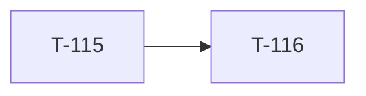

<!-- AUTO-GENERATED by ./scripts/ticket sync — DO NOT EDIT -->

# Ticket Lead Dashboard

## Running / Review

- **T-397** (3213) — Absent telemetry counters materialise as 0 on first INSERT, and leaderboard_totals aggregates the zero [running] — MAJOR, found by wave 1's adversarial verifier against merged main, MEASURED not reasoned. Deferred by operator triage 2026-07-26: it neither destroys operator-authored work nor blocks a backlog feature, and the state it leaves is strictly better than the pre-T-393 state (which was: all ingest 400s, nothing stored at all). Do not read "T-393 shipped" as "telemetry is now correct".

T-393 split PlayerStatInput into a required identity core plus an OPTIONAL counters object, so that omitting counters stops being a write. The UPDATE half of that claim HOLDS — handlers/telemetry.rs:734-749's counters-absent statement names only discord_id and role_played, no column is re-bound to its own value, no read-modify-write race. Verified by reading the SQL.

THE INSERT HALF DOES NOT. migrations/0001_initial_schema.sql:251-265 declares the counter columns NOT NULL DEFAULT 0 / DEFAULT false, so a FIRST insert with counters absent materialises zeros, and a stored 0 is indistinguishable from a genuinely scored 0. Because T-393 moved `deaths` into the counters block, the shipping mod's top-level "deaths" is now silently dropped — T-393's own test asserts rows[0].deaths == 0 for a player it reported with deaths:1.

MEASURED on a cold DB (BEGIN..ROLLBACK), one linked player, two matches:
  row A (mod path, counters absent): kills=0  deaths=0
  row B (full-fidelity report):      kills=17 deaths=3
  REFRESH MATERIALIZED VIEW leaderboard_totals -> kills=17 deaths=3 kd_ratio=5.67
True deaths is 4; the honest kd is 4.25. The zero is not inert, it is summed.

This is T-316's failure shape — silence becoming a value — relocated from the UPDATE path to the INSERT path. The mod's own class header (TBD_ResultsReporter.c:19-21) states the intended semantics verbatim: "an absent field says 'not measured' where a 0 would claim 'measured, and it was none'." The backend now does the opposite.

NOTE THE TRADE BEFORE "FIXING" IT BY MOVING deaths BACK. deaths-in-the-required-core is correct on a first insert but corrupt on a mixed re-ingest of the same row (a full report writes 17/3, a later mod-only report overwrites deaths->1 and leaves kills=17, giving kd 17). deaths-in-counters is correct on re-ingest and lossy on first insert. T-393 chose the anti-corruption side, which is defensible and consistent with T-316. The placement is NOT the real defect — even with deaths in the core, kills/team_kills/longest_kill_m/vehicles_destroyed would still materialise as 0 on a first insert.

THE ACTUAL FIX is at the schema: make the counter columns NULLable so absent = NULL = "not measured", and make leaderboard_totals NULL-aware. That is a migration plus a materialized-view change plus a backfill decision for existing rows. Sized accordingly; do not attempt it as a patch.

SECOND HALF, MOD SIDE, executor: workbench — TBD_ResultsReporter.c BuildPlayerRow should emit a complete counters object once the engine exposes kills/team_kills/longest_kill/vehicles_destroyed per player. Check whether Enfusion exposes them at all before committing; if it does not, the NULL-semantics fix above is the whole answer. Its class header at :19-21 also now describes the backend falsely (claims the fields are #[serde(default)]) and needs correcting.
- **T-407** (3223) — Fabricated stats still render beside real ones on /me/deployments — the T-392 defect, one page over [running] — Same defect family as T-392 (shipped): mock values sitting on a real user's screen next to real data, indistinguishable from it. T-392 cleared the Event Hub; this is the page it did not own.

`apps/website/frontend/src/deployments.rs:198,199,210,211` (consts at `:83-88`) render `MOCK_KD "2.45"`, `MOCK_WIN_RATE "68%"`, `FAV_WEAPON_NAME "M4A1 Block II"` and `FAV_ASSET_NAME "M1A2 Abrams"` as `TelemetryStat`/`FavLoadout` tiles — immediately beside the genuinely real `d.total_operations` at `:207`. Repro: open `/me/deployments` as any user; every operator has identical K/D, win rate and favourite weapon.

Worse than the Event Hub case was, because these are personal statistics: a user has no way to tell that their 2.45 K/D is the same 2.45 everyone else sees. Note T-393/T-397 are the reason real numbers are not available yet — production telemetry ingest was 400ing entirely until this run, so there is no data to show. Which means the honest fix is an empty state ("No telemetry recorded"), not a wiring job, until T-397's counter semantics land.

TWO SMALLER ONES ON THE SAME THEME, both found by T-392's agent:

`apps/website/frontend/src/event_hub.rs` (whole file) — the event's OWN briefing has no consumer on its own page. `EventHub.briefing` is authorable through a real textarea (`event_manager.rs:1177`, PATCHed at `:539-541`) and renders on the schedule LIST card (`events.rs:334`, honestly, via unwrap_or_default), but `/events/:id` — the hub that card links to — never reads it. Repro: create an operation, type an operation-level briefing, save, open the hub; only the per-mission briefing appears. Needs a design call about where operation-level prose belongs on the hero, which is why T-392 did not add it.

`apps/website/frontend/src/mission_overview.rs:894` — uses `.filter(|b| !b.is_empty())` where `approvals.rs:389` uses `.trim().is_empty()`. Repro: `dossier_body` with `briefing: Some("\n\n  ")` renders a "Tactical Briefing" heading over blank space in a whitespace-pre-wrap `
`. T-392 made event_hub.rs the third behaviour in this family; two of three now trim. Pick one and make it the rule.
- **T-412** (3233) — GET /api/v1/members cannot return member 21, and list_servers is N+1 over a growing table [running] — Two product-side scaling defects found by T-399's agent during the ratchet sweep. Neither is a test problem; both are live API behaviour.

1. handlers/events.rs:2161 (GET /api/v1/members) -- hard ORDER BY username ASC LIMIT 20 with NO OFFSET PARAMETER AT ALL. The member directory is STRUCTURALLY INCAPABLE of returning member 21. events.rs:275 only asserts is_array(), so nothing is red today and nothing will be: any future 'my user is in the directory' assertion is born broken. This is a product bug wearing a test-ratchet costume.
2. handlers/servers.rs:99 (list_servers) -- no LIMIT, so misc_integration.rs:333's .find(id) is safe, but it calls server_intel() IN A LOOP, one round trip per row, over a monotonically growing table. MEASURED 63 rows. Runtime creep rather than a correctness fault, flagged because it degrades on the same curve as everything else in T-410.

Note the asymmetry with T-410: those are tests that will fail. These are endpoints that will silently under-serve and never fail anything.

## Ready

- **T-090** (900) — Map visualization program [ready] — Map Engine v2 through sea-band + contours @ `bd481cf1`. **Active:** **T-090.5.5** tree/veg/prop glyphs. Single lane.

## Next queued (top 10)

- **T-072** (720) — Ctrl multi-place [queued] — Hold Ctrl to place multiple copies without re-selecting asset.
- **T-073** (730) — Shift + map rotation [queued] — Shift-drag and map rotation widget for placed entities.
- **T-075** (750) — Spacebar flyTo vs widget [queued] — Spacebar centers selection; resolve flyTo vs transform widget conflict.
- **T-116** (1160) — Results POST to backend [queued] — SPLIT 2026-07-26. Mod half SHIPPED: TBD_ResultsReporter.c (682 lines, T-181.13.1) POSTs to /api/v1/ingest/match-results. Website half OPEN and folded into T-232 — event_hub.rs renders no result/outcome/match data at all. This row now tracks only the website half.
- **T-117** (1170) — Mission upload + validation UI [queued] — Web UI for mission upload and schema validation (API exists).
- **T-118** (1180) — Event ORBAT + identity linking UI [queued] — SPLIT 2026-07-26. DONE: identity-link UI (settings.rs:6-9,74-94, T-159.25) and the ORBAT selector (event_hub.rs:520-572, T-159.25a). OPEN residual is tracked by T-226 (PATCH /events/{id} has no caller), T-284 (clear_slot unreachable, admin cannot free a claimed slot) and T-231 (identity last mile). This row is a pointer, not work.
- **T-120** (1200) — Staging soak + golden mission smoke [queued] — Pinned game/mod version soak; golden-mission smoke on staging server.
- **T-146** (1470) — Asset Browser Data Wiring [queued] — Hook up T-150 registry items (vehicles/crates/…) to Asset Browser for map drag-place. Unblocked by T-150; after or parallel T-068.9 ingest preferred.
- **T-170** (1670) — Prod default flip to Leptos SPA [queued] — Make the Leptos SPA the production default: set `SPA_DIST_DIR` to the trunk release dist in the prod env, move the Discord OAuth redirect origin, staging soak, then flip. OPERATOR-GATED (env + Discord app settings are operator-held); claude-code prepares configs/runbook + verifies the staging soak gates. Runbook anchor: docs/website/DEV_RUNBOOK.md §SPA serving; T-159 finish program left this as the sole operator-gated residual.

## Dependency graph (scoped)

```mermaid
flowchart LR
  T115[T-115] --> T116[T-116]
```
