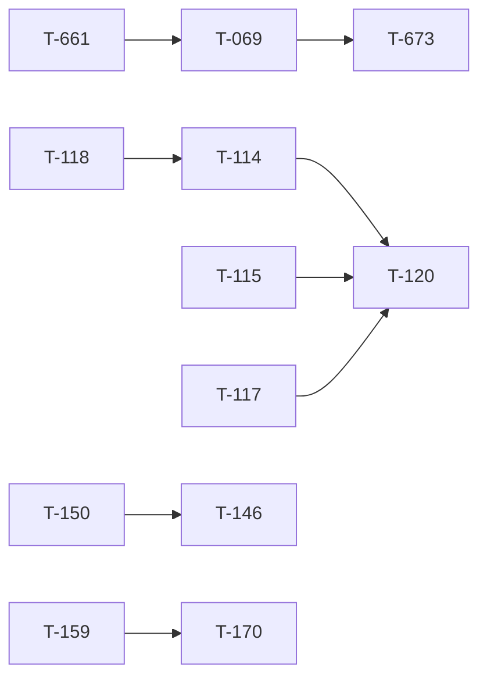

<!-- AUTO-GENERATED by cargo run -q -p xtask -- ticket sync — DO NOT EDIT -->

# Ticket Lead Dashboard

## Running / Review

## Ready

- **T-090** (900) — Map visualization program [ready] — Map Engine v2 through sea-band + contours @ `bd481cf1`. **Active:** **T-090.5.5** tree/veg/prop glyphs. Single lane.
- **T-879** (5600) — T-853 delete: mod/lib shims [ready] — T-853 shell->xtask slice. Port scripts/mod/lib/paths.sh;scripts/mod/lib/mcpd-bin.sh;scripts/mod/lib/xtask-run.sh (27 lines) to `cargo xtask (pure delete)` and delete the script, its scripts/shell-inventory.txt line, any scripts/python-inventory.txt line, and repoint every caller (Makefile, scripts/platform/wave.sh, scripts/mod/wave.sh, .github/workflows). three shims the xtask launcher does natively - delete, do not port. ACCEPTANCE IS BYTE-FOR-BYTE: capture the bash stdout+stderr+rc first, then diff the port against it on a clean tree AND on at least two deliberately broken trees. A passing run alone is NOT evidence (T-556 anti-vacuity). Build on crates/tbd-gate; do not hand-roll verdicts or process handling.
- **T-880** (5610) — T-853 delete: gate-grep [ready] — T-853 shell->xtask slice. Port scripts/mod/lib/gate-grep.sh (221 lines) to `cargo xtask (pure delete)` and delete the script, its scripts/shell-inventory.txt line, any scripts/python-inventory.txt line, and repoint every caller (Makefile, scripts/platform/wave.sh, scripts/mod/wave.sh, .github/workflows). LAST: delete only once no .sh sources it; crates/tbd-gate replaced it. ACCEPTANCE IS BYTE-FOR-BYTE: capture the bash stdout+stderr+rc first, then diff the port against it on a clean tree AND on at least two deliberately broken trees. A passing run alone is NOT evidence (T-556 anti-vacuity). Build on crates/tbd-gate; do not hand-roll verdicts or process handling.
- **T-887** (5680) — T-853 port: restore-into-scratch recoverability proof [ready] — T-853 shell->xtask slice. Port scripts/deploy/backup-drill.sh to `cargo xtask deploy db drill` and delete the script(s), their scripts/shell-inventory.txt line(s), any scripts/python-inventory.txt line(s), and repoint every caller. 286 lines. Restores the newest backup into a throwaway DB to prove recoverability. Its whole value is that it actually restores, so a port that skips the restore is vacuous. ACCEPTANCE IS BYTE-FOR-BYTE: capture bash stdout+stderr+rc first, then diff on a clean tree AND on >=2 deliberately broken trees; the harness must assert the BASH side went red before believing a diff. A green run alone is not evidence (T-556). Build on crates/tbd-gate. Spec: docs/platform/t853_shell_to_xtask_waves.md
- **T-888** (5690) — T-853 port: setsid + AF_UNIX socket lifecycle [ready] — T-853 shell->xtask slice. Port scripts/mod/mcp-daemon.sh to `cargo xtask mcp daemon` and delete the script(s), their scripts/shell-inventory.txt line(s), any scripts/python-inventory.txt line(s), and repoint every caller. 90 lines. tools/tbd-tools already ships an `mcpd` binary - prefer wiring to it over reimplementing. Sources lib/mcpd-bin.sh and lib/xtask-run.sh, so this is half of T-879's unblock. ACCEPTANCE IS BYTE-FOR-BYTE: capture bash stdout+stderr+rc first, then diff on a clean tree AND on >=2 deliberately broken trees; the harness must assert the BASH side went red before believing a diff. A green run alone is not evidence (T-556). Build on crates/tbd-gate. Spec: docs/platform/t853_shell_to_xtask_waves.md
- **T-889** (5700) — T-853 port: unattended-run preflight assertions [ready] — T-853 shell->xtask slice. Port scripts/platform/preflight.sh to `cargo xtask platform preflight` and delete the script(s), their scripts/shell-inventory.txt line(s), any scripts/python-inventory.txt line(s), and repoint every caller. 197 lines, 1 python3 site. Mostly assertions before a factory run. `hostrun cargo` calls in it are now obsolete - build-essential is in the container. ACCEPTANCE IS BYTE-FOR-BYTE: capture bash stdout+stderr+rc first, then diff on a clean tree AND on >=2 deliberately broken trees; the harness must assert the BASH side went red before believing a diff. A green run alone is not evidence (T-556). Build on crates/tbd-gate. Spec: docs/platform/t853_shell_to_xtask_waves.md
- **T-890** (5710) — T-853 port: the MOD wave driver (NOT platform/wave.sh) [ready] — T-853 shell->xtask slice. Port scripts/mod/wave.sh to `cargo xtask mod wave` and delete the script(s), their scripts/shell-inventory.txt line(s), any scripts/python-inventory.txt line(s), and repoint every caller. 232 lines, 1 python3 site. Reads docs/mod/wave_plan.tsv, manages .ai/artifacts/worktrees. Lower risk than platform/wave.sh because the T-181 mod program is complete. DO NOT touch scripts/platform/wave.sh beyond repointing call sites. ACCEPTANCE IS BYTE-FOR-BYTE: capture bash stdout+stderr+rc first, then diff on a clean tree AND on >=2 deliberately broken trees; the harness must assert the BASH side went red before believing a diff. A green run alone is not evidence (T-556). Build on crates/tbd-gate. Spec: docs/platform/t853_shell_to_xtask_waves.md
- **T-891** (5720) — T-853 port: Enfusion compile gate [ready] — T-853 shell->xtask slice. Port scripts/mod/compile.sh to `cargo xtask mod compile` and delete the script(s), their scripts/shell-inventory.txt line(s), any scripts/python-inventory.txt line(s), and repoint every caller. 375 lines. Wraps ArmaReforgerServer. EXIT CONTRACT IS 0/1/2 and mod-gates.yml + ci.yml branch on it with `|| rc=$?; case $rc` - preserve exactly. `--selftest` passes ONLY on exit 1; a selftest that exits 0 means the gate is hollow. ACCEPTANCE IS BYTE-FOR-BYTE: capture bash stdout+stderr+rc first, then diff on a clean tree AND on >=2 deliberately broken trees; the harness must assert the BASH side went red before believing a diff. A green run alone is not evidence (T-556). Build on crates/tbd-gate. Spec: docs/platform/t853_shell_to_xtask_waves.md
- **T-892** (5730) — T-853 port: headless game-mode boot validation [ready] — T-853 shell->xtask slice. Port scripts/mod/world-boot.sh to `cargo xtask mod world-boot` and delete the script(s), their scripts/shell-inventory.txt line(s), any scripts/python-inventory.txt line(s), and repoint every caller. 846 lines, 4 python3 sites. Boots a real game mode headlessly and parses the log for component instantiation. Same 0/1/2 exit contract as compile.sh. Needs the engine present; verify on the machine that has it. ACCEPTANCE IS BYTE-FOR-BYTE: capture bash stdout+stderr+rc first, then diff on a clean tree AND on >=2 deliberately broken trees; the harness must assert the BASH side went red before believing a diff. A green run alone is not evidence (T-556). Build on crates/tbd-gate. Spec: docs/platform/t853_shell_to_xtask_waves.md

## Next queued (top 10)

- **T-120** (1200) — Staging soak + golden mission smoke [queued] — Pinned game/mod version soak; golden-mission smoke on staging server.
- **T-146** (1470) — Asset Browser Data Wiring [queued] — Hook up T-150 registry items (vehicles/crates/…) to Asset Browser for map drag-place. Unblocked by T-150; after or parallel T-068.9 ingest preferred.
- **T-170** (1670) — Prod default flip to Leptos SPA [queued] — Make the Leptos SPA the production default: set `SPA_DIST_DIR` to the trunk release dist in the prod env, move the Discord OAuth redirect origin, staging soak, then flip. OPERATOR-GATED (env + Discord app settings are operator-held); claude-code prepares configs/runbook + verifies the staging soak gates. Runbook anchor: docs/website/DEV_RUNBOOK.md §SPA serving; T-159 finish program left this as the sole operator-gated residual.
- **T-673** (4300) — Marker style and Area markers — the $defs/marker widening [queued] — Six attribute ids: `ATTR-FIELD-MRK-SIZE`, `-MRK-ROTATION`, `-MRK-SHAPE`, `-MRK-BRUSH`, `-MRK-COLOR`, `-MRK-ALPHA`. BLOCKING EVIDENCE: `$defs/marker` in the compiled schema is exactly {x, z, icon, label} and CLOSED — the compiled schema carries 25 `"additionalProperties": false`, so these fields are contract-blocked, not merely unbuilt. Icon-vs-Area is Eden's entire second marker model, so this is a widening plus a mod-side reader, not a UI ticket. MUST SHIP AFTER T-069, which authors the four schema-carried fields; folding these into T-069 would convert a factory-dispatchable ticket into a workbench one, which is the specific mistake this split exists to prevent. EXECUTOR IS `workbench` DELIBERATELY: this modifies `packages/tbd-schema/schema/mission.schema.json` and/or `apps/mod/tbd-framework/`, which the CLAUDE.md executor gate puts out of reach of any coding agent. The factory filters on executor, so this tagging is the safety mechanism — do not flip it to claude-code.

EXECUTOR CORRECTED 2026-08-02: was filed `workbench` on the mistaken reading that any .c file needs the Arma Workbench GUI. It does not — scripts/mod/compile.sh compiles tbd-framework against the native Linux dedicated server headlessly, verified: "OK: compiled clean, 5707 files, 11182 classes, 832 ms, no Workbench". Schema edits are plain JSON. This is factory work. Per the model-routing rule, the .c portion routes to Fable 5 even though the executor is claude-code.

SCHEMA HALF SPLIT OUT to T-706 (one widening pass for the whole program). This ticket is the Enfusion reader plus any editor UI; it does not touch packages/tbd-schema.
- **T-674** (4310) — T-216 follow-on: slot identity reaches the wire [queued] — Four attribute ids — `ATTR-FIELD-OBJ-CALLSIGN`, `-OBJ-RANK`, `-OBJ-STANCE`, `-OBJ-UNIT-NAME` — plus the two TBD-only keys `tag` and `leaderSlotId`. `OBJ-UNIT-NAME` rides this slice rather than standing alone; the sweep says so explicitly. THE CONTRACT DELTA IS ALREADY WRITTEN OUT at `crates/map-engine-core/src/mission/flatten.rs`:2620-2632 — five `$defs/slot` / `$defs/group` keys. T-216 is `shipped`, but it shipped THE LEDGER AND ITS TRIPWIRE, not the fix: flatten.rs:2584-2649 enumerates six author-facing values the compile silently drops (a squad's leaderSlotId, a slot's tag / callsign / rank / stance, and the entire vehicle roster) and records that `make verify-t180` stayed green throughout BECAUSE NOT ONE OF ITS 22 TESTS CHECKED. `stance` additionally needs an Enfusion spawn-pose call — word-boundary `stance` in apps/mod is ZERO (the 39-file `grep -rl stance` result is every hit being the substring inside `instance`). Widening `/compiled` without care 500s every mission. Related: T-242. EXECUTOR IS `workbench` DELIBERATELY: this modifies `packages/tbd-schema/schema/mission.schema.json` and/or `apps/mod/tbd-framework/`, which the CLAUDE.md executor gate puts out of reach of any coding agent. The factory filters on executor, so this tagging is the safety mechanism — do not flip it to claude-code.

EXECUTOR CORRECTED 2026-08-02: was filed `workbench` on the mistaken reading that any .c file needs the Arma Workbench GUI. It does not — scripts/mod/compile.sh compiles tbd-framework against the native Linux dedicated server headlessly, verified: "OK: compiled clean, 5707 files, 11182 classes, 832 ms, no Workbench". Schema edits are plain JSON. This is factory work. Per the model-routing rule, the .c portion routes to Fable 5 even though the executor is claude-code.

SCHEMA HALF SPLIT OUT to T-706 (one widening pass for the whole program). This ticket is the Enfusion reader plus any editor UI; it does not touch packages/tbd-schema.
- **T-675** (4320) — Vehicle roster reaches the game — the compile half of T-076 [queued] — The cross-boundary half that was split out of T-076 so the crew UI could be dispatched. No attribute ids of its own; it closes the sixth entry in the T-216 drop ledger. BLOCKING EVIDENCE: `crates/map-engine-core/src/mission/flatten.rs`:2631 states the delta as "document root + a new $def", key `vehicles`, and :2634-2640 PROVES the already-declared `entities[]` cannot carry it — `$defs/alias` is `^(kit|comp|veh|preset|layer|prop|item):[a-z0-9_]+$` and `apps/mod/tbd-framework/Data/registry.json` holds exactly ONE `veh:` row, so alias substitution would reproduce the T-200 silent-substitution defect with a 10-tonne vehicle. Without this, T-076's crew UI authors state the game never sees. EXECUTOR IS `workbench` DELIBERATELY: this modifies `packages/tbd-schema/schema/mission.schema.json` and/or `apps/mod/tbd-framework/`, which the CLAUDE.md executor gate puts out of reach of any coding agent. The factory filters on executor, so this tagging is the safety mechanism — do not flip it to claude-code.

EXECUTOR CORRECTED 2026-08-02: was filed `workbench` on the mistaken reading that any .c file needs the Arma Workbench GUI. It does not — scripts/mod/compile.sh compiles tbd-framework against the native Linux dedicated server headlessly, verified: "OK: compiled clean, 5707 files, 11182 classes, 832 ms, no Workbench". Schema edits are plain JSON. This is factory work. Per the model-routing rule, the .c portion routes to Fable 5 even though the executor is claude-code.

SCHEMA HALF SPLIT OUT to T-706 (one widening pass for the whole program). This ticket is the Enfusion reader plus any editor UI; it does not touch packages/tbd-schema.
- **T-676** (4330) — Trigger activation and effects — the Enfusion runtime [queued] — Twelve of the thirteen `ATTR-FIELD-TRG-*` ids: everything except the geometry/palette half, which is the factory ticket T-079. An activation model (condition, repeat, timeout, owner side) and an effects model are a NEW ENFUSION RUNTIME in `apps/mod/tbd-framework/` plus the schema keys to carry them. Geometry can ride the shipped T-582 zone draw tool, which is why the editor half was separable at all. Read `$defs/zoneRules`' 16 keys before designing this: they have no ATTR-FIELD id and were never triaged against Eden, but they are the closest thing TBD already has to trigger semantics. EXECUTOR IS `workbench` DELIBERATELY: this modifies `packages/tbd-schema/schema/mission.schema.json` and/or `apps/mod/tbd-framework/`, which the CLAUDE.md executor gate puts out of reach of any coding agent. The factory filters on executor, so this tagging is the safety mechanism — do not flip it to claude-code.

EXECUTOR CORRECTED 2026-08-02: was filed `workbench` on the mistaken reading that any .c file needs the Arma Workbench GUI. It does not — scripts/mod/compile.sh compiles tbd-framework against the native Linux dedicated server headlessly, verified: "OK: compiled clean, 5707 files, 11182 classes, 832 ms, no Workbench". Schema edits are plain JSON. This is factory work. Per the model-routing rule, the .c portion routes to Fable 5 even though the executor is claude-code.

SCHEMA HALF SPLIT OUT to T-706 (one widening pass for the whole program). This ticket is the Enfusion reader plus any editor UI; it does not touch packages/tbd-schema.
- **T-677** (4340) — Waypoints — group movement orders [queued] — OPERATOR DECISION 2026-08-02: AI units ARE coming, so this is no longer speculative. Was titled "blocked on AI units existing at all" because every slot currently spawns AI-disabled (TBD_SpawnManager.c:963,1166), which left 13 attribute ids with no subject.

Nine `ATTR-FIELD-WP-*` ids plus six interaction ids (`RIGHT-MODE-004`, `CONN-WP-ACT-001`, `CONN-WP-ATTACH-001`, `CONN-RAND-START-001`, `KEY-WP-001`, `ACTION-WP-QUICK-001`). THE GATE IS NOT THE SCHEMA — it is that there is no subject. `apps/mod/tbd-framework/.../TBD_SpawnManager.c`:963 and :1166 spawn every body with AI DISABLED, so a waypoint has nothing to command. The attributes sweep calls this "the single biggest scoping correction available to T-079": waypoints cannot be built, in the editor or anywhere else, until AI units exist. Ship together with the group AI state ticket or not at all — they share the gate exactly. EXECUTOR IS `workbench` DELIBERATELY: this modifies `packages/tbd-schema/schema/mission.schema.json` and/or `apps/mod/tbd-framework/`, which the CLAUDE.md executor gate puts out of reach of any coding agent. The factory filters on executor, so this tagging is the safety mechanism — do not flip it to claude-code.

EXECUTOR CORRECTED 2026-08-02: was filed `workbench` on the mistaken reading that any .c file needs the Arma Workbench GUI. It does not — scripts/mod/compile.sh compiles tbd-framework against the native Linux dedicated server headlessly, verified: "OK: compiled clean, 5707 files, 11182 classes, 832 ms, no Workbench". Schema edits are plain JSON. This is factory work. Per the model-routing rule, the .c portion routes to Fable 5 even though the executor is claude-code.

SCHEMA HALF SPLIT OUT to T-706 (one widening pass for the whole program). This ticket is the Enfusion reader plus any editor UI; it does not touch packages/tbd-schema.
- **T-678** (4350) — Group AI state: combat mode, behaviour, formation, speed [queued] — OPERATOR DECISION 2026-08-02: AI units ARE coming — this ticket has a subject now. Previously gated behind the same question as T-677.

Four attribute ids: `ATTR-FIELD-GRP-COMBAT-MODE`, `-GRP-BEHAVIOUR`, `-GRP-FORMATION`, `-GRP-SPEED-MODE`. Same AI gate as waypoints, and the sweep says they should ship together or not at all. Evidence that nothing exists to hang these on: word-boundary `combatMode` and `speedMode` return ZERO in both the frontend and the mod tree; `formation` returns one frontend hit and it is prose in a comment at editor_ops.rs:1324. `$defs/group` is closed, so each field is a widening plus an Enfusion reader. EXECUTOR IS `workbench` DELIBERATELY: this modifies `packages/tbd-schema/schema/mission.schema.json` and/or `apps/mod/tbd-framework/`, which the CLAUDE.md executor gate puts out of reach of any coding agent. The factory filters on executor, so this tagging is the safety mechanism — do not flip it to claude-code.

EXECUTOR CORRECTED 2026-08-02: was filed `workbench` on the mistaken reading that any .c file needs the Arma Workbench GUI. It does not — scripts/mod/compile.sh compiles tbd-framework against the native Linux dedicated server headlessly, verified: "OK: compiled clean, 5707 files, 11182 classes, 832 ms, no Workbench". Schema edits are plain JSON. This is factory work. Per the model-routing rule, the .c portion routes to Fable 5 even though the executor is claude-code.

SCHEMA HALF SPLIT OUT to T-706 (one widening pass for the whole program). This ticket is the Enfusion reader plus any editor UI; it does not touch packages/tbd-schema.
- **T-679** (4360) — Placement scatter: radius and area shape [queued] — Three attribute ids: `ATTR-FIELD-OBJ-PLACEMENT-RADIUS`, `-OBJ-SHAPE`, `-GRP-PLACEMENT-RADIUS`. `$defs/slot` and `$defs/group` are both closed, so this is one key on each plus a spawn-side reader that scatters within the radius. THE CHEAPEST COHERENT SCHEMA-WIDENING SLICE in the workbench program, and a 2D top-down editor is the best possible surface for it — the scatter circle is drawable — so it is the one most worth doing early if the operator wants an easy first workbench win. EXECUTOR IS `workbench` DELIBERATELY: this modifies `packages/tbd-schema/schema/mission.schema.json` and/or `apps/mod/tbd-framework/`, which the CLAUDE.md executor gate puts out of reach of any coding agent. The factory filters on executor, so this tagging is the safety mechanism — do not flip it to claude-code.

EXECUTOR CORRECTED 2026-08-02: was filed `workbench` on the mistaken reading that any .c file needs the Arma Workbench GUI. It does not — scripts/mod/compile.sh compiles tbd-framework against the native Linux dedicated server headlessly, verified: "OK: compiled clean, 5707 files, 11182 classes, 832 ms, no Workbench". Schema edits are plain JSON. This is factory work. Per the model-routing rule, the .c portion routes to Fable 5 even though the executor is claude-code.

SCHEMA HALF SPLIT OUT to T-706 (one widening pass for the whole program). This ticket is the Enfusion reader plus any editor UI; it does not touch packages/tbd-schema.

## Dependency graph (scoped)

```mermaid
flowchart LR
  T661[T-661] --> T069[T-069]
  T118[T-118] --> T114[T-114]
  T114[T-114] --> T120[T-120]
  T115[T-115] --> T120[T-120]
  T117[T-117] --> T120[T-120]
  T150[T-150] --> T146[T-146]
  T159[T-159] --> T170[T-170]
  T069[T-069] --> T673[T-673]
```
