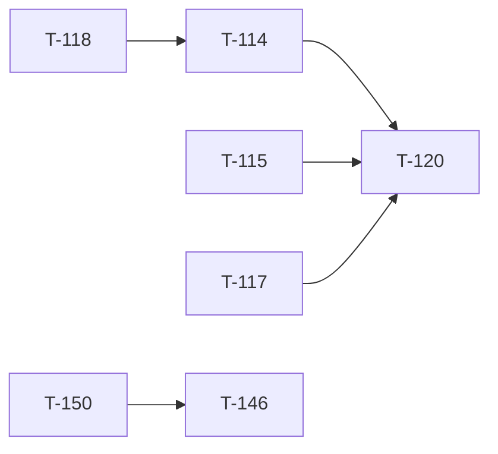

<!-- AUTO-GENERATED by ./scripts/ticket sync — DO NOT EDIT -->

# Ticket Lead Dashboard

## Running / Review

## Ready

- **T-090** (900) — Map visualization program [ready] — Map Engine v2 through sea-band + contours @ `bd481cf1`. **Active:** **T-090.5.5** tree/veg/prop glyphs. Single lane.
- **T-593** (3460) — Wire api_post_raw — it ships with no caller and is dead code until this lands [ready] — T-591 shipped `api_post_raw` in `apps/website/frontend/src/client.rs` and FLAGGED IT HONESTLY: it has
no caller, carries `#[allow(dead_code)]`, and the agent cited `map-engine-wasm` by name — the entire
crate whose consumer was deleted and which cost a ticket to discover. **If this follow-up is not
scheduled, revert T-591 rather than leave dead code.** It is scheduled; do it.

=== THE MEASUREMENT THAT JUSTIFIES IT ===
T-591 measured the real amplification with a counting allocator over a 33.55 MiB / 170k-slot payload:
  one parsed Value tree = 235.87 MiB for 33.55 MiB source = 7.03x   (x86_64, MEASURED)
  derived wasm32 tree                                     = 4.70x
ROOT CAUSE: `serde_json::Map` is a BTreeMap and each `LeafNode<String,Value>` holds ELEVEN slots
regardless of key count -- 408 B/object on wasm32. 340,658 objects account for 205 of 236 MiB.
**The cost is per-JSON-OBJECT, not per-byte.**
The ticket's "four times over" was the right verdict with the wrong inventory: the JS string and the
Rust String both drop at parse. What is live at the fetch call is THREE full Value trees --
`up_doc`'s stored value, `version_body`'s `json!` clone, and `request()`'s per-attempt clone.
  today (api_post(Value))            16.10x
  raw + to_string(version_body(..))  11.40x
  raw + streaming caller              6.70x

=== TWO CALL-SITE SHAPES, BOTH COMPILE-VERIFIED BY T-591 ===
MINIMAL (2 lines, wasm32 clean, zero test churn) -- replaces missions.rs:1915 + :1919:
    let body = serde_json::to_string(
        &map_engine_core::mission::compile::version_body(&semver, &notes, &doc),
    ).unwrap_or_default();
    match crate::client::api_post_raw(store, &path, body).await { Ok(()) => {
18.2x -> 12.8x. The `version_body(&semver, &notes, &doc)` literal survives inside `to_string(...)`, so
the anti-drift pin at missions.rs:3390 still holds.

STREAMING (reaches 7.4x) BREAKS `the_upload_panel_is_wired_to_the_versions_route` -- and **that
failure is CORRECT**: hand-streaming the wrapper genuinely abandons the shared builder, which is what
the pin exists to prevent.
**RECOMMENDED SHAPE:** add `version_body_to_writer(w, semver, notes, payload)` to
`crates/map-engine-core/src/mission/compile.rs` beside `version_body`, have BOTH doors onto
`create_version` use it, and re-point the pin at the new name. That gets 7.4x AND keeps the
anti-drift property. Two files: `compile.rs` + `missions.rs`.

=== THE HONEST CEILING — DO NOT OVERCLAIM IT ===
256 MB is NOT reachable: 256 x 6.70 = 1.72 GiB of wasm32 linear heap on top of the wgpu editor.
Anchoring on T-117's shipped 32 MiB (implying ~540 MiB survivable) and taking the WORSE
loadout-bearing ratio: ~40 MiB minimal, ~72 MiB streaming. Recommend `UPLOAD_MAX_BYTES = 64 << 20`
with the streaming call site. The streaming/multipart route (T-591 item 3) remains the only fix for
genuinely large missions.

ALSO FOUND: the 201 response echoes the whole `json_payload` back (`models/mission.rs:128`), so
`api_post::<serde_json::Value>` parses a FOURTH tree out of the response that `missions.rs:1920`'s
`Ok(_)` discards. `api_post_raw` returns `Ok(())` deliberately to avoid exactly that.
- **T-594** (3461) — Activate T-244's vehicle lane: two blockers plus T-583's gate step, all in one slice [ready] — **THESE MUST LAND TOGETHER.** T-583 shipped `make map-reclassify` and specified the gate step, but the
step was DELIBERATELY NOT WIRED because the tree is in drift TODAY -- wiring it alone would turn every
slice gate red. Verified by the command center: `make map-reclassify TERRAIN=everon` exits 1 with
`DRIFT — 16 prefab(s) classify differently than the committed catalogue`.

T-244 added a `vehicle` kind and classify rules weeks ago. The change has been LATENT ever since --
the rules changed, the committed artifact did not, and T-278 later measured that regenerating would
have PANICKED (`.expect("kind bucket")` against an 8-element array with no `vehicle`).

=== THE TWO BLOCKERS, both confirmed still blocking by wave 73's verifier ===
1. `packages/tbd-schema/schema/map-object-type-inventory.schema.json:54` -- `byKind` is
   `additionalProperties: false` with 8 required keys and no `vehicle`. A regenerated inventory
   carrying `byKind.vehicle` is REJECTED.
2. `xtask/src/schema_gates.rs:428` -- `INSTANCE_KINDS: [&str; 8]`, no `vehicle`, feeding the I1 sum
   gate, which then comes up short by exactly 176 (= `byKind.vehicle.instances`).
   **AND IT HAS NO LOCKSTEP TEST.** Its twin at `tools/tbd-tools/src/world/mod.rs:34` is `[&str; 9]`
   WITH `vehicle` and IS pinned by `instance_kinds_match_enums_schema`. Same name, same purpose, and
   the UNGUARDED copy is the one feeding the gate. Pin it in the same commit or it drifts again.

=== THE ORDER ===
(a) fix both blockers; (b) `make map-reclassify TERRAIN=everon WRITE=1` to regenerate the catalogue --
16 rows change, 13 -> vehicle/{armor,car,truck,boat} and 3 -> prop/debris, 1607 of 1623 byte-identical;
(c) confirm `make map-reclassify TERRAIN=everon` now exits 0; (d) ONLY THEN wire the gate step.

=== T-583's EXACT GATE STEP, and three load-bearing details ===
    run "T-278 catalogue drift" checkrun make map-reclassify TERRAIN=everon
Placement: immediately after `run "schema" gate_schema`, in BOTH `gate_slice()` (~wave.sh:1917) and
`cmd_gate()` (~wave.sh:2086) -- per T-556, a step in only one half drifts green.
 - **`checkrun`, NOT `hostrun`.** `hostrun` bakes in the SHARED CARGO_TARGET_DIR, and
   `tools/tbd-tools/src/serve.rs:326` `repo_root()` is `env!("CARGO_MANIFEST_DIR")` -- a COMPILE-TIME
   constant. A shared target dir can therefore serve a `world` binary that reads a DIFFERENT
   WORKTREE'S rules and catalogue while reporting on yours. `checkrun` pins `$GATE_CHECK_TARGET`.
 - **Not into `schema-validate`**: `gate_schema`'s tripwire parses `xtask schema <name>` lines and
   `map-reclassify` is a `tbd-tools --bin world` call -- it would trip or silently miss it.
 - Cost ~12 s.
Run on the day T-244 landed, this step would have gone RED immediately.

## Next queued (top 10)

- **T-072** (720) — Ctrl multi-place [queued] — Hold Ctrl to place multiple copies without re-selecting asset.
- **T-073** (730) — Shift + map rotation [queued] — Shift-drag and map rotation widget for placed entities.
- **T-075** (750) — Spacebar flyTo vs widget [queued] — Spacebar centers selection; resolve flyTo vs transform widget conflict.
- **T-120** (1200) — Staging soak + golden mission smoke [queued] — Pinned game/mod version soak; golden-mission smoke on staging server.
- **T-146** (1470) — Asset Browser Data Wiring [queued] — Hook up T-150 registry items (vehicles/crates/…) to Asset Browser for map drag-place. Unblocked by T-150; after or parallel T-068.9 ingest preferred.
- **T-170** (1670) — Prod default flip to Leptos SPA [queued] — Make the Leptos SPA the production default: set `SPA_DIST_DIR` to the trunk release dist in the prod env, move the Discord OAuth redirect origin, staging soak, then flip. OPERATOR-GATED (env + Discord app settings are operator-held); claude-code prepares configs/runbook + verifies the staging soak gates. Runbook anchor: docs/website/DEV_RUNBOOK.md §SPA serving; T-159 finish program left this as the sole operator-gated residual.

## Dependency graph (scoped)

```mermaid
flowchart LR
  T118[T-118] --> T114[T-114]
  T114[T-114] --> T120[T-120]
  T115[T-115] --> T120[T-120]
  T117[T-117] --> T120[T-120]
  T150[T-150] --> T146[T-146]
```
