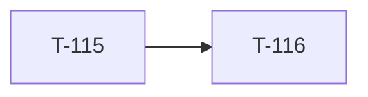

<!-- AUTO-GENERATED by ./scripts/ticket sync — DO NOT EDIT -->

# Ticket Lead Dashboard

## Running / Review

- **T-553** (3393) — TBD_ZoneRegistry still claims zoneRules additionalProperties: true (T-419 residual) [running] — FOUND by W62 adversarial verifier (DIRTY MINOR) after T-419.

T-419 closed open-schema lore in TBD_ObjectiveRules.c + TBD_MissionLoader.c, but TBD_ZoneRegistry.c:39 still says:
  //! `rules.penalty` vocabulary. Additive under the schema's `additionalProperties: true`.

Live pin: packages/tbd-schema/schema/mission.schema.json $defs.zoneRules.additionalProperties = false.

Repro:
  rg -n 'additionalProperties: true' apps/mod/tbd-framework/Scripts/Game/TBD/Zones/TBD_ZoneRegistry.c
  # expect hit at line 39; schema says false.
- **T-554** (3394) — T-418 FE hydrate→briefing wire has no Class-R pin (core only) [running] — FOUND by W62 adversarial verifier (DIRTY MINOR) after T-418.

mission_hydrate.rs threads MissionDetail.briefing into apply_row_meta via opt(&row.briefing). Core Class-R t418_apply_row_meta_threads_briefing_into_meta covers apply_row_meta/compile_export, not the FE call site.

Mutation probe: replace both opt(&row.briefing) with None → cargo test -p website-frontend briefing|hydrate still PASS.

Repro:
  # Temporarily return None for briefing in mission_hydrate RowMeta construction;
  # website-frontend tests that mention briefing/hydrate still green;
  # only map-engine-core Class-R fails if apply_row_meta itself is gutted.
- **T-557** (3410) — dev-login 500s on concurrent first use: ON CONFLICT (discord_id) cannot arbitrate idx_users_arma_id [running] — A REAL APPLICATION DEFECT, found by T-534 while chasing a flaky gate. T-534 removed it from the TEST
path with a serialised prime; the handler is unchanged and a real client still hits it.

`apps/website/api/src/handlers/dev.rs:41` INSERTs a user with a FIXED `arma_id`
(`dev-arma-76561190000000001`) and `ON CONFLICT (discord_id) DO UPDATE`. But `arma_id` carries its own
unique index -- `idx_users_arma_id`, `apps/website/api/migrations/0001_initial_schema.sql:887`.
ON CONFLICT arbitrates exactly ONE index. Two concurrent FIRST-TIME dev-logins against a cold database
both take the INSERT path; the loser violates idx_users_arma_id, which the conflict clause does not
cover, so Postgres raises 23505 instead of falling through to DO UPDATE. The handler maps it to 500.

MEASURED from the Postgres log, not inferred:
    ERROR:  duplicate key value violates unique constraint "idx_users_arma_id"
    DETAIL: Key (arma_id)=(dev-arma-76561190000000001) already exists.
    STATEMENT: INSERT INTO users (..., arma_id, ...) ... ON CONFLICT (discord_id) DO UPDATE SET ...
Symptom seen by the caller: `dev-login did not mint a session ... status: 500`.

SCOPE NOTE: dev-login is development-only (`APP_ENV=development`), so this is not a production
outage -- but it is the front door every agent, gate and operator uses to get a session, and it fails
exactly when the database is cold, which is exactly when the gate runs.

FIX DIRECTIONS: arbitrate both indexes (or drop the fixed `arma_id` from the INSERT and let it be set
only on first create), or make the dev user's `arma_id` a function of `discord_id` so the two indexes
can never disagree. T-534 pinned the current literals with a Class-R test
(`t534_dev_login_prime_literals_still_match_handler`) that greps dev.rs for both the literals AND the
`ON CONFLICT (discord_id) DO UPDATE` shape -- IT WILL GO RED when you change this, deliberately.
Update it in the same commit rather than deleting it.

## Ready

- **T-090** (900) — Map visualization program [ready] — Map Engine v2 through sea-band + contours @ `bd481cf1`. **Active:** **T-090.5.5** tree/veg/prop glyphs. Single lane.

## Next queued (top 10)

- **T-072** (720) — Ctrl multi-place [queued] — Hold Ctrl to place multiple copies without re-selecting asset.
- **T-073** (730) — Shift + map rotation [queued] — Shift-drag and map rotation widget for placed entities.
- **T-075** (750) — Spacebar flyTo vs widget [queued] — Spacebar centers selection; resolve flyTo vs transform widget conflict.
- **T-116** (1160) — Results POST to backend [queued] — SPLIT 2026-07-26. Mod half SHIPPED: TBD_ResultsReporter.c (682 lines, T-181.13.1) POSTs to /api/v1/ingest/match-results. Website half OPEN and folded into T-232 — event_hub.rs renders no result/outcome/match data at all. This row now tracks only the website half.
- **T-117** (1170) — Mission upload + validation UI [queued] — Web UI for mission upload and schema validation (API exists).
- **T-118** (1180) — Event ORBAT + identity linking UI [queued] — SPLIT 2026-07-26. DONE: identity-link UI (settings.rs:6-9,74-94, T-159.25) and the ORBAT selector (event_hub.rs:520-572, T-159.25a). OPEN residual is tracked by T-226 (PATCH /events/{id} has no caller), T-284 (clear_slot unreachable, admin cannot free a claimed slot) and T-231 (identity last mile). This row is a pointer, not work.
- **T-120** (1200) — Staging soak + golden mission smoke [queued] — Pinned game/mod version soak; golden-mission smoke on staging server.
- **T-146** (1470) — Asset Browser Data Wiring [queued] — Hook up T-150 registry items (vehicles/crates/…) to Asset Browser for map drag-place. Unblocked by T-150; after or parallel T-068.9 ingest preferred.
- **T-170** (1670) — Prod default flip to Leptos SPA [queued] — Make the Leptos SPA the production default: set `SPA_DIST_DIR` to the trunk release dist in the prod env, move the Discord OAuth redirect origin, staging soak, then flip. OPERATOR-GATED (env + Discord app settings are operator-held); claude-code prepares configs/runbook + verifies the staging soak gates. Runbook anchor: docs/website/DEV_RUNBOOK.md §SPA serving; T-159 finish program left this as the sole operator-gated residual.

## Dependency graph (scoped)

```mermaid
flowchart LR
  T115[T-115] --> T116[T-116]
```
