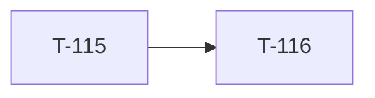

<!-- AUTO-GENERATED by ./scripts/ticket sync — DO NOT EDIT -->

# Ticket Lead Dashboard

## Running / Review

## Ready

- **T-090** (900) — Map visualization program [ready] — Map Engine v2 through sea-band + contours @ `bd481cf1`. **Active:** **T-090.5.5** tree/veg/prop glyphs. Single lane.
- **T-251** (2690) — Production deployment story [ready] — No Dockerfile, no docker-compose.staging.yml (referenced by deploy.env.example and HOME_SERVER.md but absent), no deploy-website.sh, no deploy job in any of the four CI workflows, no TLS or reverse-proxy config in-repo, no pg_dump backup script, and no metrics, Sentry or OTel dependency.
- **T-253** (2710) — Reclaim 65GB and stop double-compiling [ready] — target/ is 52GB, target-ci/ another 12GB, and .git/lfs holds 1.6GB of objects from tile pyramids untracked back on 2026-07-03. Disk is at 87%. Also no CARGO_TARGET_DIR is set, so the moment Rust work is sliced across worktrees each one starts a cold build.
- **T-254** (2720) — Entity and object placement — the whole entities[] block [ready] — The Objects chip is a stub (eden_chrome.rs:1466-1470), place_at no-ops in objects mode (editor_ops.rs:1598-1602), the palette filters to kind==character (asset_catalog.rs:63), and the doc has no entities map. The mod has no reader either. Also blocks objective_destroy, which resolves rules.targetAlias against entities[].
- **T-436** (3275) — Harden deploy-website.sh: require /home/sam/tbd/ prefix + case-insensitive prairielearn refuse [ready] — In-wave hotfix from wave 9 adversarial verify (M2/M3). deploy-website.sh refused only substring prairielearn (case-sensitive) and did not enforce the documented /home/sam/tbd/ prefix, so a filled deploy.env could dry-run/rsync --delete to arbitrary paths (e.g. /tmp/not-tbd-at-all). PrairieLearn mixed-case paths also slipped through.

Repro before fix: DEPLOY_ENV with TBD_REMOTE_DIR=/tmp/not-tbd-at-all → --dry-run rc=0.

Cure: fail-closed prefix check under /home/sam/tbd/ + case-insensitive prairielearn refuse.

## Next queued (top 10)

- **T-072** (720) — Ctrl multi-place [queued] — Hold Ctrl to place multiple copies without re-selecting asset.
- **T-073** (730) — Shift + map rotation [queued] — Shift-drag and map rotation widget for placed entities.
- **T-075** (750) — Spacebar flyTo vs widget [queued] — Spacebar centers selection; resolve flyTo vs transform widget conflict.
- **T-116** (1160) — Results POST to backend [queued] — SPLIT 2026-07-26. Mod half SHIPPED: TBD_ResultsReporter.c (682 lines, T-181.13.1) POSTs to /api/v1/ingest/match-results. Website half OPEN and folded into T-232 — event_hub.rs renders no result/outcome/match data at all. This row now tracks only the website half.
- **T-117** (1170) — Mission upload + validation UI [queued] — Web UI for mission upload and schema validation (API exists).
- **T-118** (1180) — Event ORBAT + identity linking UI [queued] — SPLIT 2026-07-26. DONE: identity-link UI (settings.rs:6-9,74-94, T-159.25) and the ORBAT selector (event_hub.rs:520-572, T-159.25a). OPEN residual is tracked by T-226 (PATCH /events/{id} has no caller), T-284 (clear_slot unreachable, admin cannot free a claimed slot) and T-231 (identity last mile). This row is a pointer, not work.
- **T-120** (1200) — Staging soak + golden mission smoke [queued] — Pinned game/mod version soak; golden-mission smoke on staging server.
- **T-146** (1470) — Asset Browser Data Wiring [queued] — Hook up T-150 registry items (vehicles/crates/…) to Asset Browser for map drag-place. Unblocked by T-150; after or parallel T-068.9 ingest preferred.
- **T-170** (1670) — Prod default flip to Leptos SPA [queued] — Make the Leptos SPA the production default: set `SPA_DIST_DIR` to the trunk release dist in the prod env, move the Discord OAuth redirect origin, staging soak, then flip. OPERATOR-GATED (env + Discord app settings are operator-held); claude-code prepares configs/runbook + verifies the staging soak gates. Runbook anchor: docs/website/DEV_RUNBOOK.md §SPA serving; T-159 finish program left this as the sole operator-gated residual.

## Dependency graph (scoped)

```mermaid
flowchart LR
  T115[T-115] --> T116[T-116]
```
