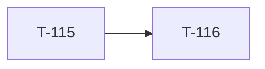

<!-- AUTO-GENERATED by ./scripts/ticket sync — DO NOT EDIT -->

# Ticket Lead Dashboard

## Running / Review

## Ready

- **T-090** (900) — Map visualization program [ready] — Map Engine v2 through sea-band + contours @ `bd481cf1`. **Active:** **T-090.5.5** tree/veg/prop glyphs. Single lane.
- **T-456** (3295) — OnBackendFetchSuccess does not re-check MISSION_FILE_MAX_BYTES [ready] — Residual from T-450 / wave 20 adversarial. Compiled missions are pinned at 8MiB via x-tbd-missionFileMaxBytes + validate_mission_document + profile LoadFromProfileFile, but OnBackendFetchSuccess → ParseMissionJson does not re-check body size. A compromised/stale API path could still hand the mod an oversized JSON.

Repro: read TBD_MissionLoader OnBackendFetchSuccess vs LoadFromProfileFile size gate.

Cure: apply the same MISSION_FILE_MAX_BYTES check on the REST success path before ParseMissionJson.
- **T-458** (3297) — AdminGate still uses browse-mode has_min_role [ready] — Residual from T-454 / wave 21 adversarial NIT. wiki/modpacks/event_hub action gates now use has_min_role_authed, but ui.rs AdminGate still calls auth.has_min_role(Role::Admin) (browse-mode None=>true via auth.rs).

Mitigation today: AdminGate is nested under AuthGate, which only renders children when is_authenticated() (user is Some), so guests cannot flash admin UI via None=>true.

Repro: read apps/website/frontend/src/ui.rs:244-264 and auth.rs has_min_role.

Cure: switch AdminGate to has_min_role_authed (or equivalent None=>false) while keeping the reactive move || auth path.
- **T-459** (3298) — ticket advance-slice mutates without schema check preflight [ready] — Residual from T-455 / wave 21 adversarial NIT. cmd_add/cmd_remove (and set-status/mark-ready/reorder/ship) now call require_check_ok before write, but cmd_advance_slice still save_registry + sync with no preflight while check is red.

Repro: red in-memory registry → cmd_advance_slice still writes active_slice.

Cure: call require_check_ok(root, registry, &format!("advance-slice {id}")) before mutate, with a Class-R/unit test mirroring add_refuses_invalid.

## Next queued (top 10)

- **T-072** (720) — Ctrl multi-place [queued] — Hold Ctrl to place multiple copies without re-selecting asset.
- **T-073** (730) — Shift + map rotation [queued] — Shift-drag and map rotation widget for placed entities.
- **T-075** (750) — Spacebar flyTo vs widget [queued] — Spacebar centers selection; resolve flyTo vs transform widget conflict.
- **T-116** (1160) — Results POST to backend [queued] — SPLIT 2026-07-26. Mod half SHIPPED: TBD_ResultsReporter.c (682 lines, T-181.13.1) POSTs to /api/v1/ingest/match-results. Website half OPEN and folded into T-232 — event_hub.rs renders no result/outcome/match data at all. This row now tracks only the website half.
- **T-117** (1170) — Mission upload + validation UI [queued] — Web UI for mission upload and schema validation (API exists).
- **T-118** (1180) — Event ORBAT + identity linking UI [queued] — SPLIT 2026-07-26. DONE: identity-link UI (settings.rs:6-9,74-94, T-159.25) and the ORBAT selector (event_hub.rs:520-572, T-159.25a). OPEN residual is tracked by T-226 (PATCH /events/{id} has no caller), T-284 (clear_slot unreachable, admin cannot free a claimed slot) and T-231 (identity last mile). This row is a pointer, not work.
- **T-120** (1200) — Staging soak + golden mission smoke [queued] — Pinned game/mod version soak; golden-mission smoke on staging server.
- **T-146** (1470) — Asset Browser Data Wiring [queued] — Hook up T-150 registry items (vehicles/crates/…) to Asset Browser for map drag-place. Unblocked by T-150; after or parallel T-068.9 ingest preferred.
- **T-170** (1670) — Prod default flip to Leptos SPA [queued] — Make the Leptos SPA the production default: set `SPA_DIST_DIR` to the trunk release dist in the prod env, move the Discord OAuth redirect origin, staging soak, then flip. OPERATOR-GATED (env + Discord app settings are operator-held); claude-code prepares configs/runbook + verifies the staging soak gates. Runbook anchor: docs/website/DEV_RUNBOOK.md §SPA serving; T-159 finish program left this as the sole operator-gated residual.

## Dependency graph (scoped)

```mermaid
flowchart LR
  T115[T-115] --> T116[T-116]
```
