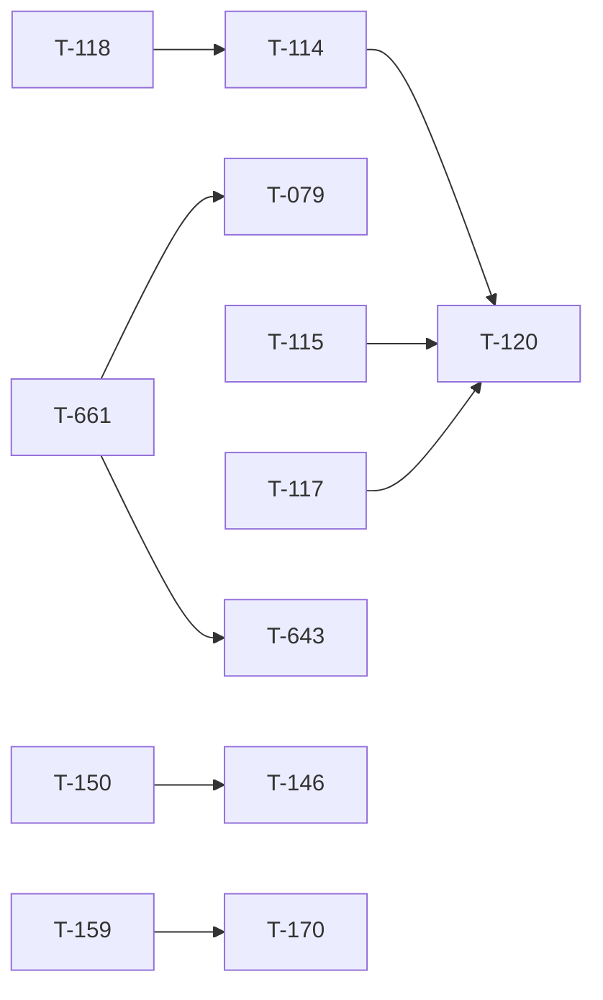

<!-- AUTO-GENERATED by ./scripts/ticket sync — DO NOT EDIT -->

# Ticket Lead Dashboard

## Running / Review

## Ready

- **T-090** (900) — Map visualization program [ready] — Map Engine v2 through sea-band + contours @ `bd481cf1`. **Active:** **T-090.5.5** tree/veg/prop glyphs. Single lane.

## Next queued (top 10)

- **T-120** (1200) — Staging soak + golden mission smoke [queued] — Pinned game/mod version soak; golden-mission smoke on staging server.
- **T-146** (1470) — Asset Browser Data Wiring [queued] — Hook up T-150 registry items (vehicles/crates/…) to Asset Browser for map drag-place. Unblocked by T-150; after or parallel T-068.9 ingest preferred.
- **T-170** (1670) — Prod default flip to Leptos SPA [queued] — Make the Leptos SPA the production default: set `SPA_DIST_DIR` to the trunk release dist in the prod env, move the Discord OAuth redirect origin, staging soak, then flip. OPERATOR-GATED (env + Discord app settings are operator-held); claude-code prepares configs/runbook + verifies the staging soak gates. Runbook anchor: docs/website/DEV_RUNBOOK.md §SPA serving; T-159 finish program left this as the sole operator-gated residual.
- **T-643** (4030) — Line of Sight: point-to-point ray [queued] — Operator-requested; ships BEFORE the viewshed. The second of the two dead buttons — the LoS stub is eden_chrome.rs:3715-3717 (`TOOL_DISABLED disabled=true`, MaterialIcon name="visibility"), adjacent to the ruler stub, which is why this and T-642 are one wave apart. Click observer, click target -> clear/blocked plus the terrain profile between them. Samples the loaded DEM (`crates/map-engine-core`, 6400^2 uint16, +/-0.204 m against 11 survey anchors at T-091.0). Cheap, immediately useful for checking a firing position, and it PROVES the DEM sampling path that T-644 then reuses. Code: the button in post-split eden_toolbelt.rs; two-click capture in the same pointer handlers as the ruler (mission_editor.rs); the ray walk and profile in a NEW `apps/website/frontend/src/los_tool.rs` (module name INFERRED; wave 0 pre-declares the stub); `crates/map-engine-core/src/dem/sample.rs` (232 lines, holds DemManifest and the elevation sampler) needs a SEGMENT sampler, not a point sampler. DECIDE INSIDE THE TICKET: eye height above ground for observer and target — a standing soldier is not the terrain surface — and whether the profile renders as an inline chart or an overlay. Same honesty rule as T-642: do not un-disable the button until the tool works.
- **T-079** (4040) — Triggers — the editor half: palette mode, area geometry, owner link [queued] — PROMOTED AND SPLIT FOUR WAYS. T-079 as filed absorbed 14 ids across three unrelated entity families — the largest single absorber in the interactions sweep — and could not be dispatched as one ticket. This row is the TRIGGERS slice and the EDITOR HALF ONLY: `RIGHT-MODE-003` and `CONN-TRG-OWNER-001`. The other three: waypoints and the trigger activation/effects runtime are workbench tickets (waypoints are blocked on AI units existing at all — TBD_SpawnManager.c:963,1166 spawns every body with AI disabled, so a waypoint has no subject; the activation model is a new Enfusion runtime); the connection graph is its own factory ticket; systems/modules is NOT FILED because the SYS family declares no ids in attributes.md:223-225 and cannot be sized. Code: another PaletteKind variant + tab strip entry in post-split eden_dock_right.rs (eden_chrome.rs:1833, :3041-3046). Trigger GEOMETRY rides the SHIPPED T-582 zone draw tool rather than inventing a second one: `zones_panel` (eden_chrome.rs:2228), `ZoneShape` :3660, `circle_from_clicks` :3626, `zone_rule_fields` :3443, now in eden_zones.rs; the command surface is large and already in editor_ops.rs (`zone_draw_armed` :2325, `begin_zone_draw` :2350, `begin_zone_reshape` :2378, `cancel_zone_draw` :2400, `zone_draw_pop_vertex` :2412, `advance_zone_draw` :2436, `close_zone_polygon` :2499, `zone_rows` :2579, `set_zone_rule` :2688, `delete_zone` :2717) and a trigger area is a second consumer of all of it. A trigger entity map in store.rs follows the markersById :355 / zones precedent. NOTE for scoping: $defs/zoneRules' 16 keys have no ATTR-FIELD id and were never triaged against Eden, but they are the closest thing TBD has to trigger semantics and belong in this ticket's reading.
- **T-660** (4050) — Validation: cargo and loadout policy rules [queued] — Rule content plus one extension. Rules: vehicle inventories match policy (the MissionAnalyzer's R9, a PvP fairness check) plus WOG's `fn_check_weapon` set — below-standard magazine counts, no vest, no uniform, missing map/compass/radio. TBD already holds the cargo model (T-068.15.1). Code: rule content in `crates/map-engine-core/src/mission/validate.rs`, and EXTEND rather than duplicate `crates/map-engine-core/src/mission/wire_safety.rs` where the cargo policy check already half-exists: `scan_cargo_capacity` :360, `CargoPhys` :338, `CARGO_CONTAINERS` :326, `CARGO_CAPACITY_CAVEAT` :331. The no-vest / no-uniform / missing-map-compass-radio rules read `apps/website/frontend/src/arsenal_rules.rs`:49-162 (the 14 pick rows) — read-only, not claimed, since the engine lives in core. Worth keeping in view while building: FNF's version of this compares against a serialised sentinel string `[[[[],[]],...],false]`, which is exactly the brittleness a typed model deletes. Depends on T-656.
- **T-648** (4060) — Transform: Shift-rotate, snap grid, widget + Space cycle [queued] — SUPERSEDES T-073 and T-075 (both cancelled in favour of this row) and absorbs the snapping slice. Ids: `XFORM-SHIFT-001` (Shift+drag rotates to face cursor), `TOOLBAR-GRID-MOVE-001` (translation / rotation / area-scaling snap grids with increase and decrease), `WIDGET-CYCLE-001` + `WIDGET-TRANS-001` (transformation widget), `KEY-GRID-001`. Two collisions to DECIDE INSIDE THE TICKET: in Eden `Space` cycles widget variants, in TBD `Space` is flyTo (`center_on_selection`, editor_ops.rs:354) — Eden's `1`-`5` direct keys are free, so using them dissolves the clash; and pick a TBD key for the grid toggle, do NOT copy Eden's `odiaeresis` or `;` keysym artefacts. Code: Shift+drag is a modifier branch in `onpointermove` (mission_editor.rs:1437-1643) and the Space decision is in the keydown :1005-1030; select_tool.rs holds `drag_delta` :201, `push_drag_preview` :232, `clear_drag_preview` :257; rotation and snapped positions commit through `attrs_update_position` (editor_ops.rs:667) and rotation already round-trips numerically (attributes.rs:292, editor_ops.rs:1841), so this is a gesture on an existing field. WARNING, verified twice: `GRID_CELL_M` at select_tool.rs:33 IS NOT A SNAP STEP. It is `MissionDocCore::GRID_CELL_M`, a spatial-index cell size used only at :338 and :372 to build a PointIndex. NOTHING SNAP-RELATED EXISTS: `grep -riw snap` over the frontend returns 37 hits and every single one is `let snap = read_snapshot();`. The quantiser is new and goes beside `drag_delta`.
- **T-644** (4070) — Line of Sight: viewshed raster [queued] — Follow-up to T-643 and a hard dependency on it — T-643 proves the DEM sampling path this reuses. Pick an observer, shade everything it can and cannot see. It is the better planning tool by some way and the DEM supports it. THE HARD PART IS THE COLOUR LANGUAGE, not the compute: a visible/hidden wash must not fight the contours (T-640) or the landcover, both of which already use the same map surface. Prototype the palette BEFORE building the compute. Code: second mode on the same tool surface (`apps/website/frontend/src/los_tool.rs`); bulk sampling in `crates/map-engine-core/src/dem/sample.rs`; and a new raster lane in `crates/map-engine-render/src/engine.rs` — that last path is graded LOW: the engine is 6,302 lines and it was not confirmed that no existing lane can carry the wash. Check that first; if a lane can be reused, this ticket drops the engine path entirely.
- **T-668** (4080) — One state vocabulary across the whole editor chrome [queued] — NEW, from editor_chrome_direction.md, and the ticket that most directly answers the operator's "the current UI is very inconsistent and very disjointed". Geometry is the visible half of the problem; the reason Eden reads as ONE PRODUCT and ours reads as assembled is that Eden uses one state language everywhere and we use several. Adopt four rules across the whole chrome. (1) HOVER = solid amber fill. Orange is hover, NOT toggled-on — easy to copy backwards; batch 08 proved it via frame 164000 where the New button is amber purely because the cursor is over it. (2) TOGGLED ON = lighter plate + 1px dark top border, distinct from hover BY CONSTRUCTION so the two can never be confused. (3) DISABLED = dimmed glyph, AND IT STILL SHOWS ITS TOOLTIP (verified on Redo) — a disabled control that explains itself is strictly better than one that goes silent. (4) UNAVAILABLE = two strategies chosen by verb: clipboard verbs (Cut/Copy/Delete) keep their slot and grey out; scope/query verbs (Select..., Log...) are dropped from the menu entirely. Plus three conventions: RESERVE THE CHECKMARK GUTTER UNCONDITIONALLY (Eden only allocates it when a menu happens to have a checked item, so label indent jumps between menus — that is a bug to NOT copy); `...` means "opens a dialog", everywhere; parenthetical scope qualifiers `(Selected)` / `(View)` and axis glosses `(Width)` / `(Length)` / `(Height)`. KEEP THE AEGIS PALETTE — desaturated #adc6ff primary, the Aegis type scale, our glass surfaces. This is Eden's structure in Aegis colours, not a reskin, and the editor must not look like a different product from the Library and Events pages it sits inside. Do NOT copy Eden's translucent panels over a live scene. Cheap by construction: it changes classes, not structure. SCHEDULING CAVEAT, recorded because it is a real cost: the direction says this should land EARLY so later waves build against a finished vocabulary, but every earlier wave already has a claimant on one of these files and the program is fixed at 19 waves — wave 10 is the earliest slot with no collision. T-636 (status bar), T-638 (dock collapse) and T-667 (furniture) therefore land before it and will need a retrofit pass.
- **T-655** (4090) — Validation panel: persistent issue list with rollup [queued] — The surface for the validation group, and product order says it should ship FIRST within that group. The rollup ranks #2 of 10 in the tooling analysis and the reason is decisive: FNF commented THEIRS out inside an HTML comment, so a maker gets no summary of failures and every other check became invisible. Requirements: a persistent issue list with a rollup; CLICK-TO-SELECT findings, not a clipboard dump; a severity ladder with a legend; and NO SEVERITY THAT FIRES ON CORRECT INPUT. Validation is ALWAYS ON — not behind a debug flag, not on save, not on export (T-635 gates telemetry; correctness diagnostics are never gated). Code: no validation surface exists in the SPA, so a NEW `apps/website/frontend/src/validation_panel.rs` (module name INFERRED; wave 0 pre-declares the stub) plus the mount and the always-on re-evaluation tick in mission_editor.rs, where `MissionEditorPage` :642 owns every overlay mount (:2060-2110). DELIBERATE SCOPING DECISION: if the panel DOCKS rather than floats it also touches the dock chrome, and that single path would collide it with most of the program. Float it, or accept the serialisation and re-open the owns row. NOTE, unresolved and worth the operator's attention: the file graph would permit this ticket as early as wave 3, and both independent packings put it late. That is a product call, not a scheduling one, and it costs zero waves either way.

## Dependency graph (scoped)

```mermaid
flowchart LR
  T661[T-661] --> T079[T-079]
  T118[T-118] --> T114[T-114]
  T114[T-114] --> T120[T-120]
  T115[T-115] --> T120[T-120]
  T117[T-117] --> T120[T-120]
  T150[T-150] --> T146[T-146]
  T159[T-159] --> T170[T-170]
  T661[T-661] --> T643[T-643]
```
