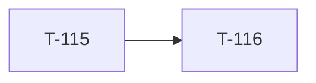

<!-- AUTO-GENERATED by ./scripts/ticket sync — DO NOT EDIT -->

# Ticket Lead Dashboard

## Running / Review

- **T-418** (3243) — map-engine-wasm is dead as a whole crate, and compile_export's briefing is a dead key [running] — Two independent dead-surface findings from wave 4, both larger than the tickets that surfaced them.

1. THE WHOLE map-engine-wasm CRATE IS DEAD, not just the binding T-243 deleted. `cargo tree -p map-engine-wasm --invert --depth 1` returns only itself -- zero reverse dependencies, and it appears in no [dependencies] table anywhere. Its Cargo.toml describes it as 'a shim exposing map-engine-core to the TypeScript UI shell', and that shell was DELETED at T-159.29.3: there are ZERO .ts/.tsx files outside node_modules and no map_engine_wasm* artifact is ever produced -- it is never wasm-packed. The Leptos SPA links map-engine-core DIRECTLY and says why (frontend/Cargo.toml:89 'instead of reaching it through the map-engine-wasm shim'; mission_doc.rs:5 'no map-engine-wasm JS shim, spec D2') -- that collapse was the point of T-159.15.
   Its entire remaining surface (DemGrid, SeaBandResult, HillshadeResult, TbddResult, DecodedDem, SlotIndex, WorldStore, RenderEngine, ...) exports to a JS boundary that no longer exists, and it costs a fmt+clippy pass on every `make lint`. T-243 deleted only what its ticket named.
   DECIDE: delete the crate, or document why it is kept (a planned future JS consumer is a legitimate answer -- an undocumented one is not).

2. compile_export's envelope `briefing` always resolves to \"\". T-214 wired it to read meta.briefing, but apply_row_meta never threads it: mission_hydrate.rs:403-424's RowMeta carries only title/terrain/time/weather, so the key is absent and the field is dead. Pre-existing and already documented as such at compile.rs:164-172. REPRO: export any mission whose row has a briefing; the downloaded envelope's briefing is empty.
- **T-419** (3244) — Six mod comments now assert the schema is open, and four tickets will read them as the contract [running] — Filed by wave 4's T-241 agent, which correctly reported rather than fixed (the mod .c files were in its owns but changing mod prose was out of its scope).

T-241 closed zones[].rules to a 16-key vocabulary with additionalProperties:false. Six comments in the mod now assert the opposite -- that the vocabulary is open and additive:
  apps/mod/tbd-framework/Scripts/Game/TBD/Backend/TBD_MissionLoader.c:71, :72, :87
  apps/mod/tbd-framework/Scripts/Game/TBD/Objectives/TBD_ObjectiveRules.c:5, :6, :47
Example, verbatim: 'The objective rule vocabulary. Additive and legal under `additionalProperties: true`'.

WHY THIS MATTERS MORE THAN A NORMAL STALE COMMENT: T-241 is a DEPENDENCY ROOT. slice-collisions.py encodes T-201, T-211, T-212 and T-275 -> T-241 precisely so the zones vocabulary is declared ONCE instead of four tickets each inventing one. All four will read these headers as the contract for what they are building on, and the headers now describe a schema that no longer exists. This is the stale-doc trap that costs a whole slice.

Comment-only edit, zero behavioural risk.

ALSO IN THE SAME FILES: TBD_MissionLoader.c:88 documents graceSeconds as 'number >= 0' but the code at :389 also rejects > MAX_GRACE_SECONDS. The header omits the ceiling. T-275-adjacent.

RECORDED DECISION so it is not re-litigated: T-241 deliberately did NOT encode conditional `required` for holdSeconds and targetAlias, though both are effectively mandatory (without them the objective goes inert with an operator-facing reason). Reason: it is a different defect from T-241's, and conditional requires are the shape most likely to collide with T-201/T-211/T-212. Both keys carry the requirement in prose instead. The command center endorsed this. Enforce it when a consumer actually needs it, not before.
- **T-530** (3370) — T-332 Class-R partly pins doc comment strings [running] — Wave 47 verifier P3/NIT. T-332 BE/FE Class-R partly asserts doc comment phrases (T-332 clear contract). Behavior covered by IT + stronger FE pins. Cure: pin live code paths only (body.insert / is_unique_violation / SQL), not comment prose.

## Ready

- **T-090** (900) — Map visualization program [ready] — Map Engine v2 through sea-band + contours @ `bd481cf1`. **Active:** **T-090.5.5** tree/veg/prop glyphs. Single lane.

## Next queued (top 10)

- **T-072** (720) — Ctrl multi-place [queued] — Hold Ctrl to place multiple copies without re-selecting asset.
- **T-073** (730) — Shift + map rotation [queued] — Shift-drag and map rotation widget for placed entities.
- **T-075** (750) — Spacebar flyTo vs widget [queued] — Spacebar centers selection; resolve flyTo vs transform widget conflict.
- **T-116** (1160) — Results POST to backend [queued] — SPLIT 2026-07-26. Mod half SHIPPED: TBD_ResultsReporter.c (682 lines, T-181.13.1) POSTs to /api/v1/ingest/match-results. Website half OPEN and folded into T-232 — event_hub.rs renders no result/outcome/match data at all. This row now tracks only the website half.
- **T-117** (1170) — Mission upload + validation UI [queued] — Web UI for mission upload and schema validation (API exists).
- **T-118** (1180) — Event ORBAT + identity linking UI [queued] — SPLIT 2026-07-26. DONE: identity-link UI (settings.rs:6-9,74-94, T-159.25) and the ORBAT selector (event_hub.rs:520-572, T-159.25a). OPEN residual is tracked by T-226 (PATCH /events/{id} has no caller), T-284 (clear_slot unreachable, admin cannot free a claimed slot) and T-231 (identity last mile). This row is a pointer, not work.
- **T-120** (1200) — Staging soak + golden mission smoke [queued] — Pinned game/mod version soak; golden-mission smoke on staging server.
- **T-146** (1470) — Asset Browser Data Wiring [queued] — Hook up T-150 registry items (vehicles/crates/…) to Asset Browser for map drag-place. Unblocked by T-150; after or parallel T-068.9 ingest preferred.
- **T-170** (1670) — Prod default flip to Leptos SPA [queued] — Make the Leptos SPA the production default: set `SPA_DIST_DIR` to the trunk release dist in the prod env, move the Discord OAuth redirect origin, staging soak, then flip. OPERATOR-GATED (env + Discord app settings are operator-held); claude-code prepares configs/runbook + verifies the staging soak gates. Runbook anchor: docs/website/DEV_RUNBOOK.md §SPA serving; T-159 finish program left this as the sole operator-gated residual.

## Dependency graph (scoped)

```mermaid
flowchart LR
  T115[T-115] --> T116[T-116]
```
