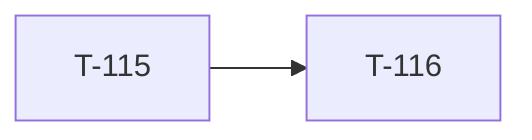

<!-- AUTO-GENERATED by ./scripts/ticket sync — DO NOT EDIT -->

# Ticket Lead Dashboard

## Running / Review

- **T-328** (3144) — mcpd runs long-lived from the shared target dir, so it can serve unmerged code [running] — FOUND by T-322 while isolating `make api`; flagged not fixed, different owner.

`mcpd` (scripts/mod/mcp-daemon.sh) is the second long-lived process running out of the shared CARGO_TARGET_DIR, with a 4h max-life. It carries the same correctness exposure `make api` just had: the wave gate's `cargo test -p website-api` rewrites binaries in that tree after every land, so a daemon started before a land keeps running one tree's code while the repo has moved on.

Note what T-322 established, so this is not fixed for the wrong reason: a rebuild does NOT kill a running process (cargo unlinks and re-links; the process keeps its inode, and the kernel refuses an in-place overwrite with ETXTBSY). The risk is STALENESS, not death — the daemon silently serving code that is no longer what main says.

Apply the same fix: an inline CARGO_TARGET_DIR on whatever builds it, matching the shape used for `api`/`rust-api` in the Makefile and for target-gate-frontend / dist-gate-frontend in wave.sh.

== DEFERRED 2026-07-26 BY OPERATOR DECISION, NOT CANCELLED ==
Recording a bug is most of its value; fixing it now is optional. The audits that produced this ticket were generating work faster than the run could close it, and the original T-182..T-297 feature backlog had not moved in hours. The operator's call, verbatim in substance: there will always be bugs, that is what developing is — knowing them is good, but spending the token budget on things that do not need fixing right now means nothing ships.
This is findable, fully diagnosed, and reproducible from the notes above. Promote it to `idea` when it actually blocks something, when it starts costing real time, or after the feature backlog lands. Nothing here was judged wrong — only not now.
- **T-381** (3197) — The integration suite can point at the live database, and one delete is unscoped [running] — All 20 files in apps/website/api/tests/ early-return unless TEST_DATABASE_URL is set, and Makefile:121-123 points it at a dedicated `rust_it`. But **nothing validates the target database name**, so an exported `TEST_DATABASE_URL=.../tbd_reforger` runs the whole suite against the live dev DB.

The one unscoped destructive statement: tests/factions.rs:18 — `DELETE FROM user_factions` with **no WHERE**. Wipes the table. Every other suite scopes to test-owned rows. Also tests/identity_link.rs:26 — `UPDATE users SET arma_id = NULL WHERE discord_id = $3` against the shared dev operator row.

tests/null_tolerance.rs:240-245 already documents the shared-dev-row hazard, so the awareness exists and the guard does not.

Two fixes, both cheap: refuse to run unless the database name matches a test pattern (`rust_it`, `*_it`, `*_probe`), and scope that DELETE. Several agents this run have created and dropped their own throwaway DBs correctly — the convention exists; enforce it.

== DEFERRED 2026-07-26 BY OPERATOR DECISION, NOT CANCELLED ==
Recording a bug is most of its value; fixing it now is optional. The audits that produced this ticket were generating work faster than the run could close it, and the original T-182..T-297 feature backlog had not moved in hours. The operator's call, verbatim in substance: there will always be bugs, that is what developing is — knowing them is good, but spending the token budget on things that do not need fixing right now means nothing ships.
This is findable, fully diagnosed, and reproducible from the notes above. Promote it to `idea` when it actually blocks something, when it starts costing real time, or after the feature backlog lands. Nothing here was judged wrong — only not now.
- **T-532** (3372) — No API route to re-point mission current_version_id after a bad version [running] — FOUND as T-382 residual (W48). T-382 closed the *new* hole: vacuous `payload:{}` is rejected at create_version write time. Already-broken rows (and any future non-vacuous but unwanted tip) still cannot be re-pointed via API — only `psql` UPDATE of `missions.current_version_id`.

Needs a rollback / re-point handler in missions.rs **and** route registration in `app.rs` (out of T-382 owns). Repro: after a good version then a bad tip that somehow lands, there is no PATCH/POST to restore the prior version id; `/compiled` stays 409 NoSlots.

## Ready

- **T-090** (900) — Map visualization program [ready] — Map Engine v2 through sea-band + contours @ `bd481cf1`. **Active:** **T-090.5.5** tree/veg/prop glyphs. Single lane.

## Next queued (top 10)

- **T-072** (720) — Ctrl multi-place [queued] — Hold Ctrl to place multiple copies without re-selecting asset.
- **T-073** (730) — Shift + map rotation [queued] — Shift-drag and map rotation widget for placed entities.
- **T-075** (750) — Spacebar flyTo vs widget [queued] — Spacebar centers selection; resolve flyTo vs transform widget conflict.
- **T-116** (1160) — Results POST to backend [queued] — SPLIT 2026-07-26. Mod half SHIPPED: TBD_ResultsReporter.c (682 lines, T-181.13.1) POSTs to /api/v1/ingest/match-results. Website half OPEN and folded into T-232 — event_hub.rs renders no result/outcome/match data at all. This row now tracks only the website half.
- **T-117** (1170) — Mission upload + validation UI [queued] — Web UI for mission upload and schema validation (API exists).
- **T-118** (1180) — Event ORBAT + identity linking UI [queued] — SPLIT 2026-07-26. DONE: identity-link UI (settings.rs:6-9,74-94, T-159.25) and the ORBAT selector (event_hub.rs:520-572, T-159.25a). OPEN residual is tracked by T-226 (PATCH /events/{id} has no caller), T-284 (clear_slot unreachable, admin cannot free a claimed slot) and T-231 (identity last mile). This row is a pointer, not work.
- **T-120** (1200) — Staging soak + golden mission smoke [queued] — Pinned game/mod version soak; golden-mission smoke on staging server.
- **T-146** (1470) — Asset Browser Data Wiring [queued] — Hook up T-150 registry items (vehicles/crates/…) to Asset Browser for map drag-place. Unblocked by T-150; after or parallel T-068.9 ingest preferred.
- **T-170** (1670) — Prod default flip to Leptos SPA [queued] — Make the Leptos SPA the production default: set `SPA_DIST_DIR` to the trunk release dist in the prod env, move the Discord OAuth redirect origin, staging soak, then flip. OPERATOR-GATED (env + Discord app settings are operator-held); claude-code prepares configs/runbook + verifies the staging soak gates. Runbook anchor: docs/website/DEV_RUNBOOK.md §SPA serving; T-159 finish program left this as the sole operator-gated residual.

## Dependency graph (scoped)

```mermaid
flowchart LR
  T115[T-115] --> T116[T-116]
```
