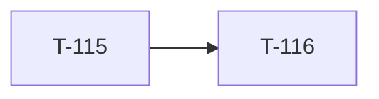

<!-- AUTO-GENERATED by ./scripts/ticket sync — DO NOT EDIT -->

# Ticket Lead Dashboard

## Running / Review

- **T-402** (3218) — T-393 follow-ups: legacy-counter tripwire gaps and the unpinned terrain value space [running] — Three MINOR findings against the shipped T-393 contract split, from wave 1's adversarial verifier. None affects the shipping mod; all are cheap. Grouped because they are one file and one sitting.

1. command_win is missing from the legacy tripwire and the comment is false. handlers/telemetry.rs:483-508 lists kills/team_kills/longest_kill_m/vehicles_destroyed/is_command. SEVEN fields moved into the counters object; deaths is excluded deliberately and correctly (including it would 400 every production report, since the mod emits deaths at top level), but command_win is excluded SILENTLY while the comment asserts "Nothing else that moved is tolerated." Harmless in practice — a genuine pre-split sender carries the other five and trips anyway — but the comment states something untrue about the code beneath it.

2. A JSON null escapes the tripwire. Option<IgnoredAny> under serde_json's deserialize_option maps null -> None, so legacy_counter_key() returns None and {"kills": null, ...} passes as a modern body. No known sender does this. Reasoned from serde semantics, not compiled — confirm before fixing.

3. The golden pins one instantiation of the mod's format string, not the mod's value space. The T-393 golden hard-codes terrain "everon". GetTerrain() returns mission.meta.terrain verbatim and packages/tbd-schema/schema/mission.schema.json:124 constrains it only to ^[a-z][a-z0-9_]*$, while valid_terrain (telemetry.rs:31-38) accepts exactly everon|arland|custom and upsert_match (telemetry.rs:854) 400s anything else — REJECTING THE WHOLE REPORT, not degrading the field. So a community terrain still produces the T-393 headline failure and the new golden cannot see it. Pre-existing and outside T-393's stated scope, but it means "all production ingest 400s" is not fully retired for non-allowlisted terrains. Either widen the allowlist, or degrade to NULL like the other unparseable fields do (parse_uuid_opt, telemetry.rs:49-54, is the model), or pin the value space in the golden.

Verified as NOT defects while checking these: the golden's bytes match BuildPayload/BuildPlayerRow exactly, key order included; the tripwire cannot reject anything the mod sends; started_at/ended_at cannot arrive blank because s_bSawLive guards the report (TBD_ResultsReporter.c:215).
- **T-413** (3234) — Adopt the URL guard at the four remaining writers, and cover the deployments sink wiring [running] — The deliberate residue of T-405, which was scoped in wave 3 to the P0 half (the live javascript: sink at deployments.rs plus the 0010 backfill) and the two highest-exposure writers. These are the rest, all  -- weaker than an <a href> because browsers do not execute javascript: in img src, but the guard is absent identically.

REMAINING WRITERS (T-405 shipped cms.rs and oauth.rs; these are untouched):
  events.banner_image_url   -- handlers/events.rs:624 create, :1215 update -- admin tier -- render at frontend/src/events.rs:346
  missions.thumbnail_url    -- handlers/missions.rs:396 create, :509 update -- create is mission_maker+, PATCH is AuthUser+ownership -- renders at frontend/src/missions.rs:402,:546,:912
REMAINING RENDER SITES (all users.avatar_url, whose writer T-405 DID guard at oauth.rs:125):
  frontend/src/leaderboards.rs:200, layout.rs:230, settings.rs:192, event_hub.rs:1418
  frontend/src/announcements.rs:295 (announcements.thumbnail_url; writer guarded by T-405)

THE PORTED PREDICATE IS READY TO REUSE: T-405 put is_http_url in apps/website/frontend/src/url_guard.rs for the wasm side and kept api/src/services/text.rs authoritative, pinned together by apps/website/shared/is_http_url_cases.rs (86 cases) which both crates include!. Add cases THERE, not to either implementation -- widening one alone turns the other's suite red on the same commit, which is the anti-drift mechanism working. CAUTION: a slice that touches ONLY that shared file currently hard-fails clippy_changed -- see T-409 F1.

COVERAGE GAP, separate from the writers: deployments.rs:465's WIRING has no test. replay_href is exhaustively unit-tested but nothing proves the view! calls it; re-inlining href=replay would pass every test. The crate is CSR-only and cannot render to a string natively. NOT A LIVE DEFECT -- wave 3's verifier drove a real headless Chromium through /deployments against three stored payloads and confirmed the guard fires, the cell renders an em-dash with no anchor, and a legitimate https link still renders in the same table. So this is a regression-risk gap, not a bug.

CONFIRMED NOT AN ISSUE, do not re-audit: modpacks.workshop_url reaches an <a href> at frontend/src/event_hub.rs:236 but has NO HTTP WRITER -- services/registry_import.rs:82's INSERT omits the column and there is no UPDATE modpacks in the API crate. Only operator psql seeds populate it. frontend/src/modpacks.rs:346 also renders it but that page is hardcoded MOCK_MODPACKS and never calls the API.
- **T-416** (3241) — Cargo capacity belongs in wire_safety.rs, server-side, covering save and compile in one place [running] — Recommendation from T-240's agent, endorsed by the command center, deliberately NOT built in wave 4 because it crosses files T-240 did not own.

T-240 shipped the rule (arsenal_rules.rs:810 cargo_capacity_errors) and wired it to the Arsenal's loadout export (arsenal.rs:477 try_export). That is the only authoring-time refusal point the client HAS -- see the two structural findings in T-417. It is not the right home.

THE PRECEDENT IS EXACT: crates/map-engine-core/src/mission/wire_safety.rs is a rule expressed in code rather than schema, one linear pass over the already-parsed editor payload, wired into apps/website/api/src/contract/validate.rs:101 (Save Version -> 400 carrying per-problem findings) and apps/website/api/src/services/mission_compile.rs:498 (the compiled gate). Its own header states the reason: the schema rejects the value 'long after the author pressed Save, in front of the wrong human.' The frontend already renders those findings -- mission_commands.rs:112-120 feeds them to the Save dialog. Cargo already reaches that payload (flatten.rs:1103-1126, ModSlotCargo).

WHY IT IS BETTER: natively testable (the frontend seam is #![cfg(target_arch = \"wasm32\")] and cannot be proven by the gate), and it covers save AND compile in one place instead of one export button.

THE ONE REAL DESIGN QUESTION: it needs the registry for weights and capacities, which the API has and the pure core crate does not. Resolve that before building -- either thread a registry handle in, or split the rule so core holds the arithmetic and the API supplies the table.

Once this lands, T-240's frontend block becomes a nicety on top rather than the only line of defence.

## Ready

- **T-090** (900) — Map visualization program [ready] — Map Engine v2 through sea-band + contours @ `bd481cf1`. **Active:** **T-090.5.5** tree/veg/prop glyphs. Single lane.

## Next queued (top 10)

- **T-072** (720) — Ctrl multi-place [queued] — Hold Ctrl to place multiple copies without re-selecting asset.
- **T-073** (730) — Shift + map rotation [queued] — Shift-drag and map rotation widget for placed entities.
- **T-075** (750) — Spacebar flyTo vs widget [queued] — Spacebar centers selection; resolve flyTo vs transform widget conflict.
- **T-116** (1160) — Results POST to backend [queued] — SPLIT 2026-07-26. Mod half SHIPPED: TBD_ResultsReporter.c (682 lines, T-181.13.1) POSTs to /api/v1/ingest/match-results. Website half OPEN and folded into T-232 — event_hub.rs renders no result/outcome/match data at all. This row now tracks only the website half.
- **T-117** (1170) — Mission upload + validation UI [queued] — Web UI for mission upload and schema validation (API exists).
- **T-118** (1180) — Event ORBAT + identity linking UI [queued] — SPLIT 2026-07-26. DONE: identity-link UI (settings.rs:6-9,74-94, T-159.25) and the ORBAT selector (event_hub.rs:520-572, T-159.25a). OPEN residual is tracked by T-226 (PATCH /events/{id} has no caller), T-284 (clear_slot unreachable, admin cannot free a claimed slot) and T-231 (identity last mile). This row is a pointer, not work.
- **T-120** (1200) — Staging soak + golden mission smoke [queued] — Pinned game/mod version soak; golden-mission smoke on staging server.
- **T-146** (1470) — Asset Browser Data Wiring [queued] — Hook up T-150 registry items (vehicles/crates/…) to Asset Browser for map drag-place. Unblocked by T-150; after or parallel T-068.9 ingest preferred.
- **T-170** (1670) — Prod default flip to Leptos SPA [queued] — Make the Leptos SPA the production default: set `SPA_DIST_DIR` to the trunk release dist in the prod env, move the Discord OAuth redirect origin, staging soak, then flip. OPERATOR-GATED (env + Discord app settings are operator-held); claude-code prepares configs/runbook + verifies the staging soak gates. Runbook anchor: docs/website/DEV_RUNBOOK.md §SPA serving; T-159 finish program left this as the sole operator-gated residual.

## Dependency graph (scoped)

```mermaid
flowchart LR
  T115[T-115] --> T116[T-116]
```
