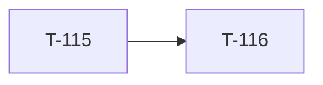

<!-- AUTO-GENERATED by ./scripts/ticket sync — DO NOT EDIT -->

# Ticket Lead Dashboard

## Running / Review

- **T-387** (3203) — render-check / gate residual after T-339: dev-login single Discord id (not api_proxy) [running] — NARROWED after W61 (T-339 shipped). The original api_proxy:None render-check hole is CLOSED by T-339 (CLI --api-proxy + default :8080).

Remaining from the original T-387 write-up (do not re-litigate api_proxy):
- Dev-login / probe path still folds multiple roles onto a single Discord id in ways that half-hydrate or collide sessions (see original T-387 notes + T-361 SSE proxy sibling if overlapping).

Measure live gate/smokes/dev-login before implementing; owns stay tools gate/smokes unless evidence moves the residual.

== DEFERRED — residual after T-339 ==
- **T-559** (3412) — T-554 Class-R soft contains — comment decoy opt(&row.briefing) stays green [running] — FOUND by W63 adversarial verifier (DIRTY MAJOR) after T-554.

hydrate_wires_row_briefing_into_apply_row_meta only asserts body.contains("opt(&row.briefing)").
W62 None mutation FAILS (good). Both wires → None + `// decoy opt(&row.briefing)` inside each fn → PASS.

Repro: in mission_hydrate.rs replace both opt(&row.briefing) with None but leave a comment containing the substring in adopt_payload and apply_row; cargo test -p website-frontend hydrate_wires_row_briefing still green.
- **T-560** (3413) — T-557 Class-R hollow — comment COALESCE / bind-form INSERT still races [running] — FOUND by W63 adversarial verifier (DIRTY MAJOR) after T-557.

t534_dev_login_prime_literals_still_match_handler greps COALESCE(arma_id and bans only the literal '', 'dev-arma-…' stamp.
Comment `// COALESCE(arma_id` + remove real UPDATE → PASS.
INSERT arma_id = $3 + comment COALESCE (no real UPDATE) → PASS; barrier probe 3× idx_users_arma_id hits.

Product NULL+COALESCE path holds (0 race hits). Pin does not.

Repro: keep ON CONFLICT (discord_id), stamp arma_id via bind $N in INSERT VALUES, replace live COALESCE UPDATE with a comment containing COALESCE(arma_id; Class-R green; concurrent cold dev-login 23505 again.

## Ready

- **T-090** (900) — Map visualization program [ready] — Map Engine v2 through sea-band + contours @ `bd481cf1`. **Active:** **T-090.5.5** tree/veg/prop glyphs. Single lane.

## Next queued (top 10)

- **T-072** (720) — Ctrl multi-place [queued] — Hold Ctrl to place multiple copies without re-selecting asset.
- **T-073** (730) — Shift + map rotation [queued] — Shift-drag and map rotation widget for placed entities.
- **T-075** (750) — Spacebar flyTo vs widget [queued] — Spacebar centers selection; resolve flyTo vs transform widget conflict.
- **T-116** (1160) — Results POST to backend [queued] — SPLIT 2026-07-26. Mod half SHIPPED: TBD_ResultsReporter.c (682 lines, T-181.13.1) POSTs to /api/v1/ingest/match-results. Website half OPEN and folded into T-232 — event_hub.rs renders no result/outcome/match data at all. This row now tracks only the website half.
- **T-117** (1170) — Mission upload + validation UI [queued] — Web UI for mission upload and schema validation (API exists).
- **T-118** (1180) — Event ORBAT + identity linking UI [queued] — SPLIT 2026-07-26. DONE: identity-link UI (settings.rs:6-9,74-94, T-159.25) and the ORBAT selector (event_hub.rs:520-572, T-159.25a). OPEN residual is tracked by T-226 (PATCH /events/{id} has no caller), T-284 (clear_slot unreachable, admin cannot free a claimed slot) and T-231 (identity last mile). This row is a pointer, not work.
- **T-120** (1200) — Staging soak + golden mission smoke [queued] — Pinned game/mod version soak; golden-mission smoke on staging server.
- **T-146** (1470) — Asset Browser Data Wiring [queued] — Hook up T-150 registry items (vehicles/crates/…) to Asset Browser for map drag-place. Unblocked by T-150; after or parallel T-068.9 ingest preferred.
- **T-170** (1670) — Prod default flip to Leptos SPA [queued] — Make the Leptos SPA the production default: set `SPA_DIST_DIR` to the trunk release dist in the prod env, move the Discord OAuth redirect origin, staging soak, then flip. OPERATOR-GATED (env + Discord app settings are operator-held); claude-code prepares configs/runbook + verifies the staging soak gates. Runbook anchor: docs/website/DEV_RUNBOOK.md §SPA serving; T-159 finish program left this as the sole operator-gated residual.

## Dependency graph (scoped)

```mermaid
flowchart LR
  T115[T-115] --> T116[T-116]
```
