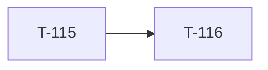

<!-- AUTO-GENERATED by ./scripts/ticket sync — DO NOT EDIT -->

# Ticket Lead Dashboard

## Running / Review

- **T-358** (3174) — factions.rs defeats its own unique index, and both sweeps were structurally blind to it [running] — THE MISSED INSTANCE. Seven shipped tickets and six filed ones (T-346..T-351) all enumerate this bug class, and NONE of them names apps/website/api/src/handlers/factions.rs.

WHY BOTH SWEEPS MISSED IT, which is the interesting part: it is the ONLY handler in the crate that takes a raw `Json<Value>` body (:87, :114) and delegates all required-field and emptiness validation to JSON Schema. So it has ZERO #[serde(default)] — invisible to the T-218/T-315..T-319 sweep — and ZERO string is_empty() — invisible to T-343's 100-site enumeration. Its one is_empty() (:29) is on `details: Vec<String>`, so a mechanical pass saw the file, classified that site as benign, and emitted nothing. It also has zero trim(). A file can be swept twice and still be unexamined.

THE DEFECT: `name` is projected out at :37 with `as_str().unwrap_or_default().to_string()` — no trim, no emptiness check — and bound untrimmed into three places, one of which is a UNIQUE KEY:
  :93-94 INSERT ... ON CONFLICT (owner_id, name) DO NOTHING
  :121   SELECT id FROM user_factions WHERE owner_id = $1 AND name = $2 AND id <> $3  (clash check)
  :140   UPDATE ... SET name = $2
backed by migrations/0006_user_factions.sql:16-17 CREATE UNIQUE INDEX idx_user_factions_owner_name.

The only server-side guard is "minLength": 1 at packages/tbd-schema/schema/faction-library.schema.json:17 — a LENGTH check, not a CONTENT check, with no pattern. Verified against the real schema: "   ", a single tab, a single newline, and "Soviet Army 1980s " all validate. So POST with name "\t" returns 201 with a faction whose entire display name is a tab; and POST "USA" then "USA " returns 201 TWICE — ON CONFLICT never fires because the byte strings differ, and the :121 clash check misses for the same reason, silently bypassing the 409 at :103.

IT DEFEATS A GATE THAT ALREADY EXISTS: tests/factions.rs:136-145 case T4 asserts a duplicate name returns CONFLICT. One trailing space turns that assertion's subject into a 201. Exactly T-351's complaint about arma_id — the test only ever posts clean values, so nothing pins it.

THE FIRST-PARTY SPA IS THE DELIVERY VECTOR: frontend/src/faction_manager.rs:92 already has the CORRECT guard (`doc.name.trim().is_empty()`) but only CHECKS — :106 then serialises the UNTRIMMED name. Typing a trailing space passes the client guard and ships the padding. Same second defect T-343 called out for warn_user: the platform normalises the same operator text two different ways depending which side you ask.

SEVERITY BOUND, checked rather than assumed — this is NOT T-346-class. The ORBAT/mission-doc faction key derives from `side`, not `name` (editor_ops.rs:1139-1145 `format!("faction-{side}")` and :1536 `f.key == side`), and `side` is enum-constrained so padding is rejected there. orbat_manager.rs:228 selects library rows by UUID and only LABELS with name. The sole equality comparison on user_factions.name anywhere in the repo is factions.rs:121 itself. So there is no clobber and no cross-table join collapse. The harm is a defeated unique constraint, two palette rows whose labels render IDENTICALLY because HTML collapses whitespace (so the operator cannot tell them apart or know which one an edit hit), and a padded name propagating into the mission doc at orbat_manager.rs:319 and :377.

FIX DIRECTION: the DO-NOT-NAIVELY-TRIM warning does NOT bind here — `name` has no other side to disagree with. But T-346's SHAPE argument does: a trim-only fix leaves name "\t" reachable, because that is a content problem, not a padding problem. Both halves are needed — reject a name empty after trimming, AND reject one not equal to its trimmed form — or normalise at the single :37 projection point. Add the test that tests/factions.rs:136-145 is missing.

LOAD-BEARING FOR WHOEVER FIXES THIS, from the adversarial verifier: adopting the generated contract type closes only HALF. `TbdFactionLibraryEntryName` (contract/generated/faction_library.rs:1089-1100) rejects len < 1 but does NOT TRIM — "\t" still passes. A fix that swaps in the generated type and stops there leaves the padding half open.

AND THE MECHANISM THAT HID THIS IS STILL LIVE, which is the more general finding: contract/generated/mod.rs declares five modules under a blanket #[allow(clippy::all, dead_code)] and only two are referenced anywhere. faction_library.rs (1282 lines), mission_editor.rs and loadout.rs are DEAD. So for the two HTTP write paths that have a schema at all, a typed, serde-enforcing, CI-drift-gated projection ALREADY EXISTS and is bypassed in favour of the runtime jsonschema validator — which is exactly why factions.rs has zero #[serde(default)] for a grep to find. Consider whether adopting the generated types is the real fix for the whole class rather than patching this one handler.

== DEFERRED 2026-07-26 BY OPERATOR DECISION, NOT CANCELLED ==
Recording a bug is most of its value; fixing it now is optional. The audits that produced this ticket were generating work faster than the run could close it, and the original T-182..T-297 feature backlog had not moved in hours. The operator's call, verbatim in substance: there will always be bugs, that is what developing is — knowing them is good, but spending the token budget on things that do not need fixing right now means nothing ships.
This is findable, fully diagnosed, and reproducible from the notes above. Promote it to `idea` when it actually blocks something, when it starts costing real time, or after the feature backlog lands. Nothing here was judged wrong — only not now.
- **T-363** (3179) — PATCH /missions/:id title has no guard at all, and semver is never validated [running] — BOTH CONFIRMED END TO END by T-348, and both worse than the ticket that sent it looking.

1. **missions.rs:393-395 — PATCH `title` has NO GUARD WHATSOEVER**, so an empty string clobbers a real title, not merely whitespace. The `is_empty()` check that was assumed to be here is actually on the CREATE path at :296, and that one is untrimmed. There is no CHECK constraint and no trigger in migrations 0001-0009, so nothing downstream catches it. A blank title is unrecoverable and sorts FIRST in the in-game mission browser.

2. **missions.rs:587/:598 — semver is never parsed.** No `semver` crate, no validator anywhere. Uniqueness is enforced by a DB unique index (0001_initial_schema.sql:803) on a `text` column, so `' 0.1.0 '` and `'0.1.0'` are DISTINCT btree keys: no 23505, the duplicate-version 409 never fires, the request returns 201 — and then :611-615 runs unconditionally and makes that shadow version the mission's `current_version_id`. So a padded version silently becomes the live one.

The semver half is the more interesting fix: validate the string as a real semver rather than only trimming it, because trimming leaves `"1"`, `"1.2"` and `"banana"` all acceptable. Check whether any existing row would fail validation before you enforce it — T-228 and T-357 both established that discipline, and T-357 measured that a naive tightening would have 400'd six real live missions.

Note T-346 owns handlers/missions.rs for the armory work and has SHIPPED, so the file is free.

== DEFERRED 2026-07-26 BY OPERATOR DECISION, NOT CANCELLED ==
Recording a bug is most of its value; fixing it now is optional. The audits that produced this ticket were generating work faster than the run could close it, and the original T-182..T-297 feature backlog had not moved in hours. The operator's call, verbatim in substance: there will always be bugs, that is what developing is — knowing them is good, but spending the token budget on things that do not need fixing right now means nothing ships.
This is findable, fully diagnosed, and reproducible from the notes above. Promote it to `idea` when it actually blocks something, when it starts costing real time, or after the feature backlog lands. Nothing here was judged wrong — only not now.
- **T-379** (3195) — role_played accepts a blank and replaces a populated scoreline [running] — handlers/telemetry.rs:461-470, bound at :475 — the `ON CONFLICT DO UPDATE` sets `role_played = EXCLUDED.role_played`, and the pre-transaction validation loop at :432-439 checks `arma_id` and `source_event_id` for blankness but **not `role_played`**.

It is a required String, so ABSENCE is a 400 (T-316's fix). Present-and-blank passes, and `''` replaces a populated role. Migration 0009 made the column `NOT NULL DEFAULT ''`, so `''` is a storable value — **NOT NULL does not close this.**

This is the same shape the file has already fixed twice: `outcome` rejects blank at :414-420 (T-316) and `source_match_id` rejects blank at :297-307 (T-347). role_played was simply missed by both.

Also in the same statement, and a genuine judgement call rather than an oversight: `discord_id = EXCLUDED.discord_id` binds a lookup result that is None when no user matches the arma_id, so a re-ingest after an UNLINK nulls a previously-populated discord_id. T-326 established that unlink SHOULD release the rows, so that is probably intended — but say so in a comment, because nothing currently does.

== DEFERRED 2026-07-26 BY OPERATOR DECISION, NOT CANCELLED ==
Recording a bug is most of its value; fixing it now is optional. The audits that produced this ticket were generating work faster than the run could close it, and the original T-182..T-297 feature backlog had not moved in hours. The operator's call, verbatim in substance: there will always be bugs, that is what developing is — knowing them is good, but spending the token budget on things that do not need fixing right now means nothing ships.
This is findable, fully diagnosed, and reproducible from the notes above. Promote it to `idea` when it actually blocks something, when it starts costing real time, or after the feature backlog lands. Nothing here was judged wrong — only not now.

## Ready

- **T-090** (900) — Map visualization program [ready] — Map Engine v2 through sea-band + contours @ `bd481cf1`. **Active:** **T-090.5.5** tree/veg/prop glyphs. Single lane.

## Next queued (top 10)

- **T-072** (720) — Ctrl multi-place [queued] — Hold Ctrl to place multiple copies without re-selecting asset.
- **T-073** (730) — Shift + map rotation [queued] — Shift-drag and map rotation widget for placed entities.
- **T-075** (750) — Spacebar flyTo vs widget [queued] — Spacebar centers selection; resolve flyTo vs transform widget conflict.
- **T-116** (1160) — Results POST to backend [queued] — SPLIT 2026-07-26. Mod half SHIPPED: TBD_ResultsReporter.c (682 lines, T-181.13.1) POSTs to /api/v1/ingest/match-results. Website half OPEN and folded into T-232 — event_hub.rs renders no result/outcome/match data at all. This row now tracks only the website half.
- **T-117** (1170) — Mission upload + validation UI [queued] — Web UI for mission upload and schema validation (API exists).
- **T-118** (1180) — Event ORBAT + identity linking UI [queued] — SPLIT 2026-07-26. DONE: identity-link UI (settings.rs:6-9,74-94, T-159.25) and the ORBAT selector (event_hub.rs:520-572, T-159.25a). OPEN residual is tracked by T-226 (PATCH /events/{id} has no caller), T-284 (clear_slot unreachable, admin cannot free a claimed slot) and T-231 (identity last mile). This row is a pointer, not work.
- **T-120** (1200) — Staging soak + golden mission smoke [queued] — Pinned game/mod version soak; golden-mission smoke on staging server.
- **T-146** (1470) — Asset Browser Data Wiring [queued] — Hook up T-150 registry items (vehicles/crates/…) to Asset Browser for map drag-place. Unblocked by T-150; after or parallel T-068.9 ingest preferred.
- **T-170** (1670) — Prod default flip to Leptos SPA [queued] — Make the Leptos SPA the production default: set `SPA_DIST_DIR` to the trunk release dist in the prod env, move the Discord OAuth redirect origin, staging soak, then flip. OPERATOR-GATED (env + Discord app settings are operator-held); claude-code prepares configs/runbook + verifies the staging soak gates. Runbook anchor: docs/website/DEV_RUNBOOK.md §SPA serving; T-159 finish program left this as the sole operator-gated residual.

## Dependency graph (scoped)

```mermaid
flowchart LR
  T115[T-115] --> T116[T-116]
```
