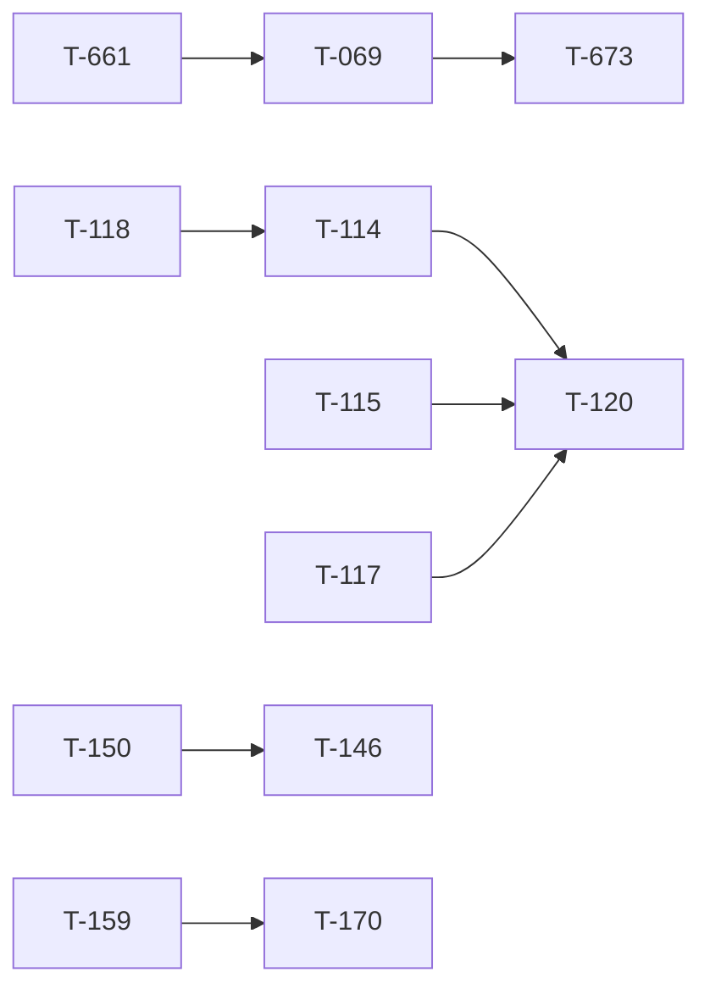

<!-- AUTO-GENERATED by ./scripts/ticket sync — DO NOT EDIT -->

# Ticket Lead Dashboard

## Running / Review

## Ready

- **T-090** (900) — Map visualization program [ready] — Map Engine v2 through sea-band + contours @ `bd481cf1`. **Active:** **T-090.5.5** tree/veg/prop glyphs. Single lane.
- **T-778** (4654) — Six more register-at-mount thread_local seams have no lifecycle guard — port the wave-129 idiom [ready] — MAJOR, found during wave 129's fix pass and filed rather than fixed because it spans four files outside that wave's owns. THE DEFECT SHAPE, proven twice in wave 129: a `thread_local` seam registered when a component mounts and never unregistered stays callable after the component dies. Backspace hide-chrome unmounts panels (mission_editor.rs, NO modal guard, and dialogs explicitly survive the hide), after which the stale closure REPORTS SUCCESS -- `true`, or a stale value -- while every `set` writes to DISPOSED signals, which reactive_graph 0.2.14 makes a SILENT NO-OP. A click reports success and does nothing: a dead click by lifecycle rather than by routing. TWO FAILURE MODES, and a naive fix closes only the first: (1) no unregister at all, so the stale hook answers forever; (2) an UNCONDITIONAL unregister, so a REMOUNT that installs before the dead component's cleanup runs is clobbered by that cleanup. VERIFIED BY THE ORCHESTRATOR 2026-08-08, `grep -c` per file -- each has register-at-mount seams and ZERO `ptr_eq` and ZERO `on_cleanup`: apps/website/frontend/src/ruler_tool.rs (RULER_CHAIN, 1 seam); apps/website/frontend/src/los_tool.rs (LOS_STATE, LOS_SAMPLER, VIEWSHED_STATE, 3 seams); apps/website/frontend/src/world_assets/mod.rs (register_render_ctx, 1 seam); apps/website/frontend/src/select_tool.rs (register_editor_selection, 1 seam -- this one is DOCUMENTED as deliberately leaking with the engine, so confirm the intent before changing it rather than assuming). THE FIX IS ALREADY WRITTEN AND SHIPPED TWICE -- port it, do not re-invent: `install_seam`/`unregister_seam` plus the `SeamRegistration` trait at apps/website/frontend/src/validation_panel.rs (wave 129, dac84b03) is the generic form covering four seams; eden_dock_right.rs's `install_select_zone` (f6a2b687) is the single-seam form. Register + `on_cleanup` unregister guarded by `Rc::ptr_eq` so only the LOSING registration is cleared. `on_cleanup` is Send + Sync-bound and `Rc<dyn Fn>` is !Send, so park the Rc in a `StoredValue::new_local` and read it back inside the cleanup -- cleanups run BEFORE arena nodes are removed, so the read is valid, and holding the clone keeps the allocation alive. DO NOT compare a bare `usize` address: the old Rc drops on re-register, so a later hook can be allocated at the freed address and a stale cleanup would wrongly clear it (ABA). For a signal-valued seam use the arena key `==` (slotmap versions its keys, so a recycled slot is not mistaken for its predecessor). ACCEPTANCE, three behavioural cases per seam, as wave 129 pinned them: install -> cleanup -> the read reports honest failure AND the stale hook is not called at all; install(A) -> install(B) -> A's cleanup -> B SURVIVES and still answers; never-installed -> honest failure. Perturb both ways: removing the cleanup must redden case 1, and removing the ptr_eq guard must redden case 2 ALONE -- case 2 is the one a naive fix gets wrong. WHY THIS IS URGENT RATHER THAN TIDY: in wave 129 a fix agent ADDED a new instance of this defect (validation_panel.rs `register_route_probe`) while a sibling agent was fixing the identical shape twelve lines away, and then made row clickability depend on it. The pattern is easy to get wrong and there was no shared idiom; now there is one. Audit every seam you touch and every seam you add.
- **T-779** (4655) — set_loadout discards the acknowledgement T-770 added, so the history tail fires over writes that never happened [ready] — RESIDUE of T-770 (wave 140), verified by the orchestrator 2026-08-08. T-770's whole point was that `commit_writes` counted closure CALLS rather than sink acknowledgements, so its WARNING arm was unreachable. The core half landed: `MissionDocCore::update_slot_loadout` (crates/map-engine-core/src/doc/store.rs:2784) now returns `bool` and returns `false` when the slot id is not in the document. THE FRONTEND HALF DID NOT. `editor_ops::set_loadout` (apps/website/frontend/src/editor_ops.rs:2005) calls `core.update_slot_loadout(id, loadout_json);` and then hardcodes `true` as the value of `did`, discarding the acknowledgement entirely. CONSEQUENCES, both live: (1) `crate::mission_history::after_local_edit()` fires whenever the OPS_CTX and doc merely EXIST, so a set_loadout against a stale or deleted slot id still marks the mission dirty and mints an undo step over a document that did not change; (2) any receipt built on this path still cannot distinguish a real write from a no-op, which is precisely the defect T-770 was filed to close. FIX: return the mutator's bool out of the closure instead of `true`, so `did` means what its name says, and gate `after_local_edit()` on it. Then check the callers — `arsenal.rs:1253` is the live one — and decide whether a refused write should surface to the operator rather than passing silently. ACCEPTANCE: a test that calls set_loadout with an id that is NOT in the document and asserts no history entry is minted and the mission is not dirtied; perturb by restoring the hardcoded `true` and watch it go red. Note arsenal.rs carries source pins naming `pub fn set_loadout` and its tail line (arsenal.rs:6180, :6205, :4897) — update them honestly, do not delete them.
- **T-780** (4656) — Connections have no line on the map, so CONN-DEL-001 can only be reached from the panel [ready] — DISCLOSED SCOPE GAP carried from T-768 (wave 140) and confirmed still open after the remediation run. T-768 delivered the connect gesture's pointer half once T-723 fixed the armed-pointerup path, so a connection can now be STARTED and FINISHED on the map. What it did not deliver is a rendered LINE: connections draw nothing, so there is no artifact to click, and CONN-DEL-001 (delete a connection) is reachable only from the panel's Delete control. An author who drew a connection on the map has no way to remove it on the map. THIS IS THE SAME SHAPE T-760 AND T-748 ALREADY CLOSED for markers and comments respectively: both needed a render lane in crates/map-engine-render/src/draw_order.rs plus the rebind tail in apps/website/frontend/src/mission_history.rs, and both are now shipped and can be copied rather than re-derived. RECIPE: add the connection lane to draw_order.rs and engine.rs the way the marker lane was added by T-760; feed it from the document, NOT from a slice's own owns — T-069 and T-672 independently established that a lane fed from a slice's own state goes stale after undo/redo/restore, which is why the feed comes first; then wire pick/hit-testing so a line can be selected, and route Delete through the existing path rather than authoring a second one. ACCEPTANCE: draw a connection, undo, redo, restore from IDB, and confirm the line survives each; then select the line on the map and delete it through the same code path the panel's Delete uses.
- **T-781** (4657) — Comments still cannot be composed — PLACE-COMMENT-001's last undelivered clause [ready] — RESIDUE of T-748 (wave 141) and, before it, T-651 (wave 114). The spec row PLACE-COMMENT-001 asks for comments that are 'Draggable, copy/paste, layerable, COMPOSABLE' plus a 'Comment icon at position'. T-748 (wave 141) delivered the map glyph, so the icon clause is closed. THE COMPOSABLE CLAUSE IS NOT: compositions capture from the SELECTION, and comments sit in no selection lane, so a comment can never be part of a composition. T-748's own diagnosis called this out — 'composable was a silent drop, which is what the HARD GATE bars' — and it is scope accounting rather than broken code: nothing misbehaves, the feature simply does not exist. THE INTERESTING QUESTION IS WHERE TO PUT COMMENTS. They are deliberately absent from the compiled mission (the same property that keeps them out of the render SoA before T-748 gave them a glyph), so a composition containing a comment must carry it as authoring metadata and must NOT emit it into the compiled output. Check how `place_composition` (crates/map-engine-core/src/doc/store.rs) captures and replays, and whether the comment can ride the same rows without reaching flatten. WATCH THE Z RULE: `place_composition` creates at z = 0.0 (see T-777) and that is on the operator's reserved decision surface with T-743 — do not change paste/composition landing semantics as part of this ticket; carry whatever the operator decides. ACCEPTANCE: select a comment together with entities, make a composition, place it, and confirm the comment comes back at the right offset, survives undo/redo/restore, and does NOT appear in the compiled mission.

## Next queued (top 10)

- **T-120** (1200) — Staging soak + golden mission smoke [queued] — Pinned game/mod version soak; golden-mission smoke on staging server.
- **T-146** (1470) — Asset Browser Data Wiring [queued] — Hook up T-150 registry items (vehicles/crates/…) to Asset Browser for map drag-place. Unblocked by T-150; after or parallel T-068.9 ingest preferred.
- **T-170** (1670) — Prod default flip to Leptos SPA [queued] — Make the Leptos SPA the production default: set `SPA_DIST_DIR` to the trunk release dist in the prod env, move the Discord OAuth redirect origin, staging soak, then flip. OPERATOR-GATED (env + Discord app settings are operator-held); claude-code prepares configs/runbook + verifies the staging soak gates. Runbook anchor: docs/website/DEV_RUNBOOK.md §SPA serving; T-159 finish program left this as the sole operator-gated residual.
- **T-673** (4300) — Marker style and Area markers — the $defs/marker widening [queued] — Six attribute ids: `ATTR-FIELD-MRK-SIZE`, `-MRK-ROTATION`, `-MRK-SHAPE`, `-MRK-BRUSH`, `-MRK-COLOR`, `-MRK-ALPHA`. BLOCKING EVIDENCE: `$defs/marker` in the compiled schema is exactly {x, z, icon, label} and CLOSED — the compiled schema carries 25 `"additionalProperties": false`, so these fields are contract-blocked, not merely unbuilt. Icon-vs-Area is Eden's entire second marker model, so this is a widening plus a mod-side reader, not a UI ticket. MUST SHIP AFTER T-069, which authors the four schema-carried fields; folding these into T-069 would convert a factory-dispatchable ticket into a workbench one, which is the specific mistake this split exists to prevent. EXECUTOR IS `workbench` DELIBERATELY: this modifies `packages/tbd-schema/schema/mission.schema.json` and/or `apps/mod/tbd-framework/`, which the CLAUDE.md executor gate puts out of reach of any coding agent. The factory filters on executor, so this tagging is the safety mechanism — do not flip it to claude-code.

EXECUTOR CORRECTED 2026-08-02: was filed `workbench` on the mistaken reading that any .c file needs the Arma Workbench GUI. It does not — scripts/mod/compile.sh compiles tbd-framework against the native Linux dedicated server headlessly, verified: "OK: compiled clean, 5707 files, 11182 classes, 832 ms, no Workbench". Schema edits are plain JSON. This is factory work. Per the model-routing rule, the .c portion routes to Fable 5 even though the executor is claude-code.

SCHEMA HALF SPLIT OUT to T-706 (one widening pass for the whole program). This ticket is the Enfusion reader plus any editor UI; it does not touch packages/tbd-schema.
- **T-674** (4310) — T-216 follow-on: slot identity reaches the wire [queued] — Four attribute ids — `ATTR-FIELD-OBJ-CALLSIGN`, `-OBJ-RANK`, `-OBJ-STANCE`, `-OBJ-UNIT-NAME` — plus the two TBD-only keys `tag` and `leaderSlotId`. `OBJ-UNIT-NAME` rides this slice rather than standing alone; the sweep says so explicitly. THE CONTRACT DELTA IS ALREADY WRITTEN OUT at `crates/map-engine-core/src/mission/flatten.rs`:2620-2632 — five `$defs/slot` / `$defs/group` keys. T-216 is `shipped`, but it shipped THE LEDGER AND ITS TRIPWIRE, not the fix: flatten.rs:2584-2649 enumerates six author-facing values the compile silently drops (a squad's leaderSlotId, a slot's tag / callsign / rank / stance, and the entire vehicle roster) and records that `make verify-t180` stayed green throughout BECAUSE NOT ONE OF ITS 22 TESTS CHECKED. `stance` additionally needs an Enfusion spawn-pose call — word-boundary `stance` in apps/mod is ZERO (the 39-file `grep -rl stance` result is every hit being the substring inside `instance`). Widening `/compiled` without care 500s every mission. Related: T-242. EXECUTOR IS `workbench` DELIBERATELY: this modifies `packages/tbd-schema/schema/mission.schema.json` and/or `apps/mod/tbd-framework/`, which the CLAUDE.md executor gate puts out of reach of any coding agent. The factory filters on executor, so this tagging is the safety mechanism — do not flip it to claude-code.

EXECUTOR CORRECTED 2026-08-02: was filed `workbench` on the mistaken reading that any .c file needs the Arma Workbench GUI. It does not — scripts/mod/compile.sh compiles tbd-framework against the native Linux dedicated server headlessly, verified: "OK: compiled clean, 5707 files, 11182 classes, 832 ms, no Workbench". Schema edits are plain JSON. This is factory work. Per the model-routing rule, the .c portion routes to Fable 5 even though the executor is claude-code.

SCHEMA HALF SPLIT OUT to T-706 (one widening pass for the whole program). This ticket is the Enfusion reader plus any editor UI; it does not touch packages/tbd-schema.
- **T-675** (4320) — Vehicle roster reaches the game — the compile half of T-076 [queued] — The cross-boundary half that was split out of T-076 so the crew UI could be dispatched. No attribute ids of its own; it closes the sixth entry in the T-216 drop ledger. BLOCKING EVIDENCE: `crates/map-engine-core/src/mission/flatten.rs`:2631 states the delta as "document root + a new $def", key `vehicles`, and :2634-2640 PROVES the already-declared `entities[]` cannot carry it — `$defs/alias` is `^(kit|comp|veh|preset|layer|prop|item):[a-z0-9_]+$` and `apps/mod/tbd-framework/Data/registry.json` holds exactly ONE `veh:` row, so alias substitution would reproduce the T-200 silent-substitution defect with a 10-tonne vehicle. Without this, T-076's crew UI authors state the game never sees. EXECUTOR IS `workbench` DELIBERATELY: this modifies `packages/tbd-schema/schema/mission.schema.json` and/or `apps/mod/tbd-framework/`, which the CLAUDE.md executor gate puts out of reach of any coding agent. The factory filters on executor, so this tagging is the safety mechanism — do not flip it to claude-code.

EXECUTOR CORRECTED 2026-08-02: was filed `workbench` on the mistaken reading that any .c file needs the Arma Workbench GUI. It does not — scripts/mod/compile.sh compiles tbd-framework against the native Linux dedicated server headlessly, verified: "OK: compiled clean, 5707 files, 11182 classes, 832 ms, no Workbench". Schema edits are plain JSON. This is factory work. Per the model-routing rule, the .c portion routes to Fable 5 even though the executor is claude-code.

SCHEMA HALF SPLIT OUT to T-706 (one widening pass for the whole program). This ticket is the Enfusion reader plus any editor UI; it does not touch packages/tbd-schema.
- **T-676** (4330) — Trigger activation and effects — the Enfusion runtime [queued] — Twelve of the thirteen `ATTR-FIELD-TRG-*` ids: everything except the geometry/palette half, which is the factory ticket T-079. An activation model (condition, repeat, timeout, owner side) and an effects model are a NEW ENFUSION RUNTIME in `apps/mod/tbd-framework/` plus the schema keys to carry them. Geometry can ride the shipped T-582 zone draw tool, which is why the editor half was separable at all. Read `$defs/zoneRules`' 16 keys before designing this: they have no ATTR-FIELD id and were never triaged against Eden, but they are the closest thing TBD already has to trigger semantics. EXECUTOR IS `workbench` DELIBERATELY: this modifies `packages/tbd-schema/schema/mission.schema.json` and/or `apps/mod/tbd-framework/`, which the CLAUDE.md executor gate puts out of reach of any coding agent. The factory filters on executor, so this tagging is the safety mechanism — do not flip it to claude-code.

EXECUTOR CORRECTED 2026-08-02: was filed `workbench` on the mistaken reading that any .c file needs the Arma Workbench GUI. It does not — scripts/mod/compile.sh compiles tbd-framework against the native Linux dedicated server headlessly, verified: "OK: compiled clean, 5707 files, 11182 classes, 832 ms, no Workbench". Schema edits are plain JSON. This is factory work. Per the model-routing rule, the .c portion routes to Fable 5 even though the executor is claude-code.

SCHEMA HALF SPLIT OUT to T-706 (one widening pass for the whole program). This ticket is the Enfusion reader plus any editor UI; it does not touch packages/tbd-schema.
- **T-677** (4340) — Waypoints — group movement orders [queued] — OPERATOR DECISION 2026-08-02: AI units ARE coming, so this is no longer speculative. Was titled "blocked on AI units existing at all" because every slot currently spawns AI-disabled (TBD_SpawnManager.c:963,1166), which left 13 attribute ids with no subject.

Nine `ATTR-FIELD-WP-*` ids plus six interaction ids (`RIGHT-MODE-004`, `CONN-WP-ACT-001`, `CONN-WP-ATTACH-001`, `CONN-RAND-START-001`, `KEY-WP-001`, `ACTION-WP-QUICK-001`). THE GATE IS NOT THE SCHEMA — it is that there is no subject. `apps/mod/tbd-framework/.../TBD_SpawnManager.c`:963 and :1166 spawn every body with AI DISABLED, so a waypoint has nothing to command. The attributes sweep calls this "the single biggest scoping correction available to T-079": waypoints cannot be built, in the editor or anywhere else, until AI units exist. Ship together with the group AI state ticket or not at all — they share the gate exactly. EXECUTOR IS `workbench` DELIBERATELY: this modifies `packages/tbd-schema/schema/mission.schema.json` and/or `apps/mod/tbd-framework/`, which the CLAUDE.md executor gate puts out of reach of any coding agent. The factory filters on executor, so this tagging is the safety mechanism — do not flip it to claude-code.

EXECUTOR CORRECTED 2026-08-02: was filed `workbench` on the mistaken reading that any .c file needs the Arma Workbench GUI. It does not — scripts/mod/compile.sh compiles tbd-framework against the native Linux dedicated server headlessly, verified: "OK: compiled clean, 5707 files, 11182 classes, 832 ms, no Workbench". Schema edits are plain JSON. This is factory work. Per the model-routing rule, the .c portion routes to Fable 5 even though the executor is claude-code.

SCHEMA HALF SPLIT OUT to T-706 (one widening pass for the whole program). This ticket is the Enfusion reader plus any editor UI; it does not touch packages/tbd-schema.
- **T-678** (4350) — Group AI state: combat mode, behaviour, formation, speed [queued] — OPERATOR DECISION 2026-08-02: AI units ARE coming — this ticket has a subject now. Previously gated behind the same question as T-677.

Four attribute ids: `ATTR-FIELD-GRP-COMBAT-MODE`, `-GRP-BEHAVIOUR`, `-GRP-FORMATION`, `-GRP-SPEED-MODE`. Same AI gate as waypoints, and the sweep says they should ship together or not at all. Evidence that nothing exists to hang these on: word-boundary `combatMode` and `speedMode` return ZERO in both the frontend and the mod tree; `formation` returns one frontend hit and it is prose in a comment at editor_ops.rs:1324. `$defs/group` is closed, so each field is a widening plus an Enfusion reader. EXECUTOR IS `workbench` DELIBERATELY: this modifies `packages/tbd-schema/schema/mission.schema.json` and/or `apps/mod/tbd-framework/`, which the CLAUDE.md executor gate puts out of reach of any coding agent. The factory filters on executor, so this tagging is the safety mechanism — do not flip it to claude-code.

EXECUTOR CORRECTED 2026-08-02: was filed `workbench` on the mistaken reading that any .c file needs the Arma Workbench GUI. It does not — scripts/mod/compile.sh compiles tbd-framework against the native Linux dedicated server headlessly, verified: "OK: compiled clean, 5707 files, 11182 classes, 832 ms, no Workbench". Schema edits are plain JSON. This is factory work. Per the model-routing rule, the .c portion routes to Fable 5 even though the executor is claude-code.

SCHEMA HALF SPLIT OUT to T-706 (one widening pass for the whole program). This ticket is the Enfusion reader plus any editor UI; it does not touch packages/tbd-schema.
- **T-679** (4360) — Placement scatter: radius and area shape [queued] — Three attribute ids: `ATTR-FIELD-OBJ-PLACEMENT-RADIUS`, `-OBJ-SHAPE`, `-GRP-PLACEMENT-RADIUS`. `$defs/slot` and `$defs/group` are both closed, so this is one key on each plus a spawn-side reader that scatters within the radius. THE CHEAPEST COHERENT SCHEMA-WIDENING SLICE in the workbench program, and a 2D top-down editor is the best possible surface for it — the scatter circle is drawable — so it is the one most worth doing early if the operator wants an easy first workbench win. EXECUTOR IS `workbench` DELIBERATELY: this modifies `packages/tbd-schema/schema/mission.schema.json` and/or `apps/mod/tbd-framework/`, which the CLAUDE.md executor gate puts out of reach of any coding agent. The factory filters on executor, so this tagging is the safety mechanism — do not flip it to claude-code.

EXECUTOR CORRECTED 2026-08-02: was filed `workbench` on the mistaken reading that any .c file needs the Arma Workbench GUI. It does not — scripts/mod/compile.sh compiles tbd-framework against the native Linux dedicated server headlessly, verified: "OK: compiled clean, 5707 files, 11182 classes, 832 ms, no Workbench". Schema edits are plain JSON. This is factory work. Per the model-routing rule, the .c portion routes to Fable 5 even though the executor is claude-code.

SCHEMA HALF SPLIT OUT to T-706 (one widening pass for the whole program). This ticket is the Enfusion reader plus any editor UI; it does not touch packages/tbd-schema.

## Dependency graph (scoped)

```mermaid
flowchart LR
  T661[T-661] --> T069[T-069]
  T118[T-118] --> T114[T-114]
  T114[T-114] --> T120[T-120]
  T115[T-115] --> T120[T-120]
  T117[T-117] --> T120[T-120]
  T150[T-150] --> T146[T-146]
  T159[T-159] --> T170[T-170]
  T069[T-069] --> T673[T-673]
```
