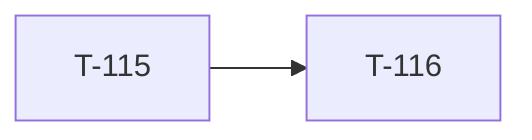

<!-- AUTO-GENERATED by ./scripts/ticket sync — DO NOT EDIT -->

# Ticket Lead Dashboard

## Running / Review

## Ready

- **T-090** (900) — Map visualization program [ready] — Map Engine v2 through sea-band + contours @ `bd481cf1`. **Active:** **T-090.5.5** tree/veg/prop glyphs. Single lane.
- **T-411** (3232) — Nothing resets the gate database -- per-wave DB names, not a periodic reset [ready] — T-399 fixed one ratchet; this is the mechanism that guarantees the class recurs. ensure_gate_db (scripts/platform/wave.sh:~93-105 pre-T-406) deliberately never drops tbd_gate_it for speed, so every suite's residue accumulates forever. T-406 was dispatched over that same file in wave 3 and EXPLICITLY DID NOT add a reset -- it scoped finding 6 down to asserting the flock invariant instead, and said so. So this is unowned and unreconciled by design, not by oversight.

RECOMMENDATION from T-399's agent, whose reasoning the command center endorses: per-wave database NAMES, not a periodic reset.
  A periodic reset is a SCHEDULED fix to an UNSCHEDULED problem. It makes the ratchet intermittent instead of permanent, which is strictly WORSE for diagnosis -- a suite that fails only on runs 21-40 of a cycle reads exactly like a flake, and this program's most expensive failure mode is a false-red that sends an agent hunting through its own diff. It also cannot be reasoned about at the moment a gate goes red, because 'how dirty is it right now' is not knowable from the verdict.
  CONCRETELY: ensure_gate_db derives tbd_gate_w<N> from the wave number, creates it if absent, drops waves older than the last two.
  THE SPEED ARGUMENT IN THE CURRENT COMMENT DOES NOT SURVIVE CONTACT WITH THE NUMBER: migrations on a fresh DB are the entire cost -- measured, the first run against an empty tbd_t399_cold was 11.5s INCLUDING a compile, and the migrate itself is sub-second. The expensive thing was never the schema, it is the 609-crate build, which CARGO_TARGET_DIR already shares and which this does not touch.
  TWO PROPERTIES IT BUYS: (a) a wave's verdict becomes reproducible after the fact -- right now 'the identical tree passed against a fresh cold DB' is a discovery each time; (b) it composes with T-398's shared-database mechanism 2 and registry_compat's fixed-UUID race, both of which are 'one database, many concurrent writers' -- narrowing the blast radius to one wave shrinks both without solving either.
  KEEP the operator TEST_DATABASE_URL override exactly as it is; it is the escape hatch wave 1 shipped against.

Related: T-410 is the catalogue of ratchets this mechanism will keep producing.
- **T-425** (3264) — T-215's vehicle placement: the alias table flatten needs, and four authoring gaps it disclosed [ready] — Residue of wave 5's T-215, which shipped real vehicle map placement (position, faction, cargo) with a proven save/reload round trip. All of the below is disclosed by the agent or the verifier, none of it is a regression.

1. BLOCKS THE EMISSION PATH -- there is no ResourceName -> `veh:` alias table. `$defs/entity.alias` is `^(kit|comp|veh|preset|layer|prop|item):[a-z0-9_]+$`, a REGISTRY ALIAS, not a ResourceName. `kit-aliases.json` maps characters to `kit:` only; the sole `veh:m151_mg` in the repo is hardcoded in two sample files. Flatten cannot emit a valid `entity.alias` for T-215's rows until a table mirroring kit-aliases.json's shape exists. Mapping ResourceName->alias without one would drop every vehicle but m151_mg, or substitute a different one -- the T-200 silent-substitution defect with a vehicle instead of a rifleman.

2. THE FLATTEN DELTA, worked out and ready to use: `cargo[]` -> `entity.inventory` byte-identical, no transform (T-215 emitted `$defs/entityInventory` verbatim). `faction` <- `factionId` stripped of the `faction-` prefix and lowercased, falling back to `squadId -> squad.factionId`. `entity.faction` is optional, so a squad-less vehicle is schema-valid without it.

3. STALE PROSE in `mission.schema.json` (T-242's file, left alone): the top-level `entities` description still asserts 'the editor's vehicle row is {id, resourceName, position, squadId} ... with nowhere to author contents'. As of T-215 there is somewhere.

4. PLACED VEHICLES ARE NOT SELECTABLE OR DRAGGABLE. They render (`vehicle_xy_flat` -> `vehicles_bind`) but are off the slot SoA, so pick/marquee/drag skip them. Position is authored at drop and edited only by delete-and-replace; rotation stays 0.0 because the Placed row has no heading field. Deliberate -- putting them in the slot selection would read 'SEL 1' with nothing highlighted, since that selection is the slot SoA.

5. NOT VERIFIED LIVE, and it should be. Neither T-215 (its worktree could not be served -- :3000 runs from the main checkout) nor the wave verifier (browser tooling unavailable: `list_connected_browsers` returned empty on four attempts) placed a vehicle in a browser. What IS established: the served bundle is post-merge (dist rebuilt 21:17 vs merge 21:16:32) and contains `vehiclesById` x5, `factionId` x3, `cargo` x14. UNVERIFIED: that a vehicle can be placed, that it persists across reload, that cargo authoring works, and T-215's four claims in item 4. A browser pass is cheap and would close it.

CONFIRMED SOUND, do not re-audit: T-215's design call that a map-placed vehicle carries NO squadId is correct and the verifier proved why. Attaching would have hit `place_orbat.rs:157-161`, where `is_open_for_placement` counts a squad holding ANY vehicle as authored -- so attaching closes the side's current squad and the next character placement mints a fresh one, silently splitting the fireteam being built around it. That is the T-321 one-squad-per-click defect.
- **T-427** (3266) — Paginate or slim GET /registry and /registry/compat for editor first open [ready] — Follow-on from T-245 (wave 6). T-245 session-caches registry+compat so editor REMOUNTS skip the ~7MB dual fetch, but the first SPA open in a session still GETs both unpaginated endpoints and walks all compat edges for cargo_defaults_by_character.

Repro: cold-load /missions/:id/edit; Network shows full GET /api/v1/registry and /api/v1/registry/compat (~1.8k items / ~20k edges). Remount within the same wasm session does not re-fetch (covered by t245_registry_session).

Cure lives in API pagination / narrower endpoints + frontend DTO/client — outside T-245 owns (mission_editor.rs only).

## Next queued (top 10)

- **T-072** (720) — Ctrl multi-place [queued] — Hold Ctrl to place multiple copies without re-selecting asset.
- **T-073** (730) — Shift + map rotation [queued] — Shift-drag and map rotation widget for placed entities.
- **T-075** (750) — Spacebar flyTo vs widget [queued] — Spacebar centers selection; resolve flyTo vs transform widget conflict.
- **T-116** (1160) — Results POST to backend [queued] — SPLIT 2026-07-26. Mod half SHIPPED: TBD_ResultsReporter.c (682 lines, T-181.13.1) POSTs to /api/v1/ingest/match-results. Website half OPEN and folded into T-232 — event_hub.rs renders no result/outcome/match data at all. This row now tracks only the website half.
- **T-117** (1170) — Mission upload + validation UI [queued] — Web UI for mission upload and schema validation (API exists).
- **T-118** (1180) — Event ORBAT + identity linking UI [queued] — SPLIT 2026-07-26. DONE: identity-link UI (settings.rs:6-9,74-94, T-159.25) and the ORBAT selector (event_hub.rs:520-572, T-159.25a). OPEN residual is tracked by T-226 (PATCH /events/{id} has no caller), T-284 (clear_slot unreachable, admin cannot free a claimed slot) and T-231 (identity last mile). This row is a pointer, not work.
- **T-120** (1200) — Staging soak + golden mission smoke [queued] — Pinned game/mod version soak; golden-mission smoke on staging server.
- **T-146** (1470) — Asset Browser Data Wiring [queued] — Hook up T-150 registry items (vehicles/crates/…) to Asset Browser for map drag-place. Unblocked by T-150; after or parallel T-068.9 ingest preferred.
- **T-170** (1670) — Prod default flip to Leptos SPA [queued] — Make the Leptos SPA the production default: set `SPA_DIST_DIR` to the trunk release dist in the prod env, move the Discord OAuth redirect origin, staging soak, then flip. OPERATOR-GATED (env + Discord app settings are operator-held); claude-code prepares configs/runbook + verifies the staging soak gates. Runbook anchor: docs/website/DEV_RUNBOOK.md §SPA serving; T-159 finish program left this as the sole operator-gated residual.

## Dependency graph (scoped)

```mermaid
flowchart LR
  T115[T-115] --> T116[T-116]
```
