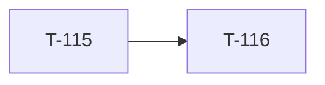

<!-- AUTO-GENERATED by ./scripts/ticket sync — DO NOT EDIT -->

# Ticket Lead Dashboard

## Running / Review

- **T-387** (3203) — render-check / gate residual after T-339: dev-login single Discord id (not api_proxy) [running] — NARROWED after W61 (T-339 shipped). api_proxy half-hydrate CLOSED (smokes.rs defaults api_proxy to :8080; gate --api-proxy).

MEASURED residual (W64 attempt, STOP — owns collide with T-560):
- apps/website/api/src/handlers/dev.rs:14 DEV_USER_ID fixed for all roles
- ON CONFLICT updates role on same discord_id; issue_session does not revoke prior family
- IT corpus documents landmine: misc_integration.rs:288-293, missions.rs:1105-1111

Fix lives in handlers/dev.rs — sequence AFTER T-560 (same owns). Do not re-litigate api_proxy.
Owns for the real fix: apps/website/api/src/handlers/dev.rs (+ ITs that assume one discord_id).
- **T-561** (3414) — T-559 Class-R still hollow — block-comment / string decoy opt(&row.briefing) [running] — FOUND by W64 adversarial verifier (DIRTY MAJOR) after T-559.

strip_rust_line_comments only drops // lines. Both wires → None plus:
- /* opt(&row.briefing) */ → PASS
- let _ = "opt(&row.briefing)"; → PASS
// decoy still RED (T-559 held).

Repro: replace both opt(&row.briefing) with None; leave /* opt(&row.briefing) */ in adopt_payload and apply_row; cargo test hydrate_wires_row_briefing green.
- **T-562** (3415) — T-560 Class-R still hollow — string/format! SET arma_id = COALESCE decoy [running] — FOUND by W64 adversarial verifier (DIRTY MAJOR) after T-560.

Comment strip works; contains("SET arma_id = COALESCE(arma_id") keeps string literals.
Delete live UPDATE + leave needle in let _decoy = "…" or format!("…") → PASS while INSERT stays NULL.
Claimed // + bind attacks still RED.

Repro: remove COALESCE UPDATE; add string/format! decoy with the needle; Class-R green; concurrent cold race can return.

## Ready

- **T-090** (900) — Map visualization program [ready] — Map Engine v2 through sea-band + contours @ `bd481cf1`. **Active:** **T-090.5.5** tree/veg/prop glyphs. Single lane.

## Next queued (top 10)

- **T-072** (720) — Ctrl multi-place [queued] — Hold Ctrl to place multiple copies without re-selecting asset.
- **T-073** (730) — Shift + map rotation [queued] — Shift-drag and map rotation widget for placed entities.
- **T-075** (750) — Spacebar flyTo vs widget [queued] — Spacebar centers selection; resolve flyTo vs transform widget conflict.
- **T-116** (1160) — Results POST to backend [queued] — SPLIT 2026-07-26. Mod half SHIPPED: TBD_ResultsReporter.c (682 lines, T-181.13.1) POSTs to /api/v1/ingest/match-results. Website half OPEN and folded into T-232 — event_hub.rs renders no result/outcome/match data at all. This row now tracks only the website half.
- **T-117** (1170) — Mission upload + validation UI [queued] — Web UI for mission upload and schema validation (API exists).
- **T-118** (1180) — Event ORBAT + identity linking UI [queued] — SPLIT 2026-07-26. DONE: identity-link UI (settings.rs:6-9,74-94, T-159.25) and the ORBAT selector (event_hub.rs:520-572, T-159.25a). OPEN residual is tracked by T-226 (PATCH /events/{id} has no caller), T-284 (clear_slot unreachable, admin cannot free a claimed slot) and T-231 (identity last mile). This row is a pointer, not work.
- **T-120** (1200) — Staging soak + golden mission smoke [queued] — Pinned game/mod version soak; golden-mission smoke on staging server.
- **T-146** (1470) — Asset Browser Data Wiring [queued] — Hook up T-150 registry items (vehicles/crates/…) to Asset Browser for map drag-place. Unblocked by T-150; after or parallel T-068.9 ingest preferred.
- **T-170** (1670) — Prod default flip to Leptos SPA [queued] — Make the Leptos SPA the production default: set `SPA_DIST_DIR` to the trunk release dist in the prod env, move the Discord OAuth redirect origin, staging soak, then flip. OPERATOR-GATED (env + Discord app settings are operator-held); claude-code prepares configs/runbook + verifies the staging soak gates. Runbook anchor: docs/website/DEV_RUNBOOK.md §SPA serving; T-159 finish program left this as the sole operator-gated residual.

## Dependency graph (scoped)

```mermaid
flowchart LR
  T115[T-115] --> T116[T-116]
```
