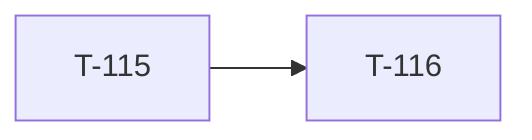

<!-- AUTO-GENERATED by ./scripts/ticket sync — DO NOT EDIT -->

# Ticket Lead Dashboard

## Running / Review

## Ready

- **T-090** (900) — Map visualization program [ready] — Map Engine v2 through sea-band + contours @ `bd481cf1`. **Active:** **T-090.5.5** tree/veg/prop glyphs. Single lane.
- **T-439** (3278) — Objects palette aliases need prop:/comp: rows in mod Data/registry.json [ready] — Residual from T-254 / wave 9 N5. Editor synthesises prop:*/comp:* aliases for crate|other (~333 workbench kinds); mod Data/registry.json has 1 comp: (comp:checkpoint_small) and 0 prop: entries. SpawnMissionEntities warn+skips unknown aliases.

Repro: place a non-checkpoint Objects leaf → compile entities[] → world-boot → spawn warns and skips; only checkpoint_small resolves.

Cure: export/register prop: and comp: rows for Objects-eligible kinds (or narrow palette to known aliases until registry catches up).
- **T-442** (3281) — Event Hub SPA still fetches global /modpacks/current ignoring event.modpack_id [ready] — Residual from T-260 / wave 11 adversarial MINOR W11-V1. API now returns events.server_id and events.modpack_id (migration 0011 + handlers), but apps/website/frontend/src/event_hub.rs still GETs /modpacks/current for the Hub chip; EventHub DTO lacks those fields.

Repro: create event with modpack_id set; Hub UI still shows global current pack.

Cure: wire event_hub.rs (+ dto) to prefer event.modpack_id when present, fall back to /modpacks/current only when null.
- **T-444** (3283) — make seed does not apply wiki pages (content_golden only) [ready] — Residual from T-263 / wave 12 adversarial MINOR. make seed now applies vehicle_database.sql, but wiki manuals remain only in content_golden.sql (not in the seed recipe). Fresh seed DB → GET /wiki empty → SPA "No manuals yet." (explicit empty, not silent mock).

Repro: make db-up + make seed on empty DB; curl GET /api/v1/wiki → data:[]; vehicles have rows.

Cure: extract wiki INSERT seed (or include content_golden wiki section) into seeds/ + Makefile seed line, same shape as vehicle_database.sql.

## Next queued (top 10)

- **T-072** (720) — Ctrl multi-place [queued] — Hold Ctrl to place multiple copies without re-selecting asset.
- **T-073** (730) — Shift + map rotation [queued] — Shift-drag and map rotation widget for placed entities.
- **T-075** (750) — Spacebar flyTo vs widget [queued] — Spacebar centers selection; resolve flyTo vs transform widget conflict.
- **T-116** (1160) — Results POST to backend [queued] — SPLIT 2026-07-26. Mod half SHIPPED: TBD_ResultsReporter.c (682 lines, T-181.13.1) POSTs to /api/v1/ingest/match-results. Website half OPEN and folded into T-232 — event_hub.rs renders no result/outcome/match data at all. This row now tracks only the website half.
- **T-117** (1170) — Mission upload + validation UI [queued] — Web UI for mission upload and schema validation (API exists).
- **T-118** (1180) — Event ORBAT + identity linking UI [queued] — SPLIT 2026-07-26. DONE: identity-link UI (settings.rs:6-9,74-94, T-159.25) and the ORBAT selector (event_hub.rs:520-572, T-159.25a). OPEN residual is tracked by T-226 (PATCH /events/{id} has no caller), T-284 (clear_slot unreachable, admin cannot free a claimed slot) and T-231 (identity last mile). This row is a pointer, not work.
- **T-120** (1200) — Staging soak + golden mission smoke [queued] — Pinned game/mod version soak; golden-mission smoke on staging server.
- **T-146** (1470) — Asset Browser Data Wiring [queued] — Hook up T-150 registry items (vehicles/crates/…) to Asset Browser for map drag-place. Unblocked by T-150; after or parallel T-068.9 ingest preferred.
- **T-170** (1670) — Prod default flip to Leptos SPA [queued] — Make the Leptos SPA the production default: set `SPA_DIST_DIR` to the trunk release dist in the prod env, move the Discord OAuth redirect origin, staging soak, then flip. OPERATOR-GATED (env + Discord app settings are operator-held); claude-code prepares configs/runbook + verifies the staging soak gates. Runbook anchor: docs/website/DEV_RUNBOOK.md §SPA serving; T-159 finish program left this as the sole operator-gated residual.

## Dependency graph (scoped)

```mermaid
flowchart LR
  T115[T-115] --> T116[T-116]
```
