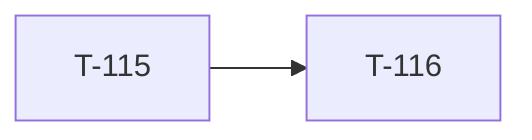

<!-- AUTO-GENERATED by ./scripts/ticket sync — DO NOT EDIT -->

# Ticket Lead Dashboard

## Running / Review

## Ready

- **T-090** (900) — Map visualization program [ready] — Map Engine v2 through sea-band + contours @ `bd481cf1`. **Active:** **T-090.5.5** tree/veg/prop glyphs. Single lane.
- **T-435** (3274) — Pin arland z_bounds polygon in flatten zone tests [ready] — MINOR from wave 8 verifier on T-201. Everon z_bounds is pinned ([[0,0],[12800,0],…]); arland uses terrain_bounds("arland")→4096² but no flatten-level test asserts that polygon.

Repro: cargo test -p map-engine-core --features mission — no arland z_bounds size assert.

Cure: unit test with terrain=arland expecting 4096² ring.
- **T-446** (3285) — CMS hero image upload needs web-sys FormData features [ready] — Residual from T-267 / wave 14. Hero upload button now errors honestly instead of fake success; multipart POST /cms/uploads needs web-sys FormData/File features in apps/website/frontend/Cargo.toml (+ likely client helper). Outside T-267 owns.

Repro: CMS Content → hero upload → error toast; /cms/uploads never called.

Cure: enable FormData/File features, wire multipart api helper, POST /cms/uploads and set thumbnail_url.
- **T-467** (3306) — verify-t438/t456 still unwired from Makefile/CI siblings [ready] — Residual from wave 25 adversarial N2. wave.sh wires verify-t438 and verify-t456 (T-463), but Makefile/CI have no sibling targets (same shape as pre-T-452 for other verifies).

Repro: make ci-local / ci.yml pass while scripts/mod/verify-t438*.sh is deleted.

Cure: add Makefile + CI steps mirroring wave.sh, or document intentional wave-only scope with a pin.
- **T-475** (3314) — T-446 Class-R greens comment-out FormData + unpinned absolute URL [ready] — Residual from wave 28 adversarial MAJOR×2 on T-446.
(1) content.rs Class-R uses raw CARGO.contains("\"FormData\"") — commenting the feature line (`# "FormData",`) still PASS because the string remains in the file. Same comment-needle class as T-460/T-461.
(2) Live handle_hero calls absolute_cms_upload_url(&raw) so Publish gets http(s) for T-405 validated_thumbnail, but Class-R never mentions absolute_cms_upload_url — replacing with `let url = raw;` still greens all content::tests (11/11).

Repro: `# "FormData",` in Cargo.toml → hero_multipart_upload_is_wired_not_stubbed PASS; `let url = raw;` → content::tests PASS.

Cure: strip // and # comments (and TOML string-safe comment lines) before Cargo FormData/File/FileList pins; require live prod call absolute_cms_upload_url(…) on the upload Ok path (not comment-only). RED→GREEN on both verifier perturbations.

## Next queued (top 10)

- **T-072** (720) — Ctrl multi-place [queued] — Hold Ctrl to place multiple copies without re-selecting asset.
- **T-073** (730) — Shift + map rotation [queued] — Shift-drag and map rotation widget for placed entities.
- **T-075** (750) — Spacebar flyTo vs widget [queued] — Spacebar centers selection; resolve flyTo vs transform widget conflict.
- **T-116** (1160) — Results POST to backend [queued] — SPLIT 2026-07-26. Mod half SHIPPED: TBD_ResultsReporter.c (682 lines, T-181.13.1) POSTs to /api/v1/ingest/match-results. Website half OPEN and folded into T-232 — event_hub.rs renders no result/outcome/match data at all. This row now tracks only the website half.
- **T-117** (1170) — Mission upload + validation UI [queued] — Web UI for mission upload and schema validation (API exists).
- **T-118** (1180) — Event ORBAT + identity linking UI [queued] — SPLIT 2026-07-26. DONE: identity-link UI (settings.rs:6-9,74-94, T-159.25) and the ORBAT selector (event_hub.rs:520-572, T-159.25a). OPEN residual is tracked by T-226 (PATCH /events/{id} has no caller), T-284 (clear_slot unreachable, admin cannot free a claimed slot) and T-231 (identity last mile). This row is a pointer, not work.
- **T-120** (1200) — Staging soak + golden mission smoke [queued] — Pinned game/mod version soak; golden-mission smoke on staging server.
- **T-146** (1470) — Asset Browser Data Wiring [queued] — Hook up T-150 registry items (vehicles/crates/…) to Asset Browser for map drag-place. Unblocked by T-150; after or parallel T-068.9 ingest preferred.
- **T-170** (1670) — Prod default flip to Leptos SPA [queued] — Make the Leptos SPA the production default: set `SPA_DIST_DIR` to the trunk release dist in the prod env, move the Discord OAuth redirect origin, staging soak, then flip. OPERATOR-GATED (env + Discord app settings are operator-held); claude-code prepares configs/runbook + verifies the staging soak gates. Runbook anchor: docs/website/DEV_RUNBOOK.md §SPA serving; T-159 finish program left this as the sole operator-gated residual.

## Dependency graph (scoped)

```mermaid
flowchart LR
  T115[T-115] --> T116[T-116]
```
