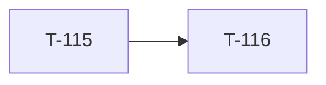

<!-- AUTO-GENERATED by ./scripts/ticket sync — DO NOT EDIT -->

# Ticket Lead Dashboard

## Running / Review

- **T-351** (3167) — Nothing pins the arma_id trim, and legacy whitespace rows are still in the tables [running] — TWO STRUCTURAL GAPS T-343 identified. These are why this bug class keeps coming back.

1. **No test anywhere pins the arma_id trim.** tests/identity_link.rs only ever posts "steam-xyz". So T-326's fix and T-316's binding are held in place by COMMENTS, NOT GATES — the next refactor can undo either silently, and the symptom (an account that reads as linked while being invisible to every match ingest) is invisible until someone notices their stats are missing. Add a test that posts a padded arma_id and asserts both the stored value and that the ingest resolver finds it.

2. **No btrim migration exists**, so legacy whitespace rows predating T-326/T-317 are still in the tables. Every read-path fix in T-350 is a workaround for data that could simply be normalised. Count the affected rows on a pg_dump copy FIRST and report the number — T-228 established that discipline and it is what stopped a migration that would have made the API refuse to boot.

Do these together: the migration cleans the past, the test protects the future.

══ DO NOT NAIVELY TRIM — two sites where a one-sided trim CREATES the catastrophe ══
T-343 found these and they bind on any ticket in this family:
  events.rs:1735 — orbat_reservations.squad must stay BYTE-IDENTICAL to orbat_slots.squad, which is written untrimmed by crates/map-engine-core/src/mission/orbat.rs:163.
  events.rs:1923 — must mirror `or_fallback` at crates/map-engine-core/src/mission/flatten.rs:626. Disagreement means the seat VANISHES, the assignment round-robins, and the request still returns 200.
Trimming on write and trimming on read must agree. T-326's bug was not an untrimmed value per se — it was a DISAGREEMENT between two sites. Check both halves before changing either.

== DEFERRED 2026-07-26 BY OPERATOR DECISION, NOT CANCELLED ==
Recording a bug is most of its value; fixing it now is optional. The audits that produced this ticket were generating work faster than the run could close it, and the original T-182..T-297 feature backlog had not moved in hours. The operator's call, verbatim in substance: there will always be bugs, that is what developing is — knowing them is good, but spending the token budget on things that do not need fixing right now means nothing ships.
This is findable, fully diagnosed, and reproducible from the notes above. Promote it to `idea` when it actually blocks something, when it starts costing real time, or after the feature backlog lands. Nothing here was judged wrong — only not now.
- **T-360** (3176) — DashboardResponse.server_status is the third read of one payload and still Option<Value> [running] — FOUND by T-306. The server-status payload has THREE read sites. T-306 typed two of them (ServerStatusDto for the SSE stream, ServerRowDto for /servers) and could not type the third: `DashboardResponse::server_status` is still `Option<Value>` because typing it requires changing `dashboard.rs`, outside T-306's ownership.

This is not cosmetic — it is why T-232 needed a `vf64` helper to read the FPS by hand off an untyped Value, and it is the last place the same numeric mismatch can silently recur. T-232 already fixed a confident `FPS: 0` on that card; typing the field is what stops the next one.

Also from T-306, and cheap to do here: `/members`, `/registry/compat` and `POST /fire-missions/solve` are live-typed with NO fixture at all, so nothing pins their wire shape. Adding those captures is the same job.

Read T-306's work first — it established which goldens legitimately stay `Value` (no typed consumer) versus which are escape hatches, and its per-test annotations say which is which. Do not undo that distinction.

== DEFERRED 2026-07-26 BY OPERATOR DECISION, NOT CANCELLED ==
Recording a bug is most of its value; fixing it now is optional. The audits that produced this ticket were generating work faster than the run could close it, and the original T-182..T-297 feature backlog had not moved in hours. The operator's call, verbatim in substance: there will always be bugs, that is what developing is — knowing them is good, but spending the token budget on things that do not need fixing right now means nothing ships.
This is findable, fully diagnosed, and reproducible from the notes above. Promote it to `idea` when it actually blocks something, when it starts costing real time, or after the feature backlog lands. Nothing here was judged wrong — only not now.
- **T-512** (3352) — HTTP IT for blank weather PATCH reject + CREATE omit→Clear [running] — Wave 43 residual (CLEAN NIT). T-377/T-509 covered by Class-R + admin_field omit-create. No committed HTTP IT that PATCH dense_fog then weather:"" stays dense_fog / 400, and CREATE omit weather returns clear. Cure: add missions IT cases. Ad-hoc HTTP was green at verify.
- **T-517** (3357) — W45 hotfix: identity_link PAD_ACTOR collides with telemetry PLAYER_DISCORD [running] — Wave 45 cold gate FAIL after T-516. telemetry_ingest_closes_the_loop asserts leaderboard kills==5 but got 15; identity_link padded_arma assert deployments==1 got 2. Root cause: T-351 PAD_ACTOR and telemetry PLAYER_DISCORD both use discord snowflake 000000000000400003 on the shared gate DB. Parallel suites: telemetry writes 5 kills; T-351 padded test writes 7+3=10 for the same discord_id → MV sum 15. Cure: move PAD_ACTOR (and PAD seed/arma string suffixes) to an unused T-400 id (e.g. 000000000000400013); Class-R assert PAD_ACTOR != telemetry PLAYER_DISCORD literal. Owns: apps/website/api/tests/identity_link.rs only. Do not change telemetry.rs.

## Ready

- **T-090** (900) — Map visualization program [ready] — Map Engine v2 through sea-band + contours @ `bd481cf1`. **Active:** **T-090.5.5** tree/veg/prop glyphs. Single lane.

## Next queued (top 10)

- **T-072** (720) — Ctrl multi-place [queued] — Hold Ctrl to place multiple copies without re-selecting asset.
- **T-073** (730) — Shift + map rotation [queued] — Shift-drag and map rotation widget for placed entities.
- **T-075** (750) — Spacebar flyTo vs widget [queued] — Spacebar centers selection; resolve flyTo vs transform widget conflict.
- **T-116** (1160) — Results POST to backend [queued] — SPLIT 2026-07-26. Mod half SHIPPED: TBD_ResultsReporter.c (682 lines, T-181.13.1) POSTs to /api/v1/ingest/match-results. Website half OPEN and folded into T-232 — event_hub.rs renders no result/outcome/match data at all. This row now tracks only the website half.
- **T-117** (1170) — Mission upload + validation UI [queued] — Web UI for mission upload and schema validation (API exists).
- **T-118** (1180) — Event ORBAT + identity linking UI [queued] — SPLIT 2026-07-26. DONE: identity-link UI (settings.rs:6-9,74-94, T-159.25) and the ORBAT selector (event_hub.rs:520-572, T-159.25a). OPEN residual is tracked by T-226 (PATCH /events/{id} has no caller), T-284 (clear_slot unreachable, admin cannot free a claimed slot) and T-231 (identity last mile). This row is a pointer, not work.
- **T-120** (1200) — Staging soak + golden mission smoke [queued] — Pinned game/mod version soak; golden-mission smoke on staging server.
- **T-146** (1470) — Asset Browser Data Wiring [queued] — Hook up T-150 registry items (vehicles/crates/…) to Asset Browser for map drag-place. Unblocked by T-150; after or parallel T-068.9 ingest preferred.
- **T-170** (1670) — Prod default flip to Leptos SPA [queued] — Make the Leptos SPA the production default: set `SPA_DIST_DIR` to the trunk release dist in the prod env, move the Discord OAuth redirect origin, staging soak, then flip. OPERATOR-GATED (env + Discord app settings are operator-held); claude-code prepares configs/runbook + verifies the staging soak gates. Runbook anchor: docs/website/DEV_RUNBOOK.md §SPA serving; T-159 finish program left this as the sole operator-gated residual.

## Dependency graph (scoped)

```mermaid
flowchart LR
  T115[T-115] --> T116[T-116]
```
