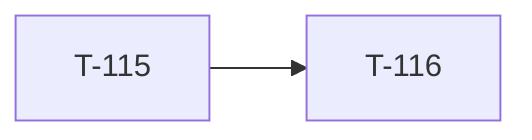

<!-- AUTO-GENERATED by ./scripts/ticket sync — DO NOT EDIT -->

# Ticket Lead Dashboard

## Running / Review

- **T-384** (3200) — Re-pointing a match to another event leaves the first event marked attended [running] — CREATED BY T-369's OWN FIX, and it flagged it rather than hiding it. The re-point path is now reachable — a corrected re-POST can move a match from EV1 to EV2 — but the attendance UPDATE only ever SETS `attended`, never retracts.

Measured by T-369: re-pointing a match from EV1 to EV2 marks EV2 attended and **leaves EV1 attended**, inflating attendance_rate to 100%.

This needs a contract decision, not a patch: there is no record of WHICH match marked a registration as attended, so the write is not currently reversible. Options — store the match id on the registration so it can be retracted; recompute attendance from match_player_stats rather than storing a flag; or declare attendance monotonic and document it.

Recomputing is probably right and matches how T-326 handled deployments (it refused to re-derive 'a deployment' in a second place, precisely so two definitions could not drift). Read T-369's reasoning and T-316's per-field rules first.

== DEFERRED 2026-07-26 BY OPERATOR DECISION, NOT CANCELLED ==
Recording a bug is most of its value; fixing it now is optional. The audits that produced this ticket were generating work faster than the run could close it, and the original T-182..T-297 feature backlog had not moved in hours. The operator's call, verbatim in substance: there will always be bugs, that is what developing is — knowing them is good, but spending the token budget on things that do not need fixing right now means nothing ships.
This is findable, fully diagnosed, and reproducible from the notes above. Promote it to `idea` when it actually blocks something, when it starts costing real time, or after the feature backlog lands. Nothing here was judged wrong — only not now.
- **T-415** (3240) — The mod never checks whether it delivered the authored loadout, and IsComplete has zero callers [running] — THE DURABLE FIX for T-240, which shipped the client half only. Confirmed twice by independent agents on 2026-07-26, and re-confirmed against the source during wave 4.

The mod has NO runtime capacity math at all -- zero volume/weight/grid arithmetic under Scripts/Game/. InsertCargo pushes at the engine and reads the bool; it does not even call CanInsertItemInStorage (that pre-check exists only on the weapon-slot path, TBD_LoadoutEquipHelper.c:491/:495).

On a cargo item that will not fit (TBD_LoadoutEquipHelper.c:1108-1145) it tries the authored container, then ANY storage on the character (logged Degrade/WARNING); if nothing accepts it, it DELETES THE ENTITY, **BREAKS the row qty loop** -- dropping THE ENTIRE REMAINING QUANTITY of that row, not one item -- logs one ERROR naming slot+item+'no storage would accept unit N/M (character full)', and continues. It never aborts the loadout, never leaves the character naked, never refuses to spawn.

NOTHING READS THE RESULT. ReportVerdict only prints. `bool IsComplete()` (TBD_LoadoutEquipHelper.c:197-200) has ZERO CALLERS repo-wide -- verified again in wave 4 by `grep -rn IsComplete apps/ scripts/ crates/ packages/`, which returns exactly one hit: the definition. The answer to 'did we deliver the authored JSON' is computed and discarded. SpawnSlotBody returns the body unconditionally (:1070); MaterializeSlotBodies counts a failure only when the body is null; boot proceeds to LOBBY regardless. The only surface is log text, and the only thing that turns it into a failure is world-boot.sh's no-TBD-ERROR check -- a CI gate, not runtime.

RESULT: the operator gets a body in the field missing kit they authored, with a log line nobody reads.

FIX: consume IsComplete, or pre-check with the Can* family. Either closes it. Until then, EVERY client-side refusal (T-240's export gate included) is a heuristic over an export the mod never reads back -- the website's CargoBudget derives from Workbench export-time data (TBD_RegistryScan.c:896-909, cells = Ceil(maxVolume/50), hardcoded grid w=4) which the mod NEVER READS.

NOT AN ISSUE, do not re-derive (two paid subagent runs already answered it): recursion is NOT REACHABLE. CargoRow is three scalars (container, item, qty) with no id/parent/path so a tree is not expressible even in principle (arsenal_rules.rs:586); mission.schema.json cargoContainer is a flat 4-token enum; additionalProperties:false rejects a children/parentId key outright.
- **T-497** (3332) — Mission mutators still AuthUser+can_edit after T-408 PATCH tier fix [running] — Wave 38 residual from T-408. update_mission now MissionMakerUser. Still AuthUser+can_edit only: delete_mission, submit_mission, create_version, set_armory in handlers/missions.rs. Demotion still leaves those paths open. Cure: same MissionMakerUser tier (or deliberate ownership-outlives-role Class-R per path).

## Ready

- **T-090** (900) — Map visualization program [ready] — Map Engine v2 through sea-band + contours @ `bd481cf1`. **Active:** **T-090.5.5** tree/veg/prop glyphs. Single lane.

## Next queued (top 10)

- **T-072** (720) — Ctrl multi-place [queued] — Hold Ctrl to place multiple copies without re-selecting asset.
- **T-073** (730) — Shift + map rotation [queued] — Shift-drag and map rotation widget for placed entities.
- **T-075** (750) — Spacebar flyTo vs widget [queued] — Spacebar centers selection; resolve flyTo vs transform widget conflict.
- **T-116** (1160) — Results POST to backend [queued] — SPLIT 2026-07-26. Mod half SHIPPED: TBD_ResultsReporter.c (682 lines, T-181.13.1) POSTs to /api/v1/ingest/match-results. Website half OPEN and folded into T-232 — event_hub.rs renders no result/outcome/match data at all. This row now tracks only the website half.
- **T-117** (1170) — Mission upload + validation UI [queued] — Web UI for mission upload and schema validation (API exists).
- **T-118** (1180) — Event ORBAT + identity linking UI [queued] — SPLIT 2026-07-26. DONE: identity-link UI (settings.rs:6-9,74-94, T-159.25) and the ORBAT selector (event_hub.rs:520-572, T-159.25a). OPEN residual is tracked by T-226 (PATCH /events/{id} has no caller), T-284 (clear_slot unreachable, admin cannot free a claimed slot) and T-231 (identity last mile). This row is a pointer, not work.
- **T-120** (1200) — Staging soak + golden mission smoke [queued] — Pinned game/mod version soak; golden-mission smoke on staging server.
- **T-146** (1470) — Asset Browser Data Wiring [queued] — Hook up T-150 registry items (vehicles/crates/…) to Asset Browser for map drag-place. Unblocked by T-150; after or parallel T-068.9 ingest preferred.
- **T-170** (1670) — Prod default flip to Leptos SPA [queued] — Make the Leptos SPA the production default: set `SPA_DIST_DIR` to the trunk release dist in the prod env, move the Discord OAuth redirect origin, staging soak, then flip. OPERATOR-GATED (env + Discord app settings are operator-held); claude-code prepares configs/runbook + verifies the staging soak gates. Runbook anchor: docs/website/DEV_RUNBOOK.md §SPA serving; T-159 finish program left this as the sole operator-gated residual.

## Dependency graph (scoped)

```mermaid
flowchart LR
  T115[T-115] --> T116[T-116]
```
