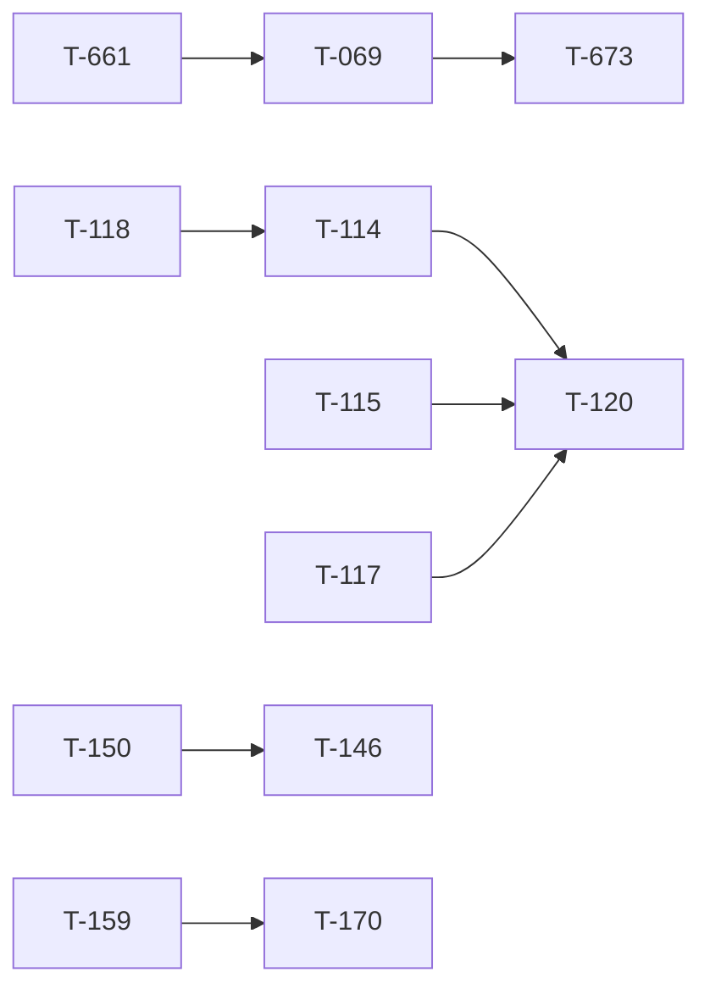

<!-- AUTO-GENERATED by cargo run -q -p xtask -- ticket sync — DO NOT EDIT -->

# Ticket Lead Dashboard

## Running / Review

## Ready

- **T-090** (900) — Map visualization program [ready] — Map Engine v2 through sea-band + contours @ `bd481cf1`. **Active:** **T-090.5.5** tree/veg/prop glyphs. Single lane.
- **T-898** (5780) — verify file-length scans ZERO files — SIZE-1/SIZE-3 is enforced by nothing [ready] — Found 2026-08-12 by the T-896 slice while porting the Makefile CI lane. `cargo xtask verify file-length` (xtask/src/node_free.rs:77) walks ONLY `apps/website` and keeps only `.go`/`.ts`/`.tsx`. After the T-145 Go->Rust and T-159 React->Leptos cutovers there are ZERO such files in the tree — measured, `find apps/website -name '*.go' -o -name '*.ts' -o -name '*.tsx' | wc -l` returns 0. So the gate has printed `0 warning(s), 0 violation(s)` over an EMPTY SET for the entire Rust era, and `.coding-standards-allowlist.yaml` has no SIZE-3 entries because nothing has ever needed one.

SIZE-1 (>600 warn) and SIZE-3 (>1000 fail) are therefore enforced by nothing. Every size decision in T-853 -- agents reporting overruns, splitting gate_ui_layouts, slice_worktree and mk_build at seams -- was self-discipline against a gate that checks nothing. That discipline was real and the splits were right; the gate was theatre.

This is the same defect class the whole T-853 program is about: a check that reports success over an input it never examined. It is also line 89's `.unwrap_or(0)` fail-open in miniature, one level up -- there the read failure is swallowed, here the file set is empty.

CURE: extend the walk to the Rust tree (xtask/, tools/, crates/, apps/website/*/src) and add `.rs`. MEASURE FIRST -- this turns main RED immediately on at least three pre-existing files: xtask/src/schema_gates.rs 4044, xtask/src/cmds.rs 1330, tools/tbd-tools/src/smokes.rs 3852, plus main.rs which grew past 1000 during Phase 3. So the slice is: extend the walk, then EITHER split those files OR give each an allowlist entry carrying a real reason and an expiry. Do not extend the walk and then silence it -- that reproduces the defect with extra steps.
- **T-899** (5790) — T-853 Phase 1.5: make verify file-length actually scan something [ready] — T-898 is the finding; this is the fix. Extend the walk from `apps/website` + .go/.ts/.tsx (zero files) to the Rust tree: xtask/, tools/, crates/, apps/website/*/src, keeping `.rs`. Fix the `.unwrap_or(0)` fail-open at node_free.rs:89 while you are in there. MEASURE FIRST: this turns main RED on at least schema_gates.rs 4044, cmds.rs 1330, smokes.rs 3852 and main.rs (>1000 after Phase 3). The slice is EITHER split those OR give each an allowlist entry with a real reason and an expiry. Do NOT extend the walk and then silence it — that reproduces the defect with extra steps. Prove it bites: plant a 1200-line file and watch it fail. ACCEPTANCE: prove the change BITES — perturb the new subject and watch it go red — not merely that it passes. A green run alone is not evidence (T-556). Finish with a full `cargo xtask platform wave gate` PASS: it is the only check that sees cross-crate breakage, and it has caught defects a green `cargo test -p xtask` could not. Spec: docs/platform/t853_shell_to_xtask_waves.md
- **T-900** (5800) — T-853 Phase 4: retire doc references to things that no longer exist [ready] — The Makefile sweep rewrote 137 live docs but did not catch references to tools deleted EARLIER. Example found 2026-08-13: apps/mod/README.md:64 says `make web  # Vite dev server on :5173` — the React app was deleted at T-159.29.3 and Vite with it. Sweep for references to: make targets, the React/Vite app, `scripts/*.sh` paths (only wave.sh and hostrun.sh remain), and `node`/`npm` outside the enfusion-mcp floor. Rewrite LIVE docs only. Do NOT touch the historical record: SHIPPED_HISTORY, generated TICKET_*.md, registry.json ticket prose, .ai/artifacts/** incl. every verify-log, wave_plan.tsv, applied migrations, and the byte-for-byte port narratives in xtask/src/mk_*.rs. Those describe what was true then. ACCEPTANCE: prove the change BITES — perturb the new subject and watch it go red — not merely that it passes. A green run alone is not evidence (T-556). Finish with a full `cargo xtask platform wave gate` PASS: it is the only check that sees cross-crate breakage, and it has caught defects a green `cargo test -p xtask` could not. Spec: docs/platform/t853_shell_to_xtask_waves.md
- **T-901** (5810) — T-853 Phase 7a: gate the CI run: blocks before bash relocates there [ready] — Bash does not need a .sh file to survive — with the Makefile gone, the remaining hiding place is the 39 `run:` blocks in .github/workflows/. Add `cargo xtask verify ci-shell`. Parse the YAML PROPERLY (serde_yaml/serde_norway) — do not regex YAML. Each `run:` passes iff every logical line is `cargo xtask <args>` or one of a SHORT in-Rust allowlist of genuine pre-cargo setup (rustup target/component add, pinned cargo install, git lfs pull, docker/podman compose). FAIL on: if/for/while/case, &&, ||, ;, |, backticks, $(, redirection, set -, >3 logical lines, heredocs, a `shell:` key naming bash/sh/python, or a `run:` on a step that also has `uses:`. Pin the `uses:` allowlist too so the ban cannot be routed around via a composite action. Rationale to record in the module doc: the ban is not on bash the language, it is on logic that no type checker and no local replay can see. Expect existing multi-line run: blocks to fail — port them, that is the point. ACCEPTANCE: prove the change BITES — perturb the new subject and watch it go red — not merely that it passes. A green run alone is not evidence (T-556). Finish with a full `cargo xtask platform wave gate` PASS: it is the only check that sees cross-crate breakage, and it has caught defects a green `cargo test -p xtask` could not. Spec: docs/platform/t853_shell_to_xtask_waves.md
- **T-902** (5820) — T-853 Phase 6: retire wave.sh — the verdict diff, then the deletion [ready] — wave.sh is ported and waves 231-232 already ran END TO END under the Rust driver (prep, three parallel slices, per-slice land with two hand-resolved conflicts, full gate, close, push). What has NOT been done is a side-by-side bash-vs-Rust verdict comparison on a real wave. Do that: run `cargo xtask platform wave diff all` (31 arms) plus `diff base` (proves base derivation identical over ALL ~2760 commits), and run one real wave's gate under BOTH drivers, diffing normalised output. Only then delete scripts/platform/wave.sh and its inventory lines (shell AND python — it is the last python3 entry). Repoint every caller; `git grep -n 'wave\.sh'` must return only historical records afterwards. ACCEPTANCE: prove the change BITES — perturb the new subject and watch it go red — not merely that it passes. A green run alone is not evidence (T-556). Finish with a full `cargo xtask platform wave gate` PASS: it is the only check that sees cross-crate breakage, and it has caught defects a green `cargo test -p xtask` could not. Spec: docs/platform/t853_shell_to_xtask_waves.md
- **T-903** (5830) — T-853 Phase 6: delete hostrun.sh — it dies with wave.sh [ready] — hostrun.sh's last consumer is scripts/platform/wave.sh. Its Rust successor xtask/src/hostrun.rs already exists, is shared with playtest_server, and has a live test proving the bridge crosses the container wall (glibc 2.36 in-container vs 2.43 on the host). Delete the script and its inventory line ONLY after wave.sh is gone — order matters, and BLOCKED ON the wave.sh slice in this wave. This is the last tracked shell file in the repository. ACCEPTANCE: prove the change BITES — perturb the new subject and watch it go red — not merely that it passes. A green run alone is not evidence (T-556). Finish with a full `cargo xtask platform wave gate` PASS: it is the only check that sees cross-crate breakage, and it has caught defects a green `cargo test -p xtask` could not. Spec: docs/platform/t853_shell_to_xtask_waves.md
- **T-904** (5840) — T-853 Phase 7b: flip the ratchet to a HARD ZERO [ready] — The finale. Rewrite shell_free.rs from an allowlist ratchet into one TrackedLanguageBan table and DELETE scripts/shell-inventory.txt and scripts/python-inventory.txt entirely. Keep the good parts: the parsed-shebang detector (which correctly ignores Rust `#![allow(...)]`) and the fail-closed handling of an unreadable tracked path. Ban `*.sh|bash|zsh|ksh|fish|bat|ps1|py|mjs|cjs`, plus `Makefile`/`GNUmakefile`/`*.mk` so the deleted Makefile cannot return. ONE gate, so a future escape does not need a new gate written for it. Keep the apps/mod/** Enfusion exemption explicit and narrow. Also fold LANG-2 in: zero tracked .py AND zero python3 in command position. Prove it bites four ways: plant a .sh, plant an extensionless file with a bash shebang, plant a Makefile, and confirm a Rust file opening with `#![allow(...)]` does NOT trip it. Then rewrite CODING_STANDARDS §1.1 LANG-1/2/3 — they are ratchets today and become bans. ACCEPTANCE: prove the change BITES — perturb the new subject and watch it go red — not merely that it passes. A green run alone is not evidence (T-556). Finish with a full `cargo xtask platform wave gate` PASS: it is the only check that sees cross-crate breakage, and it has caught defects a green `cargo test -p xtask` could not. Spec: docs/platform/t853_shell_to_xtask_waves.md

## Next queued (top 10)

- **T-120** (1200) — Staging soak + golden mission smoke [queued] — Pinned game/mod version soak; golden-mission smoke on staging server.
- **T-146** (1470) — Asset Browser Data Wiring [queued] — Hook up T-150 registry items (vehicles/crates/…) to Asset Browser for map drag-place. Unblocked by T-150; after or parallel T-068.9 ingest preferred.
- **T-170** (1670) — Prod default flip to Leptos SPA [queued] — Make the Leptos SPA the production default: set `SPA_DIST_DIR` to the trunk release dist in the prod env, move the Discord OAuth redirect origin, staging soak, then flip. OPERATOR-GATED (env + Discord app settings are operator-held); claude-code prepares configs/runbook + verifies the staging soak gates. Runbook anchor: docs/website/DEV_RUNBOOK.md §SPA serving; T-159 finish program left this as the sole operator-gated residual.
- **T-673** (4300) — Marker style and Area markers — the $defs/marker widening [queued] — Six attribute ids: `ATTR-FIELD-MRK-SIZE`, `-MRK-ROTATION`, `-MRK-SHAPE`, `-MRK-BRUSH`, `-MRK-COLOR`, `-MRK-ALPHA`. BLOCKING EVIDENCE: `$defs/marker` in the compiled schema is exactly {x, z, icon, label} and CLOSED — the compiled schema carries 25 `"additionalProperties": false`, so these fields are contract-blocked, not merely unbuilt. Icon-vs-Area is Eden's entire second marker model, so this is a widening plus a mod-side reader, not a UI ticket. MUST SHIP AFTER T-069, which authors the four schema-carried fields; folding these into T-069 would convert a factory-dispatchable ticket into a workbench one, which is the specific mistake this split exists to prevent. EXECUTOR IS `workbench` DELIBERATELY: this modifies `packages/tbd-schema/schema/mission.schema.json` and/or `apps/mod/tbd-framework/`, which the CLAUDE.md executor gate puts out of reach of any coding agent. The factory filters on executor, so this tagging is the safety mechanism — do not flip it to claude-code.

EXECUTOR CORRECTED 2026-08-02: was filed `workbench` on the mistaken reading that any .c file needs the Arma Workbench GUI. It does not — scripts/mod/compile.sh compiles tbd-framework against the native Linux dedicated server headlessly, verified: "OK: compiled clean, 5707 files, 11182 classes, 832 ms, no Workbench". Schema edits are plain JSON. This is factory work. Per the model-routing rule, the .c portion routes to Fable 5 even though the executor is claude-code.

SCHEMA HALF SPLIT OUT to T-706 (one widening pass for the whole program). This ticket is the Enfusion reader plus any editor UI; it does not touch packages/tbd-schema.
- **T-674** (4310) — T-216 follow-on: slot identity reaches the wire [queued] — Four attribute ids — `ATTR-FIELD-OBJ-CALLSIGN`, `-OBJ-RANK`, `-OBJ-STANCE`, `-OBJ-UNIT-NAME` — plus the two TBD-only keys `tag` and `leaderSlotId`. `OBJ-UNIT-NAME` rides this slice rather than standing alone; the sweep says so explicitly. THE CONTRACT DELTA IS ALREADY WRITTEN OUT at `crates/map-engine-core/src/mission/flatten.rs`:2620-2632 — five `$defs/slot` / `$defs/group` keys. T-216 is `shipped`, but it shipped THE LEDGER AND ITS TRIPWIRE, not the fix: flatten.rs:2584-2649 enumerates six author-facing values the compile silently drops (a squad's leaderSlotId, a slot's tag / callsign / rank / stance, and the entire vehicle roster) and records that `make verify-t180` stayed green throughout BECAUSE NOT ONE OF ITS 22 TESTS CHECKED. `stance` additionally needs an Enfusion spawn-pose call — word-boundary `stance` in apps/mod is ZERO (the 39-file `grep -rl stance` result is every hit being the substring inside `instance`). Widening `/compiled` without care 500s every mission. Related: T-242. EXECUTOR IS `workbench` DELIBERATELY: this modifies `packages/tbd-schema/schema/mission.schema.json` and/or `apps/mod/tbd-framework/`, which the CLAUDE.md executor gate puts out of reach of any coding agent. The factory filters on executor, so this tagging is the safety mechanism — do not flip it to claude-code.

EXECUTOR CORRECTED 2026-08-02: was filed `workbench` on the mistaken reading that any .c file needs the Arma Workbench GUI. It does not — scripts/mod/compile.sh compiles tbd-framework against the native Linux dedicated server headlessly, verified: "OK: compiled clean, 5707 files, 11182 classes, 832 ms, no Workbench". Schema edits are plain JSON. This is factory work. Per the model-routing rule, the .c portion routes to Fable 5 even though the executor is claude-code.

SCHEMA HALF SPLIT OUT to T-706 (one widening pass for the whole program). This ticket is the Enfusion reader plus any editor UI; it does not touch packages/tbd-schema.
- **T-675** (4320) — Vehicle roster reaches the game — the compile half of T-076 [queued] — The cross-boundary half that was split out of T-076 so the crew UI could be dispatched. No attribute ids of its own; it closes the sixth entry in the T-216 drop ledger. BLOCKING EVIDENCE: `crates/map-engine-core/src/mission/flatten.rs`:2631 states the delta as "document root + a new $def", key `vehicles`, and :2634-2640 PROVES the already-declared `entities[]` cannot carry it — `$defs/alias` is `^(kit|comp|veh|preset|layer|prop|item):[a-z0-9_]+$` and `apps/mod/tbd-framework/Data/registry.json` holds exactly ONE `veh:` row, so alias substitution would reproduce the T-200 silent-substitution defect with a 10-tonne vehicle. Without this, T-076's crew UI authors state the game never sees. EXECUTOR IS `workbench` DELIBERATELY: this modifies `packages/tbd-schema/schema/mission.schema.json` and/or `apps/mod/tbd-framework/`, which the CLAUDE.md executor gate puts out of reach of any coding agent. The factory filters on executor, so this tagging is the safety mechanism — do not flip it to claude-code.

EXECUTOR CORRECTED 2026-08-02: was filed `workbench` on the mistaken reading that any .c file needs the Arma Workbench GUI. It does not — scripts/mod/compile.sh compiles tbd-framework against the native Linux dedicated server headlessly, verified: "OK: compiled clean, 5707 files, 11182 classes, 832 ms, no Workbench". Schema edits are plain JSON. This is factory work. Per the model-routing rule, the .c portion routes to Fable 5 even though the executor is claude-code.

SCHEMA HALF SPLIT OUT to T-706 (one widening pass for the whole program). This ticket is the Enfusion reader plus any editor UI; it does not touch packages/tbd-schema.
- **T-676** (4330) — Trigger activation and effects — the Enfusion runtime [queued] — Twelve of the thirteen `ATTR-FIELD-TRG-*` ids: everything except the geometry/palette half, which is the factory ticket T-079. An activation model (condition, repeat, timeout, owner side) and an effects model are a NEW ENFUSION RUNTIME in `apps/mod/tbd-framework/` plus the schema keys to carry them. Geometry can ride the shipped T-582 zone draw tool, which is why the editor half was separable at all. Read `$defs/zoneRules`' 16 keys before designing this: they have no ATTR-FIELD id and were never triaged against Eden, but they are the closest thing TBD already has to trigger semantics. EXECUTOR IS `workbench` DELIBERATELY: this modifies `packages/tbd-schema/schema/mission.schema.json` and/or `apps/mod/tbd-framework/`, which the CLAUDE.md executor gate puts out of reach of any coding agent. The factory filters on executor, so this tagging is the safety mechanism — do not flip it to claude-code.

EXECUTOR CORRECTED 2026-08-02: was filed `workbench` on the mistaken reading that any .c file needs the Arma Workbench GUI. It does not — scripts/mod/compile.sh compiles tbd-framework against the native Linux dedicated server headlessly, verified: "OK: compiled clean, 5707 files, 11182 classes, 832 ms, no Workbench". Schema edits are plain JSON. This is factory work. Per the model-routing rule, the .c portion routes to Fable 5 even though the executor is claude-code.

SCHEMA HALF SPLIT OUT to T-706 (one widening pass for the whole program). This ticket is the Enfusion reader plus any editor UI; it does not touch packages/tbd-schema.
- **T-677** (4340) — Waypoints — group movement orders [queued] — OPERATOR DECISION 2026-08-02: AI units ARE coming, so this is no longer speculative. Was titled "blocked on AI units existing at all" because every slot currently spawns AI-disabled (TBD_SpawnManager.c:963,1166), which left 13 attribute ids with no subject.

Nine `ATTR-FIELD-WP-*` ids plus six interaction ids (`RIGHT-MODE-004`, `CONN-WP-ACT-001`, `CONN-WP-ATTACH-001`, `CONN-RAND-START-001`, `KEY-WP-001`, `ACTION-WP-QUICK-001`). THE GATE IS NOT THE SCHEMA — it is that there is no subject. `apps/mod/tbd-framework/.../TBD_SpawnManager.c`:963 and :1166 spawn every body with AI DISABLED, so a waypoint has nothing to command. The attributes sweep calls this "the single biggest scoping correction available to T-079": waypoints cannot be built, in the editor or anywhere else, until AI units exist. Ship together with the group AI state ticket or not at all — they share the gate exactly. EXECUTOR IS `workbench` DELIBERATELY: this modifies `packages/tbd-schema/schema/mission.schema.json` and/or `apps/mod/tbd-framework/`, which the CLAUDE.md executor gate puts out of reach of any coding agent. The factory filters on executor, so this tagging is the safety mechanism — do not flip it to claude-code.

EXECUTOR CORRECTED 2026-08-02: was filed `workbench` on the mistaken reading that any .c file needs the Arma Workbench GUI. It does not — scripts/mod/compile.sh compiles tbd-framework against the native Linux dedicated server headlessly, verified: "OK: compiled clean, 5707 files, 11182 classes, 832 ms, no Workbench". Schema edits are plain JSON. This is factory work. Per the model-routing rule, the .c portion routes to Fable 5 even though the executor is claude-code.

SCHEMA HALF SPLIT OUT to T-706 (one widening pass for the whole program). This ticket is the Enfusion reader plus any editor UI; it does not touch packages/tbd-schema.
- **T-678** (4350) — Group AI state: combat mode, behaviour, formation, speed [queued] — OPERATOR DECISION 2026-08-02: AI units ARE coming — this ticket has a subject now. Previously gated behind the same question as T-677.

Four attribute ids: `ATTR-FIELD-GRP-COMBAT-MODE`, `-GRP-BEHAVIOUR`, `-GRP-FORMATION`, `-GRP-SPEED-MODE`. Same AI gate as waypoints, and the sweep says they should ship together or not at all. Evidence that nothing exists to hang these on: word-boundary `combatMode` and `speedMode` return ZERO in both the frontend and the mod tree; `formation` returns one frontend hit and it is prose in a comment at editor_ops.rs:1324. `$defs/group` is closed, so each field is a widening plus an Enfusion reader. EXECUTOR IS `workbench` DELIBERATELY: this modifies `packages/tbd-schema/schema/mission.schema.json` and/or `apps/mod/tbd-framework/`, which the CLAUDE.md executor gate puts out of reach of any coding agent. The factory filters on executor, so this tagging is the safety mechanism — do not flip it to claude-code.

EXECUTOR CORRECTED 2026-08-02: was filed `workbench` on the mistaken reading that any .c file needs the Arma Workbench GUI. It does not — scripts/mod/compile.sh compiles tbd-framework against the native Linux dedicated server headlessly, verified: "OK: compiled clean, 5707 files, 11182 classes, 832 ms, no Workbench". Schema edits are plain JSON. This is factory work. Per the model-routing rule, the .c portion routes to Fable 5 even though the executor is claude-code.

SCHEMA HALF SPLIT OUT to T-706 (one widening pass for the whole program). This ticket is the Enfusion reader plus any editor UI; it does not touch packages/tbd-schema.
- **T-679** (4360) — Placement scatter: radius and area shape [queued] — Three attribute ids: `ATTR-FIELD-OBJ-PLACEMENT-RADIUS`, `-OBJ-SHAPE`, `-GRP-PLACEMENT-RADIUS`. `$defs/slot` and `$defs/group` are both closed, so this is one key on each plus a spawn-side reader that scatters within the radius. THE CHEAPEST COHERENT SCHEMA-WIDENING SLICE in the workbench program, and a 2D top-down editor is the best possible surface for it — the scatter circle is drawable — so it is the one most worth doing early if the operator wants an easy first workbench win. EXECUTOR IS `workbench` DELIBERATELY: this modifies `packages/tbd-schema/schema/mission.schema.json` and/or `apps/mod/tbd-framework/`, which the CLAUDE.md executor gate puts out of reach of any coding agent. The factory filters on executor, so this tagging is the safety mechanism — do not flip it to claude-code.

EXECUTOR CORRECTED 2026-08-02: was filed `workbench` on the mistaken reading that any .c file needs the Arma Workbench GUI. It does not — scripts/mod/compile.sh compiles tbd-framework against the native Linux dedicated server headlessly, verified: "OK: compiled clean, 5707 files, 11182 classes, 832 ms, no Workbench". Schema edits are plain JSON. This is factory work. Per the model-routing rule, the .c portion routes to Fable 5 even though the executor is claude-code.

SCHEMA HALF SPLIT OUT to T-706 (one widening pass for the whole program). This ticket is the Enfusion reader plus any editor UI; it does not touch packages/tbd-schema.

## Dependency graph (scoped)

```mermaid
flowchart LR
  T661[T-661] --> T069[T-069]
  T118[T-118] --> T114[T-114]
  T114[T-114] --> T120[T-120]
  T115[T-115] --> T120[T-120]
  T117[T-117] --> T120[T-120]
  T150[T-150] --> T146[T-146]
  T159[T-159] --> T170[T-170]
  T069[T-069] --> T673[T-673]
```
