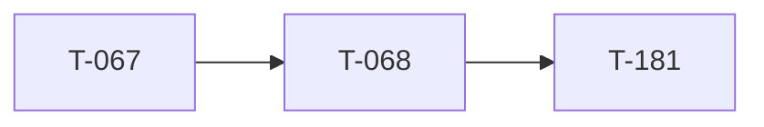

<!-- AUTO-GENERATED by ./scripts/ticket sync — DO NOT EDIT -->

# Ticket Lead Dashboard

## Running / Review

## Ready

- **T-068** (680) — Virtual Arsenal (registry + loadout export) [ready] — Cargo ladder shipped (T-068.15.1 @ 85acbb13 → .15.2 @ 4fb156b7 → T-068.11 @ c66494c6 → T-068.12 @ 0be53e16). T-068.13 LOBBY picker moved to T-181.9.1; LOBBY slot picker → T-068.14 Phase-2 E2E. Hub: t068_virtual_arsenal_program.md + t068_15_cargo_program.md.
- **T-090** (900) — Map visualization program [ready] — Map Engine v2 through sea-band + contours @ `bd481cf1`. **Active:** **T-090.5.5** tree/veg/prop glyphs. Single lane.
- **T-151** (1500) — WebGPU (wgpu/wasm) render engine spike - replace Deck.gl [ready] — wgpu Mission Creator engine: W0–W9 shipped @ c4831451 (T-151.9); W10 audit T-151.10/10.1 shipped; W11 remediations T-151.11.1–.6 complete @ 8237cda6. Operator sign-off + polish next. Hub: t151_wgpu_engine_program.md. Worktree tbd-reforger-wgpu-spike/. D5 LANGUAGE GATE.
- **T-181** (1810) — TBD Framework — Arma-3-parity event mod (factory + spine) [ready] — Rebuild the Arma 3 mission workflow inside Reforger: website Mission Creator = Eden, compiled mission JSON = the .pbo, and the mod supplies everything Reforger does NOT ship (lobby, briefing, slotting, spawn, spectator, admin). Stage 1 FACTORY shipped: host-aware execution, a 1.3s headless Enfusion compile gate on the native dedicated server (no Workbench), a mechanical CRF symbol index (266 files / 71,606 LOC), and a capability matrix whose UNTRIAGED gate turns a forgotten capability into a build error. Stage 2 is the TBD-owned event spine (ONE LIFE + admin respawn; macOS-methodology UI on Aegis tokens). CRF is an Arma-Public-License ORACLE — indexed, never vendored. ABSORBS T-068.13.

## Next queued (top 10)

- **T-072** (720) — Ctrl multi-place [queued] — Hold Ctrl to place multiple copies without re-selecting asset.
- **T-073** (730) — Shift + map rotation [queued] — Shift-drag and map rotation widget for placed entities.
- **T-075** (750) — Spacebar flyTo vs widget [queued] — Spacebar centers selection; resolve flyTo vs transform widget conflict.
- **T-114** (1140) — Slot roster enforcement + production slot picker [queued] — Production in-game slot picker synced to event roster API + identity-linked claims. **Not** full web ORBAT (T-180 shipped). After T-068.13 production LOBBY picker + T-118.
- **T-115** (1150) — Capture win condition [queued] — Real side victory via capture / hold / elimination objective.
- **T-116** (1160) — Results POST to backend [queued] — Game server posts match results; visible on event page.
- **T-117** (1170) — Mission upload + validation UI [queued] — Web UI for mission upload and schema validation (API exists).
- **T-118** (1180) — Event ORBAT + identity linking UI [queued] — Event-side slotting UX completion: manual ORBAT assignment, roster admin, Discord/game identity linking. Complements mission ORBAT authoring (**T-180** shipped) — Event lobby polish still open.
- **T-119** (1190) — Framework MVP remainder [queued] — Loadouts, safe start, boundary, admin commands for M1 gate.
- **T-120** (1200) — Staging soak + golden mission smoke [queued] — Pinned game/mod version soak; golden-mission smoke on staging server.

## Dependency graph (scoped)

```mermaid
flowchart LR
  T067[T-067] --> T068[T-068]
  T068[T-068] --> T181[T-181]
```
