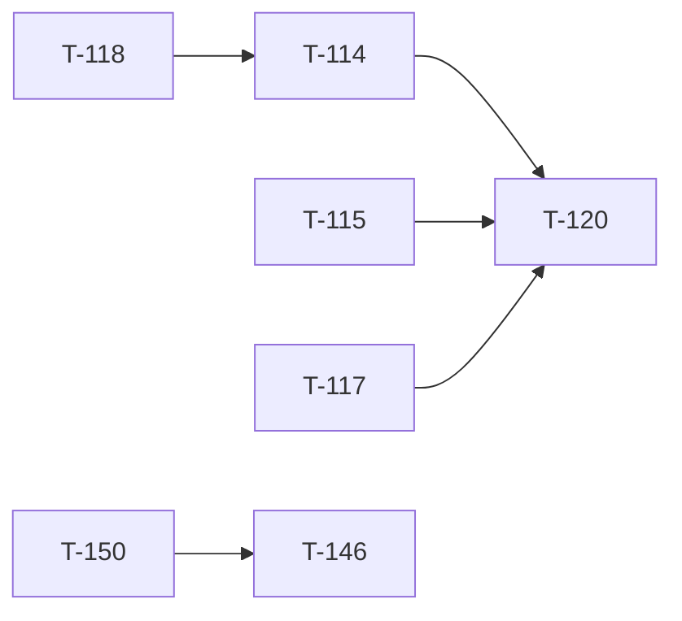

<!-- AUTO-GENERATED by ./scripts/ticket sync — DO NOT EDIT -->

# Ticket Lead Dashboard

## Running / Review

## Ready

- **T-090** (900) — Map visualization program [ready] — Map Engine v2 through sea-band + contours @ `bd481cf1`. **Active:** **T-090.5.5** tree/veg/prop glyphs. Single lane.
- **T-615** (3622) — DOCUMENTATION_STANDARDS.md is the most rotted example of the convention it defines — 7 dead links inside it [ready] — FOUND by T-611 (wave 78) while deciding whether `verify-citations` should read `docs/`. Doc-owned,
so T-611 reported rather than fixed.

=== THE IRONY, AND THE POINT ===
`docs/platform/DOCUMENTATION_STANDARDS.md` defines the "turn a comment into a checked link"
convention. **Seven of the eight dead relative links in the repo are inside that document**, and every
one is a prose citation *with a line number* pointing at a file deleted during the big cutovers:

- `:139, :152, :197, :198` -> `apps/website/internal/{models/registry.go, handlers/registry.go,
  models/mission.go, handlers/handlers.go}` -- Go, **deleted at T-145**
- `:162, :222, :223` -> `apps/website/frontend/src/types/{models/registry.ts, models/user.ts,
  api/index.ts}` -- React, **deleted at T-159.29.3**
- `docs/specs/Mission_Creator_Architecture/t123_documentation_standards_rollout.md:119` ->
  `apps/website/internal/contract/validate.go`

Plus non-link prose pointing at files that no longer exist: `t123:72` cites
`apps/website/frontend/tsdoc.json`; `t123:136` cites
`packages/tbd-schema/scripts/verify-contract-citations.mjs` **as the live citation gate** -- it has
been xtask since T-165.1.

This is the best available argument for the convention T-610 adopted (cite stable **symbol names**,
never line numbers) and it is failing inside the document that should be making it.

=== ALSO: ADD §10.1, TEXT ALREADY DRAFTED ===
T-611 measured the `docs/`-scanning question rather than assuming: temporarily adding `docs/` + `md`
to the gate gave **73 citations, 5 dangling, ALL 5 FALSE** -- in prose the tag is inline as
`` `@contract registry-items.schema.json#/$defs/item`. `` and the pointer capture swallows the closing
backtick and trailing punctuation. Zero true findings, five ways to go red on correct citations. A
markdown-aware matcher still could not tell §3.1's grammar template from a live citation, because that
document is mostly examples of it. **Decision: the gate stays out of `docs/`; prose is held by
convention.** That rationale is now recorded on `SCAN_ROOTS` in `xtask/src/schema_gates.rs` so nobody
re-litigates it from intuition.

T-611 drafted the exact replacement for the §10 table row at `:420` and a new §10.1 section to insert
after the keystone paragraph at `:426`. **The full text is in T-611's slice report** -- use it verbatim
rather than re-deriving; it carries the measured numbers.

Summary of §10.1: prose cites stable symbol names, never line numbers (`TBD_SpawnManager.ClaimSlot`
survives an edit above it; `TBD_SpawnManager.c:2094` does not -- T-610 found ~19 rotted in one
runbook); a repo-relative path with no line number when a symbol will not do; `@contract` in prose is
**illustrative, not a checked link**; anything that genuinely must be machine-checked belongs in code
or in its own index gate (cf. `make verify-oracle` for `@idx`). And: the gate prints its own scope on
every run -- trust that line over the doc if they disagree.

=== WHILE YOU ARE THERE ===
`verify-citations` now prints its scope generated from its own constants, so the printed claim can no
longer outlive the config. Any doc sentence that restates the scope in prose should defer to that line
instead of duplicating it -- duplicated scope claims are how this ticket happened.
- **T-620** (3672) — verify-no-python has been RED since the factory started, is in no CI job, and half of it cannot fire [ready] — OPERATOR-RAISED 2026-08-01: *"I thought I had made a rule to make future scripts be in Rust using
xtask. That does not seem like it's the case."* **The rule exists and is correct. It has simply never
been able to bind.** Three independent reasons, all measured.

=== 1. THE GATE IS RED, AND HAS BEEN SINCE THE DAY THE FACTORY STARTED ===
    $ make verify-no-python
    FAIL: leftover .py files:
      ./scripts/mod/slice-collisions.py
      ./scripts/platform/slice-collisions.py
    verify-no-python: FAIL
    make: *** [Makefile:467: verify-no-python] Error 1
Both files landed in `1e3ea1f6` (**2026-07-26**) -- the day the platform factory opened -- and they are
**the factory's own tooling**. The command center has invoked `slice-collisions.py` throughout.

=== 2. IT IS IN NO CI JOB ===
`grep verify-no-python .github/workflows/*.yml` -> **no hits.** It exists only at `Makefile:466-467`
and inside `make ci-local` (`Makefile:481`), the local replay that nothing runs by default. It is
**not a wave-gate step**, which is why the factory's gate kept reporting 28/28 over a red rule for
three straight waves.

=== 3. HALF OF IT PHYSICALLY CANNOT FIRE -- THE SIGNATURE DEFECT, INSIDE THE RULE'S OWN GATE ===
`scripts/verify-no-python.sh:29` greps with **`rg`**, which does not exist in this environment (it is
a harness-injected shell function; `bash -c 'command -v rg'` finds nothing -- documented three times
in `docs/platform/PLATFORM_FACTORY.md`). Measured:
    ./scripts/verify-no-python.sh: line 29: rg: command not found
      OK (none)
`|| true` swallows the failure and the check reports **"OK (none)"** -- not because there are no
`python3` invocations in `scripts/` and the `Makefile`, but **because it never looked.** So the
interpreter-invocation half of this gate has never once run.

=== FIX, IN ORDER ===
1. **Replace `rg` with `grep`** at `:29` and make the check **fail closed** on a non-zero exit that is
   not "no matches" (see `scripts/mod/lib/gate-grep.sh` from T-556, which already reads exit status
   0/1/2/127 correctly -- reuse it rather than re-deriving). Expect it to go red immediately; that is
   the point.
2. **Decide the two `.py` files.** Either port `slice-collisions.py` to `xtask` (it is the operator's
   stated intent and it is ~one command: disjoint-set packing over the `owns` column), or add an
   explicit, dated, justified exemption in the gate. **Do not silently delete the finding.**
3. **Wire it somewhere that runs.** CI job, or a wave-gate step, or both. A gate in `ci-local` only is
   a gate nobody runs -- exactly how this stayed red for three waves.

RELATED: T-621 (no rule at all for shell), T-611 (`verify-citations` scoped so it never read Rust),
T-606/T-612 (health checks satisfied only by a stale build). Same class each time: **a tool reports
success over an input it never actually examined.**
- **T-621** (3682) — There is no Rust-first rule for shell — 58 scripts, 15,415 lines, no gate, no convention [ready] — OPERATOR-RAISED 2026-08-01, alongside T-620. Python has a rule (T-162, and see T-620 for why it never
bound). **Shell has none at all** -- no `verify-no-shell`, no "new tooling goes in xtask" convention,
nothing in `CODING_STANDARDS.md` or `CLAUDE.md`.

MEASURED: **58 `.sh` files, 15,415 lines** (excluding `.git` and worktrees). `scripts/platform/wave.sh`
alone is ~2,800 lines and grew by hundreds more across waves 75-79. Nothing was violating a rule --
**the rule was never written**, so every slice that needed a script reached for bash by default.

The operator's stated intent, from the Rust rewrite era: *everything in Rust; scripts in `xtask`.*
`CLAUDE.md` already records the direction of travel -- *"All tooling is Rust (T-165 Node eradication);
Node exists solely as the `enfusion-mcp` runtime"* -- but says nothing about bash.

=== WHY THIS IS NOT COSMETIC ===
Waves 75-79 spent a large fraction of their budget on defects that are **specific to shell**:
- `grep` is ugrep 7.5.0 in an agent shell and GNU 3.8 under `bash script.sh`; they disagree on bare
  `{}` in an ERE, and every API route path contains `{id}`.
- `rg` does not exist, and `|| true` turns its absence into a silent pass (T-620, and the same shape
  in T-606's `remote-log-grep.sh`).
- `${TBD_SCENARIO:={GUID}...}` truncates at the GUID's brace, and the validator printed
  "config VALID" over the wreckage (T-607).
- `mcp-wb-logs.sh` had no reachable `exit 0` **or** `exit 2` and was fully inverted -- PASS on a stale
  build, FAIL on a healthy one (T-612).
None of these failure modes survive contact with a typed language and a test harness.

=== FIX SHAPE -- proposal, operator to confirm ===
1. Write the rule down (`CODING_STANDARDS.md`): **new tooling goes in `xtask`**; bash is permitted only
   for thin process glue that must run before/without cargo (container entry, `distrobox-host-exec`
   wrappers, git hooks).
2. **Grandfather with an explicit list**, so the list can only shrink. A `verify-no-new-shell` gate
   compares against the committed inventory and fails on an unlisted new `.sh`. This is the cheap,
   honest version -- it does not force a 15k-line rewrite, it just stops the bleeding.
3. Port opportunistically, highest-risk first. `wave.sh`'s gate/push logic is the obvious candidate:
   it has now had **three consecutive rounds** of self-approval defects (T-602 -> T-613 -> T-618),
   every one of them a bash-string-matching problem.

**Do not start by rewriting `wave.sh`.** Write the rule, add the ratchet, then port when a script next
needs real work.

## Next queued (top 10)

- **T-072** (720) — Ctrl multi-place [queued] — Hold Ctrl to place multiple copies without re-selecting asset.
- **T-073** (730) — Shift + map rotation [queued] — Shift-drag and map rotation widget for placed entities.
- **T-075** (750) — Spacebar flyTo vs widget [queued] — Spacebar centers selection; resolve flyTo vs transform widget conflict.
- **T-120** (1200) — Staging soak + golden mission smoke [queued] — Pinned game/mod version soak; golden-mission smoke on staging server.
- **T-146** (1470) — Asset Browser Data Wiring [queued] — Hook up T-150 registry items (vehicles/crates/…) to Asset Browser for map drag-place. Unblocked by T-150; after or parallel T-068.9 ingest preferred.
- **T-170** (1670) — Prod default flip to Leptos SPA [queued] — Make the Leptos SPA the production default: set `SPA_DIST_DIR` to the trunk release dist in the prod env, move the Discord OAuth redirect origin, staging soak, then flip. OPERATOR-GATED (env + Discord app settings are operator-held); claude-code prepares configs/runbook + verifies the staging soak gates. Runbook anchor: docs/website/DEV_RUNBOOK.md §SPA serving; T-159 finish program left this as the sole operator-gated residual.

## Dependency graph (scoped)

```mermaid
flowchart LR
  T118[T-118] --> T114[T-114]
  T114[T-114] --> T120[T-120]
  T115[T-115] --> T120[T-120]
  T117[T-117] --> T120[T-120]
  T150[T-150] --> T146[T-146]
```
