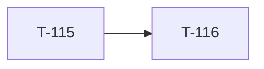

<!-- AUTO-GENERATED by ./scripts/ticket sync — DO NOT EDIT -->

# Ticket Lead Dashboard

## Running / Review

## Ready

- **T-090** (900) — Map visualization program [ready] — Map Engine v2 through sea-band + contours @ `bd481cf1`. **Active:** **T-090.5.5** tree/veg/prop glyphs. Single lane.
- **T-431** (3270) — Identity-link attendance backfill still marks every mission on the event [ready] — MAJOR residual from T-230 (wave 7). Match ingest now scopes attendance via matches.(event_id, mission_id), but apps/website/api/src/handlers/me.rs BACKFILL_ATTENDANCE (≈59–65) still UPDATEs all event_missions for any event_id found on the player's matches — no mission_id join.

Repro: multi-mission event; play one; identity-link path runs BACKFILL_ATTENDANCE; sibling event_mission registrations flip to attended.

Cure: same JOIN shape as T-230 telemetry ingest.
- **T-433** (3272) — cms.rs announcement_body_persist_contract unit test is tautological [ready] — MINOR from wave 7 verifier. handlers/cms.rs announcement_body_persist_contract_is_identity_not_ammonia sets stored = authored.to_string() then asserts equality — never calls create/update. Real pin is IT cms_announcement_body + admin_field.

Repro: read the unit test; it cannot fail if handlers regress to sanitize_html.

Cure: delete it or replace with a non-vacuous pin (handler/IT only).
- **T-440** (3279) — Cold/schema gates never apply make seed / faction_library.sql [ready] — Residual from T-256 / wave 10 adversarial MAJOR. Cold wave gate validates faction-library.sample.json via schema but never runs `make seed` or applies apps/website/api/seeds/faction_library.sql. Deleting the Makefile seed line still greens the cold gate — false authority that T-256's seed wiring was examined.

Repro: remove `seeds/faction_library.sql` from Makefile seed recipe; `bash scripts/platform/wave.sh gate <base>` still PASS; `make schema-validate` still PASS sample.

Manual prove seed works: apply SQL on throwaway DB → 2 starter rows.

Cure: gate tripwire (Makefile verify target + wave.sh step, or IT that asserts seed recipe + applies SQL on cold DB).
- **T-477** (3316) — T-431 Class-R greened on event-wide BACKFILL_ATTENDANCE shapes [ready] — Residual from wave 29 adversarial BLOCKER. Class-R in me.rs requires join pin `m.event_id = em.event_id AND m.mission_id = em.mission_id` and bans `WHERE em.event_id IN (` — but still PASS when:
(1) join pin present + UNION ALL event_id-only second arm
(2) dead `(FALSE AND <join_pin> OR TRUE)` with event-only JOIN
(3) `em.event_id = ANY (...)` + join pin only in SQL `--` comment inside the const

Live SQL today is correct; the gate is hollow. No behavioral IT for link-confirm BACKFILL_ATTENDANCE (telemetry IT is T-230 ingest only).

Repro: rewrite BACKFILL_ATTENDANCE to event-wide via ANY/UNION while keeping join substring → unit test PASS.

Cure: harden Class-R — strip SQL `--`/`/* */` comments before pins; require a single FROM event_missions … INNER JOIN matches with live ON containing both equalities (no UNION/ANY event-id-only arms); ban `em.event_id = ANY` / nested event_id-only IN/ANY. Prefer also a minimal behavioral IT if owns can widen to tests/; else structural-only with RED→GREEN on verifier shapes.
- **T-478** (3317) — T-440 verify greened on comment name + path-echo seed recipe [ready] — Residual from wave 29 adversarial MAJOR×2 (+ MINOR). verify-t440-faction-library-seed.sh:
(1) `'US Army 1980s'` is raw grep — SQL `-- US Army 1980s` + `SELECT 1;` PASS
(2) recipe pin is path substring on any non-#-prefixed line — `echo seeds/faction_library.sql >/dev/null` PASS; psql -c SELECT with path in comment PASS
(3) MINOR: script never pins wave.sh cold/slice `run "T-440…"` wiring

Repro: comment-only starter name or echo-path recipe → verify-t440 PASS.

Cure: strip SQL comments before name pin; require live INSERT INTO user_factions (or measured table) with name column value; require recipe line that actually redirects/applies the file to psql (same shape as verify-t444 if tighter); pin wave.sh both gate paths invoke the script. RED→GREEN on verifier perturbations.

## Next queued (top 10)

- **T-072** (720) — Ctrl multi-place [queued] — Hold Ctrl to place multiple copies without re-selecting asset.
- **T-073** (730) — Shift + map rotation [queued] — Shift-drag and map rotation widget for placed entities.
- **T-075** (750) — Spacebar flyTo vs widget [queued] — Spacebar centers selection; resolve flyTo vs transform widget conflict.
- **T-116** (1160) — Results POST to backend [queued] — SPLIT 2026-07-26. Mod half SHIPPED: TBD_ResultsReporter.c (682 lines, T-181.13.1) POSTs to /api/v1/ingest/match-results. Website half OPEN and folded into T-232 — event_hub.rs renders no result/outcome/match data at all. This row now tracks only the website half.
- **T-117** (1170) — Mission upload + validation UI [queued] — Web UI for mission upload and schema validation (API exists).
- **T-118** (1180) — Event ORBAT + identity linking UI [queued] — SPLIT 2026-07-26. DONE: identity-link UI (settings.rs:6-9,74-94, T-159.25) and the ORBAT selector (event_hub.rs:520-572, T-159.25a). OPEN residual is tracked by T-226 (PATCH /events/{id} has no caller), T-284 (clear_slot unreachable, admin cannot free a claimed slot) and T-231 (identity last mile). This row is a pointer, not work.
- **T-120** (1200) — Staging soak + golden mission smoke [queued] — Pinned game/mod version soak; golden-mission smoke on staging server.
- **T-146** (1470) — Asset Browser Data Wiring [queued] — Hook up T-150 registry items (vehicles/crates/…) to Asset Browser for map drag-place. Unblocked by T-150; after or parallel T-068.9 ingest preferred.
- **T-170** (1670) — Prod default flip to Leptos SPA [queued] — Make the Leptos SPA the production default: set `SPA_DIST_DIR` to the trunk release dist in the prod env, move the Discord OAuth redirect origin, staging soak, then flip. OPERATOR-GATED (env + Discord app settings are operator-held); claude-code prepares configs/runbook + verifies the staging soak gates. Runbook anchor: docs/website/DEV_RUNBOOK.md §SPA serving; T-159 finish program left this as the sole operator-gated residual.

## Dependency graph (scoped)

```mermaid
flowchart LR
  T115[T-115] --> T116[T-116]
```
