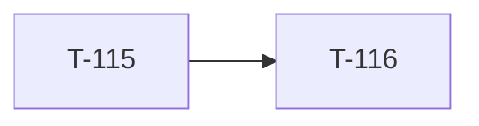

<!-- AUTO-GENERATED by ./scripts/ticket sync — DO NOT EDIT -->

# Ticket Lead Dashboard

## Running / Review

- **T-341** (3157) — deployments.rs has a bare SELECT * and swallows decode errors, in the file held up as the good example [running] — FOUND by T-329 while fixing the sibling bug. The irony is the point: deployments.rs:103 is what every other read site was told to copy, and two other statements in the same file are the defects it was supposed to model against.

1. **`deployments.rs:76`** — `SELECT event_registrations.*`, the identical bare-`*` shape that made dashboard.rs 500 in production. Benign only because `slot_id` HAPPENS to be `Option<Uuid>` today. Any future nullable column on that table makes this a live 500, and nothing warns you.

2. **`deployments.rs:55`** — `mission_title_terrain` swallows every error via `.ok().flatten()`, so a decode failure degrades silently to `None` instead of surfacing. That is the same class as the gate defects this program has fixed repeatedly: something reporting success while examining less than it claims. A missing mission title reads as 'no mission' rather than 'this query is broken'.

3. **`tests/dashboard_reads.rs:80`** asserts /dashboard is 200 but passes VACUOUSLY — same reachability defect T-329 found in null_tolerance.rs: it authenticates as one user and the assertion depends on rows belonging to another. Fix it the way T-329 fixed its own: mint a session whose identity owns the seeded rows.

T-329's static enumerator will name :76 once it runs; check whether it is in the tolerance list and prune it as part of this.

== DEFERRED 2026-07-26 BY OPERATOR DECISION, NOT CANCELLED ==
Recording a bug is most of its value; fixing it now is optional. The audits that produced this ticket were generating work faster than the run could close it, and the original T-182..T-297 feature backlog had not moved in hours. The operator's call, verbatim in substance: there will always be bugs, that is what developing is — knowing them is good, but spending the token budget on things that do not need fixing right now means nothing ships.
This is findable, fully diagnosed, and reproducible from the notes above. Promote it to `idea` when it actually blocks something, when it starts costing real time, or after the feature backlog lands. Nothing here was judged wrong — only not now.
- **T-371** (3187) — display_name() selects on an untrimmed is_empty, so a whitespace Discord name is stored verbatim [running] — FOUND by T-366 while establishing whether trimming on read was safe. This is the WRITE side of the bug it fixed on the read side, and it is reachable in production.

`services/discord.rs:113` `display_name()` chooses between `global_name` and `username` using `global_name.is_empty()` — an untrimmed FIELD-SELECTION test. So a Discord `global_name` of `"   "` wins that branch and is stored verbatim into `users.username` by the login upsert at `handlers/oauth.rs:117`, which rewrites on EVERY login.

T-366 fixed the consequence (a whitespace username no longer produces an anonymous audit line) but deliberately did not touch this file. Note the shape: this is not a guard that should have trimmed, it is a CHOICE BETWEEN TWO FIELDS made on a test that whitespace passes — so the fix is to make the selection test meaningful, not to trim the winner.

T-319 already hardened `DiscordUser.username` in this file (it required the field, closing the case where an absent username blanked the stored name). This is the adjacent case: present, non-empty, and meaningless. Read T-319's reasoning first — it established that a malformed upstream response is not a client error and there is no request to reject, so the only lever is whether the body decodes and what the code then selects.

Also fold in: `handlers/admin.rs:342-344` hand-rolls a duplicate of `handlers/mod.rs::username()` minus the discord_id fallback, so with `username = ''` a warn logs `"000000000000000001 warned '': probe"` — actor falls back, target renders empty. It should call `username()`. Doing so would also let the display-trim decision T-366 deferred land coherently across both halves instead of one.

== DEFERRED 2026-07-26 BY OPERATOR DECISION, NOT CANCELLED ==
Recording a bug is most of its value; fixing it now is optional. The audits that produced this ticket were generating work faster than the run could close it, and the original T-182..T-297 feature backlog had not moved in hours. The operator's call, verbatim in substance: there will always be bugs, that is what developing is — knowing them is good, but spending the token budget on things that do not need fixing right now means nothing ships.
This is findable, fully diagnosed, and reproducible from the notes above. Promote it to `idea` when it actually blocks something, when it starts costing real time, or after the feature backlog lands. Nothing here was judged wrong — only not now.
- **T-382** (3198) — Empty-but-valid payload becomes current_version_id with no rollback route [running] — mission-editor-payload.schema.json has NO top-level `required`, no `minProperties`, and `editor.slots` is a bare `{"type":"array"}` with no `minItems`. `create_version` requires only that payload be Some and semver non-empty (missions.rs:587), then `validate_payload` passes `{}` clean — the crate's own test pins this as valid at contract/validate.rs:151-156.

So `{"semver":"0.1.5","payload":{}}` returns 201 and `UPDATE missions SET current_version_id` (missions.rs:611) moves the pointer. Downstream: `/compiled` 409s on NoSlots so the game server can no longer load the mission; `orbat_template_for_mission` materialises ZERO orbat_slots on attach; `ingest_event_roster` omits the mission.

`current_version_id` has exactly two writers and **there is no endpoint to re-point it at an older version**, so through the API this is unrecoverable. The prior version row does survive in mission_versions, so an operator can fix it with psql — which is why this is judgement rather than clear-cut, and why the fix might be a rollback route rather than a stricter schema.

Note T-357 measured that a naive tightening of that schema would have 400'd six real live missions, so do not reach for `minItems` without checking. A gate at write time is what is missing; the gate at read time (409) already exists and is too late.

== DEFERRED 2026-07-26 BY OPERATOR DECISION, NOT CANCELLED ==
Recording a bug is most of its value; fixing it now is optional. The audits that produced this ticket were generating work faster than the run could close it, and the original T-182..T-297 feature backlog had not moved in hours. The operator's call, verbatim in substance: there will always be bugs, that is what developing is — knowing them is good, but spending the token budget on things that do not need fixing right now means nothing ships.
This is findable, fully diagnosed, and reproducible from the notes above. Promote it to `idea` when it actually blocks something, when it starts costing real time, or after the feature backlog lands. Nothing here was judged wrong — only not now.

## Ready

- **T-090** (900) — Map visualization program [ready] — Map Engine v2 through sea-band + contours @ `bd481cf1`. **Active:** **T-090.5.5** tree/veg/prop glyphs. Single lane.

## Next queued (top 10)

- **T-072** (720) — Ctrl multi-place [queued] — Hold Ctrl to place multiple copies without re-selecting asset.
- **T-073** (730) — Shift + map rotation [queued] — Shift-drag and map rotation widget for placed entities.
- **T-075** (750) — Spacebar flyTo vs widget [queued] — Spacebar centers selection; resolve flyTo vs transform widget conflict.
- **T-116** (1160) — Results POST to backend [queued] — SPLIT 2026-07-26. Mod half SHIPPED: TBD_ResultsReporter.c (682 lines, T-181.13.1) POSTs to /api/v1/ingest/match-results. Website half OPEN and folded into T-232 — event_hub.rs renders no result/outcome/match data at all. This row now tracks only the website half.
- **T-117** (1170) — Mission upload + validation UI [queued] — Web UI for mission upload and schema validation (API exists).
- **T-118** (1180) — Event ORBAT + identity linking UI [queued] — SPLIT 2026-07-26. DONE: identity-link UI (settings.rs:6-9,74-94, T-159.25) and the ORBAT selector (event_hub.rs:520-572, T-159.25a). OPEN residual is tracked by T-226 (PATCH /events/{id} has no caller), T-284 (clear_slot unreachable, admin cannot free a claimed slot) and T-231 (identity last mile). This row is a pointer, not work.
- **T-120** (1200) — Staging soak + golden mission smoke [queued] — Pinned game/mod version soak; golden-mission smoke on staging server.
- **T-146** (1470) — Asset Browser Data Wiring [queued] — Hook up T-150 registry items (vehicles/crates/…) to Asset Browser for map drag-place. Unblocked by T-150; after or parallel T-068.9 ingest preferred.
- **T-170** (1670) — Prod default flip to Leptos SPA [queued] — Make the Leptos SPA the production default: set `SPA_DIST_DIR` to the trunk release dist in the prod env, move the Discord OAuth redirect origin, staging soak, then flip. OPERATOR-GATED (env + Discord app settings are operator-held); claude-code prepares configs/runbook + verifies the staging soak gates. Runbook anchor: docs/website/DEV_RUNBOOK.md §SPA serving; T-159 finish program left this as the sole operator-gated residual.

## Dependency graph (scoped)

```mermaid
flowchart LR
  T115[T-115] --> T116[T-116]
```
