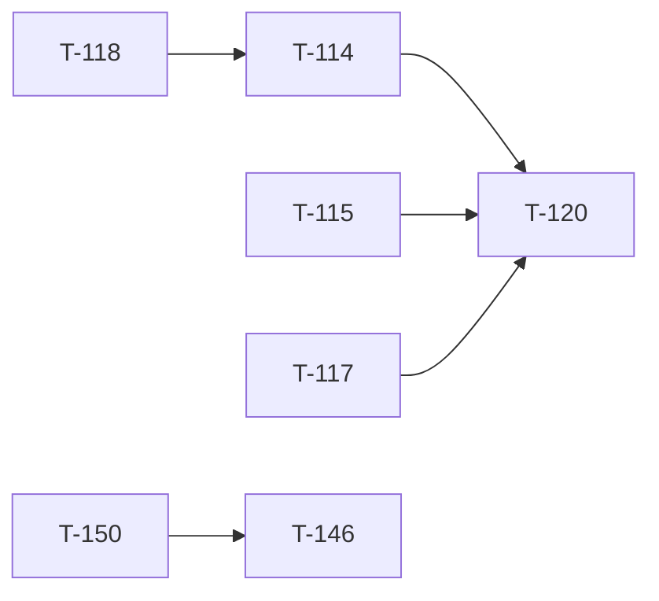

<!-- AUTO-GENERATED by ./scripts/ticket sync — DO NOT EDIT -->

# Ticket Lead Dashboard

## Running / Review

## Ready

- **T-090** (900) — Map visualization program [ready] — Map Engine v2 through sea-band + contours @ `bd481cf1`. **Active:** **T-090.5.5** tree/veg/prop glyphs. Single lane.
- **T-615** (3622) — DOCUMENTATION_STANDARDS.md is the most rotted example of the convention it defines — 7 dead links inside it [ready] — FOUND by T-611 (wave 78) while deciding whether `verify-citations` should read `docs/`. Doc-owned,
so T-611 reported rather than fixed.

=== THE IRONY, AND THE POINT ===
`docs/platform/DOCUMENTATION_STANDARDS.md` defines the "turn a comment into a checked link"
convention. **Seven of the eight dead relative links in the repo are inside that document**, and every
one is a prose citation *with a line number* pointing at a file deleted during the big cutovers:

- `:139, :152, :197, :198` -> `apps/website/internal/{models/registry.go, handlers/registry.go,
  models/mission.go, handlers/handlers.go}` -- Go, **deleted at T-145**
- `:162, :222, :223` -> `apps/website/frontend/src/types/{models/registry.ts, models/user.ts,
  api/index.ts}` -- React, **deleted at T-159.29.3**
- `docs/specs/Mission_Creator_Architecture/t123_documentation_standards_rollout.md:119` ->
  `apps/website/internal/contract/validate.go`

Plus non-link prose pointing at files that no longer exist: `t123:72` cites
`apps/website/frontend/tsdoc.json`; `t123:136` cites
`packages/tbd-schema/scripts/verify-contract-citations.mjs` **as the live citation gate** -- it has
been xtask since T-165.1.

This is the best available argument for the convention T-610 adopted (cite stable **symbol names**,
never line numbers) and it is failing inside the document that should be making it.

=== ALSO: ADD §10.1, TEXT ALREADY DRAFTED ===
T-611 measured the `docs/`-scanning question rather than assuming: temporarily adding `docs/` + `md`
to the gate gave **73 citations, 5 dangling, ALL 5 FALSE** -- in prose the tag is inline as
`` `@contract registry-items.schema.json#/$defs/item`. `` and the pointer capture swallows the closing
backtick and trailing punctuation. Zero true findings, five ways to go red on correct citations. A
markdown-aware matcher still could not tell §3.1's grammar template from a live citation, because that
document is mostly examples of it. **Decision: the gate stays out of `docs/`; prose is held by
convention.** That rationale is now recorded on `SCAN_ROOTS` in `xtask/src/schema_gates.rs` so nobody
re-litigates it from intuition.

T-611 drafted the exact replacement for the §10 table row at `:420` and a new §10.1 section to insert
after the keystone paragraph at `:426`. **The full text is in T-611's slice report** -- use it verbatim
rather than re-deriving; it carries the measured numbers.

Summary of §10.1: prose cites stable symbol names, never line numbers (`TBD_SpawnManager.ClaimSlot`
survives an edit above it; `TBD_SpawnManager.c:2094` does not -- T-610 found ~19 rotted in one
runbook); a repo-relative path with no line number when a symbol will not do; `@contract` in prose is
**illustrative, not a checked link**; anything that genuinely must be machine-checked belongs in code
or in its own index gate (cf. `make verify-oracle` for `@idx`). And: the gate prints its own scope on
every run -- trust that line over the doc if they disagree.

=== WHILE YOU ARE THERE ===
`verify-citations` now prints its scope generated from its own constants, so the printed claim can no
longer outlive the config. Any doc sentence that restates the scope in prose should defer to that line
instead of duplicating it -- duplicated scope claims are how this ticket happened.
- **T-618** (3652) — The gate base can still self-approve: the ticket ledger reads files the forging commit wrote [ready] — FOUND by wave 78's adversarial verifier. **Third round of the same defect** (T-602 -> T-613 -> here),
and the fix this time is small and specific -- do not redesign the oracles.

=== THE ATTACK, measured in a scratch clone ===
ONE commit defeats all three cross-checks for a **silent PASS**. Subject `wave 78 CLOSED …`; **in the
same commit** append wave-78 rows to `docs/platform/wave_plan.tsv` and mark them `shipped` in
`.ai/tickets/registry.json`; place it after the last slice merge.

    Variant A (marker AFTER wave + plan/registry edited in the same commit):
      ticket ledger: wave 78 has 2 ticket(s) ... all shipped — corroborated.
      RC=0        <-- SILENT PASS; range gated = 1 commit, honest range = 11
    Variant B (marker, NO ledger edits):  refusing to run unconfirmed.  RC=2
    Variant C (marker mid-wave + plan edit): base cuts through a slice.  RC=2  (oracle 3 catches it)

- **Oracle 1** (`wave_close_is_newest_wave:1938`) never refuses a HIGHER wave number -- 78 beats all
  of 45-77, so it passes silently.
- **Oracle 2** (`wave_close_ledger_says:1970`) is the hole. It reads `wave_plan.tsv` and
  `registry.json` **from HEAD's checkout**, and the forging commit's edits are IN HEAD's tree. The
  independence claim written at `wave.sh:1901` -- that each check draws on "evidence the commit under
  test did not itself produce" -- **is false for oracle 2**, because a slice may edit both files.
- **Oracle 3** (`slice_span_check:2002`) is genuinely marker-free and does catch the mid-wave variant,
  but its own comment admits it "cannot catch a base placed AFTER the whole wave".
- The backstop `demand_base_confirmation:2034` fires in variant B but is **bypassed** in A, precisely
  because editing the two files flips oracle 2 to rc0.

Net effect: the gate runs `base..HEAD` = 1 commit and reports PASS/SKIP over an entire unread wave --
the wave-75 defect, reintroduced through the derivation oracle.

=== THE FIX (small, specific) ===
**Read the ledger from OUTSIDE the range being validated.** Oracle 2 must not consult HEAD's tree; it
should read `wave_plan.tsv` / `registry.json` at the **candidate base's parent**, or at the previous
close, via `git show <rev>:<path>` -- a revision the forging commit cannot have written. That single
change restores the independence the comment already claims and kills variant A.

Then **correct the comment at `:1901`** to describe what is actually true. A false independence claim
in a security-shaped check is worse than no claim, because the next reader stops looking.

Consider also giving oracle 1 an upper bound (a boundary claiming a wave number far beyond the
highest ticket in the plan is suspicious), but the oracle-2 fix is the load-bearing one.

=== FAIR WEIGHTING, so the next agent does not over-build ===
This needs a **deliberately forged commit**, not a natural mistake -- but that is exactly T-613's
stated threat model ("the gate base can no longer approve itself"), it requires no operator
interaction, and the design only half-discloses the gap: it admits "no fully independent oracle
exists" while making a specific false independence claim about oracle 2. Fix the read, fix the
comment, stop.
- **T-619** (3662) — PAT_ASSIGNED diverged between two sibling scripts that both claim ONE shared definition [ready] — FOUND by wave 78's adversarial verifier -- the cross-slice class that wave 77 also shipped (T-604's
detector quoted a Print T-605 reworded).

`scripts/mod/mcp-wb-logs.sh:44` states: *"The check vocabulary — shared with remote-log-grep.sh.
**ONE definition per pattern**."* Five of the six shared patterns match. `PAT_ASSIGNED` does not:

    mcp-wb-logs.sh:57   '\[TBD\] SpawnManager: assigned slot'                          # flat only
    remote-log-grep.sh:136 '\[TBD\]\[Spawn\].*assigned|\[TBD\] SpawnManager: assigned'  # both formats

They are **not sourced from a common lib** -- the "one definition" is a claim, not a mechanism.
T-614 broadened the sibling THIS WAVE, with the reasoning that `TBD_SpawnManager.c` is 70/74 tagged
and `:675` is a flat straggler, so *"the reword is the direction the file is already travelling."*

**When `:675` moves to `[TBD][Spawn]`, `mcp-wb-logs.sh` reports PARTIAL over a boot where a player
really was seated** -- measured:

    $ bash scripts/mod/mcp-wb-logs.sh --file tagged_seat.log   # player WAS seated (tagged format)
      exit=2  (PARTIAL: slot bodies built; no player has deployed yet.)

That is the latent false-amber T-614 inoculated its own file against, and a partial regression of the
inversion T-612 had just fixed in this same file.

FIX: broaden `mcp-wb-logs.sh:57` to match its sibling -- **or better, make the claim true** by
extracting the six shared patterns into one sourced file (`scripts/mod/lib/` already exists;
`gate-grep.sh` lives there from T-556). A comment asserting a shared definition, over two divergent
copies, is the signature defect in miniature: it reports agreement it never checked.

## Next queued (top 10)

- **T-072** (720) — Ctrl multi-place [queued] — Hold Ctrl to place multiple copies without re-selecting asset.
- **T-073** (730) — Shift + map rotation [queued] — Shift-drag and map rotation widget for placed entities.
- **T-075** (750) — Spacebar flyTo vs widget [queued] — Spacebar centers selection; resolve flyTo vs transform widget conflict.
- **T-120** (1200) — Staging soak + golden mission smoke [queued] — Pinned game/mod version soak; golden-mission smoke on staging server.
- **T-146** (1470) — Asset Browser Data Wiring [queued] — Hook up T-150 registry items (vehicles/crates/…) to Asset Browser for map drag-place. Unblocked by T-150; after or parallel T-068.9 ingest preferred.
- **T-170** (1670) — Prod default flip to Leptos SPA [queued] — Make the Leptos SPA the production default: set `SPA_DIST_DIR` to the trunk release dist in the prod env, move the Discord OAuth redirect origin, staging soak, then flip. OPERATOR-GATED (env + Discord app settings are operator-held); claude-code prepares configs/runbook + verifies the staging soak gates. Runbook anchor: docs/website/DEV_RUNBOOK.md §SPA serving; T-159 finish program left this as the sole operator-gated residual.

## Dependency graph (scoped)

```mermaid
flowchart LR
  T118[T-118] --> T114[T-114]
  T114[T-114] --> T120[T-120]
  T115[T-115] --> T120[T-120]
  T117[T-117] --> T120[T-120]
  T150[T-150] --> T146[T-146]
```
