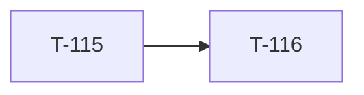

<!-- AUTO-GENERATED by ./scripts/ticket sync — DO NOT EDIT -->

# Ticket Lead Dashboard

## Running / Review

## Ready

- **T-090** (900) — Map visualization program [ready] — Map Engine v2 through sea-band + contours @ `bd481cf1`. **Active:** **T-090.5.5** tree/veg/prop glyphs. Single lane.
- **T-434** (3273) — CI schema job still only validate+citations while make schema-validate runs nine [ready] — Residual from T-420/T-422. Wave gate now runs the full schema-validate set (incl. per-context height-labels). .github/workflows/ci.yml schema job still only `xtask schema validate` + citations — same hole T-420 documented.

Repro: compare ci.yml schema job vs Makefile schema-validate recipe / GATE_SCHEMA_VALIDATE_GATES in wave.sh.

Cure: align CI with make schema-validate (or document intentional narrowing with a tripwire).
- **T-447** (3286) — CMS content page still seeds from mock_docs; no GET list [ready] — Residual from T-267 / wave 14 adversarial NIT. Write paths (POST/PATCH/DELETE/push-discord) are live, but the CMS Content master list still uses mock_docs() and GET /cms/announcements is 405 — session cannot see server-persisted announcements after reload.

Repro: Publish announcement; reload /content → mock seed only.

Cure: add list route if missing + FE LocalResource GET /cms/announcements.
- **T-463** (3302) — verify-t438/t456 shell gates still unwired from wave cold gate [ready] — Residual from T-462 / wave 24. wave.sh now runs verify-t439 and verify-t444 after schema, but scripts/mod/verify-t438-deploy-staging-compose-path.sh and verify-t456-mission-rest-size-gate.sh remain agent-local only — cold gate never executes them.

Repro: corrupt deploy-staging compose path or strip REST size check → wave.sh gate still PASS until those scripts are invoked manually.

Cure: wire both into wave.sh gate_slice + cmd_gate next to the T-439/T-444 steps (same pattern).
- **T-464** (3303) — Null-tolerance sweep for GET /cms/announcements [ready] — Residual from T-447 / wave 25 cold gate. Admin GET /cms/announcements is registered but null_tolerance every_get_route_is_swept_or_skipped_with_a_reason fails: path neither in route_sweep() nor ROUTE_SWEEP_SKIP.

Repro: after T-447 merge, `wave.sh gate` → test api FAIL — `GET routes … neither swept …: ["/cms/announcements"]`.

Cure: add `/cms/announcements` to route_sweep() (admin list; drafts+published) with Seed auth as other admin GETs; prove RED→GREEN. Do not skip unless sweep is impossible.
- **T-465** (3304) — T-447 Class-R false-green: draft filter + Content hydrate unexamined [ready] — Residual from wave 25 adversarial. Live T-447 behavior holds (SQL drafts+published, AdminUser, LocalResource hydrate), but Class-R pins are false-green:
(1) list_cms_announcements_is_drafts_plus_published_not_public_feed greends if status IN ('draft', 'published') appears anywhere in prod (incl. bait comment) while live SQL is published-only.
(2) content_boots_from_cms_list_not_mock_docs greends if LocalResource+api_get strings remain while Effect ignores opt and docs.set(hardcoded mock).
(3) AdminUser extractor not pinned; no IT asserts GET /cms/announcements returns a draft or 401 for non-admin.

Repro: published-only SQL + bait comment → Class-R PASS; Effect docs.set(mock) → Class-R PASS.

Cure: (A) IT POST draft then GET /cms/announcements must include it + public feed must not; non-admin GET → 401. (B) Harden Class-R: pin AdminUser on list handler; pin Effect docs.set(mapped) / filter_map(doc_from_announcement) chain so ignoring hydrate fails. RED→GREEN on verifier perturbations.

## Next queued (top 10)

- **T-072** (720) — Ctrl multi-place [queued] — Hold Ctrl to place multiple copies without re-selecting asset.
- **T-073** (730) — Shift + map rotation [queued] — Shift-drag and map rotation widget for placed entities.
- **T-075** (750) — Spacebar flyTo vs widget [queued] — Spacebar centers selection; resolve flyTo vs transform widget conflict.
- **T-116** (1160) — Results POST to backend [queued] — SPLIT 2026-07-26. Mod half SHIPPED: TBD_ResultsReporter.c (682 lines, T-181.13.1) POSTs to /api/v1/ingest/match-results. Website half OPEN and folded into T-232 — event_hub.rs renders no result/outcome/match data at all. This row now tracks only the website half.
- **T-117** (1170) — Mission upload + validation UI [queued] — Web UI for mission upload and schema validation (API exists).
- **T-118** (1180) — Event ORBAT + identity linking UI [queued] — SPLIT 2026-07-26. DONE: identity-link UI (settings.rs:6-9,74-94, T-159.25) and the ORBAT selector (event_hub.rs:520-572, T-159.25a). OPEN residual is tracked by T-226 (PATCH /events/{id} has no caller), T-284 (clear_slot unreachable, admin cannot free a claimed slot) and T-231 (identity last mile). This row is a pointer, not work.
- **T-120** (1200) — Staging soak + golden mission smoke [queued] — Pinned game/mod version soak; golden-mission smoke on staging server.
- **T-146** (1470) — Asset Browser Data Wiring [queued] — Hook up T-150 registry items (vehicles/crates/…) to Asset Browser for map drag-place. Unblocked by T-150; after or parallel T-068.9 ingest preferred.
- **T-170** (1670) — Prod default flip to Leptos SPA [queued] — Make the Leptos SPA the production default: set `SPA_DIST_DIR` to the trunk release dist in the prod env, move the Discord OAuth redirect origin, staging soak, then flip. OPERATOR-GATED (env + Discord app settings are operator-held); claude-code prepares configs/runbook + verifies the staging soak gates. Runbook anchor: docs/website/DEV_RUNBOOK.md §SPA serving; T-159 finish program left this as the sole operator-gated residual.

## Dependency graph (scoped)

```mermaid
flowchart LR
  T115[T-115] --> T116[T-116]
```
