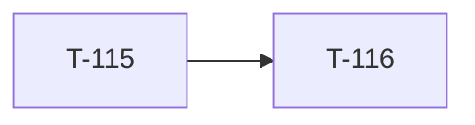

<!-- AUTO-GENERATED by ./scripts/ticket sync — DO NOT EDIT -->

# Ticket Lead Dashboard

## Running / Review

## Ready

- **T-090** (900) — Map visualization program [ready] — Map Engine v2 through sea-band + contours @ `bd481cf1`. **Active:** **T-090.5.5** tree/veg/prop glyphs. Single lane.
- **T-438** (3277) — deploy-staging.sh still looks for docker-compose.staging.yml under apps/website/api [ready] — Residual from T-251 / wave 9 N1. T-251 placed apps/website/docker-compose.staging.yml, but scripts/mod/deploy-staging.sh:184 still cds to apps/website/api and runs docker compose -f docker-compose.staging.yml there.

Repro: after T-251 land, follow game staging path that uses deploy-staging.sh compose step — file not found / wrong cwd.

Cure: point deploy-staging.sh (and any twin bootstrap) at apps/website/docker-compose.staging.yml; align STAGING-SERVER.md.
- **T-445** (3284) — Audit Load-more Class-R does not pin on_load_more UI wiring [ready] — Residual from T-266 / wave 13 adversarial MINOR. Class-R tests pin audit_logs_path / parse_next_cursor / merge_audit_page helpers, but nothing asserts on_load_more calls merge_audit_page. A replace bug (lines.set(page.data) instead of append) would keep those tests green while truncating the trail again.

Repro: change Load more to replace the vec; cargo test -p website-frontend audit::tests still PASS.

Cure: include_str! / source guard (T-264 style) that on_load_more uses merge_audit_page + audit_logs_path(Some(before)).
- **T-448** (3287) — Personnel dossier Deployments stat has no API field [ready] — Residual from T-268 / wave 14. Dossier Deployments cell stays em-dash because RosterRow/AdminUserRow omit total_deployments. Not a fake count — honest empty — but ticket summary asked for the hardcoded stat.

Repro: Personnel dossier → Deployments always —.

Cure: project count in admin list_users + dto AdminUserRow + personnel.rs bind.

## Next queued (top 10)

- **T-072** (720) — Ctrl multi-place [queued] — Hold Ctrl to place multiple copies without re-selecting asset.
- **T-073** (730) — Shift + map rotation [queued] — Shift-drag and map rotation widget for placed entities.
- **T-075** (750) — Spacebar flyTo vs widget [queued] — Spacebar centers selection; resolve flyTo vs transform widget conflict.
- **T-116** (1160) — Results POST to backend [queued] — SPLIT 2026-07-26. Mod half SHIPPED: TBD_ResultsReporter.c (682 lines, T-181.13.1) POSTs to /api/v1/ingest/match-results. Website half OPEN and folded into T-232 — event_hub.rs renders no result/outcome/match data at all. This row now tracks only the website half.
- **T-117** (1170) — Mission upload + validation UI [queued] — Web UI for mission upload and schema validation (API exists).
- **T-118** (1180) — Event ORBAT + identity linking UI [queued] — SPLIT 2026-07-26. DONE: identity-link UI (settings.rs:6-9,74-94, T-159.25) and the ORBAT selector (event_hub.rs:520-572, T-159.25a). OPEN residual is tracked by T-226 (PATCH /events/{id} has no caller), T-284 (clear_slot unreachable, admin cannot free a claimed slot) and T-231 (identity last mile). This row is a pointer, not work.
- **T-120** (1200) — Staging soak + golden mission smoke [queued] — Pinned game/mod version soak; golden-mission smoke on staging server.
- **T-146** (1470) — Asset Browser Data Wiring [queued] — Hook up T-150 registry items (vehicles/crates/…) to Asset Browser for map drag-place. Unblocked by T-150; after or parallel T-068.9 ingest preferred.
- **T-170** (1670) — Prod default flip to Leptos SPA [queued] — Make the Leptos SPA the production default: set `SPA_DIST_DIR` to the trunk release dist in the prod env, move the Discord OAuth redirect origin, staging soak, then flip. OPERATOR-GATED (env + Discord app settings are operator-held); claude-code prepares configs/runbook + verifies the staging soak gates. Runbook anchor: docs/website/DEV_RUNBOOK.md §SPA serving; T-159 finish program left this as the sole operator-gated residual.

## Dependency graph (scoped)

```mermaid
flowchart LR
  T115[T-115] --> T116[T-116]
```
