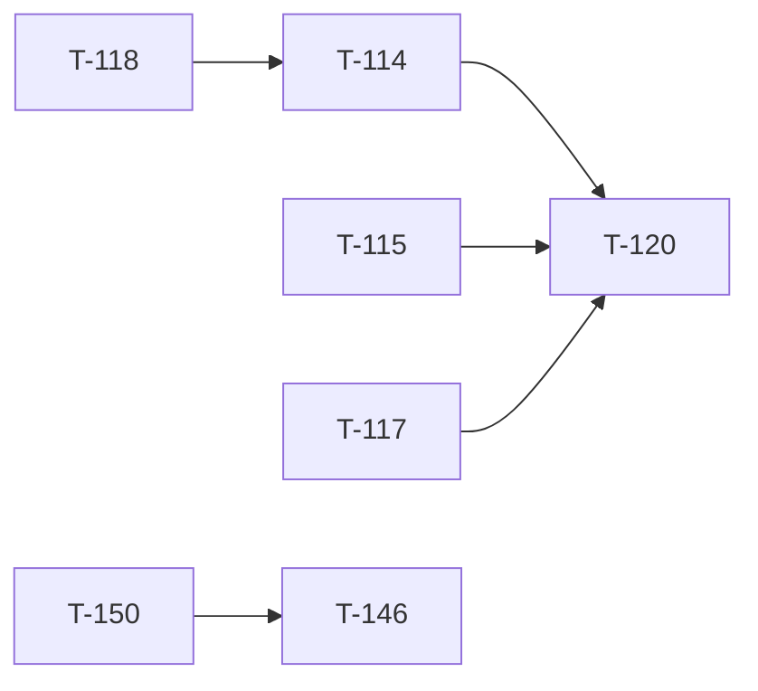

<!-- AUTO-GENERATED by ./scripts/ticket sync — DO NOT EDIT -->

# Ticket Lead Dashboard

## Running / Review

## Ready

- **T-090** (900) — Map visualization program [ready] — Map Engine v2 through sea-band + contours @ `bd481cf1`. **Active:** **T-090.5.5** tree/veg/prop glyphs. Single lane.
- **T-370** (3186) — Remove the 8 dead mark_adopted call sites — but move the purge first [ready] — FOLLOW-UP from T-352, which deliberately left this and explained why. **The sequencing is the whole ticket; getting it wrong strands data in users' browsers permanently.**

`mark_adopted` no longer writes anything — T-352 deleted the storage and made the function purge `tbd-editor-adopted:*` residue instead. Eight call sites remain: mission_hydrate.rs 187, 213, 226, 246, 279, 299, 888 and mission_commands.rs:141.

**DO NOT simply delete them.** `purge_legacy_markers` is reachable ONLY via `mark_adopted`. Every browser that ever opened the editor still holds `tbd-editor-adopted:<missionId>` in localStorage, and those calls are currently what erases it. Removing them in the same release leaves that residue stranded forever — and residue readable by whichever account signs in next was the original leak.

Correct order:
  1. Move the purge to a boot hook (`main.rs` or `mission_editor.rs`), so it runs regardless of hydrate path.
  2. Ship that. Give it a release to reach users' browsers.
  3. THEN delete the eight call sites and the shim.

Steps 1 and 3 must not be the same release. If you judge one release insufficient for step 2, say so and pick a longer gap — this is data in other people's browsers, not a refactor.

Note mission_hydrate.rs is assigned to T-191/T-223/T-338 in the wave plan, so check nothing else holds it when you take this.

== DEFERRED 2026-07-26 BY OPERATOR DECISION, NOT CANCELLED ==
Recording a bug is most of its value; fixing it now is optional. The audits that produced this ticket were generating work faster than the run could close it, and the original T-182..T-297 feature backlog had not moved in hours. The operator's call, verbatim in substance: there will always be bugs, that is what developing is — knowing them is good, but spending the token budget on things that do not need fixing right now means nothing ships.
This is findable, fully diagnosed, and reproducible from the notes above. Promote it to `idea` when it actually blocks something, when it starts costing real time, or after the feature backlog lands. Nothing here was judged wrong — only not now.

=== WAVE 81: STEP 1 DONE, STEP 3 DELIBERATELY NOT ===
The purge has MOVED, which was the ticket's stated precondition. `mission_hydrate.rs:178` now calls
`crate::editor_session::purge_legacy_markers()` at the top of `hydrate_from_server` -- **before** the
`is_uuid` guard and **before** the fetch, so it runs on every editor boot on every branch (closing
T-388's three skip paths), and it is called **directly, not through `mark_adopted`**, so the eight
dead call sites are now safely deletable.
**What remains is only the deletion of those eight sites.** It was not done in wave 81 because the
purge move should bake for a release first -- deleting the sites in the same commit that moves the
behaviour off them removes the ability to revert one without the other.
CAVEAT recorded honestly by the slice: the compile-level proof (a real path expression to a `pub fn`,
which a comment cannot produce) does NOT prove the ORDERING claim (before-fetch / before-`is_uuid`);
that rests on review of the 4-line prologue. Every file involved is wasm32-only, so no native test can
call it.
- **T-573** (3426) — Mixed drag: vehicle GPU preview still slots-only (set_drag SoA) [ready] — FOUND by W68 adversarial verifier (CLEAN NIT) after T-491, and admitted by the slice agent.

`move_entities_and_vehicles` commits mixed drag in one LOCAL yrs txn, but live drag preview still filters vehicles out of `engine.set_drag` (`mission_editor.rs` ~1125–1134). `set_drag` is slot-SoA only in map-engine-render (outside T-491 owns).

Repro: select one slot + one vehicle; drag — vehicle glyph stays put until release; slot previews. Commit still moves both; undo is one step.

Cure: extend drag preview / set_drag for vehicles (map-engine-render + host), or document as wontfix.

=== WAVE 81: NOT REACHED, AND THE EXACT PATCH IS KNOWN ===
T-314's slice found the cure needs two files it did not own, and shipped nothing rather than half.
**Root cause: the engine has no vehicle ids.** `vehicles_bind(xy)` (`crates/map-engine-render/src/engine.rs:4282`)
takes a bare flat `xy` from `MissionDocCore::vehicle_xy_flat`, so `set_drag` cannot resolve a dragged
vehicle id to a lane row. Three edits:
1. `crates/map-engine-core/src/slots_gpu.rs` -- `pack_vehicle_drag_preview(drag_ids, ids, xy, dx, dy)`:
   re-pack the whole `MissionVehicles` lane with matched rows offset, unknown ids (the slot half of a
   mixed selection) skipped. The lane is a dense pack already re-uploaded wholesale, so no SoA
   row-patching is needed.
2. `apps/website/frontend/src/mission_history.rs:329,382` -- feed vehicle ids alongside `xy`.
3. `apps/website/frontend/src/mission_editor.rs:1126-1134` -- delete the `is_vehicle_id` filter and
   pass the whole `ids` list to `set_drag`.
- **T-625** (3742) — Behind Caddy every public client shares one auth rate-limit bucket [ready] — FOUND by wave 81''s verifier (F5). **Pre-existing and self-documented**, but worth knowing before a
big event night.

`Caddyfile.website:18-19` proxies from loopback, so axum''s `ConnectInfo` peer is Caddy for every
public client and they all key to a single `strict|127.0.0.1` bucket at **1 rps / burst 10**
(`middleware/ratelimit.rs:53-63` says so itself). `frontend/src/auth.rs:5` confirms the SPA refreshes
on bootstrap.

**Op-night scenario:** more than ~10 members open the site within ~10 seconds; boot 11 onward gets a
429 on `/auth/refresh` and renders logged-out until retried.

**What holds:** the 429 is refused by middleware *before* the handler, so the single-use refresh token
is **not spent** and a retry succeeds; and the client has no auto-retry loop, so there is no stampede.

**Not new.** The in-memory L1 tier has had identical numbers on the identical shared key for waves.
T-578 added durability, which makes it marginally stricter (a restart mid-spike no longer refills the
bucket) -- it did not create the sharing.

**FIX:** wire `X-Forwarded-For` behind `Config::trusted_proxies`, which exists and is **read by
nothing**. That is what makes per-IP mean per-client. T-578''s module header defers it explicitly
rather than doing it silently.
- **T-626** (3752) — T-587 backfill regex is not character-for-character with parse_grid [ready] — FOUND by wave 81''s verifier (F3). Divergence is entirely in the **safe** direction; filed for accuracy.

`migrations/0020_fire_missions_solution.sql:86-88` claims its accept regex matches `parse_grid`
character for character. `frontend/src/mortar.rs:297-302` parses via `str::parse::<f64>`, which accepts
`+`-signed, bare-dot and exponent forms the regex rejects. Measured:

    ''+1000, 2000'' -> f      ''.5, 2'' -> f      ''5., 2'' -> f      ''1e3, 500'' -> f
    ''1000, 2000''  -> t

**Under-permissive only** -- the dangerous direction (inventing coordinates for rows the calculator
has always shown as unrestorable) is closed: everything the regex accepts, Rust parses to the same
finite f64. Practical impact ~nil, because `restore()` (`mortar.rs:347-355`) still falls back to
`parse_grid` for un-backfilled rows and `fmt_grid` output always matches the regex, so every
SPA-written row backfills.

The backfill test''s six cases (`t587_fire_mission_solution.rs:311-334`) omit exactly the divergent
forms -- **the equivalence claim is untested precisely where it is false.**

Pathological edge, recorded: a >~309-digit grid string matches the regex but overflows
`::double precision`, which would abort the migration. No realistic row has that shape.

## Next queued (top 10)

- **T-072** (720) — Ctrl multi-place [queued] — Hold Ctrl to place multiple copies without re-selecting asset.
- **T-073** (730) — Shift + map rotation [queued] — Shift-drag and map rotation widget for placed entities.
- **T-075** (750) — Spacebar flyTo vs widget [queued] — Spacebar centers selection; resolve flyTo vs transform widget conflict.
- **T-120** (1200) — Staging soak + golden mission smoke [queued] — Pinned game/mod version soak; golden-mission smoke on staging server.
- **T-146** (1470) — Asset Browser Data Wiring [queued] — Hook up T-150 registry items (vehicles/crates/…) to Asset Browser for map drag-place. Unblocked by T-150; after or parallel T-068.9 ingest preferred.
- **T-170** (1670) — Prod default flip to Leptos SPA [queued] — Make the Leptos SPA the production default: set `SPA_DIST_DIR` to the trunk release dist in the prod env, move the Discord OAuth redirect origin, staging soak, then flip. OPERATOR-GATED (env + Discord app settings are operator-held); claude-code prepares configs/runbook + verifies the staging soak gates. Runbook anchor: docs/website/DEV_RUNBOOK.md §SPA serving; T-159 finish program left this as the sole operator-gated residual.

## Dependency graph (scoped)

```mermaid
flowchart LR
  T118[T-118] --> T114[T-114]
  T114[T-114] --> T120[T-120]
  T115[T-115] --> T120[T-120]
  T117[T-117] --> T120[T-120]
  T150[T-150] --> T146[T-146]
```
