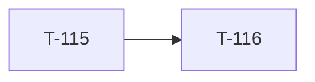

<!-- AUTO-GENERATED by ./scripts/ticket sync — DO NOT EDIT -->

# Ticket Lead Dashboard

## Running / Review

- **T-505** (3345) — Hydrate/row-mirror still stomps authored title after T-375 compile emit [running] — Wave 41 residual (CLEAN). T-375 emits non-blank trimmed meta.title on compile_payload. hydrate/apply_row_meta still does not load payload title into meta; create_version does not PATCH missions.title. Reload can overwrite authored title with stale row. Cure: adopt_payload/apply_row_meta prefer payload title (trim-aware) and/or mirror title to row on Save with non-blank guard.
- **T-511** (3351) — Land orbat_slots partial unique (assigned_to) + retire events.rs two-seat seed [running] — Wave 43 residual (CLEAN). T-331 cleared content_golden double-seat and left the partial unique on orbat_slots(event_mission_id, assigned_to) WHERE assigned_to IS NOT NULL unlanded because tests/events.rs:540 still seeds legacy two-seat for T-318 recovery and a partial unique cannot be DEFERRABLE. Cure: deliberately update/retire that assertion (or drop index around the seed), then CREATE UNIQUE INDEX in a migration. Repro: create index on clean DB, UPDATE second seat assigned_to → 23505.
- **T-515** (3355) — Cold gate db_migrate hollow for SQL-only claim migrations [running] — Wave 44 residual (CLEAN after T-513/514; MINOR from verifier). db_migrate in wave.sh only checks schema/object counts. A SQL-only claim migration like T-335 0016 can drop the claim UPDATE yet keep REFRESH and still gate-green when claimable orphans are 0. Mitigated by synthetic non-vacuity in the slice report, not by the gate. Cure: gate asserts migration body contains the claim UPDATE (Class-R on 0016) and/or runs a planted-orphan migrate probe.
- **T-522** (3362) — W46 hotfix: T-505 prefer-payload Class-R must run on native CI [running] — Wave 46 verifier MAJOR. mission_hydrate::t505_tests / adopt_payload prefer-payload Class-R live under #[cfg(target_arch = "wasm32")] (main.rs). Native cargo test -p website-frontend (cold gate) runs 0 t505 tests — prefer→&row.title regression stays green. Cure: move prefer-payload Class-R to a path that executes in cold/CI (native unit in map-engine-core store, or ungated tests module, or wasm32 gate job that actually runs these). Perturbation: prefer→row.title must RED under the same command the cold gate uses. Owns: apps/website/frontend/src/mission_hydrate.rs and/or apps/website/frontend/src/main.rs; may touch crates/map-engine-core/src/doc/store.rs if pin moves there.
- **T-523** (3363) — W46 hotfix: T-515 db_migrate claim body must strip SQL comments [running] — Wave 46 verifier MAJOR. gate_db_migrate_claim_body in scripts/platform/wave.sh uses grep -qF (comment-blind). Hollow bait with the three claim needles only inside -- line comments PASSes while live UPDATE is gone — same failure class as T-513/514. Cure: strip SQL line/block comments (or otherwise refuse comment-only matches) before needle search. Perturbation: TBD_GATE_MIGRATION_0016=/tmp/bait with needles only in comments → FAIL; real 0016 → PASS. Owns: scripts/platform/wave.sh only.
- **T-526** (3366) — W46 hotfix: rustfmt mission_title_prefer.rs after T-522 [running] — Wave 46 cold gate FAIL fmt after T-522/523 merge. apps/website/frontend/src/mission_title_prefer.rs fails rustfmt --check (split chain wrapping in adopt_payload_wires_prefer_helper). Cure: rustfmt that file only. Owns: apps/website/frontend/src/mission_title_prefer.rs.

## Ready

- **T-090** (900) — Map visualization program [ready] — Map Engine v2 through sea-band + contours @ `bd481cf1`. **Active:** **T-090.5.5** tree/veg/prop glyphs. Single lane.

## Next queued (top 10)

- **T-072** (720) — Ctrl multi-place [queued] — Hold Ctrl to place multiple copies without re-selecting asset.
- **T-073** (730) — Shift + map rotation [queued] — Shift-drag and map rotation widget for placed entities.
- **T-075** (750) — Spacebar flyTo vs widget [queued] — Spacebar centers selection; resolve flyTo vs transform widget conflict.
- **T-116** (1160) — Results POST to backend [queued] — SPLIT 2026-07-26. Mod half SHIPPED: TBD_ResultsReporter.c (682 lines, T-181.13.1) POSTs to /api/v1/ingest/match-results. Website half OPEN and folded into T-232 — event_hub.rs renders no result/outcome/match data at all. This row now tracks only the website half.
- **T-117** (1170) — Mission upload + validation UI [queued] — Web UI for mission upload and schema validation (API exists).
- **T-118** (1180) — Event ORBAT + identity linking UI [queued] — SPLIT 2026-07-26. DONE: identity-link UI (settings.rs:6-9,74-94, T-159.25) and the ORBAT selector (event_hub.rs:520-572, T-159.25a). OPEN residual is tracked by T-226 (PATCH /events/{id} has no caller), T-284 (clear_slot unreachable, admin cannot free a claimed slot) and T-231 (identity last mile). This row is a pointer, not work.
- **T-120** (1200) — Staging soak + golden mission smoke [queued] — Pinned game/mod version soak; golden-mission smoke on staging server.
- **T-146** (1470) — Asset Browser Data Wiring [queued] — Hook up T-150 registry items (vehicles/crates/…) to Asset Browser for map drag-place. Unblocked by T-150; after or parallel T-068.9 ingest preferred.
- **T-170** (1670) — Prod default flip to Leptos SPA [queued] — Make the Leptos SPA the production default: set `SPA_DIST_DIR` to the trunk release dist in the prod env, move the Discord OAuth redirect origin, staging soak, then flip. OPERATOR-GATED (env + Discord app settings are operator-held); claude-code prepares configs/runbook + verifies the staging soak gates. Runbook anchor: docs/website/DEV_RUNBOOK.md §SPA serving; T-159 finish program left this as the sole operator-gated residual.

## Dependency graph (scoped)

```mermaid
flowchart LR
  T115[T-115] --> T116[T-116]
```
