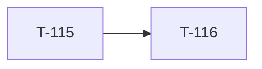

<!-- AUTO-GENERATED by ./scripts/ticket sync — DO NOT EDIT -->

# Ticket Lead Dashboard

## Running / Review

## Ready

- **T-090** (900) — Map visualization program [ready] — Map Engine v2 through sea-band + contours @ `bd481cf1`. **Active:** **T-090.5.5** tree/veg/prop glyphs. Single lane.
- **T-219** (2370) — The editor silently deletes any top-level key it does not understand [ready] — mission-editor-payload.schema.json has no additionalProperties:false and no required, so the API stores arbitrary keys. But hydrate reads exactly seven paths (store.rs:1097-1158) and compile_payload rebuilds from a json! literal (compile.rs:85-99). A server-first field or migration will appear to work, persist, and be quietly erased on next Save. MissionDocCore::hydrate has zero unit tests.
- **T-230** (2480) — Attendance marks every mission in the event and breaks the roster counters [ready] — telemetry.rs:279-288 sets attended for all event_missions of the event, not the one played, and only when match.event_id parses. Side effect: decorate_events and the dashboard count only registered and waitlisted, so a completed op's roster collapses to zero. Withdraw also stops promoting the waitlist once state is attended, and the withdrawn and no_show enum values are never written by anything.
- **T-239** (2570) — Unticketed XSS hardening item from the Go purge [ready] — T-015 is used in commits but absent from the registry. The bluemonday sanitisation survived the Go purge as ammonia (services/text.rs:10-16, wired at cms.rs:109,194), and text.rs:6-9 records an open security item: the exact UGCPolicy-to-ammonia allowlist mapping plus a golden corpus and a no-XSS property test.

== FULLY SWEPT 2026-07-26 by a paid-for subagent; the slice agent was cut for budget ==
**THERE IS NO LIVE STORED-XSS VIA HTML BODY.** The frontend has EXACTLY ONE raw-HTML sink repo-wide — arsenal.rs:1392 `inner_html=r.shape` — and it is fed by a hardcoded &'static str const table. Repo-wide grep for inner_html|set_inner_html|insert_adjacent_html|outer_html|srcdoc returns that one line. index.html has no inline script, and the SPA is CSR-only so there is no SSR concatenation path. A verified negative, and it reframes this whole ticket.

TWO THINGS THAT ARE REAL TODAY AND ARE IN THIS TICKET'S OWN FILES:
  **The one field that IS sanitised renders as ESCAPED TEXT.** announcements.body is ammonia'd at cms.rs:140/:248 and rendered at frontend/announcements.rs:80 as `{p.to_string()}` in a 
 — a Leptos text node. So ammonia buys ZERO security there, and it actively CORRUPTS display: ammonia HTML-escapes bare `<` and `&`, then Leptos escapes again, so an author writing `a < b` sees the literal `a &lt; b` on screen. That double-escape is a live bug. Either stop sanitising a field that renders as text, or stop escaping a field that arrives as HTML — doing both is what breaks it.
  `snippet` bypasses its own cap: snippet_from (cms.rs:54-60) returns the caller's value verbatim, so the 200-rune limit is skipped when supplied explicitly, and PATCH never recomputes it from the new sanitised body.

SO THE ALLOWLIST WORK IS DEFENCE-IN-DEPTH, NOT A LIVE-BUG FIX — which frees it to be strict rather than permissive. The latent exposure is real though: the moment anything goes behind inner_html, announcements.body, events.briefing, missions.briefing and wiki_pages.body_md all become live at once, and render_markdown (wiki.rs:215) is the obvious future candidate since it builds Leptos nodes today but would be the natural place to add a raw-HTML fast path.

Notable: **wiki_pages.body_md — the largest unsanitised text column in the schema — has NO frontend consumer at all** (wiki.rs renders the hardcoded MANUALS const and never fetches /wiki). Five more fields are write-only with zero readers: missions.rejection_reason, users.ban_reason, warnings.reason, fire_missions.fp_grid, fire_missions.target_grid.

The live vector is a URL scheme, not an HTML body — filed as T-391 (P0).

Negative findings worth not re-investigating: no nickname/bio/pronouns column exists; telemetry ingests NO player display name, squad name, or chat text (only the engine GUID and role_played, confirmed against TBD_ResultsReporter.c:566-569) so the 'anyone who joins a server' attack does not exist; and handlers/servers.rs's write handlers are NOT registered in app.rs, which independently confirms T-235's handoff is still outstanding.

A fourth subagent mapped EVERY render site in the frontend by data provenance — recorded at docs/platform/frontend_data_provenance.md so it is not re-derived. It confirms T-391 is the only live vector (no HTML sink beyond arsenal.rs:1392's const table) and corrects three priors: arsenal.rs is mixed not mock, leaderboards.rs is fully API-fed since T-195 deleted its MOCK, and content.rs has ZERO API-fed renders (its list is mock_docs(), so an author cannot see what they just published — T-267). Placeholder-fallback family filed as T-392.

## Next queued (top 10)

- **T-072** (720) — Ctrl multi-place [queued] — Hold Ctrl to place multiple copies without re-selecting asset.
- **T-073** (730) — Shift + map rotation [queued] — Shift-drag and map rotation widget for placed entities.
- **T-075** (750) — Spacebar flyTo vs widget [queued] — Spacebar centers selection; resolve flyTo vs transform widget conflict.
- **T-116** (1160) — Results POST to backend [queued] — SPLIT 2026-07-26. Mod half SHIPPED: TBD_ResultsReporter.c (682 lines, T-181.13.1) POSTs to /api/v1/ingest/match-results. Website half OPEN and folded into T-232 — event_hub.rs renders no result/outcome/match data at all. This row now tracks only the website half.
- **T-117** (1170) — Mission upload + validation UI [queued] — Web UI for mission upload and schema validation (API exists).
- **T-118** (1180) — Event ORBAT + identity linking UI [queued] — SPLIT 2026-07-26. DONE: identity-link UI (settings.rs:6-9,74-94, T-159.25) and the ORBAT selector (event_hub.rs:520-572, T-159.25a). OPEN residual is tracked by T-226 (PATCH /events/{id} has no caller), T-284 (clear_slot unreachable, admin cannot free a claimed slot) and T-231 (identity last mile). This row is a pointer, not work.
- **T-120** (1200) — Staging soak + golden mission smoke [queued] — Pinned game/mod version soak; golden-mission smoke on staging server.
- **T-146** (1470) — Asset Browser Data Wiring [queued] — Hook up T-150 registry items (vehicles/crates/…) to Asset Browser for map drag-place. Unblocked by T-150; after or parallel T-068.9 ingest preferred.
- **T-170** (1670) — Prod default flip to Leptos SPA [queued] — Make the Leptos SPA the production default: set `SPA_DIST_DIR` to the trunk release dist in the prod env, move the Discord OAuth redirect origin, staging soak, then flip. OPERATOR-GATED (env + Discord app settings are operator-held); claude-code prepares configs/runbook + verifies the staging soak gates. Runbook anchor: docs/website/DEV_RUNBOOK.md §SPA serving; T-159 finish program left this as the sole operator-gated residual.

## Dependency graph (scoped)

```mermaid
flowchart LR
  T115[T-115] --> T116[T-116]
```
