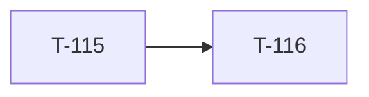

<!-- AUTO-GENERATED by ./scripts/ticket sync — DO NOT EDIT -->

# Ticket Lead Dashboard

## Running / Review

- **T-375** (3191) — An authored mission title is dropped by Save and overwritten by the stale row on reload [running] — ROUND-TRIP DROPS THE FIELD. crates/map-engine-core/src/mission/compile.rs:111-130 emits only `map.terrain` and `environment` out of `meta` — **the title is not in the compiled payload.** It is authored doc-only (eden_chrome.rs:1038-1040 -> editor_ops::set_title -> store.rs:1021-1024), and the T-192 row mirror covers only time_of_day/weather (eden_chrome.rs:492-497).

So on the next boot `hydrate_from_server` calls `apply_row`/`adopt_payload`, which writes the STALE ROW TITLE back over the doc. The authored title survives only in the local IndexedDB blob and is overwritten by a stale server value on reload. Export does carry it (compile_export:189-193), which is why this looks fine until someone reloads.

Related and already documented but still live: compile_export:211-215 reads `meta.briefing`, which `apply_row_meta` never threads, so the export envelope's briefing is permanently "".

Fix either half — emit the title in the compiled payload, or mirror it to the row like weather. Mirroring is probably right (the row is what the library and the mod read), but then it needs the same non-blank guard eden_chrome.rs:706-710 already applies. Note apply_row_meta tests only `is_empty`, so a WHITESPACE title currently propagates into the doc.

Also in the same family, latent: the `items` root map is cleared by `hydrate` (store.rs:1101/1114) and never emitted by compile_payload. Nothing authors `items` today, so it is not live — but the clear-then-load design means the NEXT root map added without a matching compile key inherits this silently. Worth a guard that fails loudly on a root the compile does not emit.

== DEFERRED 2026-07-26 BY OPERATOR DECISION, NOT CANCELLED ==
Recording a bug is most of its value; fixing it now is optional. The audits that produced this ticket were generating work faster than the run could close it, and the original T-182..T-297 feature backlog had not moved in hours. The operator's call, verbatim in substance: there will always be bugs, that is what developing is — knowing them is good, but spending the token budget on things that do not need fixing right now means nothing ships.
This is findable, fully diagnosed, and reproducible from the notes above. Promote it to `idea` when it actually blocks something, when it starts costing real time, or after the feature backlog lands. Nothing here was judged wrong — only not now.
- **T-376** (3192) — The registry importer NULLs ten populated columns from a partial envelope [running] — services/registry_import.rs:201-219 — the `ON CONFLICT DO UPDATE` sets ten columns that bind from `#[serde(default)] Option<T>` fields (contract/generated/registry_items.rs:196-238, bound at :167-189). Absent in the envelope -> None -> NULL -> **written over a populated column.** The file's own comment at :166 states the mechanism: 'v2 envelopes bind NULL columns.'

THREE THINGS MAKE THIS A DEFECT RATHER THAN A CHOICE:
  1. `icon_url` is the ONE column deliberately excluded from the DO UPDATE, with the rationale spelled out at :110-114 ('curated icons survive re-imports'). Preserve-semantics were reasoned about for exactly one column and never extended.
  2. The schema says absent means UNKNOWN, not clear: weight_kg/volume_cm3/max_* all carry 'Absent when the value is an engine class default not serialized in the prefab — never guessed.'
  3. `IS DISTINCT FROM` at :210-219 does not protect — it is the TRIGGER. Stored-non-NULL vs incoming-NULL IS distinct, so the row updates and counts as `updated`.

No envelope-version gate exists: `import_items` never reads `env.registry_items_version`. And the idempotency test (tests/registry_compat.rs:387) re-imports the SAME BYTES — precisely the case where the NULLs match — so the downgrade path is untested.

Blast radius: handlers/registry.rs:82-94 serves all ten; weight_kg and cargo_grid_w/h drive the Arsenal capacity UI. Fix precedent is in the file already: `COALESCE(EXCLUDED.col, registry_items.col)`, matching icon_url. Secondary, same statement: display_name/category are minLength:1, which blocks "" but not "   ", and :153 binds untrimmed.

== DEFERRED 2026-07-26 BY OPERATOR DECISION, NOT CANCELLED ==
Recording a bug is most of its value; fixing it now is optional. The audits that produced this ticket were generating work faster than the run could close it, and the original T-182..T-297 feature backlog had not moved in hours. The operator's call, verbatim in substance: there will always be bugs, that is what developing is — knowing them is good, but spending the token budget on things that do not need fixing right now means nothing ships.
This is findable, fully diagnosed, and reproducible from the notes above. Promote it to `idea` when it actually blocks something, when it starts costing real time, or after the feature backlog lands. Nothing here was judged wrong — only not now.
- **T-378** (3194) — gate v-suite accept can write the literal string null over a committed golden [running] — The worst of the tooling cluster, because it destroys the baselines every other gate is measured against.

tools/tbd-tools/src/vsuite.rs:390 — `std::fs::write(&gold_file, &cap.dom)?` with NO validity check. inject.rs:107-108 returns the 4-byte string `"null"` when the SPA fails to mount, and the stability loop BREAKS on the second identical `"null"` — which is the fast path, so a broken mount reaches the write quickly and confidently. `gate v-suite accept` then writes `null` over a committed golden.

**`verify` mode parses the DOM (:430); `accept` does not.** That asymmetry is the bug: the mode that only reads is careful, and the mode that writes is not.

This is the same class as T-352's 8-byte wasm and T-320's zero-font browser: a build or capture that produces something structurally empty, on a success path, which then overwrites something good. Add the same check `verify` already has, plus a floor on plausible DOM size.

Also fold in the sibling with real blast radius: tools/tbd-tools/src/world/build.rs:529 — `} else { let _ = std::fs::remove_dir_all(&density_dir); }`. A non-density `--phase` **deletes all 625 committed packages/map-assets/everon/objects/density/*.bin**, the error is discarded, and the manifest is left dangling. Those are LFS-adjacent build artifacts that took a Workbench export to produce.

== DEFERRED 2026-07-26 BY OPERATOR DECISION, NOT CANCELLED ==
Recording a bug is most of its value; fixing it now is optional. The audits that produced this ticket were generating work faster than the run could close it, and the original T-182..T-297 feature backlog had not moved in hours. The operator's call, verbatim in substance: there will always be bugs, that is what developing is — knowing them is good, but spending the token budget on things that do not need fixing right now means nothing ships.
This is findable, fully diagnosed, and reproducible from the notes above. Promote it to `idea` when it actually blocks something, when it starts costing real time, or after the feature backlog lands. Nothing here was judged wrong — only not now.

## Ready

- **T-090** (900) — Map visualization program [ready] — Map Engine v2 through sea-band + contours @ `bd481cf1`. **Active:** **T-090.5.5** tree/veg/prop glyphs. Single lane.

## Next queued (top 10)

- **T-072** (720) — Ctrl multi-place [queued] — Hold Ctrl to place multiple copies without re-selecting asset.
- **T-073** (730) — Shift + map rotation [queued] — Shift-drag and map rotation widget for placed entities.
- **T-075** (750) — Spacebar flyTo vs widget [queued] — Spacebar centers selection; resolve flyTo vs transform widget conflict.
- **T-116** (1160) — Results POST to backend [queued] — SPLIT 2026-07-26. Mod half SHIPPED: TBD_ResultsReporter.c (682 lines, T-181.13.1) POSTs to /api/v1/ingest/match-results. Website half OPEN and folded into T-232 — event_hub.rs renders no result/outcome/match data at all. This row now tracks only the website half.
- **T-117** (1170) — Mission upload + validation UI [queued] — Web UI for mission upload and schema validation (API exists).
- **T-118** (1180) — Event ORBAT + identity linking UI [queued] — SPLIT 2026-07-26. DONE: identity-link UI (settings.rs:6-9,74-94, T-159.25) and the ORBAT selector (event_hub.rs:520-572, T-159.25a). OPEN residual is tracked by T-226 (PATCH /events/{id} has no caller), T-284 (clear_slot unreachable, admin cannot free a claimed slot) and T-231 (identity last mile). This row is a pointer, not work.
- **T-120** (1200) — Staging soak + golden mission smoke [queued] — Pinned game/mod version soak; golden-mission smoke on staging server.
- **T-146** (1470) — Asset Browser Data Wiring [queued] — Hook up T-150 registry items (vehicles/crates/…) to Asset Browser for map drag-place. Unblocked by T-150; after or parallel T-068.9 ingest preferred.
- **T-170** (1670) — Prod default flip to Leptos SPA [queued] — Make the Leptos SPA the production default: set `SPA_DIST_DIR` to the trunk release dist in the prod env, move the Discord OAuth redirect origin, staging soak, then flip. OPERATOR-GATED (env + Discord app settings are operator-held); claude-code prepares configs/runbook + verifies the staging soak gates. Runbook anchor: docs/website/DEV_RUNBOOK.md §SPA serving; T-159 finish program left this as the sole operator-gated residual.

## Dependency graph (scoped)

```mermaid
flowchart LR
  T115[T-115] --> T116[T-116]
```
